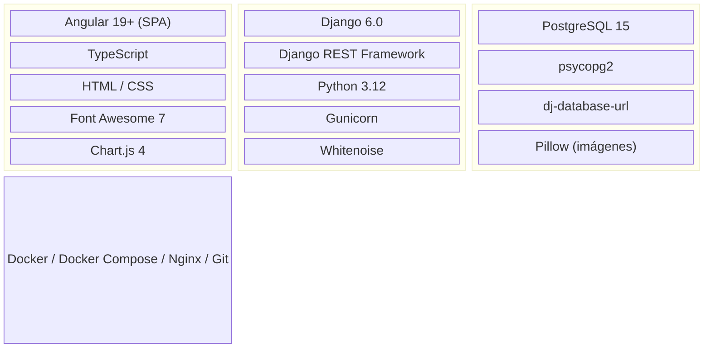
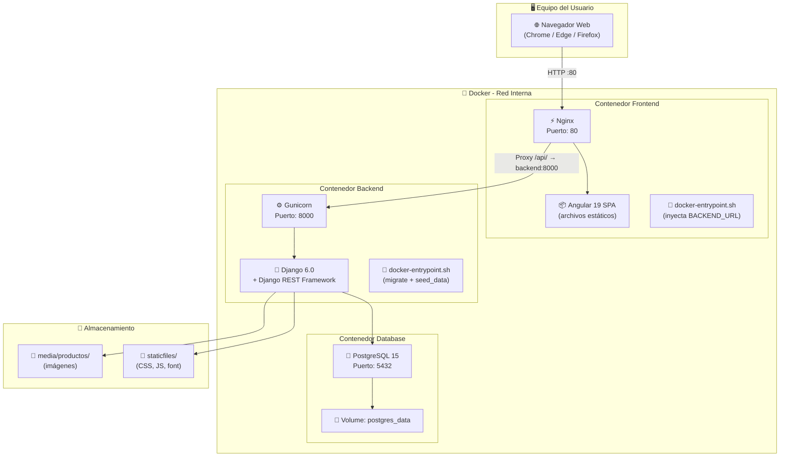
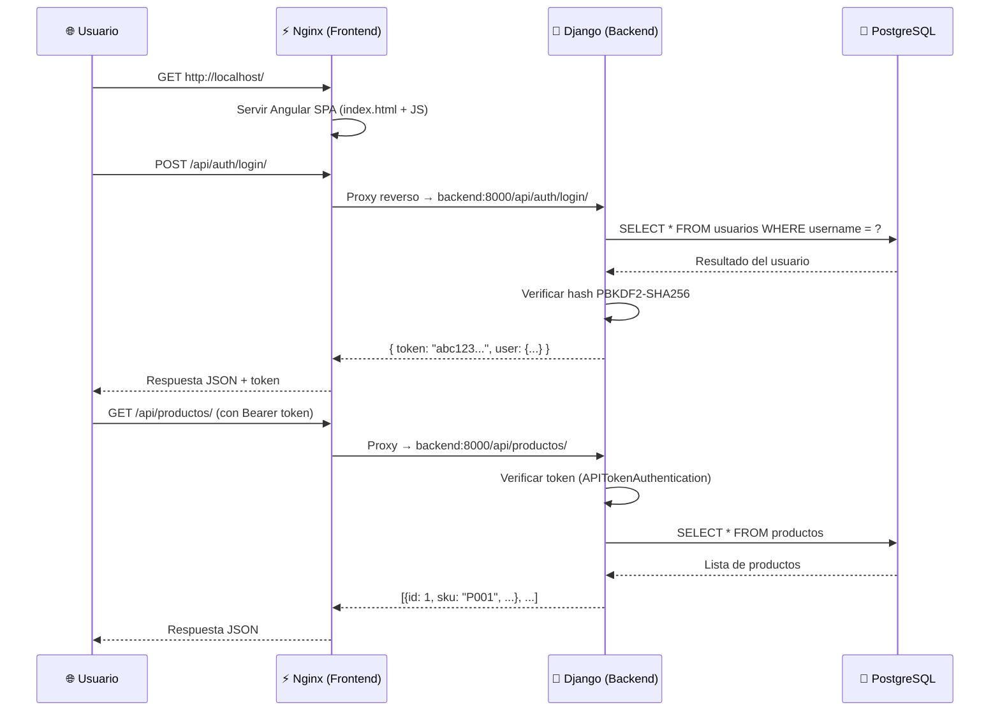
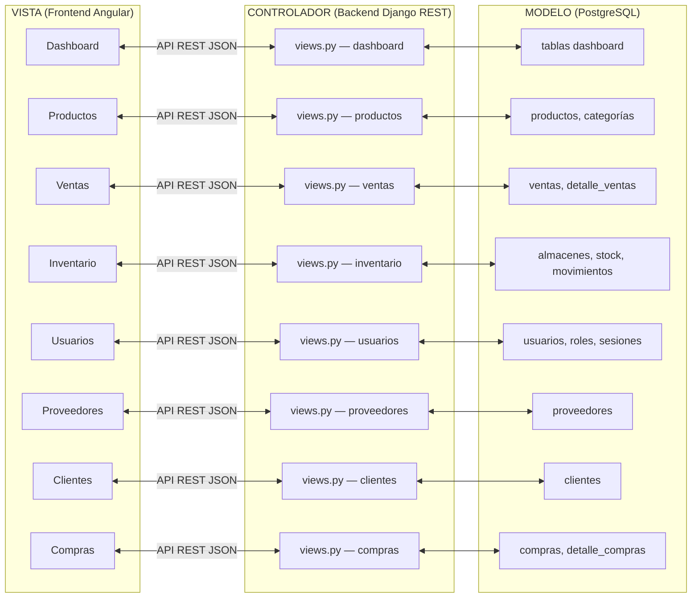
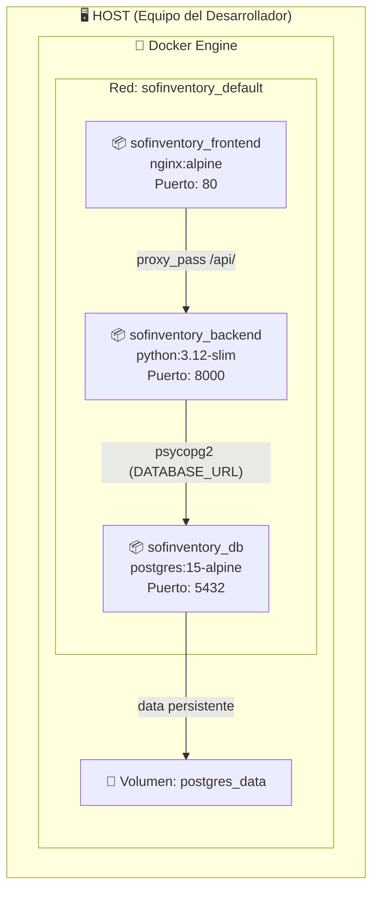

<div align="center">

# MANUAL TÉCNICO Y DE ARQUITECTURA DE SOFTWARE

## Sistema de Información SofInventory

---

**Autores:**
Alejandro Sepúlveda Duarte
Lucy Estefany Izquierdo Jaramillo

**Programa de Formación:**
Tecnología en Análisis y Desarrollo de Software (TADS)
Centro de Comercio — Regional Antioquia
Servicio Nacional de Aprendizaje (SENA)

**Evidencia:**
GA10-220501097-AA10-EV01 — Elabora documentos técnicos y de usuario del software

**Versión:** 2.0
**Fecha:** Julio 2026

</div>

---

## Tabla de Contenido

1. [Introducción](#1-introducción)
2. [Prerrequisitos de Instalación del Sistema](#2-prerrequisitos-de-instalación-del-sistema)
3. [Frameworks y Estándares de Desarrollo](#3-frameworks-y-estándares-de-desarrollo)
4. [Diagrama y Descripción de Casos de Uso](#4-diagrama-y-descripción-de-casos-de-uso)
5. [Modelo Entidad-Relación (Base de Datos)](#5-modelo-entidad-relación-base-de-datos)
6. [Diccionario de Datos](#6-diccionario-de-datos)
7. [Scripts de Instalación y Despliegue con Docker](#7-scripts-de-instalación-y-despliegue-con-docker)
8. [Diagrama de Componentes](#8-diagrama-de-componentes)
9. [Conclusiones](#9-conclusiones)
10. [Referencias y Fuentes](#10-referencias-y-fuentes)

---

## 1. Introducción

### 1.1 Propósito

El presente Manual Técnico documenta de forma exhaustiva la arquitectura, configuración, estructura de datos, procedimientos de instalación y despliegue del sistema **SofInventory**. Su propósito es servir como referencia técnica para desarrolladores, arquitectos de software, analistas, administradores de bases de datos y personal de soporte que requiera comprender, implementar, mantener o escalar la solución.

### 1.2 Alcance

Este manual cubre los siguientes aspectos del sistema:

- Arquitectura técnica completa (backend, frontend, base de datos, contenedores Docker)
- Prerrequisitos de hardware y software para el despliegue
- Stack tecnológico y estándares de codificación aplicados
- Diagramas de casos de uso con descripción detallada de actores y flujos
- Modelo entidad-relación de la base de datos PostgreSQL
- Diccionario de datos completo con tipos, longitudes y restricciones
- Scripts reales de instalación y despliegue mediante Docker Compose
- Diagrama de componentes con orquestación Docker
- Protocolo de pruebas de aceptación

### 1.3 Descripción Técnica del Sistema

**SofInventory** es un sistema ERP (Enterprise Resource Planning) orientado a la gestión integral de inventarios y procesos comerciales para PYMES. El sistema permite administrar:

| Módulo | Funcionalidad Principal |
|---|---|
| **Usuarios y Roles** | Autenticación, autorización, control de accesos por rol |
| **Productos y Categorías** | Catálogo de productos con precios, stock, imágenes |
| **Proveedores** | Gestión de proveedores con datos de contacto y ubicación |
| **Clientes** | Clientes naturales y jurídicos con categorización comercial |
| **Compras** | Registro de compras con detalle y actualización automática de inventario |
| **Ventas** | Punto de venta con múltiples métodos de pago y cálculo de IVA |
| **Inventario y Almacenes** | Control de stock por almacén, movimientos, traslados y ajustes |
| **Dashboard** | Panel de indicadores con gráficos y métricas en tiempo real |

La arquitectura es **desacoplada (decoupled)**: un backend Django REST Framework que expone una API, y un frontend Angular SPA que consume dicha API. Ambos están containerizados con Docker y orquestados mediante Docker Compose.

### 1.4 Documentos de Referencia Integrados

Este manual ha sido elaborado consolidando la información de los siguientes documentos técnicos del proyecto:

| Documento | Contenido Integrado |
|---|---|
| Modelo Entidad-Relación SofInventory PostgreSQL | Estructura de la base de datos, normalización 3FN, relaciones |
| Desarrollo Arquitectura de Software (Patrón MVC) | Vista de componentes, vista de despliegue, justificación de herramientas |
| Informe Técnico de Despliegue v2.0 | Fases de despliegue Docker, variables de entorno, protocolo de pruebas |
| Diagramas y Plantillas para Casos de Uso | CU-001 a CU-004 con flujos principales, alternativos y de excepción |

---

## 2. Prerrequisitos de Instalación del Sistema

### 2.1 Requisitos Mínimos de Hardware

| Componente | Mínimo | Recomendado |
|---|---|---|
| **CPU** | 2 núcleos | 4 núcleos o superior |
| **RAM** | 4 GB | 8 GB o superior |
| **Disco** | 20 GB libres | 50 GB (SSD recomendado) |
| **Red** | Conexión a internet para clonación del repositorio | Conexión estable y de baja latencia |

> **Nota importante:** Estos requisitos aplican al **equipo anfitrión (host)** donde se ejecutarán los contenedores Docker. Las dependencias de Python, Node.js y PostgreSQL se ejecutan **dentro** de los contenedores, por lo que no se requiere instalarlas en el sistema operativo del host.

### 2.2 Requisitos de Software en el Equipo Host

| Herramienta | Versión Requerida | Propósito | ¿Obligatorio? |
|---|---|---|---|
| **Docker Desktop** | Última versión estable (incluye Docker Engine + Docker Compose) | Construcción y ejecución de contenedores | **Sí** |
| **Git** | Última versión estable | Obtención del código fuente del repositorio | **Sí** |
| **Navegador web** | Chrome, Edge o Firefox (actualizado) | Acceso a la interfaz de usuario | **Sí** |

> **No es necesario instalar** Python, Node.js, PostgreSQL, npm, entornos virtuales de Python, ni configurar bases de datos manualmente. Todo se ejecuta dentro de los contenedores Docker, lo que elimina problemas de compatibilidad entre versiones y garantiza un entorno idéntico en cualquier máquina.

### 2.3 Herramientas Recomendadas (Opcional)

| Herramienta | Propósito |
|---|---|
| **Visual Studio Code** | Editor de código fuente |
| **Postman / Insomnia** | Pruebas de API REST |
| **pgAdmin 4 / DBeaver** | Administración de PostgreSQL (solo si se necesita inspeccionar la BD directamente) |
| **Docker Desktop** | Panel visual de contenedores, logs y redes |

### 2.4 Verificación de Prerrequisitos

Antes de proceder con la instalación, verifique que Docker y Git estén correctamente instalados:

```bash
# Verificar Docker Engine
docker --version
# Resultado esperado: Docker version 24.x.x o superior

# Verificar Docker Compose
docker compose version
# Resultado esperado: Docker Compose version v2.x.x o superior

# Verificar Git
git --version
# Resultado esperado: git version 2.x.x
```

---

## 3. Frameworks y Estándares de Desarrollo

### 3.1 Stack Tecnológico Completo



| Capa | Tecnología | Versión | Función |
|---|---|---|---|
| **Frontend** | Angular | 19+ | Interfaz de usuario SPA (Single Page Application) |
| **Frontend — Lenguaje** | TypeScript | 5.6 | Lenguaje tipado basado en JavaScript |
| **Frontend — Íconos** | Font Awesome | 7.2 | Librería de íconos vectoriales |
| **Frontend — Gráficos** | Chart.js | 4.5 | Librería de visualización de datos |
| **Backend — Framework** | Django | 6.0 | Framework web Python de alto nivel |
| **Backend — API** | Django REST Framework | 3.17 | Toolkit para construir APIs RESTful |
| **Backend — Servidor** | Gunicorn | 23.0 | Servidor WSGI para producción |
| **Backend — Estáticos** | Whitenoise | 6.12 | Servir archivos estáticos en producción |
| **Base de datos** | PostgreSQL | 15 | Sistema de gestión de BD relacional |
| **Contenedorización** | Docker | 24+ | Empaquetado y ejecución de servicios |
| **Orquestación** | Docker Compose | v2 | Definición y levantamiento multi-contenedor |
| **Servidor web (frontend)** | Nginx | Alpine | Servidor de archivos estáticos + proxy reverso |
| **Control de versiones** | Git + GitHub | — | Repositorio remoto privado |

### 3.2 Patrón de Arquitectura: MVC con API REST Desacoplada

El sistema implementa el patrón **Modelo-Vista-Controlador (MVC)** adaptado a una arquitectura **cliente-servidor desacoplada** mediante API REST:

| Capa MVC | Implementación en SofInventory | Ubicación |
|---|---|---|
| **Modelo** | Modelos de Django (usuarios, productos, inventario, proveedores, clientes, compras, ventas) que gestionan datos, reglas de negocio e interacción con PostgreSQL | `backend/*/models.py` |
| **Vista** | Aplicación Angular (SPA) que renderiza la interfaz gráfica (formularios, tablas, dashboards) en el navegador del usuario | `frontend/src/app/pages/` |
| **Controlador** | Vistas de Django REST Framework (`views.py` de cada app) que reciben peticiones HTTP de Angular, aplican permisos por rol y devuelven respuestas JSON | `backend/*/views.py` |

> **Justificación:** El patrón MVC, adaptado a esta arquitectura desacoplada, permite escalar el frontend y el backend por separado, y habilita que otros clientes (app móvil, sistema externo) reutilicen la misma API REST sin duplicar lógica de negocio.

### 3.3 Aplicaciones (Apps) del Backend

El backend Django se organiza en **8 aplicaciones modulares**, cada una responsable de un dominio del negocio:

| # | App Django | Modelo(s) | Tabla(s) PostgreSQL | Función |
|---|---|---|---|---|
| 1 | `usuarios` | TipoDocumento, Rol, Usuario, SesionAPI, IntentoFallidoLogin | `tipos_documento`, `roles`, `usuarios`, `sesiones_api`, `intentos_fallidos_login` | Gestión de usuarios, roles, autenticación y sesiones |
| 2 | `productos` | Categoria, Producto | `categorias`, `productos` | Catálogo de productos y categorías |
| 3 | `proveedores` | Proveedor | `proveedores` | Gestión de proveedores |
| 4 | `clientes` | Cliente | `clientes` | Clientes naturales y jurídicos |
| 5 | `compras` | Compra, DetalleCompra | `compras`, `detalle_compras` | Registro de compras y detalle |
| 6 | `ventas` | Venta, DetalleVenta | `ventas`, `detalle_ventas` | Punto de venta y detalle |
| 7 | `inventario` | Almacen, StockAlmacen, MovimientoInventario, Traslado, TrasladoDetalle, ConfiguracionRangosStock | `almacenes`, `stock_almacen`, `movimientos_inventario`, `traslados`, `traslados_detalle`, `configuracion_rangos_stock` | Control de inventario, almacenes y movimientos |
| 8 | `dashboard` | — | — | Agrega datos de los módulos para indicadores |

### 3.4 Variables de Entorno

El sistema utiliza archivos `.env` para la configuración de cada componente. Las variables están documentadas en la sección de despliegue. Los archivos `.env` **nunca se suben al repositorio** (excluidos por `.gitignore`).

---

## 4. Diagrama y Descripción de Casos de Uso

### 4.1 Diagrama de Casos de Uso General

```mermaid
graph TB
    subgraph "Actores del Sistema"
        Admin["👤 Administrador"]
        Vendedor["👤 Vendedor"]
        Bodega["👤 Operador de Bodega"]
        Sup["👤 Supervisor"]
    end

    subgraph "Sistema SofInventory"
        CU1["CU-001: Iniciar Sesión"]
        CU2["CU-002: Gestionar Usuarios"]
        CU3["CU-003: Registrar Productos"]
        CU4["CU-004: Gestionar Categorías"]
        CU5["CU-005: Registrar Compras"]
        CU6["CU-006: Registrar Ventas"]
        CU7["CU-007: Consultar Inventario"]
        CU8["CU-008: Administrar Almacenes"]
        CU9["CU-009: Consultar Dashboard"]
        CU10["CU-010: Gestionar Proveedores"]
        CU11["CU-011: Gestionar Clientes"]
    end

    Admin --> CU1
    Admin --> CU2
    Admin --> CU3
    Admin --> CU4
    Admin --> CU5
    Admin --> CU6
    Admin --> CU7
    Admin --> CU8
    Admin --> CU9
    Admin --> CU10
    Admin --> CU11

    Vendedor --> CU1
    Vendedor --> CU6
    Vendedor --> CU7
    Vendedor --> CU9
    Vendedor --> CU11

    Bodega --> CU1
    Bodega --> CU7
    Bodega --> CU8

    Sup --> CU1
    Sup --> CU3
    Sup --> CU4
    Sup --> CU5
    Sup --> CU6
    Sup --> CU7
    Sup --> CU8
    Sup --> CU9
    Sup --> CU10
    Sup --> CU11
```



### 4.2 Descripción de Casos de Uso Principales

#### CU-001: Iniciar Sesión

| Campo | Descripción |
|---|---|
| **Nombre** | Iniciar Sesión |
| **ID** | CU-001 |
| **Actor** | Todos los usuarios del sistema |
| **Precondiciones** | El usuario tiene credenciales válidas registradas en la base de datos |
| **Flujo Principal** | 1. El usuario ingresa al sistema desde el navegador → 2. Se muestra el formulario de autenticación → 3. El usuario ingresa username y contraseña → 4. El backend valida las credenciales (hash PBKDF2-SHA256) → 5. Se genera un token de acceso → 6. El usuario es redirigido al Dashboard principal |
| **Flujo Alternativo** | Si la cuenta está bloqueada: el sistema muestra un mensaje de bloqueo y no permite el intento |
| **Flujo de Excepción** | Si las credenciales son incorrectas: se registra el intento fallido; tras 3 intentos fallidos consecutivos, la cuenta se bloquea automáticamente |
| **Postcondiciones** | El usuario queda autenticado con un token activo; se inicia sesión en la tabla `sesiones_api` |

#### CU-002: Gestionar Usuarios

| Campo | Descripción |
|---|---|
| **Nombre** | Gestionar Usuarios |
| **ID** | CU-002 |
| **Actor** | Administrador |
| **Precondiciones** | El administrador está autenticado con token activo |
| **Flujo Principal** | 1. El administrador accede al módulo de usuarios → 2. Visualiza la lista de usuarios registrados → 3. Puede crear, editar, activar/desactivar usuarios → 4. Al crear: selección de tipo documento, número de documento, nombre completo, email, username, contraseña, rol y estado → 5. El sistema valida unicidad de documento, email y username → 6. Se guarda el usuario con contraseña hasheada (PBKDF2) → 7. Se actualiza la tabla `usuarios` |
| **Flujo Alternativo** | Edición: se carga el formulario con los datos existentes del usuario |
| **Flujo de Excepción** | Si el número de documento o email ya existe: el sistema muestra error de duplicado |
| **Postcondiciones** | La tabla `usuarios` se actualiza con la información del nuevo o modificado usuario |

#### CU-003: Registrar Productos

| Campo | Descripción |
|---|---|
| **Nombre** | Registrar Productos |
| **ID** | CU-003 |
| **Actor** | Administrador, Supervisor |
| **Precondiciones** | El usuario tiene permisos; existen categorías registradas |
| **Flujo Principal** | 1. El usuario accede al módulo de productos → 2. Crea un nuevo producto con: SKU, nombre, marca, referencia, unidad de medida, categoría, precio compra, precio venta, IVA, stock mínimo → 3. El sistema valida unicidad del SKU → 4. Se guarda el producto → 5. Se actualiza la tabla `productos` |
| **Flujo Alternativo** | Subir imagen del producto (upload a `media/productos/`) |
| **Flujo de Excepción** | Si el SKU ya existe: el sistema muestra error de duplicado |
| **Postcondiciones** | El producto queda disponible para compras, ventas y movimiento de inventario |

#### CU-004: Registrar Compras

| Campo | Descripción |
|---|---|
| **Nombre** | Registrar Compras |
| **ID** | CU-004 |
| **Actor** | Administrador, Supervisor, Operador de Bodega |
| **Precondiciones** | El usuario está autenticado; existen proveedores y productos registrados |
| **Flujo Principal** | 1. El usuario selecciona el proveedor → 2. Ingresa número de factura y fecha de compra → 3. Agrega productos al detalle de la compra (producto, cantidad, costo unitario, IVA) → 4. El sistema calcula subtotal, IVA y total → 5. Se guarda la compra y su detalle → 6. Se actualiza el stock del producto en el almacén correspondiente → 7. Se registra el movimiento de inventario (tipo: ENTRADA_COMPRA) |
| **Flujo de Excepción** | Si la factura ya existe: el sistema muestra error de duplicado |
| **Postcondiciones** | Las tablas `compras`, `detalle_compras`, `stock_almacen` y `movimientos_inventario` se actualizan |

#### CU-005: Registrar Ventas

| Campo | Descripción |
|---|---|
| **Nombre** | Registrar Ventas (Punto de Venta) |
| **ID** | CU-005 |
| **Actor** | Administrador, Supervisor, Vendedor |
| **Precondiciones** | El usuario está autenticado; existen productos con stock > 0 |
| **Flujo Principal** | 1. El vendedor selecciona los productos a vender → 2. El sistema valida stock disponible → 3. Se calcula subtotal, descuento, IVA y total → 4. Se selecciona método de pago (efectivo, débito, crédito, transferencia, Nequi, DaviPlata) → 5. Se registra la venta y su detalle → 6. Se descuenta las cantidades del stock → 7. Se genera el movimiento de inventario (tipo: SALIDA_VENTA) → 8. Se genera el número de venta automático (VTA-XXXXX) |
| **Flujo Alternativo** | Si el cliente es "General" (sin identificación): el campo `cliente` queda en null |
| **Flujo de Excepción** | Si el stock es insuficiente: el sistema muestra alerta y previene la venta |
| **Postcondiciones** | Las tablas `ventas`, `detalle_ventas`, `stock_almacen` y `movimientos_inventario` se actualizan; se genera el comprobante de venta |

#### CU-006: Consultar Inventario

| Campo | Descripción |
|---|---|
| **Nombre** | Consultar Inventario |
| **ID** | CU-006 |
| **Actor** | Todos los usuarios autenticados |
| **Precondiciones** | El usuario está autenticado |
| **Flujo Principal** | 1. El usuario accede al módulo de inventario → 2. Consulta el stock por almacén → 3. Visualiza movimientos de inventario (entradas, salidas, ajustes, traslados) → 4. Puede filtrar por producto, tipo de movimiento o rango de fechas → 5. El sistema muestra alertas de stock bajo según la configuración de rangos |
| **Postcondiciones** | Se obtiene información actualizada del inventario sin modificaciones |

#### CU-007: Gestionar Almacenes

| Campo | Descripción |
|---|---|
| **Nombre** | Gestionar Almacenes |
| **ID** | CU-007 |
| **Actor** | Administrador, Supervisor |
| **Precondiciones** | El usuario tiene permisos |
| **Flujo Principal** | 1. El usuario accede al módulo de almacenes → 2. Crea o edita almacenes con: nombre, código, dirección, responsable, teléfono, capacidad, estado → 3. El sistema valida unicidad del código → 4. Se guarda el almacén → 5. Se actualiza la tabla `almacenes` |
| **Postcondiciones** | El almacén queda disponible para recibir stock y registrar movimientos |

---

## 5. Modelo Entidad-Relación (Base de Datos)

### 5.1 Descripción General del Modelo

El modelo entidad-relación de SofInventory está diseñado bajo los principios de:

- **Normalización en Tercera Forma Normal (3FN):** Eliminación de redundancias y dependencias transitivas
- **Integridad referencial:** Claves foráneas con acciones `ON DELETE PROTECT` o `CASCADE` según el caso
- **Restricciones de dominio:** Validaciones a nivel de base de datos
- **Índices optimizados:** Para consultas frecuentes y relaciones principales

### 5.2 Estructura del Modelo por Módulos

```mermaid
erDiagram
    TYPES_DOCUMENTO ||--o{ USUARIOS : "tiene"
    TYPES_DOCUMENTO {
        int id PK
        varchar(5) codigo UK
        varchar(50) nombre
    }

    ROLES ||--o{ USUARIOS : "asignado a"
    ROLES {
        int id PK
        varchar(50) nombre UK
        text descripcion
    }

    USUARIOS ||--o{ SESIONES_API : "genera"
    USUARIOS ||--o{ INTENTOS_FALLIDOS : "registra"
    USUARIOS {
        int id PK
        int tipo_documento_id FK
        varchar(20) numero_documento UK
        varchar(150) nombre_completo
        varchar(255) email UK
        varchar(50) username UK
        varchar(255) password
        int rol_id FK
        varchar(10) estado
        date fecha_creacion
        datetime fecha_registro
        boolean cuenta_bloqueada
        datetime fecha_bloqueo
        text observaciones
    }

    SESIONES_API {
        int id PK
        int usuario_id FK
        varchar(80) token UK
        datetime creada_en
        datetime expira_en
        datetime ultima_actividad
        boolean activa
        varchar(255) user_agent
    }

    INTENTOS_FALLIDOS_LOGIN {
        int id PK
        int usuario_id FK
        datetime fecha_intento
        generic_ip ip_address
        varchar(255) user_agent
    }

    CATEGORIAS ||--o{ PRODUCTOS : "agrupa"
    CATEGORIAS {
        int id PK
        varchar(100) nombre UK
        varchar(20) tipo_control
        text descripcion
        int creado_por_id FK
        datetime fecha_creacion
    }

    PRODUCTOS ||--o{ STOCK_ALMACEN : "tiene stock en"
    PRODUCTOS ||--o{ MOVIMIENTOS_INVENTARIO : "genera movimientos"
    PRODUCTOS ||--o{ DETALLE_COMPRAS : "se compra"
    PRODUCTOS ||--o{ DETALLE_VENTAS : "se vende"
    PRODUCTOS {
        int id PK
        varchar(200) sku UK
        varchar(150) nombre
        varchar(100) marca
        varchar(100) referencia
        varchar(10) unidad_medida
        int categoria_id FK
        decimal(12,2) precio_compra
        decimal(12,2) precio_venta
        decimal(5,2) iva_porcentaje
        int stock
        int stock_minimo
        text descripcion
        text observaciones
        jsonb especificaciones
        varchar(15) estado
        int creado_por_id FK
        datetime fecha_creacion
        datetime fecha_actualizacion
        varchar(255) imagen
    }

    PROVEEDORES ||--o{ COMPRAS : "provee"
    PROVEEDORES {
        int id PK
        int tipo_documento_id FK
        varchar(20) numero_documento UK
        varchar(150) razon_social
        varchar(100) nombre_contacto
        varchar(100) cargo_contacto
        varchar(255) email UK
        varchar(20) telefono
        varchar(200) direccion
        varchar(100) pais
        varchar(100) departamento
        varchar(100) ciudad
        varchar(10) tipo_proveedor
        varchar(10) estado
        text observaciones
        int creado_por_id FK
        datetime fecha_registro
    }

    COMPRAS ||--o{ DETALLE_COMPRAS : "contiene"
    COMPRAS {
        int id PK
        int proveedor_id FK
        varchar(50) numero_factura UK
        date fecha_compra
        varchar(10) tipo_compra
        decimal(12,2) subtotal
        decimal(12,2) iva_total
        decimal(12,2) total
        varchar(15) estado
        int registrado_por_id FK
        datetime fecha_registro
    }

    DETALLE_COMPRAS {
        int id PK
        int compra_id FK
        int producto_id FK
        int cantidad
        decimal(12,2) costo_unitario
        decimal(5,2) iva_porcentaje
        decimal(12,2) subtotal
        decimal(12,2) total
    }

    CLIENTES ||--o{ VENTAS : "compra"
    CLIENTES {
        int id PK
        varchar(10) tipo_cliente
        varchar(15) categoria
        int tipo_documento_id FK
        varchar(20) numero_documento UK
        varchar(100) nombres
        varchar(100) apellidos
        varchar(150) razon_social
        varchar(150) nombre_comercial
        varchar(255) email
        varchar(20) telefono
        varchar(20) telefono2
        text direccion
        varchar(100) ciudad
        varchar(100) departamento
        varchar(100) pais
        varchar(20) codigo_postal
        varchar(10) estado
        text notas
        int creado_por_id FK
        datetime fecha_creacion
        datetime fecha_actualizacion
    }

    VENTAS ||--o{ DETALLE_VENTAS : "contiene"
    VENTAS {
        int id PK
        varchar(20) numero_venta UK
        int cliente_id FK
        int vendedor_id FK
        decimal(14,2) subtotal
        decimal(14,2) descuento
        varchar(10) tipo_iva
        decimal(5,2) iva_porcentaje
        decimal(14,2) iva_monto
        decimal(14,2) total
        varchar(15) metodo_pago
        decimal(14,2) efectivo_recibido
        decimal(14,2) cambio
        varchar(4) numero_tarjeta
        varchar(50) aprobacion_tarjeta
        varchar(100) comprobante_transferencia
        varchar(100) otro_metodo
        text observaciones
        varchar(10) estado
        datetime fecha_creacion
        datetime fecha_anulacion
        int anulado_por_id FK
        text motivo_anulacion
    }

    DETALLE_VENTAS {
        int id PK
        int venta_id FK
        int producto_id FK
        decimal(12,2) precio_unitario
        int cantidad
        decimal(14,2) subtotal
        varchar(150) nombre_producto
        varchar(200) sku_producto
    }

    ALMACENES ||--o{ STOCK_ALMACEN : "almacena"
    ALMACENES ||--o{ MOVIMIENTOS_INVENTARIO : "origen o destino"
    ALMACENES ||--o{ TRASLADOS : "origen"
    ALMACENES ||--o{ TRASLADOS : "destino"
    ALMACENES {
        int id PK
        varchar(100) nombre UK
        varchar(10) codigo UK
        text direccion
        varchar(100) responsable
        varchar(20) telefono
        int capacidad
        varchar(15) estado
        text notas
        int creado_por_id FK
        datetime fecha_creacion
        datetime fecha_actualizacion
    }

    STOCK_ALMACEN {
        int id PK
        int producto_id FK
        int almacen_id FK
        int cantidad
        datetime ultima_actualizacion
    }

    MOVIMIENTOS_INVENTARIO {
        int id PK
        varchar(25) tipo
        int producto_id FK
        int almacen_origen_id FK
        int almacen_destino_id FK
        int cantidad
        decimal(12,2) costo_unitario
        varchar(50) referencia_tipo
        int referencia_id
        text observacion
        datetime fecha
        int creado_por_id FK
    }

    TRASLADOS ||--o{ TRASLADOS_DETALLE : "contiene"
    TRASLADOS {
        int id PK
        int almacen_origen_id FK
        int almacen_destino_id FK
        varchar(15) estado
        text observacion
        datetime fecha_solicitud
        datetime fecha_completado
        int creado_por_id FK
    }

    TRASLADOS_DETALLE {
        int id PK
        int traslado_id FK
        int producto_id FK
        int cantidad
    }

    CONFIGURACION_RANGOS_STOCK {
        int id PK
        int stock_bajo
        int stock_medio
        int stock_alto
        int actualizado_por_id FK
        datetime fecha_actualizacion
    }
```

### 5.3 Relaciones Principales del Modelo

| Relación | Cardinalidad | Descripción |
|---|---|---|
| TipoDocumento → Usuarios | 1:N | Un tipo de documento puede tener múltiples usuarios |
| Rol → Usuarios | 1:N | Un rol puede asignarse a múltiples usuarios |
| Categoría → Productos | 1:N | Una categoría agrupa múltiples productos |
| Producto → StockAlmacen | 1:N | Un producto tiene stock en múltiples almacenes |
| Almacén → StockAlmacen | 1:N | Un almacén contiene stock de múltiples productos |
| Producto → MovimientoInventario | 1:N | Un producto genera múltiples movimientos |
| Almacén → MovimientoInventario | 1:N | Un almacén es origen o destino de múltiples movimientos |
| Proveedor → Compras | 1:N | Un proveedor realiza múltiples compras |
| Compra → DetalleCompra | 1:N | Una compra contiene múltiples detalles |
| Producto → DetalleCompra | 1:N | Un producto aparece en múltiples detalles de compra |
| Cliente → Ventas | 1:N | Un cliente realiza múltiples compras |
| Venta → DetalleVenta | 1:N | Una venta contiene múltiples detalles |
| Producto → DetalleVenta | 1:N | Un producto se vende en múltiples ventas |
| Traslado → TrasladoDetalle | 1:N | Un traslado contiene múltiples productos |
| Usuario → SesionAPI | 1:N | Un usuario genera múltiples sesiones |

---

## 6. Diccionario de Datos

### 6.1 Tabla: `usuarios`

| Campo | Tipo de Dato | Longitud | Llave | Requerido | Descripción |
|---|---|---:|---|---|---|
| id | Integer (SERIAL) | — | PK | Sí | Identificador único del usuario (autogenerado) |
| tipo_documento_id | Integer | — | FK → `tipos_documento.id` | Sí | Tipo de documento de identidad del usuario |
| numero_documento | Varchar | 20 | UK | Sí | Número de documento de identidad (CC, CE, NIT) |
| nombre_completo | Varchar | 150 | — | Sí | Nombre completo del usuario |
| email | Varchar | 255 | UK | Sí | Correo electrónico único |
| username | Varchar | 50 | UK | Sí | Nombre de usuario para autenticación |
| password | Varchar | 255 | — | Sí | Contraseña cifrada con PBKDF2-SHA256 |
| rol_id | Integer | — | FK → `roles.id` | Sí | Rol asignado (Administrador, Vendedor) |
| estado | Varchar | 10 | — | Sí | Estado: `activo` o `inactivo` (default: `activo`) |
| fecha_creacion | Date | — | — | Sí | Fecha de creación (auto_now_add) |
| observaciones | Text | — | — | No | Observaciones adicionales del usuario |
| fecha_registro | Datetime | — | — | Sí | Fecha y hora de registro (auto_now_add) |
| cuenta_bloqueada | Boolean | — | — | No | Indica si la cuenta está bloqueada (default: false) |
| fecha_bloqueo | Datetime | — | — | No | Fecha y hora del último bloqueo |

### 6.2 Tabla: `tipos_documento`

| Campo | Tipo de Dato | Longitud | Llave | Requerido | Descripción |
|---|---|---:|---|---|---|
| id | Integer (SERIAL) | — | PK | Sí | Identificador único del tipo de documento |
| codigo | Varchar | 5 | UK | Sí | Código del tipo (CC, CE, NIT) |
| nombre | Varchar | 50 | — | Sí | Nombre completo del tipo de documento |

### 6.3 Tabla: `roles`

| Campo | Tipo de Dato | Longitud | Llave | Requerido | Descripción |
|---|---|---:|---|---|---|
| id | Integer (SERIAL) | — | PK | Sí | Identificador único del rol |
| nombre | Varchar | 50 | UK | Sí | Nombre del rol (Administrador, Vendedor) |
| descripcion | Text | — | — | No | Descripción detallada del rol |

### 6.4 Tabla: `productos`

| Campo | Tipo de Dato | Longitud | Llave | Requerido | Descripción |
|---|---|---:|---|---|---|
| id | Integer (SERIAL) | — | PK | Sí | Identificador único del producto |
| sku | Varchar | 200 | UK | Sí | Código SKU único del producto |
| nombre | Varchar | 150 | — | Sí | Nombre comercial del producto |
| marca | Varchar | 100 | — | Sí | Marca del producto |
| referencia | Varchar | 100 | — | Sí | Referencia interna del fabricante |
| unidad_medida | Varchar | 10 | — | Sí | Unidad: Unidad, Caja, Metro, Litro, Galón, Rollo, Bulto, Kilo |
| categoria_id | Integer | — | FK → `categorias.id` | Sí | Categoría del producto |
| precio_compra | Decimal | 12,2 | — | No | Precio de compra unitario (default: 0) |
| precio_venta | Decimal | 12,2 | — | No | Precio de venta unitario (default: 0) |
| iva_porcentaje | Decimal | 5,2 | — | No | Porcentaje de IVA (default: 0) |
| stock | Integer | — | — | No | Stock actual del producto (default: 0) |
| stock_minimo | Integer | — | — | No | Stock mínimo de seguridad (default: 0) |
| descripcion | Text | — | — | No | Descripción detallada del producto |
| observaciones | Text | — | — | No | Notas internas |
| especificaciones | JSONField | — | — | No | Especificaciones técnicas en formato JSON |
| estado | Varchar | 15 | — | Sí | Estado: `pendiente`, `activo`, `inactivo` |
| creado_por_id | Integer | — | FK → `usuarios.id` | Sí | Usuario que creó el registro |
| fecha_creacion | Datetime | — | — | Sí | Fecha de creación (auto_now_add) |
| fecha_actualizacion | Datetime | — | — | Sí | Última actualización (auto_now) |
| imagen | ImageField | 255 | — | No | Ruta de imagen del producto (`productos/`) |

### 6.5 Tabla: `categorias`

| Campo | Tipo de Dato | Longitud | Llave | Requerido | Descripción |
|---|---|---:|---|---|---|
| id | Integer (SERIAL) | — | PK | Sí | Identificador único de la categoría |
| nombre | Varchar | 100 | UK | Sí | Nombre de la categoría |
| tipo_control | Varchar | 20 | — | Sí | Tipo: GENERAL, HERRAMIENTA, ELECTRICO, LIQUIDO, TORNILLERIA |
| descripcion | Text | — | — | No | Descripción de la categoría |
| creado_por_id | Integer | — | FK → `usuarios.id` | Sí | Usuario que creó la categoría |
| fecha_creacion | Datetime | — | — | Sí | Fecha de creación (auto_now_add) |

### 6.6 Tabla: `proveedores`

| Campo | Tipo de Dato | Longitud | Llave | Requerido | Descripción |
|---|---|---:|---|---|---|
| id | Integer (SERIAL) | — | PK | Sí | Identificador único del proveedor |
| tipo_documento_id | Integer | — | FK → `tipos_documento.id` | Sí | Tipo de documento del proveedor |
| numero_documento | Varchar | 20 | UK | Sí | Número de documento (CC o NIT) |
| razon_social | Varchar | 150 | UK (CI) | Sí | Razón social o nombre del proveedor |
| nombre_contacto | Varchar | 100 | — | Sí | Nombre de la persona de contacto |
| cargo_contacto | Varchar | 100 | — | No | Cargo del contacto |
| email | Varchar | 255 | UK | Sí | Correo electrónico del proveedor |
| telefono | Varchar | 20 | — | Sí | Teléfono de contacto |
| direccion | Varchar | 200 | — | Sí | Dirección física |
| pais | Varchar | 100 | — | Sí | País de origen |
| departamento | Varchar | 100 | — | Sí | Departamento/Estado |
| ciudad | Varchar | 100 | — | Sí | Ciudad |
| tipo_proveedor | Varchar | 10 | — | Sí | Tipo: Bienes, Servicios, Mixto |
| estado | Varchar | 10 | — | Sí | Estado: Activo, Inactivo |
| observaciones | Text | — | — | No | Notas adicionales |
| creado_por_id | Integer | — | FK → `usuarios.id` | Sí | Usuario que registró el proveedor |
| fecha_registro | Datetime | — | — | Sí | Fecha de registro (auto_now_add) |

### 6.7 Tabla: `clientes`

| Campo | Tipo de Dato | Longitud | Llave | Requerido | Descripción |
|---|---|---:|---|---|---|
| id | Integer (SERIAL) | — | PK | Sí | Identificador único del cliente |
| tipo_cliente | Varchar | 10 | — | Sí | Tipo: natural, juridica |
| categoria | Varchar | 15 | — | Sí | Categoría: general, minorista, mayorista, corporativo |
| tipo_documento_id | Integer | — | FK → `tipos_documento.id` | Sí | Tipo de documento |
| numero_documento | Varchar | 20 | UK | Sí | Número de documento |
| nombres | Varchar | 100 | — | No | Nombres (persona natural) |
| apellidos | Varchar | 100 | — | No | Apellidos (persona natural) |
| razon_social | Varchar | 150 | — | No | Razón social (persona jurídica) |
| nombre_comercial | Varchar | 150 | — | No | Nombre comercial (persona jurídica) |
| email | Varchar | 255 | — | No | Correo electrónico |
| telefono | Varchar | 20 | — | No | Teléfono principal |
| telefono2 | Varchar | 20 | — | No | Teléfono secundario |
| direccion | Text | — | — | No | Dirección física |
| ciudad | Varchar | 100 | — | No | Ciudad |
| departamento | Varchar | 100 | — | No | Departamento/Estado |
| pais | Varchar | 100 | — | No | País (default: Colombia) |
| codigo_postal | Varchar | 20 | — | No | Código postal |
| estado | Varchar | 10 | — | Sí | Estado: activo, inactivo, bloqueado |
| notas | Text | — | — | No | Notas adicionales |
| creado_por_id | Integer | — | FK → `usuarios.id` | Sí | Usuario que registró el cliente |
| fecha_creacion | Datetime | — | — | Sí | Fecha de creación (auto_now_add) |
| fecha_actualizacion | Datetime | — | — | Sí | Última actualización (auto_now) |

### 6.8 Tabla: `compras`

| Campo | Tipo de Dato | Longitud | Llave | Requerido | Descripción |
|---|---|---:|---|---|---|
| id | Integer (SERIAL) | — | PK | Sí | Identificador único de la compra |
| proveedor_id | Integer | — | FK → `proveedores.id` | Sí | Proveedor de la compra |
| numero_factura | Varchar | 50 | UK | Sí | Número de factura del proveedor |
| fecha_compra | Date | — | — | Sí | Fecha de la compra |
| tipo_compra | Varchar | 10 | — | Sí | Tipo: Contado, Credito |
| subtotal | Decimal | 12,2 | — | No | Subtotal de la compra (default: 0) |
| iva_total | Decimal | 12,2 | — | No | Total de IVA (default: 0) |
| total | Decimal | 12,2 | — | No | Total de la compra (default: 0) |
| estado | Varchar | 15 | — | Sí | Estado: pendiente, completada, anulada |
| registrado_por_id | Integer | — | FK → `usuarios.id` | Sí | Usuario que registró la compra |
| fecha_registro | Datetime | — | — | Sí | Fecha de registro (auto_now_add) |

### 6.9 Tabla: `detalle_compras`

| Campo | Tipo de Dato | Longitud | Llave | Requerido | Descripción |
|---|---|---:|---|---|---|
| id | Integer (SERIAL) | — | PK | Sí | Identificador único del detalle |
| compra_id | Integer | — | FK → `compras.id` | Sí | Compra a la que pertenece |
| producto_id | Integer | — | FK → `productos.id` | Sí | Producto comprado |
| cantidad | Integer | — | — | Sí | Cantidad adquirida |
| costo_unitario | Decimal | 12,2 | — | Sí | Costo por unidad |
| iva_porcentaje | Decimal | 5,2 | — | No | Porcentaje de IVA (default: 0) |
| subtotal | Decimal | 12,2 | — | Sí | Subtotal (cantidad × costo_unitario) |
| total | Decimal | 12,2 | — | Sí | Total con IVA |

### 6.10 Tabla: `ventas`

| Campo | Tipo de Dato | Longitud | Llave | Requerido | Descripción |
|---|---|---:|---|---|---|
| id | Integer (SERIAL) | — | PK | Sí | Identificador único de la venta |
| numero_venta | Varchar | 20 | UK | Sí | Número de venta (auto: VTA-XXXXX) |
| cliente_id | Integer | — | FK → `clientes.id` | No | Cliente (null = Cliente General) |
| vendedor_id | Integer | — | FK → `usuarios.id` | Sí | Vendedor que realizó la venta |
| subtotal | Decimal | 14,2 | — | No | Subtotal (default: 0) |
| descuento | Decimal | 14,2 | — | No | Descuento aplicado (default: 0) |
| tipo_iva | Varchar | 10 | — | No | Tipo: automatico, manual (default: automatico) |
| iva_porcentaje | Decimal | 5,2 | — | No | Porcentaje IVA (default: 19) |
| iva_monto | Decimal | 14,2 | — | No | Monto del IVA (default: 0) |
| total | Decimal | 14,2 | — | No | Total de la venta (default: 0) |
| metodo_pago | Varchar | 15 | — | Sí | Efectivo, debito, credito, transferencia, nequi, daviplata, otro |
| efectivo_recibido | Decimal | 14,2 | — | No | Efectivo recibido del cliente |
| cambio | Decimal | 14,2 | — | No | Cambio devuelto |
| numero_tarjeta | Varchar | 4 | — | No | Últimos 4 dígitos de tarjeta |
| aprobacion_tarjeta | Varchar | 50 | — | No | Código de aprobación de tarjeta |
| comprobante_transferencia | Varchar | 100 | — | No | Número de comprobante de transferencia |
| otro_metodo | Varchar | 100 | — | No | Descripción de otro método de pago |
| observaciones | Text | — | — | No | Observaciones de la venta |
| estado | Varchar | 10 | — | Sí | Estado: completada, anulada |
| fecha_creacion | Datetime | — | — | Sí | Fecha de creación (auto_now_add) |
| fecha_anulacion | Datetime | — | — | No | Fecha de anulación |
| anulado_por_id | Integer | — | FK → `usuarios.id` | No | Usuario que anuló la venta |
| motivo_anulacion | Text | — | — | No | Motivo de la anulación |

### 6.11 Tabla: `detalle_ventas`

| Campo | Tipo de Dato | Longitud | Llave | Requerido | Descripción |
|---|---|---:|---|---|---|
| id | Integer (SERIAL) | — | PK | Sí | Identificador único del detalle |
| venta_id | Integer | — | FK → `ventas.id` | Sí | Venta a la que pertenece |
| producto_id | Integer | — | FK → `productos.id` | Sí | Producto vendido |
| precio_unitario | Decimal | 12,2 | — | Sí | Precio de venta por unidad |
| cantidad | Integer | — | — | Sí | Cantidad vendida |
| subtotal | Decimal | 14,2 | — | Sí | Subtotal (precio × cantidad) |
| nombre_producto | Varchar | 150 | — | Sí | Nombre del producto al momento de la venta |
| sku_producto | Varchar | 200 | — | Sí | SKU del producto al momento de la venta |

### 6.12 Tabla: `almacenes`

| Campo | Tipo de Dato | Longitud | Llave | Requerido | Descripción |
|---|---|---:|---|---|---|
| id | Integer (SERIAL) | — | PK | Sí | Identificador único del almacén |
| nombre | Varchar | 100 | UK | Sí | Nombre del almacén |
| codigo | Varchar | 10 | UK | Sí | Código único del almacén |
| direccion | Text | — | — | No | Dirección física |
| responsable | Varchar | 100 | — | No | Nombre del responsable |
| telefono | Varchar | 20 | — | No | Teléfono de contacto |
| capacidad | Integer | — | — | No | Capacidad máxima en unidades |
| estado | Varchar | 15 | — | Sí | Estado: activo, inactivo, mantenimiento |
| notas | Text | — | — | No | Notas adicionales |
| creado_por_id | Integer | — | FK → `usuarios.id` | Sí | Usuario que creó el almacén |
| fecha_creacion | Datetime | — | — | Sí | Fecha de creación (auto_now_add) |
| fecha_actualizacion | Datetime | — | — | Sí | Última actualización (auto_now) |

### 6.13 Tabla: `stock_almacen`

| Campo | Tipo de Dato | Longitud | Llave | Requerido | Descripción |
|---|---|---:|---|---|---|
| id | Integer (SERIAL) | — | PK | Sí | Identificador único del registro |
| producto_id | Integer | — | FK → `productos.id` | Sí | Producto del stock |
| almacen_id | Integer | — | FK → `almacenes.id` | Sí | Almacén del stock |
| cantidad | Integer | — | — | No | Cantidad en stock (default: 0) |
| ultima_actualizacion | Datetime | — | — | Sí | Última actualización (auto_now) |

> **Restricción:** `UNIQUE (producto_id, almacen_id)` — Un producto solo puede tener un registro de stock por almacén.

### 6.14 Tabla: `movimientos_inventario`

| Campo | Tipo de Dato | Longitud | Llave | Requerido | Descripción |
|---|---|---:|---|---|---|
| id | Integer (SERIAL) | — | PK | Sí | Identificador único del movimiento |
| tipo | Varchar | 25 | — | Sí | Tipo: ENTRADA_COMPRA, SALIDA_VENTA, TRASLADO_ENTRADA, TRASLADO_SALIDA, AJUSTE_POSITIVO, AJUSTE_NEGATIVO, DEVOLUCION_COMPRA, DEVOLUCION_VENTA |
| producto_id | Integer | — | FK → `productos.id` | Sí | Producto involucrado |
| almacen_origen_id | Integer | — | FK → `almacenes.id` | No | Almacén origen (nullable) |
| almacen_destino_id | Integer | — | FK → `almacenes.id` | No | Almacén destino (nullable) |
| cantidad | Integer | — | — | Sí | Cantidad del movimiento |
| costo_unitario | Decimal | 12,2 | — | No | Costo unitario al momento del movimiento (default: 0) |
| referencia_tipo | Varchar | 50 | — | No | Tipo de referencia (Compra, Venta, Traslado) |
| referencia_id | PositiveInteger | — | — | No | ID del registro referenciado |
| observacion | Text | — | — | No | Observación del movimiento |
| fecha | Datetime | — | — | Sí | Fecha del movimiento (auto_now_add) |
| creado_por_id | Integer | — | FK → `usuarios.id` | Sí | Usuario que registró el movimiento |

### 6.15 Tabla: `traslados`

| Campo | Tipo de Dato | Longitud | Llave | Requerido | Descripción |
|---|---|---:|---|---|---|
| id | Integer (SERIAL) | — | PK | Sí | Identificador único del traslado |
| almacen_origen_id | Integer | — | FK → `almacenes.id` | Sí | Almacén de origen |
| almacen_destino_id | Integer | — | FK → `almacenes.id` | Sí | Almacén de destino |
| estado | Varchar | 15 | — | Sí | Estado: PENDIENTE, EN_TRANSITO, COMPLETADO, ANULADO |
| observacion | Text | — | — | No | Observación del traslado |
| fecha_solicitud | Datetime | — | — | Sí | Fecha de solicitud (auto_now_add) |
| fecha_completado | Datetime | — | — | No | Fecha de completado |
| creado_por_id | Integer | — | FK → `usuarios.id` | Sí | Usuario que creó el traslado |

### 6.16 Tabla: `traslados_detalle`

| Campo | Tipo de Dato | Longitud | Llave | Requerido | Descripción |
|---|---|---:|---|---|---|
| id | Integer (SERIAL) | — | PK | Sí | Identificador único del detalle |
| traslado_id | Integer | — | FK → `traslados.id` | Sí | Traslado al que pertenece |
| producto_id | Integer | — | FK → `productos.id` | Sí | Producto trasladado |
| cantidad | Integer | — | — | Sí | Cantidad a trasladar |

---

## 7. Scripts de Instalación y Despliegue con Docker

### 7.1 Obtención del Código Fuente

```bash
# Clonar el repositorio del proyecto
git clone https://github.com/AlejandroSepulvedaDuarte/SofInventory.git

# Ingresar al directorio del proyecto
cd SofInventory

# Abrir en Visual Studio Code (opcional)
code .
```

### 7.2 Estructura del Proyecto

```
SofInventory/
├── docker-compose.yml          # Orquestación de los 3 servicios
├── Dockerfile                  # Build multi-stage (frontend + backend)
├── .dockerignore               # Archivos excluidos del contexto Docker
├── .gitattributes              # Configuración de line endings (LF)
│
├── backend/
│   ├── Dockerfile              # Dockerfile del backend (microservicio)
│   ├── docker-entrypoint.sh    # Migraciones + collectstatic
│   ├── start.sh                # Script de inicio (Railway/Render)
│   ├── .env                    # Variables de entorno (NO se sube a Git)
│   ├── .env.example            # Plantilla de variables de entorno
│   ├── requirements.txt        # Dependencias Python
│   ├── manage.py               # CLI de Django
│   ├── config/                 # Configuración Django (settings, urls, wsgi)
│   ├── usuarios/               # App: Usuarios, Roles, Sesiones, Auth
│   ├── productos/              # App: Productos, Categorías
│   ├── proveedores/            # App: Proveedores
│   ├── clientes/               # App: Clientes
│   ├── compras/                # App: Compras, Detalle Compras
│   ├── ventas/                 # App: Ventas, Detalle Ventas
│   ├── inventario/             # App: Almacenes, Stock, Movimientos, Traslados
│   └── dashboard/              # App: Dashboard, Reportes
│
├── frontend/
│   ├── Dockerfile              # Build multi-stage Angular + Nginx
│   ├── docker-entrypoint.sh    # Inyección de BACKEND_URL en runtime
│   ├── nginx.conf              # Configuración Nginx (proxy reverso)
│   ├── .env.example            # Plantilla de variables del frontend
│   ├── package.json            # Dependencias Angular
│   ├── angular.json            # Configuración de build Angular
│   └── src/
│       └── app/
│           ├── core/           # Guards, Interceptors, Models, Services
│           ├── pages/          # Componentes por módulo
│           └── shared/         # Componentes compartidos
│
└── docs/                       # Documentación técnica del proyecto
```

### 7.3 Configuración de Variables de Entorno

#### 7.3.1 Archivo `backend/.env`

Cree el archivo `.env` dentro de la carpeta `backend/` con el siguiente contenido:

```env
# ========================================
# VARIABLES DE ENTorno - Backend SofInventory
# ========================================

# Clave secreta de Django (cambiar en producción)
SECRET_KEY=django-insecure-qnqdjpswh7=yoa*njm+j6b*cn-e(^@@l2a0*t-g1rz5^k57hnd

# Configuración de la base de datos PostgreSQL
DB_NAME=db_sofinventory
DB_USER=postgres
DB_PASSWORD=alejo123
DB_HOST=db
DB_PORT=5432

# Modo de depuración (0 = producción, 1 = desarrollo)
DEBUG=0

# Hosts permitidos por Django
ALLOWED_HOSTS=*

# Orígenes permitidos para CORS
CORS_ALLOW_ALL_ORIGINS=True

# Credenciales del usuario administrador inicial
INITIAL_ADMIN_USERNAME=admin
INITIAL_ADMIN_PASSWORD=admin123
INITIAL_ADMIN_EMAIL=admin@sofinventory.com
INITIAL_ADMIN_NOMBRE_COMPLETO=Administrador Principal
INITIAL_ADMIN_TIPO_DOCUMENTO=CC
INITIAL_ADMIN_NUMERO_DOCUMENTO=1000000000
```

> **IMPORTANTE:** El valor de `DB_HOST` debe ser `db` (el nombre del servicio en `docker-compose.yml`), NO `localhost`. Los contenedores se comunican entre sí a través de la red Docker interna usando los nombres de servicio.

#### 7.3.2 Variables del Frontend

El frontend **NO requiere** un archivo `.env` manual para el despliegue con Docker. El script `docker-entrypoint.sh` del frontend genera automáticamente el archivo `env.js` en tiempo de ejecución utilizando la variable `BACKEND_URL` definida en `docker-compose.yml`.

### 7.4 Despliegue con Docker Compose

#### 7.4.1 Verificar que Docker Desktop está en ejecución

```bash
# Verificar que el motor Docker está activo
docker info

# Si muestra información del daemon, Docker está funcionando correctamente
```

#### 7.4.2 Construir y Levantar los Servicios

```bash
# Construir imágenes y levantar todos los servicios en segundo plano
docker compose up --build -d
```

Este comando realiza las siguientes acciones:

1. **Construye la imagen del frontend:** Ejecuta el build multi-stage (compilación Angular con Node.js 20 + configuración Nginx)
2. **Construye la imagen del backend:** Instala dependencias Python 3.12, copia el código Django, ejecuta `collectstatic`
3. **Descarga la imagen de PostgreSQL 15 Alpine** desde Docker Hub
4. **Crea los contenedores** y los conecta a una red Docker interna
5. **Expone los puertos:** 80 (frontend), 8000 (backend), 5432 (base de datos)
6. **Crea el volumen persistente** `sofinventory_postgres_data` para la base de datos
7. **Ejecuta los entrypoints** que aplican migraciones automáticas y cargan datos iniciales

#### 7.4.3 Verificar el Estado de los Contenedores

```bash
# Verificar estado de todos los servicios
docker compose ps
```

Resultado esperado:

```
NAME                    STATUS          PORTS
sofinventory_db         Up (healthy)    0.0.0.0:5432->5432/tcp
sofinventory_backend    Up              0.0.0.0:8000->8000/tcp
sofinventory_frontend   Up              0.0.0.0:80->80/tcp
```

#### 7.4.4 Verificar los Logs

```bash
# Ver logs de todos los servicios en tiempo real
docker compose logs -f

# Ver logs de un servicio específico
docker compose logs backend
docker compose logs frontend
docker compose logs db

# Ver las últimas 50 líneas de logs del backend
docker compose logs --tail 50 backend
```

#### 7.4.5 Scripts de Migración de Django

Las migraciones se ejecutan automáticamente al iniciar el contenedor backend. Si necesita ejecutarlas manualmente:

```bash
# Ejecutar migraciones de Django
docker compose exec backend python manage.py migrate --noinput

# Crear superusuario (si no se creó automáticamente)
docker compose exec backend python manage.py createsuperuser

# Cargar datos iniciales (roles, tipos de documento, admin)
docker compose exec backend python manage.py seed_data

# Recolectar archivos estáticos
docker compose exec backend python manage.py collectstatic --noinput

# Acceder al shell de Django para inspección
docker compose exec backend python manage.py shell

# Verificar el conteo de registros en todas las tablas
docker compose exec backend python manage.py shell -c "
from usuarios.models import Usuario, Rol
from productos.models import Producto, Categoria
from inventario.models import Almacen, StockAlmacen
print(f'Usuarios: {Usuario.objects.count()}')
print(f'Roles: {Rol.objects.count()}')
print(f'Productos: {Producto.objects.count()}')
print(f'Categorías: {Categoria.objects.count()}')
print(f'Almacenes: {Almacen.objects.count()}')
print(f'Stocks: {StockAlmacen.objects.count()}')
"
```

### 7.5 Verificación de Funcionamiento (Protocolo de Aceptación)

Una vez que los tres contenedores estén activos, ejecute el siguiente protocolo:

#### Paso 1: Verificar los tres contenedores

```bash
docker compose ps
# Los tres servicios deben mostrar estado "Up"
```

#### Paso 2: Verificar la base de datos

```bash
docker compose logs db
# Mensaje esperado: "database system is ready to accept connections"
```

#### Paso 3: Verificar el backend (API)

```bash
# Verificar que la API responde
curl http://localhost:8000/api/
# Debe retornar respuesta JSON (no error de conexión)
```

#### Paso 4: Verificar el frontend (interfaz web)

Abra el navegador e ingrese a:

```
http://localhost
```

Resultado esperado: Se carga la pantalla de inicio de sesión de SofInventory.

#### Paso 5: Iniciar sesión

| Campo | Valor |
|---|---|
| **Usuario** | `admin` |
| **Contraseña** | `admin123` |

Si las credenciales son correctas, el usuario será redirigido al Dashboard principal.

#### Paso 6: Verificar módulos principales

| # | Acción | Resultado Esperado |
|---|---|---|
| 1 | Visualizar Dashboard | Se muestra el panel de indicadores con gráficos |
| 2 | Acceder a Productos | Se lista el catálogo de productos |
| 3 | Acceder a Inventario | Se muestra el stock por almacén |
| 4 | Acceder a Usuarios | Se lista los usuarios registrados |
| 5 | Registrar una venta | Se descuenta stock y se genera el movimiento |

### 7.6 Comandos Útiles de Docker Compose

| Comando | Descripción |
|---|---|
| `docker compose up -d` | Levantar servicios en segundo plano |
| `docker compose up --build -d` | Reconstruir imágenes y levantar |
| `docker compose down` | Detener y eliminar contenedores |
| `docker compose down -v` | Detener, eliminar contenedores Y volúmenes (borra la BD) |
| `docker compose ps` | Ver estado de contenedores |
| `docker compose logs -f` | Ver logs en tiempo real |
| `docker compose restart backend` | Reiniciar solo el backend |
| `docker compose exec backend bash` | Acceder al terminal del contenedor backend |
| `docker system prune` | Limpiar imágenes y contenedores no utilizados |

### 7.7 Solución de Problemas Comunes

| Problema | Causa Probable | Solución |
|---|---|---|
| `docker` no se reconoce | Docker Desktop no está instalado o no se reinició la terminal | Verifique la instalación y abra una nueva terminal |
| Contenedores no arrancan | Motor Docker no está en ejecución | Abra Docker Desktop y espere a que indique "Engine running" |
| Puerto 80/8000/5432 en uso | Otro proceso ocupa el puerto | Detenga el proceso o modifique el mapeo en `docker-compose.yml` |
| Backend se reinicia en bucle | Falta variable en `.env` o BD no está lista | Revise `docker compose logs backend` |
| Error al construir imagen (build) | Conexión inestable o espacio insuficiente | Verifique internet, ejecute `docker system prune` y reintente |
| Cambios no se reflejan | Imágenes construidas antes de modificar código | Ejecute `docker compose up --build` para reconstruir |
| Página no carga en localhost | Contenedor frontend falló | Revise `docker compose logs frontend` |
| Error de conexión a BD | `DB_HOST` configurado como `localhost` en vez de `db` | Verifique que `DB_HOST=db` en `backend/.env` |
| OOM (exit code 137) | Memoria insuficiente para build de Node.js | Verifique que `NODE_OPTIONS=--max-old-space-size=512` está en el Dockerfile |

### 7.8 Despliegue en Producción (Cloud)

El sistema está desplegado en las siguientes plataformas:

| Plataforma | URL | Descripción |
|---|---|---|
| **Railway** | `sofinventoryproduction-48fb.up.railway.app` | Despliegue completo (frontend + backend) |
| **Render** | `sofinventory-app.onrender.com` | Despliegue completo con PostgreSQL administrado |

Ambas plataformas utilizan el `Dockerfile` raíz (multi-stage) que compila el frontend Angular y lo sirve desde Django con Whitenoise.

---

## 8. Diagrama de Componentes

### 8.1 Arquitectura General del Sistema



### 8.2 Flujo de Comunicación entre Contenedores



### 8.3 Vista de Componentes — Patrón MVC



### 8.4 Vista de Despliegue — Docker Compose



---

## 9. Conclusiones

### 9.1 Mantenibilidad

La arquitectura modular de SofInventory, basada en 8 aplicaciones Django independientes y un frontend Angular desacoplado, facilita significativamente el mantenimiento del sistema. Cada módulo puede ser modificado, actualizado o extendido sin afectar a los demás, siempre que se respeten los contratos de la API REST. El uso de serializers proporciona una capa de transformación de datos que protege la API de cambios internos en los modelos.

### 9.2 Aislamiento de Entorno mediante Docker

La adopción de Docker como plataforma de despliegue elimina los problemas de compatibilidad entre versiones de Python, Node.js y PostgreSQL. El sistema se ejecuta de forma idéntica en Windows, macOS y Linux, ya que todas las dependencias están empaquetadas dentro de los contenedores. Los Dockerfiles multi-stage reducen el tamaño de las imágenes finales: las herramientas de compilación (Node.js, npm) se descartan después de la fase de build, y solo se conservan los archivos estáticos servidos por Nginx en el frontend, y las dependencias mínimas de Python en el backend.

### 9.3 Escalabilidad

La separación entre frontend, backend y base de datos permite escalar cada componente de forma independiente. En un escenario de alta demanda, se podrían ejecutar múltiples instancias del backend (Gunicorn workers) detrás de un balanceador de carga, mientras que la base de datos podría migrarse a un servicio administrado en la nube (Amazon RDS, Google Cloud SQL) con replicación y respaldo automático. El frontend, al ser un conjunto de archivos estáticos servidos por Nginx, puede escalarse mediante CDN sin modificaciones al código.

### 9.4 Seguridad

El sistema implementa múltiples capas de seguridad: autenticación por tokens con expiración, hash de contraseñas con PBKDF2-SHA256, control de acceso basado en roles (RBAC), validación de entradas a nivel de serializer y ORM, protección CSRF, y exclusión de archivos sensibles (.env, venv) del repositorio mediante .gitignore. En producción, las contraseñas nunca se almacenan en texto plano, y los secretos se gestionan a través de variables de entorno inyectadas por Docker Compose.

### 9.5 Portabilidad

Gracias a la contenedorización con Docker, el sistema puede desplegarse en cualquier entorno (desarrollo, staging, producción) con un solo comando: `docker compose up --build -d`. Las plataformas cloud como Railway y Render permiten el despliegue continuo directamente desde el repositorio Git, eliminando la necesidad de configuración manual del servidor.

---

## 10. Referencias y Fuentes

### 10.1 Documentación Oficial

| Tecnología | URL |
|---|---|
| Django 6.0 | https://docs.djangoproject.com/ |
| Django REST Framework | https://www.django-rest-framework.org/ |
| Angular 19 | https://angular.dev/ |
| PostgreSQL 15 | https://www.postgresql.org/docs/15/ |
| Docker | https://docs.docker.com/ |
| Docker Compose | https://docs.docker.com/compose/ |
| Nginx | https://nginx.org/en/docs/ |
| Gunicorn | https://docs.gunicorn.org/ |
| Node.js | https://nodejs.org/ |
| Python | https://docs.python.org/3/ |

### 10.2 Documentos Internos del Proyecto

| Documento | Descripción |
|---|---|
| Modelo Entidad-Relación SofInventory PostgreSQL | Diseño del MER con normalización 3FN |
| Desarrollo Arquitectura de Software (Patrón MVC) | Vista de componentes y despliegue |
| Informe Técnico de Despliegue v2.0 | Procedimiento Docker Compose paso a paso |
| Diagramas y Plantillas para Casos de Uso | CU-001 a CU-004 con flujos detallados |
| Plan de Mantenimiento SofInventory (ISO 14724) | Plan de mantenimiento preventivo y correctivo |
| Plan de Respaldo y Migración (ISO 27001) | Política de backups, restauración y migración |

### 10.3 Guías de Referencia

| Guía | Fuente |
|---|---|
| Guía para la Elaboración del Manual Técnico y de Operación del Sistema | DNP (Departamento Nacional de Planeación), 2020 |
| Marco de Referencia de Arquitectura | MinTIC — Directriz LI.SIS |
| ISO/IEC 27001:2022 — Seguridad de la Información | International Organization for Standardization |
| ISO 14724:2019 — Patrones de Arquitectura de Software | International Organization for Standardization |

---

<div align="center">

**Documento elaborado como parte de la evidencia GA10-220501097-AA10-EV01**
**Programa de Formación: Tecnología en Análisis y Desarrollo de Software (TADS)**
**Centro de Comercio — Regional Antioquia**
**Servicio Nacional de Aprendizaje (SENA)**

</div>
