

# MANUAL DE USUARIO
## SofInventory — Sistema ERP de Gestión de Inventarios y Ventas

**Versión del documento:** 1.0  
**Fecha:** 26 de julio de 2026  

---

### 📋 Control Administrativo

| Campo | Información |
|---|---|
| **Proyecto** | SofInventory — Sistema ERP de Gestión de Inventarios y Ventas |
| **Autores / Aprendices** | Alejandro Sepúlveda Duarte / Lucy Estefany Izquierdo Jaramillo |
| **Instructor Evaluador** | José Ignacio Botero Osorio |
| **Centro de Formación** | Centro de Comercio — Regional Antioquia (SENA) |
| **Programa de Formación** | Tecnología en Análisis y Desarrollo de Software (TADS) |
| **Ficha** | 3118526 |
| **Estado del Documento** | Aprobado para Producción |

---

### Control de Versiones del Documento

| Versión | Fecha | Autor(es) | Descripción del cambio |
|---|---|---|---|
| 1.0 | Julio 2026 | Alejandro Sepúlveda D. / Lucy Estefany Izquierdo | Versión inicial del manual: introducción, objetivos, alcance, roles y flujos de trabajo. | |

---

### Convenciones del Documento

A lo largo del manual se usan los siguientes símbolos para facilitar la lectura:

| Símbolo | Significado |
|---|---|
| 📷 **[EVIDENCIA FOTOGRÁFICA]** | Indica el espacio reservado para una captura de pantalla real del sistema, con su descripción. |
| ⚠️ | Advertencia importante: acción irreversible o que requiere especial atención. |
| ✅ | Función o sección visible / disponible para el rol indicado. |
| ❌ | Función o sección oculta / no disponible para el rol indicado. |
| **Negrita** | Nombres de botones, campos de formulario o elementos de la interfaz. |
| `Texto en código` | Nombres técnicos internos (tablas, tipos de movimiento, endpoints). |

---

## Tabla de Contenido

1. [Introducción](#1-introducción)
2. [Objetivos](#2-objetivos)
3. [Alcance del Sistema](#3-alcance-del-sistema)
4. [Normas y Buenas Prácticas de Uso](#4-normas-y-buenas-prácticas-de-uso)
5. [Instrucciones de Acceso y Navegación General](#5-instrucciones-de-acceso-y-navegación-general)
6. [Guía de Uso por Roles de Usuario](#6-guía-de-uso-por-roles-de-usuario)
7. [Flujos de Trabajo Principales](#7-flujos-de-trabajo-principales)
8. [Glosario de Términos](#8-glosario-de-términos)
9. [Preguntas Frecuentes (FAQ)](#9-preguntas-frecuentes-faq)
10. [Solución de Problemas Comunes](#10-solución-de-problemas-comunes)
11. [Mesa de Ayuda y Soporte Técnico](#11-mesa-de-ayuda-y-soporte-técnico)
12. [Referencias y Fuentes Consultadas](#12-referencias-y-fuentes-consultadas)

---

## 1. Introducción

### 1.1 Propósito del Manual

El presente Manual de Usuario describe de forma detallada, clara y paso a paso el proceso de uso del sistema **SofInventory**, un sistema ERP (Enterprise Resource Planning) diseñado para la gestión integral de inventarios, productos, compras, ventas, clientes, proveedores y usuarios de una empresa comercial.

Este manual está dirigido a los **usuarios finales** del sistema: administradores, supervisores, vendedores y operadores de bodega, proporcionando las instrucciones necesarias para aprovechar al máximo todas las funcionalidades de la plataforma.

### 1.2 Descripción del Sistema

SofInventory es una aplicación web que permite:

- **Gestionar productos y categorías** con precios, stock e imágenes
- **Controlar el inventario** en tiempo real por almacén
- **Registrar ventas** con múltiples métodos de pago y cálculo automático de IVA
- **Registrar compras** a proveedores con actualización automática de stock
- **Administrar usuarios** con roles y permisos diferenciados
- **Visualizar indicadores** del negocio en un dashboard interactivo
- **Gestionar clientes y proveedores** con información completa de contacto

### 1.3 Audiencia

| Rol | Descripción |
|---|---|
| **Usuario administrador** | Gestiona usuarios, configuración general y tiene acceso total al sistema |
| **Usuario supervisor** | Supervisa operaciones, gestiona productos, proveedores y reportes |
| **Usuario vendedor** | Realiza ventas, gestiona clientes y consulta productos |
| **Operador de bodega** | Administra almacenes, recibe compras y registra movimientos de inventario |

---

## 2. Objetivos

### 2.1 Objetivo General

Proporcionar a los usuarios finales del sistema SofInventory las instrucciones necesarias para el uso correcto, eficiente y seguro de todas las funcionalidades del sistema, según el rol que desempeñen en la organización.

### 2.2 Objetivos Específicos

- Instruir al usuario en el proceso de autenticación y navegación general del sistema.
- Describir las funcionalidades disponibles para cada rol de usuario (Administrador, Supervisor, Vendedor y Operador de Bodega).
- Explicar los flujos de trabajo principales: registro de ventas, carga de inventario, creación de usuarios y registro de compras.
- Establecer las normas y buenas prácticas para el uso seguro del sistema.
- Proporcionar referencias a las guías del DNP y estándares de documentación.

---

## 3. Alcance del Sistema

### 3.1 Módulos Funcionales

| # | Módulo | Funcionalidades | Accesible por |
|---|---|---|---|
| 1 | **Inicio de Sesión** | Autenticación, recuperación de sesión, bloqueo de cuenta | Todos los usuarios |
| 2 | **Dashboard** | Indicadores KPI, gráficos, alertas de stock, ventas recientes | Todos los usuarios |
| 3 | **Productos** | Crear, editar, buscar, filtrar por estado, gestionar categorías | Administrador, Supervisor, Bodega |
| 4 | **Categorías** | Crear, eliminar categorías de productos | Administrador, Supervisor |
| 5 | **Proveedores** | Crear, editar, buscar, activar/desactivar proveedores | Administrador, Supervisor |
| 6 | **Clientes** | Crear, editar, buscar, activar/desactivar clientes | Administrador, Supervisor, Vendedor |
| 7 | **Compras** | Registrar compras, ver detalle, anular compras | Administrador, Supervisor, Bodega |
| 8 | **Ventas** | Registrar ventas, ver detalle, anular ventas | Administrador, Supervisor, Vendedor |
| 9 | **Inventario** | Consultar stock, alertas, almacenes, registrar movimientos | Todos los usuarios |
| 10 | **Usuarios** | Crear, editar, buscar, activar/desactivar, desbloquear usuarios | Solo Administrador |

### 3.2 Roles del Sistema

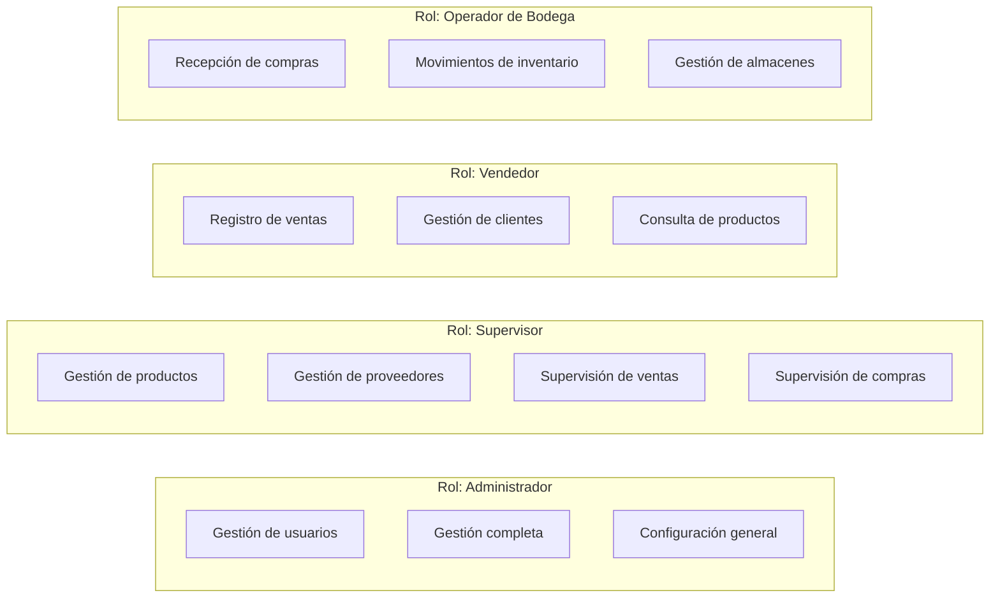
```mermaid
graph LR
    subgraph "Rol: Administrador"
        A1["Gestión de usuarios"]
        A2["Gestión completa"]
        A3["Configuración general"]
    end
    subgraph "Rol: Supervisor"
        S1["Gestión de productos"]
        S2["Gestión de proveedores"]
        S3["Supervisión de ventas"]
        S4["Supervisión de compras"]
    end
    subgraph "Rol: Vendedor"
        V1["Registro de ventas"]
        V2["Gestión de clientes"]
        V3["Consulta de productos"]
    end
    subgraph "Rol: Operador de Bodega"
        B1["Recepción de compras"]
        B2["Movimientos de inventario"]
        B3["Gestión de almacenes"]
    end
```

### 3.3 Matriz de Permisos por Rol

| Funcionalidad | Administrador | Supervisor | Vendedor | Bodega |
|---|:---:|:---:|:---:|:---:|
| Dashboard | ✅ | ✅ | ✅ | ✅ |
| Crear/Editar Productos | ✅ | ✅ | ❌ | ❌ |
| Configurar Productos | ✅ | ✅ | ❌ | ✅ |
| Gestionar Categorías | ✅ | ✅ | ❌ | ❌ |
| Crear/Editar Proveedores | ✅ | ✅ | ❌ | ❌ |
| Crear/Editar Clientes | ✅ | ✅ | ✅ | ❌ |
| Registrar Ventas | ✅ | ✅ | ✅ | ❌ |
| Registrar Compras | ✅ | ✅ | ❌ | ✅ |
| Gestionar Almacenes | ✅ | ✅ | ❌ | ✅ |
| Movimientos de Inventario | ✅ | ✅ | ❌ | ✅ |
| Gestionar Usuarios | ✅ | ❌ | ❌ | ❌ |
| Desbloquear Usuarios | ✅ | ❌ | ❌ | ❌ |

---

## 4. Normas y Buenas Prácticas de Uso

### 4.1 Seguridad de la Cuenta

1. **No comparta sus credenciales** de acceso con terceros.
2. **Cambie su contraseña** periódicamente (cada 30 días recomendado).
3. **Cierre sesión** al terminar de usar el sistema, especialmente en equipos compartidos.
4. **No deje la sesión abierta** sin supervisión.
5. Si su cuenta es bloqueada por intentos fallidos, contacte al administrador.

### 4.2 Uso del Sistema

1. **Use los navegadores soportados:** Google Chrome, Microsoft Edge o Mozilla Firefox (versiones actualizadas).
2. **Mantenga conexión estable a internet** para el funcionamiento correcto del sistema.
3. **Registre información completa y veraz** en todos los formularios.
4. **Verifique los datos** antes de confirmar operaciones críticas (ventas, compras).
5. **No cierre el navegador** durante el proceso de registro de una venta o compra.

### 4.3 Gestión de Contraseñas

- La contraseña debe tener **mínimo 8 caracteres**.
- Se recomienda combinar letras, números y caracteres especiales.
- El sistema bloquea la cuenta después de **5 intentos fallidos** de inicio de sesión.
- Las contraseñas se almacenan cifradas (hash PBKDF2-SHA256); nadie, ni siquiera el administrador, puede ver la contraseña en texto plano.

---

## 5. Instrucciones de Acceso y Navegación General

### 5.1 Requisitos Previos del Sistema

| Requisito | Especificación |
|---|---|
| **Navegador web** | Google Chrome (recomendado), Microsoft Edge o Mozilla Firefox (última versión) |
| **Conexión a internet** | Estable (mínimo 1 Mbps) |
| **Resolución de pantalla** | Mínimo 1024×768 (recomendado 1920×1080) |
| **URL de acceso (local)** | `http://localhost` (despliegue Docker) |
| **URL de acceso (producción)** | `https://sofinventory-app.onrender.com` |

### 5.2 Proceso de Inicio de Sesión

#### Paso 1: Acceder al sistema

Abra su navegador web e ingrese la URL de acceso al sistema SofInventory.

> 📷 **[EVIDENCIA FOTOGRÁFICA]**
> *Descripción: Captura de pantalla de la página de inicio de sesión de SofInventory, mostrando el formulario con los campos de usuario y contraseña, el panel de branding izquierdo con el logo y la lista de beneficios.*
>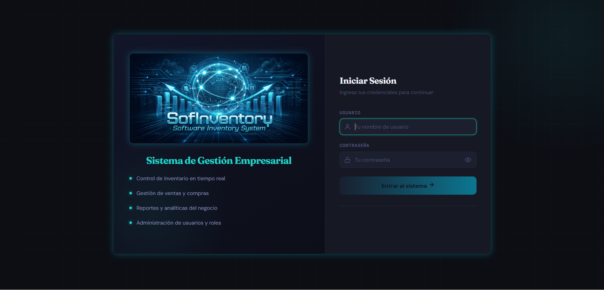

#### Paso 2: Ingresar credenciales

1. En el campo **Usuario**, ingrese su nombre de usuario asignado por el administrador.
2. En el campo **Contraseña**, ingrese su contraseña.
3. Puede hacer clic en el ícono del **ojo** (👁) para mostrar u ocultar la contraseña mientras la escribe.
4. Haga clic en el botón **"Entrar al sistema"**.

> 📷 **[EVIDENCIA FOTOGRÁFICA]**
> *Descripción: Captura del formulario de login con las credenciales ingresadas (usuario y contraseña con caracteres ocultos) y el botón "Entrar al sistema" visible.*
>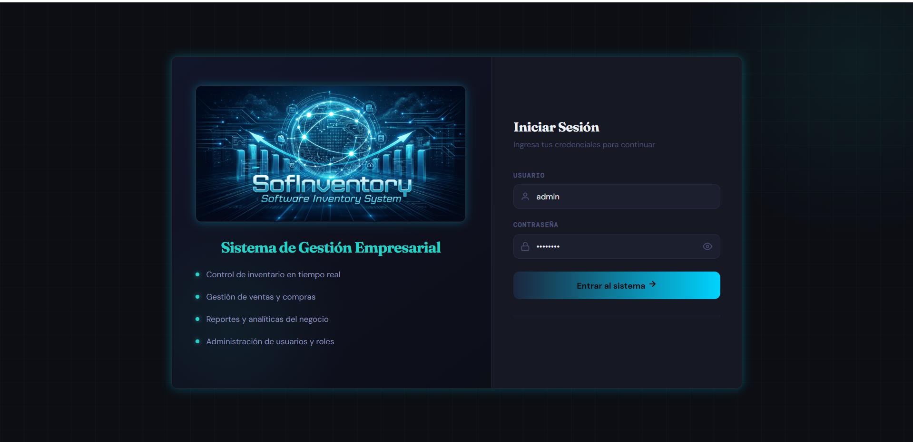

#### Paso 3: Respuesta del sistema

- **Si las credenciales son correctas:** El sistema lo redirigirá automáticamente al **Panel de Control (Dashboard)**.
- **Si las credenciales son incorrectas:** Aparecerá un mensaje de error en rojo: *"Credenciales incorrectas"*. El sistema mostrará los intentos restantes.
- **Si la cuenta está bloqueada:** Aparecerá un mensaje: *"Cuenta bloqueada. Contacta con el administrador para desbloquearla."*

> 📷 **[EVIDENCIA FOTOGRÁFICA]**
> *Descripción: Captura del Dashboard principal que se muestra después del login exitoso, con las tarjetas KPI, gráficos y el menú lateral izquierdo.*
>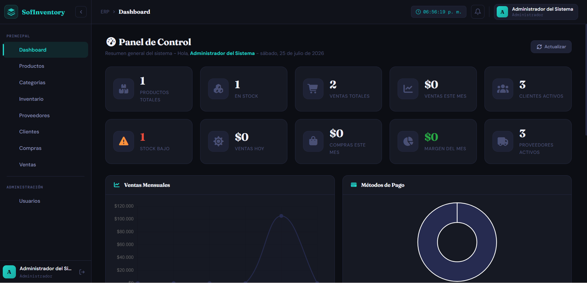

### 5.3 Descripción de la Interfaz General

#### 5.3.1 Menú Lateral (Sidebar)

El menú lateral izquierdo contiene los accesos directos a todos los módulos del sistema. Los módulos disponibles varían según el rol del usuario:

| Ícono | Módulo | Descripción | Roles con Acceso |
|---|---|---|---|
| 📊 | **Panel de Control** | Dashboard con indicadores y gráficos | Todos |
| 📦 | **Productos** | Catálogo de productos | Administrador, Supervisor, Bodega |
| 🏷️ | **Categorías** | Gestión de categorías de productos | Administrador, Supervisor |
| 🚛 | **Proveedores** | Gestión de proveedores | Administrador, Supervisor |
| 👥 | **Clientes** | Gestión de clientes | Administrador, Supervisor, Vendedor |
| 🛒 | **Compras** | Registro de compras | Administrador, Supervisor, Bodega |
| 💰 | **Ventas** | Punto de venta | Administrador, Supervisor, Vendedor |
| 📦 | **Inventario** | Control de stock y almacenes | Todos |
| 👤 | **Usuarios** | Gestión de usuarios del sistema | Solo Administrador |

> 📷 **[EVIDENCIA FOTOGRÁFICA]**
> *Descripción: Captura del menú lateral izquierdo desplegado, mostrando todos los módulos disponibles con sus íconos y nombres.*
>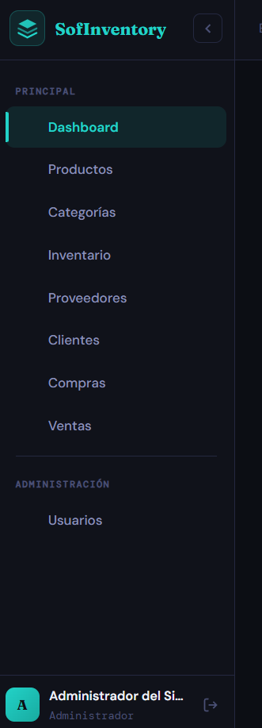

#### 5.3.2 Barra Superior (Header)

La barra superior contiene:

- **Título de la página actual:** Indica en qué módulo se encuentra.
- **Botón de actualizar:** Permite recargar los datos del módulo actual.
- **Información del usuario:** Muestra el nombre del usuario autenticado y su rol.

> 📷 **[EVIDENCIA FOTOGRÁFICA]**
> *Descripción: Captura de la barra superior de navegación mostrando el título de la página y el nombre del usuario autenticado.*
>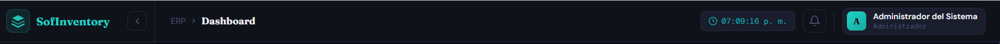

#### 5.3.3 Navegación entre Módulos

Para acceder a cualquier módulo:

1. Haga clic en el nombre del módulo en el **menú lateral izquierdo**.
2. El sistema cargará la página correspondiente con la tabla de datos y las opciones disponibles.
3. Puede volver al Dashboard en cualquier momento haciendo clic en **"Panel de Control"** en el menú.

> 📷 **[EVIDENCIA FOTOGRÁFICA]**
> *Descripción: Captura mostrando la transición entre módulos, con el menú lateral y el contenido del módulo seleccionado visible.*
>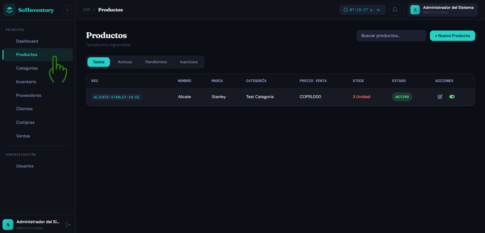

### 5.4 Cierre de Sesión

1. Haga clic en el ícono de **cerrar sesión** (🚪) en el menú lateral.
2. El sistema cerrará su sesión y lo redirigirá a la pantalla de inicio de sesión.
3. Si necesita acceder nuevamente, deberá ingresar sus credenciales.

> ⚠️ **Importante:** Siempre cierre sesión al terminar de usar el sistema, especialmente en equipos compartidos, para proteger la información.

### 5.5 Mapa de Navegación del Sistema

El siguiente mapa presenta, de forma general, cómo se organizan las pantallas del sistema a partir del inicio de sesión. El acceso a cada módulo depende del rol del usuario autenticado (ver matriz de permisos en la sección 3.3).

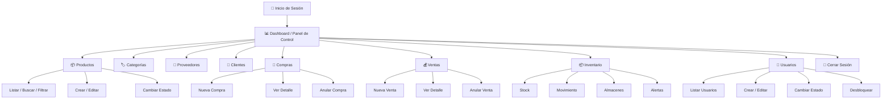
```mermaid
graph TD
    L["🔐 Inicio de Sesión"] --> D["📊 Dashboard / Panel de Control"]

    D --> P["📦 Productos"]
    D --> C["🏷️ Categorías"]
    D --> PR["🚛 Proveedores"]
    D --> CL["👥 Clientes"]
    D --> CO["🛒 Compras"]
    D --> V["💰 Ventas"]
    D --> I["📦 Inventario"]
    D --> U["👤 Usuarios"]
    D --> LO["🚪 Cerrar Sesión"]

    P --> P1["Listar / Buscar / Filtrar"]
    P --> P2["Crear / Editar"]
    P --> P3["Cambiar Estado"]

    CO --> CO1["Nueva Compra"]
    CO --> CO2["Ver Detalle"]
    CO --> CO3["Anular Compra"]

    V --> V1["Nueva Venta"]
    V --> V2["Ver Detalle"]
    V --> V3["Anular Venta"]

    I --> I1["Stock"]
    I --> I2["Movimiento"]
    I --> I3["Almacenes"]
    I --> I4["Alertas"]

    U --> U1["Listar Usuarios"]
    U --> U2["Crear / Editar"]
    U --> U3["Cambiar Estado"]
    U --> U4["Desbloquear"]
```

> **Cómo leer este mapa:** desde el Dashboard, el usuario accede a cualquier módulo habilitado para su rol a través del menú lateral. Dentro de cada módulo, las pestañas o botones internos (segundo nivel del mapa) permiten realizar las acciones específicas descritas en la sección 6 de este manual.

---

## 6. Guía de Uso por Roles de Usuario

---

### 6.1 Rol: Administrador

El **Administrador** tiene acceso total al sistema. Puede gestionar usuarios, configurar el sistema, supervisar todas las operaciones y acceder a todos los módulos.

#### 6.1.1 Panel de Control (Dashboard)

El Dashboard muestra una vista general del negocio con:

| Elemento | Descripción |
|---|---|
| **Tarjetas KPI** | Total productos, en stock, ventas totales, ventas del mes, clientes activos, stock bajo, ventas hoy, compras del mes, margen del mes, proveedores activos |
| **Gráficos** | Ventas mensuales (línea), Métodos de pago (dona), Top vendedores (barras), Estado del stock (dona) |
| **Mejor Vendedor del Mes** | Nombre, total de ventas y número de transacciones |
| **Alertas de Stock** | Lista de productos con stock por debajo del mínimo |
| **Ventas Recientes** | Últimas ventas registradas con número, cliente, fecha y total |
| **Productos Más Vendidos** | Ranking de productos más vendidos |
| **Acciones Rápidas** | Botones de acceso directo: Nueva Venta, Gestionar Productos, Gestionar Clientes, Ver Inventario |

> 📷 **[EVIDENCIA FOTOGRÁFICA]**
> *Descripción: Captura completa del Dashboard del Administrador, mostrando todas las tarjetas KPI incluyendo las de compras, margen y proveedores que solo ve el admin.*
>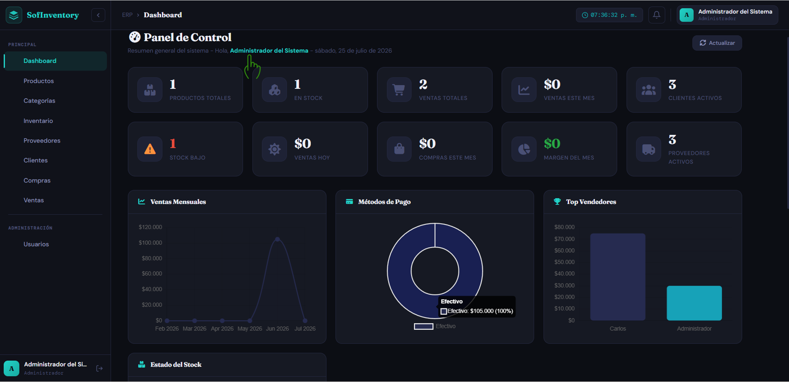

> 📷 **[EVIDENCIA FOTOGRÁFICA]**
> *Descripción: Captura de la sección de gráficos del Dashboard, mostrando las 4 gráficas: ventas mensuales, métodos de pago, top vendedores y estado del stock.*
>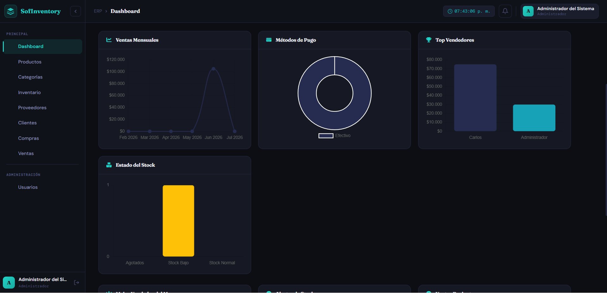

#### 6.1.2 Gestión de Usuarios

Solo el Administrador puede acceder a este módulo (protegido por `adminGuard`).

##### Listar Usuarios

1. Haga clic en **"Usuarios"** en el menú lateral.
2. Se mostrará una tabla con todos los usuarios registrados: Usuario, Nombre Completo, Email, Rol, Estado y Fecha de Creación.
3. Puede **buscar** un usuario específico escribiendo en el campo de búsqueda.

> 📷 **[EVIDENCIA FOTOGRÁFICA]**
> *Descripción: Captura de la página de Usuarios mostrando la tabla con la lista de usuarios registrados, el campo de búsqueda y el botón "+ Nuevo Usuario".*
>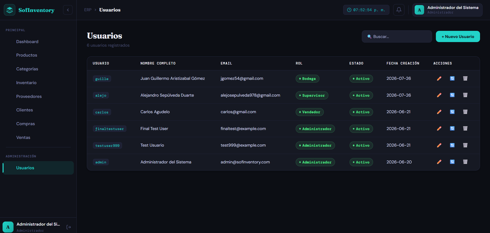

##### Crear un Nuevo Usuario

1. Haga clic en el botón **"+ Nuevo Usuario"**.
2. Se abrirá un modal con el formulario de creación.
3. Complete los campos obligatorios:

| Campo | Descripción | Obligatorio |
|---|---|---|
| Tipo Documento | Seleccione: CC - Cédula de Ciudadanía, CE - Cédula de Extranjería, NIT | Sí |
| Número Documento | Número de documento (solo números, máx. 10 dígitos) | Sí |
| Nombre Completo | Nombre completo del usuario | Sí |
| Email | Correo electrónico único | Sí |
| Username | Nombre de usuario para login (único) | Sí |
| Contraseña | Contraseña del usuario (mín. 8 caracteres) | Sí |
| Confirmar Contraseña | Repetir la contraseña | Sí |
| Rol | Seleccione: Administrador, Supervisor, Vendedor | Sí |
| Fecha Creación | Fecha de ingreso al sistema | Sí |
| Observaciones | Notas adicionales (opcional) | No |

4. Haga clic en **"Guardar"** para crear el usuario.

> 📷 **[EVIDENCIA FOTOGRÁFICA]**
> *Descripción: Captura del modal de creación de usuario con todos los campos del formulario visibles y algunos datos de ejemplo ingresados.*
>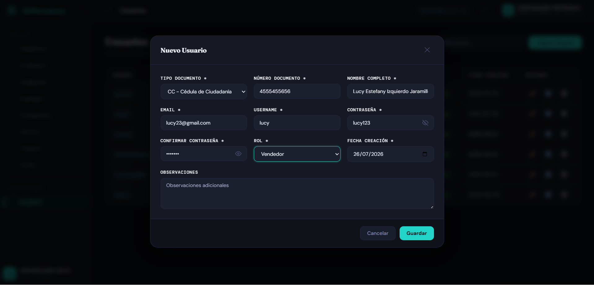

##### Editar un Usuario

1. En la tabla de usuarios, haga clic en el ícono **✏️ (Editar)** de la fila del usuario a modificar.
2. Se abrirá el modal con los datos actuales del usuario.
3. Modifique los campos deseados. El campo **Contraseña** es opcional al editar; si lo deja vacío, la contraseña no se cambiará.
4. Haga clic en **"Guardar"**.

> 📷 **[EVIDENCIA FOTOGRÁFICA]**
> *Descripción: Captura del modal de edición de usuario con los campos cargados con los datos existentes del usuario seleccionado.*
>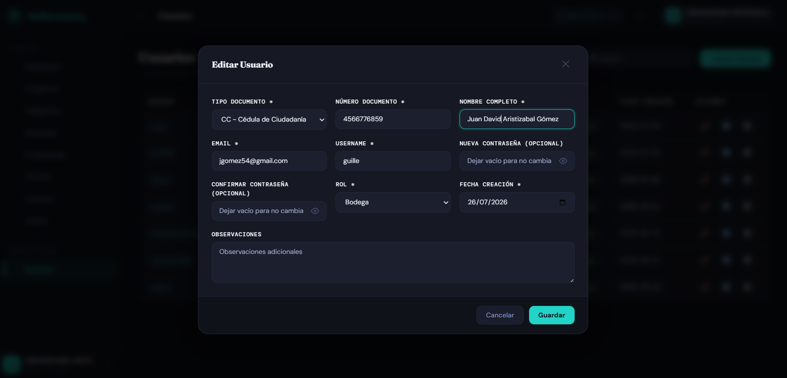

##### Cambiar Estado de un Usuario

1. En la tabla de usuarios, haga clic en el ícono **🔄 (Cambiar Estado)** de la fila del usuario.
2. El sistema cambiará el estado del usuario de **activo** a **inactivo**, o viceversa.
3. Un usuario inactivo no podrá iniciar sesión en el sistema.

> 📷 **[EVIDENCIA FOTOGRÁFICA]**
> *Descripción: Captura de la tabla de usuarios mostrando el botón de cambiar estado y el badge de estado del usuario.*
>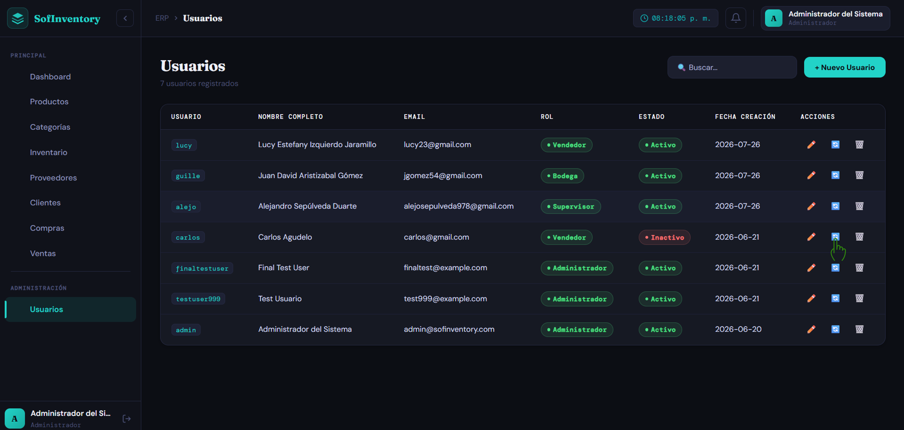

##### Desbloquear un Usuario

Si un usuario ha sido bloqueado por intentos fallidos de login (5 intentos):

1. En la tabla de usuarios, identifique el usuario con estado **"Bloqueado"** (badge rojo).
2. Haga clic en el ícono **🔓 (Desbloquear)** que aparece junto a los demás botones de acción.
3. El usuario podrá intentar iniciar sesión nuevamente.

> 📷 **[EVIDENCIA FOTOGRÁFICA]**
> *Descripción: Captura de la tabla de usuarios mostrando un usuario con el badge "Bloqueado" y el botón de desbloquear (candado abierto) visible.*
>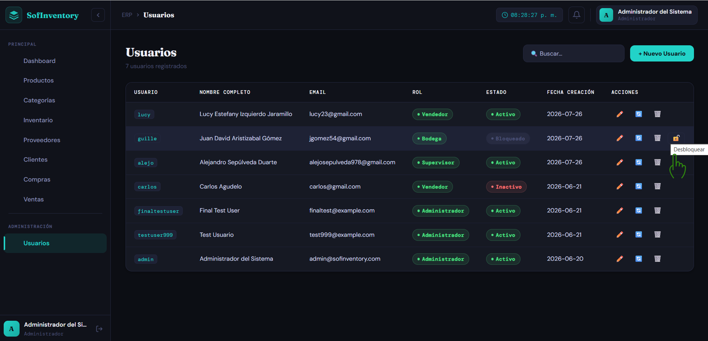

##### Eliminar un Usuario

1. En la tabla de usuarios, haga clic en el ícono **🗑️ (Eliminar)** de la fila del usuario.
2. Se mostrará una confirmación de eliminación.
3. Confirme para eliminar permanentemente el usuario.

> ⚠️ **Precaución:** Esta acción es irreversible. Asegúrese de seleccionar el usuario correcto antes de confirmar.

#### 6.1.3 Gestión de Productos

##### Listar Productos

1. Haga clic en **"Productos"** en el menú lateral.
2. Se mostrará la tabla de productos con: SKU, Nombre, Marca, Categoría, Precio Venta, Stock y Estado.
3. Use el **campo de búsqueda** para filtrar por nombre, SKU o marca.
4. Use los **botones de filtro** para mostrar: Todos, Activos, Pendientes o Inactivos.

> 📷 **[EVIDENCIA FOTOGRÁFICA]**
> *Descripción: Captura de la página de Productos mostrando la tabla con productos, los filtros por estado (Todos/Activos/Pendientes/Inactivos) y el campo de búsqueda.*
>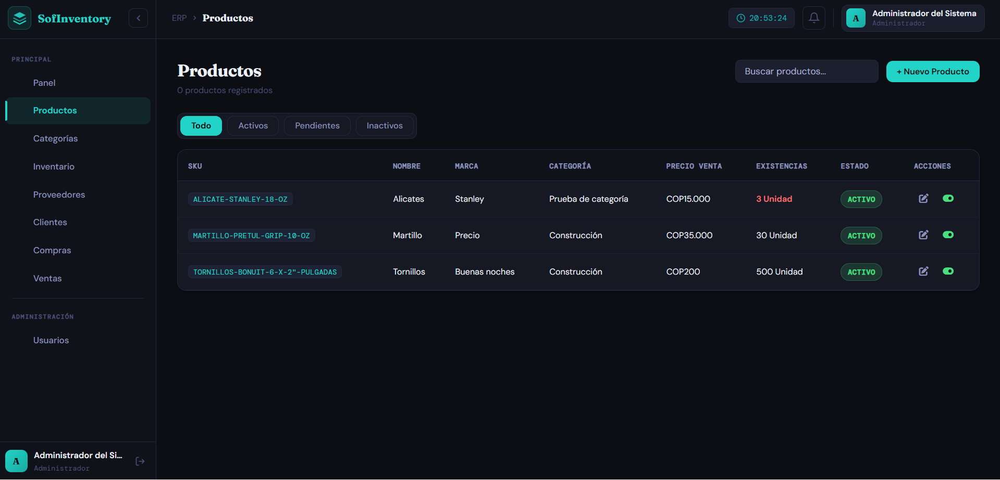

##### Crear un Nuevo Producto

1. Haga clic en **"+ Nuevo Producto"**.
2. Complete los campos del formulario:

| Campo | Descripción |
|---|---|
| SKU | Código único del producto (se genera automáticamente o se ingresa manualmente) |
| Nombre | Nombre comercial del producto |
| Marca | Marca del producto |
| Referencia | Referencia interna del fabricante |
| Unidad de Medida | Unidad, Caja, Metro, Litro, Galón, Rollo, Bulto, Kilo |
| Categoría | Seleccione la categoría del producto |
| Precio Compra | Precio de compra unitario |
| Precio Venta | Precio de venta unitario |
| IVA (%) | Porcentaje de IVA (generalmente 19%) |
| Stock Mínimo | Stock mínimo de seguridad |

3. Haga clic en **"Guardar"**.

> 📷 **[EVIDENCIA FOTOGRÁFICA]**
> *Descripción: Captura del modal de creación de producto con todos los campos del formulario visibles.*
>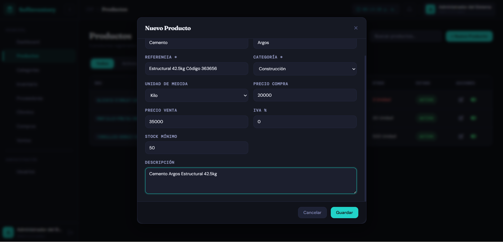

##### Cambiar Estado de un Producto

Los productos pueden tener tres estados:
- **Pendiente:** Producto registrado pero no configurado para venta
- **Activo:** Producto disponible para ventas y compras
- **Inactivo:** Producto deshabilitado

1. Haga clic en el ícono **🔄 (Cambiar Estado)** del producto.
2. El sistema rotará el estado del producto.

#### 6.1.4 Gestión de Categorías

1. Haga clic en **"Categorías"** en el menú lateral.
2. Se mostrará la lista de categorías existentes con su nombre, tipo de control y fecha de creación.
3. Para crear una categoría, haga clic en **"+ Nueva Categoría"** y complete:
   - **Nombre:** Nombre de la categoría
   - **Tipo de Control:** General, Herramienta, Eléctrico, Líquido o Tornillería
   - **Descripción:** Descripción de la categoría (opcional)

> 📷 **[EVIDENCIA FOTOGRÁFICA]**
> *Descripción: Captura de la página de Categorías mostrando la tabla de categorías y el botón de crear nueva categoría.*
>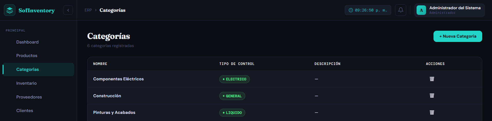

#### 6.1.5 Gestión de Proveedores

1. Haga clic en **"Proveedores"** en el menú lateral.
2. Se mostrará la tabla de proveedores con: Razón Social, Documento, Contacto, Email, Teléfono, Ciudad y Estado.
3. Use el **campo de búsqueda** para filtrar por razón social, documento o email.
4. Para crear un proveedor, haga clic en **"+ Nuevo Proveedor"** y complete los 14 campos del formulario.

> 📷 **[EVIDENCIA FOTOGRÁFICA]**
> *Descripción: Captura de la página de Proveedores mostrando la tabla con proveedores registrados y el campo de búsqueda.*
>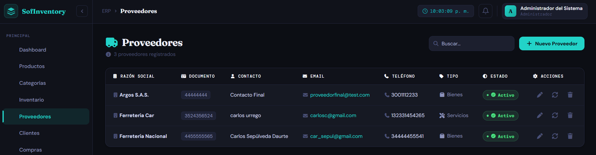

#### 6.1.6 Gestión de Clientes

1. Haga clic en **"Clientes"** en el menú lateral.
2. Se mostrará la tabla de clientes con: Nombre/Razón Social, Documento, Tipo, Categoría, Email, Teléfono, Ciudad y Estado.
3. Los clientes pueden ser **Personas Naturales** o **Personas Jurídicas**, con campos diferentes según el tipo.
4. Los clientes tienen 3 estados: Activo, Inactivo, Bloqueado (ciclo: activo → inactivo → bloqueado → activo).

> 📷 **[EVIDENCIA FOTOGRÁFICA]**
> *Descripción: Captura de la página de Clientes mostrando la tabla con clientes registrados y los campos de búsqueda por nombre, documento, email, teléfono y ciudad.*
>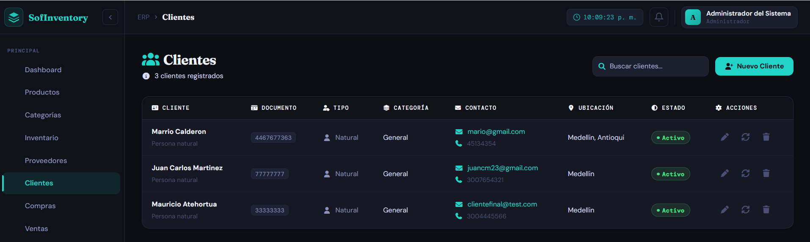

---

### 6.2 Rol: Supervisor

El **Supervisor** tiene acceso a la gestión de productos, categorías, proveedores, clientes, ventas, compras e inventario. **No puede** gestionar usuarios.

#### 6.2.1 Panel de Control del Supervisor

El Dashboard del Supervisor muestra las siguientes secciones:

| Sección | Visible |
|---|---|
| Total Productos | ✅ |
| En Stock | ✅ |
| Ventas Totales | ✅ |
| Ventas del Mes | ✅ |
| Clientes Activos | ✅ |
| Stock Bajo | ✅ |
| Ventas Hoy | ✅ |
| Gráfico de Ventas Mensuales | ✅ |
| Gráfico de Métodos de Pago | ✅ |
| Gráfico de Estado del Stock | ✅ |
| Top Vendedores | ❌ Oculto |
| Mejor Vendedor del Mes | ❌ Oculto |
| Compras del Mes | ❌ Oculto |
| Margen del Mes | ❌ Oculto |
| Proveedores Activos | ❌ Oculto |

> 📷 **[EVIDENCIA FOTOGRÁFICA]**
> *Descripción: Captura del Dashboard del Supervisor, mostrando las tarjetas KPI visibles para este rol (sin compras, margen ni proveedores).*
>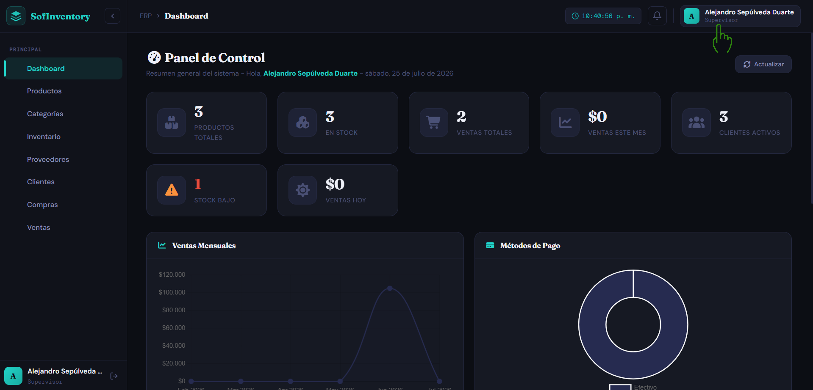

#### 6.2.2 Supervisión de Stock y Reportes

El Supervisor puede:

1. **Consultar el inventario completo** en la pestaña "Stock" del módulo de Inventario.
2. **Revisar alertas de stock bajo** en la pestaña "Alertas".
3. **Crear y editar almacenes** en la pestaña "Almacenes".
4. **Registrar movimientos de inventario** (entradas, salidas, ajustes) en la pestaña "Movimiento".
5. **Exportar inventario a CSV** para análisis externo.

> 📷 **[EVIDENCIA FOTOGRÁFICA]**
> *Descripción: Captura de la pestaña de Inventario → Stock, mostrando la tabla de productos con su stock actual, stock mínimo y estado.*
>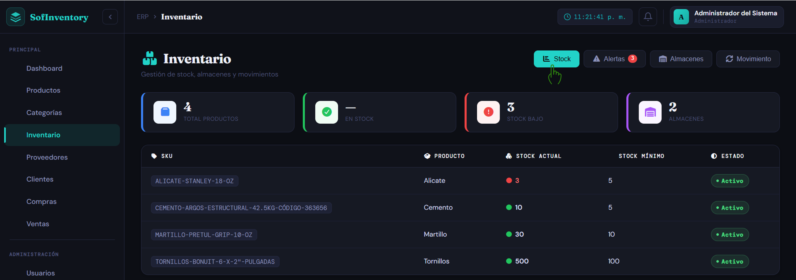

#### 6.2.3 Auditoría de Catálogo y Movimientos

El Supervisor puede:

- **Ver y editar productos** existentes.
- **Crear categorías** de productos.
- **Gestionar proveedores** (crear, editar, activar/desactivar).
- **Gestionar clientes** (crear, editar).
- **Registrar y anular compras** y ventas.
- **Registrar movimientos rápidos** de inventario.

---

### 6.3 Rol: Vendedor

El **Vendedor** se enfoca en el módulo de **ventas**, la gestión de **clientes** y la consulta de **productos**.

#### 6.3.1 Panel de Control del Vendedor

El Dashboard del Vendedor muestra las siguientes secciones:

| Sección | Visible |
|---|---|
| Total Productos | ✅ |
| En Stock | ✅ |
| Ventas Totales | ✅ |
| Ventas del Mes | ✅ |
| Clientes Activos | ❌ Oculto |
| Stock Bajo | ✅ |
| Ventas Hoy | ✅ |
| Gráfico de Ventas Mensuales | ✅ |
| Gráfico de Métodos de Pago | ✅ |
| Gráfico de Estado del Stock | ✅ |
| Top Vendedores | ❌ Oculto |
| Mejor Vendedor del Mes | ❌ Oculto |
| Compras del Mes | ❌ Oculto |
| Margen del Mes | ❌ Oculto |
| Proveedores Activos | ❌ Oculto |
| Botón "Nueva Venta" | ❌ Oculto |

> 📷 **[EVIDENCIA FOTOGRÁFICA]**
> *Descripción: Captura del Dashboard del Vendedor, mostrando las tarjetas KPI y gráficos visibles para este rol (sin compras, margen, proveedores, top vendedores).*
>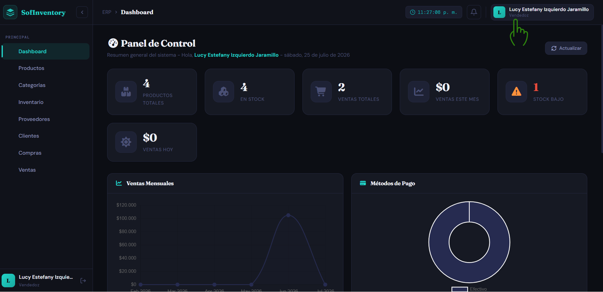

#### 6.3.2 Módulo de Facturación/Ventas

##### Registrar una Nueva Venta

1. Haga clic en **"Ventas"** en el menú lateral.
2. Haga clic en el botón **"+ Nueva Venta"**.
3. Se abrirá el modal de registro de venta con las siguientes secciones:

**Datos Generales:**

| Campo | Descripción |
|---|---|
| Cliente | Seleccione un cliente o deje "Cliente General" si no identifica al cliente |
| Almacén | Seleccione el almacén de origen del stock |
| Método de Pago | Efectivo, Tarjeta Débito, Tarjeta Crédito, Transferencia, Nequi, DaviPlata, Otro |
| Descuento | Descuento adicional en pesos (opcional) |
| Efectivo Recibido | (Solo si pago en efectivo) Dinero entregado por el cliente |
| Cambio | (Calculado automáticamente) Cambio a devolver |
| Observaciones | Notas adicionales de la venta (opcional) |

**Detalle de Productos:**

1. Haga clic en **"+ Agregar"** para agregar una línea de producto.
2. Seleccione el **producto** del desplegable.
3. Ingrese el **precio unitario** y la **cantidad**.
4. El sistema muestra el **stock disponible** del producto y calcula el **subtotal**.
5. Puede agregar múltiples productos haciendo clic en "+ Agregar" nuevamente.
6. Para eliminar una línea, haga clic en el ícono **🗑️ (basura)**.

**Totales (calculados automáticamente):**

| Campo | Descripción |
|---|---|
| Subtotal | Suma de (precio × cantidad) de todos los productos |
| Descuento | Descuento aplicado |
| IVA Estimado | Cálculo automático del IVA (19% por defecto) |
| **Total** | **Monto total a pagar** |

4. Haga clic en **"Registrar Venta"** para confirmar.

> 📷 **[EVIDENCIA FOTOGRÁFICA]**
> *Descripción: Captura del modal de nueva venta con el formulario completo: datos generales (cliente, almacén, método de pago), tabla de productos con al menos un producto agregado, y los totales calculados (subtotal, IVA, total).*
>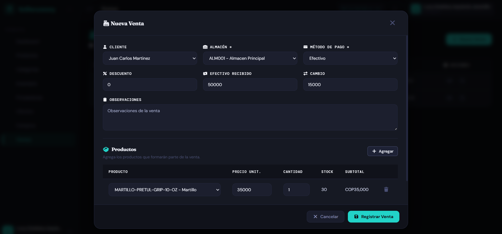

##### Ver Detalle de una Venta

1. En la tabla de ventas, haga clic en el ícono **👁 (Ver)** de la venta a consultar.
2. Se abrirá un modal con el detalle completo: número de venta, cliente, método de pago, productos, cantidades, precios y totales.

> 📷 **[EVIDENCIA FOTOGRÁFICA]**
> *Descripción: Captura del modal de detalle de venta mostrando el número de venta, cliente, método de pago, tabla de productos con cantidades y precios, y los totales.*
>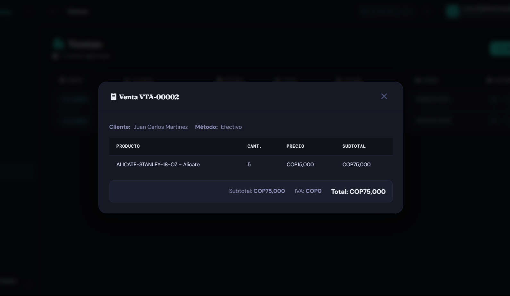

##### Anular una Venta

1. En la tabla de ventas, haga clic en el ícono **🚫 (Anular)** de la venta a anular.
2. Confirme la anulación.
3. El sistema restaurará automáticamente el stock descontado y registrará el movimiento de inventario correspondiente (DEVOLUCION_VENTA).

> ⚠️ **Importante:** La anulación de ventas es irreversible. Asegúrese de que sea necesario antes de confirmar.

> 📷 **[EVIDENCIA FOTOGRÁFICA]**
> *Descripción: Captura de la tabla de ventas mostrando el botón de anular (🚫) en una venta activa y el badge de estado "completada".*
>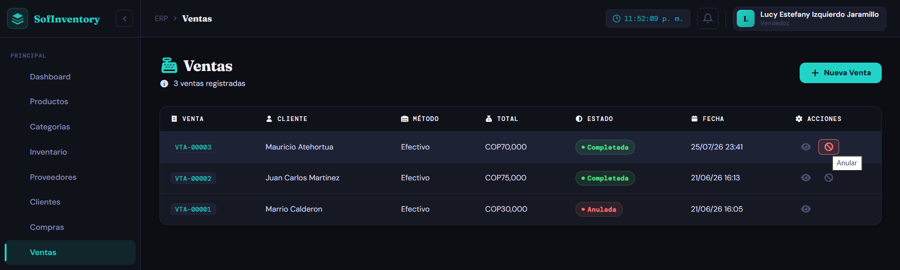

#### 6.3.3 Gestión de Clientes

El Vendedor puede crear y editar clientes:

1. Haga clic en **"Clientes"** en el menú lateral.
2. Haga clic en **"+ Nuevo Cliente"**.
3. Seleccione el tipo de cliente:
   - **Persona Natural:** Ingrese nombres, apellidos, tipo y número de documento.
   - **Persona Jurídica:** Ingrese razón social, nombre comercial, tipo y número de documento.
4. Complete los campos de contacto: email, teléfono(s), dirección, ciudad, departamento, país.
5. Seleccione la categoría: General, Minorista, Mayorista o Corporativo.
6. Haga clic en **"Guardar"**.

> 📷 **[EVIDENCIA FOTOGRÁFICA]**
> *Descripción: Captura del modal de creación de cliente mostrando los campos para persona natural (nombres, apellidos) con los datos de contacto.*
>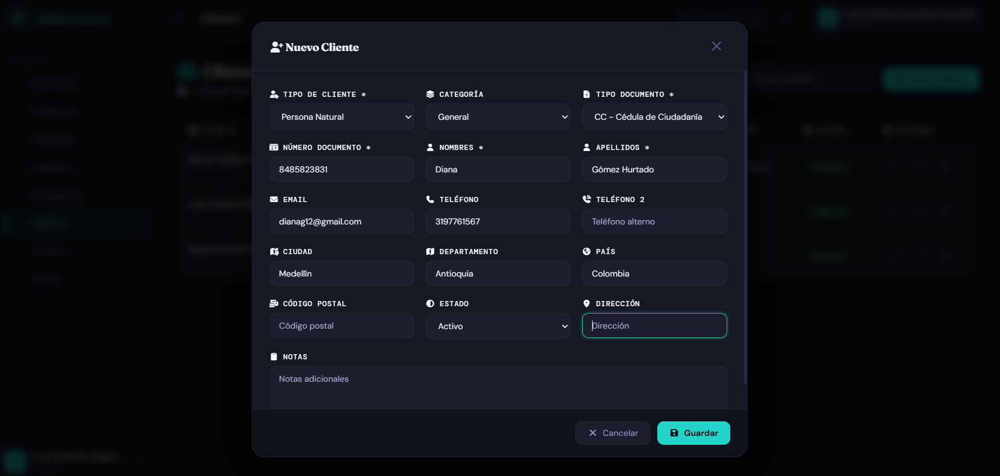

#### 6.3.4 Consulta Rápida de Productos

El Vendedor puede **ver** la lista de productos (sin poder crear ni editar):

1. Haga clic en **"Productos"** en el menú lateral.
2. Use el campo de búsqueda para encontrar un producto por nombre, SKU o marca.
3. Filtre por estado: Todos, Activos, Pendientes o Inactivos.
4. Consulte el precio de venta y el stock disponible de cada producto.

> 📷 **[EVIDENCIA FOTOGRÁFICA]**
> *Descripción: Captura de la página de Productos vista por el Vendedor, mostrando la tabla de productos con precios y stock (sin permisos para editar o crear nuevo producto).*
>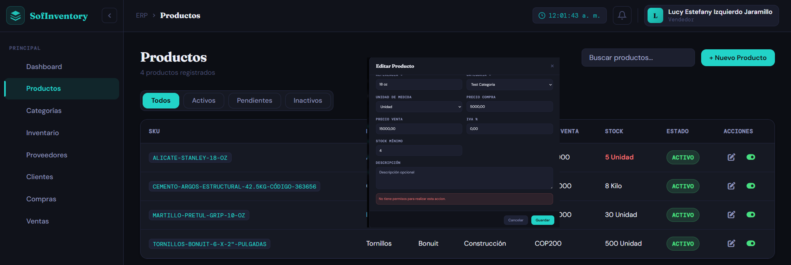

---

### 6.4 Rol: Operador de Bodega

El **Operador de Bodega** se enfoca en la recepción de compras, los movimientos de inventario y la gestión de almacenes.

#### 6.4.1 Panel de Control del Operador de Bodega

El Dashboard del Operador de Bodega muestra las siguientes secciones:

| Sección | Visible |
|---|---|
| Total Productos | ✅ |
| En Stock | ✅ |
| Ventas Totales | ✅ |
| Ventas del Mes | ❌ Oculto |
| Clientes Activos | ❌ Oculto |
| Stock Bajo | ✅ |
| Ventas Hoy | ❌ Oculto |
| Compras del Mes | ✅ |
| Margen del Mes | ❌ Oculto |
| Gráfico de Ventas Mensuales | ❌ Oculto |
| Gráfico de Métodos de Pago | ✅ |
| Gráfico de Estado del Stock | ✅ |
| Top Vendedores | ❌ Oculto |
| Mejor Vendedor del Mes | ❌ Oculto |
| Ventas Recientes | ❌ Oculto |

> 📷 **[EVIDENCIA FOTOGRÁFICA]**
> *Descripción: Captura del Dashboard del Operador de Bodega, mostrando las tarjetas KPI visibles para este rol (sin ventas del mes, clientes, ventas hoy, margen).*
>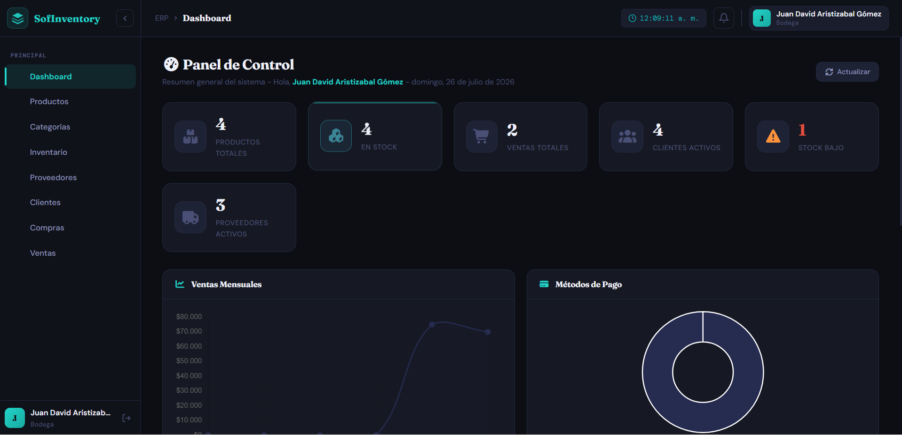

#### 6.4.2 Recepción de Compras

1. Haga clic en **"Compras"** en el menú lateral.
2. Haga clic en **"+ Nueva Compra"**.
3. Complete los datos de la compra:

**Datos Generales:**

| Campo | Descripción |
|---|---|
| Proveedor | Seleccione el proveedor |
| Número de Factura | Número de factura del proveedor |
| Fecha de Compra | Fecha de la compra |
| Tipo de Compra | Contado o Crédito |

**Detalle de Productos:**

1. Agregue líneas de producto haciendo clic en **"+ Agregar"**.
2. Seleccione el producto, ingrese la cantidad y el costo unitario.
3. El sistema calcula automáticamente subtotal, IVA y total.
4. Haga clic en **"Registrar Compra"**.

**Efecto en el Inventario:**

Al registrar una compra, el sistema automáticamente:
- **Aumenta el stock** del producto en el almacén correspondiente.
- **Registra un movimiento** de inventario de tipo `ENTRADA_COMPRA`.

> 📷 **[EVIDENCIA FOTOGRÁFICA]**
> *Descripción: Captura del modal de nueva compra con el formulario completo: datos del proveedor, factura, y tabla de productos con cantidades y costos.*
>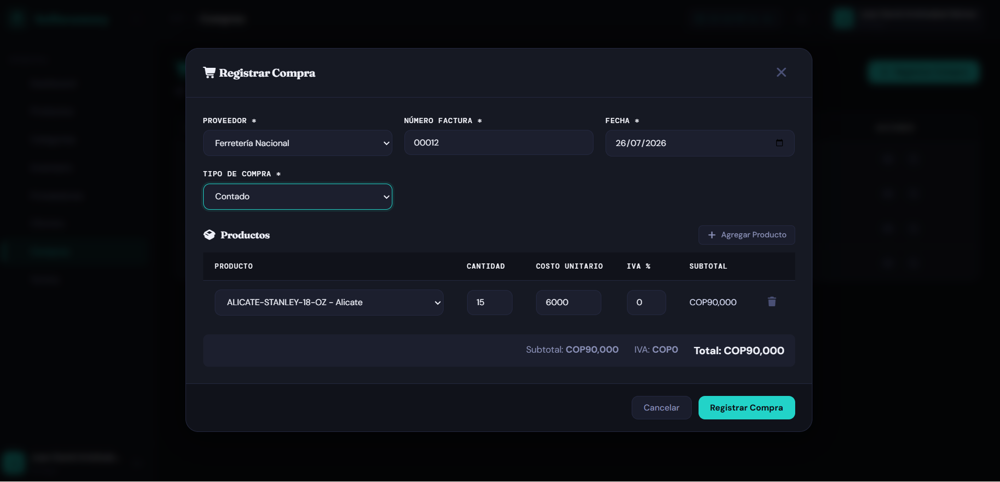

#### 6.4.3 Gestión de Almacenes

##### Listar Almacenes

1. Haga clic en **"Inventario"** en el menú lateral.
2. Haga clic en la pestaña **"Almacenes"**.
3. Se mostrará la tabla de almacenes con: Nombre, Código, Dirección y Acciones.

> 📷 **[EVIDENCIA FOTOGRÁFICA]**
> *Descripción: Captura de la pestaña "Almacenes" del módulo de Inventario, mostrando la tabla de almacenes registrados.*
>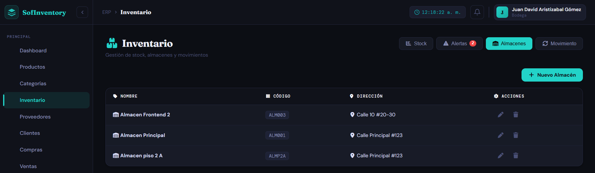

##### Crear un Nuevo Almacén

1. Haga clic en **"+ Nuevo Almacén"**.
2. Complete los campos:

| Campo | Descripción | Obligatorio |
|---|---|---|
| Nombre | Nombre del almacén | Sí |
| Código | Código único del almacén (ej: ALM001) | Sí |
| Dirección | Dirección física del almacén | No |
| Notas | Observaciones adicionales | No |

3. Haga clic en **"Guardar"**.

> 📷 **[EVIDENCIA FOTOGRÁFICA]**
> *Descripción: Captura del modal de creación de almacén con los campos: nombre, código, dirección y notas.*
>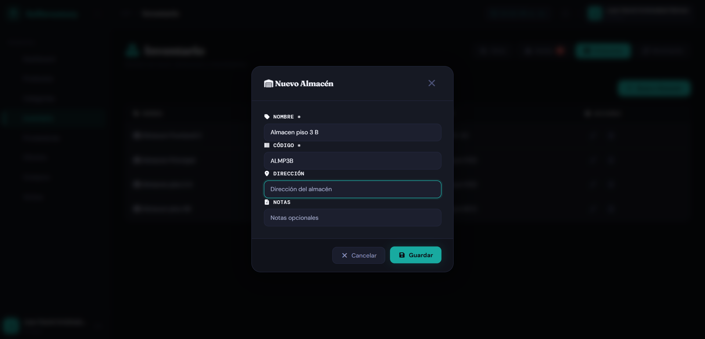

#### 6.4.4 Movimientos de Inventario

1. Haga clic en **"Inventario"** en el menú lateral.
2. Haga clic en la pestaña **"Movimiento"**.
3. Complete el formulario de movimiento:

| Campo | Descripción |
|---|---|
| Producto | Seleccione el producto |
| Tipo | Entrada, Salida o Ajuste |
| Cantidad | Cantidad de unidades |
| Motivo | Descripción del motivo del movimiento |

4. Haga clic en **"Registrar Movimiento"**.

**Tipos de Movimiento:**

| Tipo | Efecto en Stock | Uso |
|---|---|---|
| **Entrada** | Aumenta el stock | Recepción de mercancía, devoluciones |
| **Salida** | Disminuye el stock | Venta, traslado, merma |
| **Ajuste** | Modifica el stock según la cantidad ingresada | Corrección de inventario |

> 📷 **[EVIDENCIA FOTOGRÁFICA]**
> *Descripción: Captura de la pestaña "Movimiento" del módulo de Inventario con el formulario de movimiento de stock visible, mostrando los campos de producto, tipo, cantidad y motivo.*
>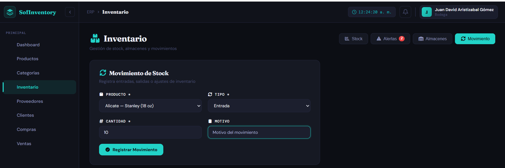

#### 6.4.5 Consulta de Almacenes y Stock

1. En la pestaña **"Stock"**, consulte el inventario completo con: SKU, Producto, Stock Actual, Stock Mínimo y Estado.
2. Los estados de stock son:
   - **Agotado:** Stock = 0
   - **Bajo:** Stock ≤ Stock Mínimo
   - **Medio:** Stock > Stock Mínimo y ≤ 20
   - **Alto:** Stock > 20
3. Use las **estadísticas resumidas** en la parte superior para ver: Total Productos, En Stock, Stock Bajo y Almacenes.

> 📷 **[EVIDENCIA FOTOGRÁFICA]**
> *Descripción: Captura de la pestaña "Stock" del módulo de Inventario mostrando las estadísticas resumidas en la parte superior y la tabla de productos con su estado de stock.*
>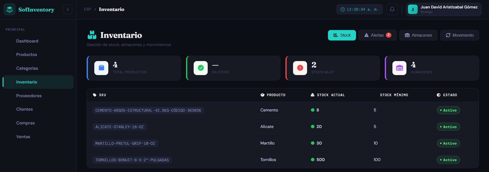

---

## 7. Flujos de Trabajo Principales

### 7.1 Flujo: Registrar una Venta

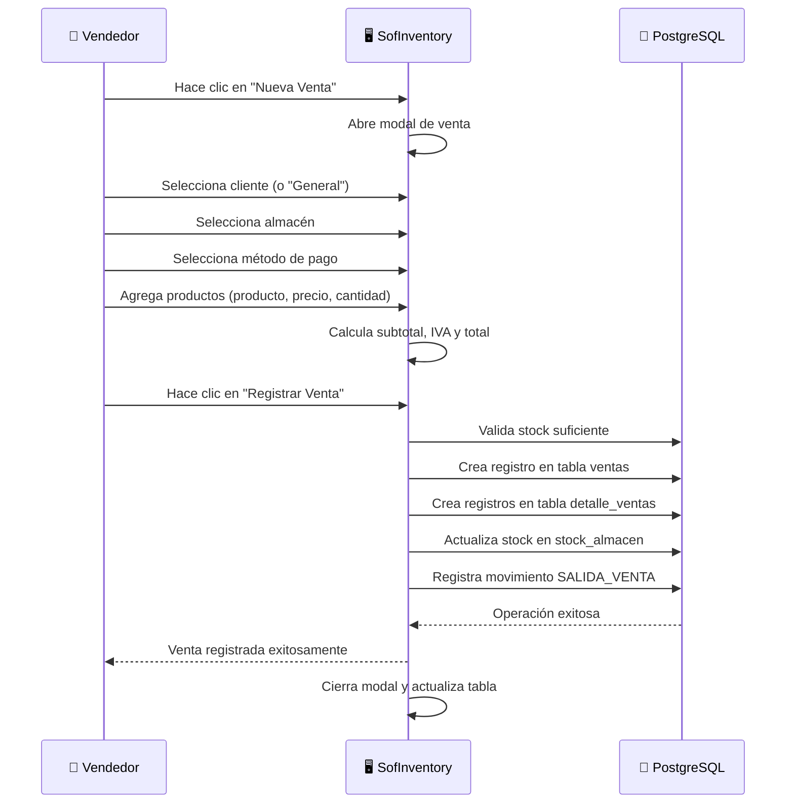
```mermaid
sequenceDiagram
    participant V as 👤 Vendedor
    participant S as 🖥️ SofInventory
    participant DB as 🐘 PostgreSQL

    V->>S: Hace clic en "Nueva Venta"
    S->>S: Abre modal de venta
    V->>S: Selecciona cliente (o "General")
    V->>S: Selecciona almacén
    V->>S: Selecciona método de pago
    V->>S: Agrega productos (producto, precio, cantidad)
    S->>S: Calcula subtotal, IVA y total
    V->>S: Hace clic en "Registrar Venta"
    S->>DB: Valida stock suficiente
    S->>DB: Crea registro en tabla ventas
    S->>DB: Crea registros en tabla detalle_ventas
    S->>DB: Actualiza stock en stock_almacen
    S->>DB: Registra movimiento SALIDA_VENTA
    DB-->>S: Operación exitosa
    S-->>V: Venta registrada exitosamente
    S->>S: Cierra modal y actualiza tabla
```

**Pasos detallados:**

1. Acceda al módulo **"Ventas"** desde el menú lateral.
2. Haga clic en **"+ Nueva Venta"**.
3. Seleccione el **cliente** (o deje "Cliente General" si no aplica).
4. Seleccione el **almacén** de donde saldrá la mercancía.
5. Seleccione el **método de pago** (Efectivo, Débito, Crédito, Transferencia, Nequi, DaviPlata).
6. Haga clic en **"+ Agregar"** para agregar productos.
7. Para cada producto: seleccione el producto, verifique el precio, ingrese la cantidad.
8. Si es pago en efectivo, ingrese el **efectivo recibido** y el sistema calculará el **cambio**.
9. Revise los **totales** (Subtotal, Descuento, IVA, Total).
10. Haga clic en **"Registrar Venta"**.
11. El sistema descontará automáticamente el stock y registrará el movimiento de inventario.

> 📷 **[EVIDENCIA FOTOGRÁFICA]**
> *Descripción: Captura del proceso completo de registro de venta, mostrando el modal con productos agregados, totales calculados y el botón "Registrar Venta" habilitado.*
>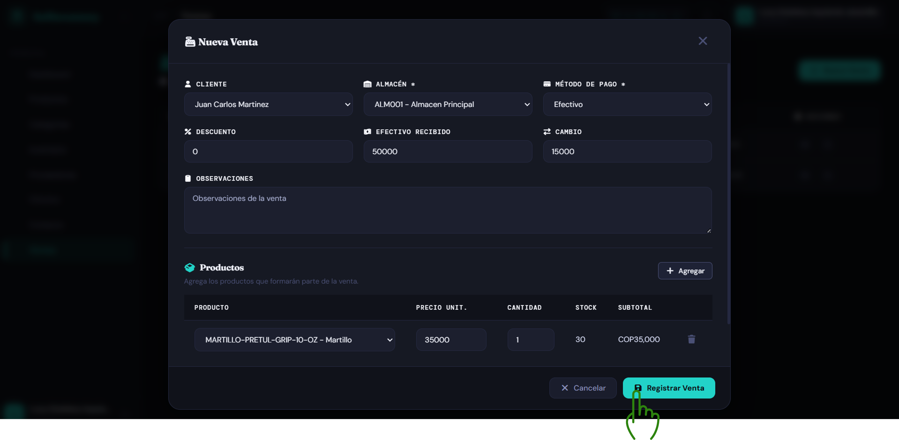

---

### 7.2 Flujo: Cargar Inventario desde Bodega

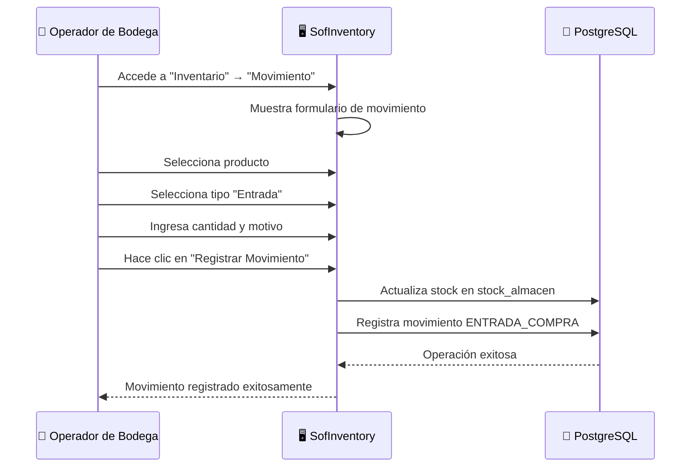
```mermaid
sequenceDiagram
    participant B as 👤 Operador de Bodega
    participant S as 🖥️ SofInventory
    participant DB as 🐘 PostgreSQL

    B->>S: Accede a "Inventario" → "Movimiento"
    S->>S: Muestra formulario de movimiento
    B->>S: Selecciona producto
    B->>S: Selecciona tipo "Entrada"
    B->>S: Ingresa cantidad y motivo
    B->>S: Hace clic en "Registrar Movimiento"
    S->>DB: Actualiza stock en stock_almacen
    S->>DB: Registra movimiento ENTRADA_COMPRA
    DB-->>S: Operación exitosa
    S-->>B: Movimiento registrado exitosamente
```

**Pasos detallados:**

1. Acceda al módulo **"Inventario"** desde el menú lateral.
2. Haga clic en la pestaña **"Movimiento"**.
3. Seleccione el **producto** del desplegable.
4. Seleccione el tipo de movimiento: **Entrada**.
5. Ingrese la **cantidad** de unidades a ingresar.
6. Ingrese el **motivo** del movimiento (ej: "Recepción de compra #123").
7. Haga clic en **"Registrar Movimiento"**.
8. El sistema actualizará el stock del producto en la base de datos.

> 📷 **[EVIDENCIA FOTOGRÁFICA]**
> *Descripción: Captura del formulario de movimiento de inventario con tipo "Entrada" seleccionado, producto elegido, cantidad ingresada y motivo escrito.*
>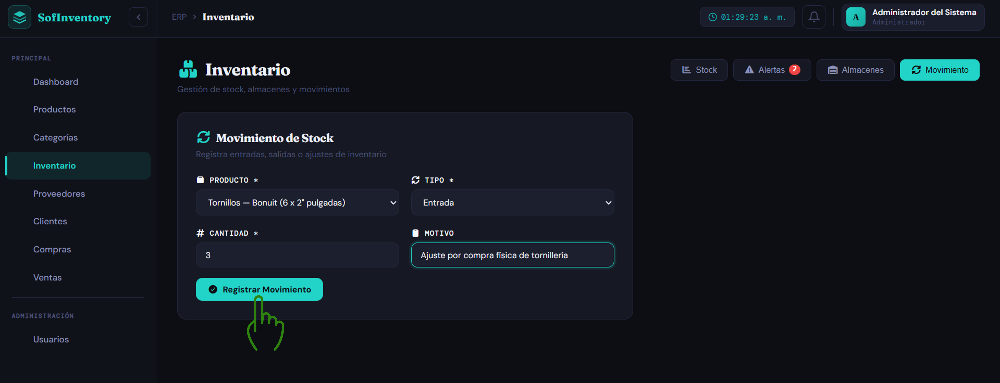

---

### 7.3 Flujo: Crear un Usuario

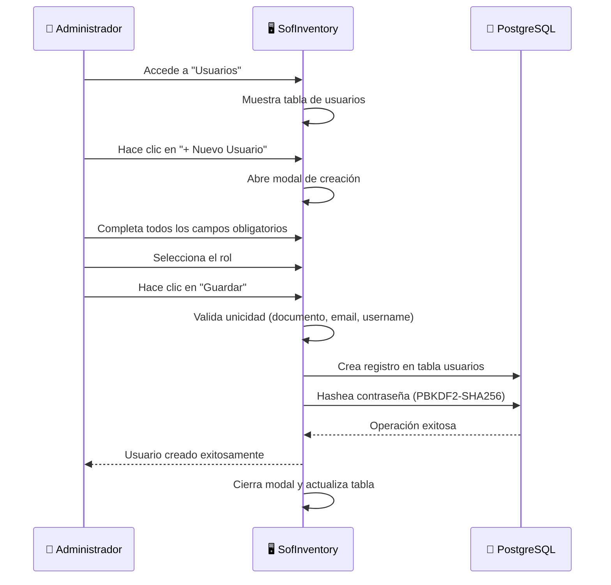
```mermaid
sequenceDiagram
    participant A as 👤 Administrador
    participant S as 🖥️ SofInventory
    participant DB as 🐘 PostgreSQL

    A->>S: Accede a "Usuarios"
    S->>S: Muestra tabla de usuarios
    A->>S: Hace clic en "+ Nuevo Usuario"
    S->>S: Abre modal de creación
    A->>S: Completa todos los campos obligatorios
    A->>S: Selecciona el rol
    A->>S: Hace clic en "Guardar"
    S->>S: Valida unicidad (documento, email, username)
    S->>DB: Crea registro en tabla usuarios
    S->>DB: Hashea contraseña (PBKDF2-SHA256)
    DB-->>S: Operación exitosa
    S-->>A: Usuario creado exitosamente
    S->>S: Cierra modal y actualiza tabla
```

**Pasos detallados:**

1. Acceda al módulo **"Usuarios"** desde el menú lateral.
2. Haga clic en **"+ Nuevo Usuario"**.
3. Seleccione el **Tipo de Documento** (CC, CE o NIT).
4. Ingrese el **Número de Documento** (solo números, máx. 10 dígitos).
5. Ingrese el **Nombre Completo** del usuario.
6. Ingrese el **Email** (debe ser único en el sistema).
7. Ingrese el **Username** (debe ser único en el sistema).
8. Ingrese y confirme la **Contraseña** (mín. 8 caracteres).
9. Seleccione el **Rol** (Administrador, Supervisor o Vendedor).
10. Seleccione la **Fecha de Creación**.
11. Ingrese **Observaciones** si es necesario.
12. Haga clic en **"Guardar"**.
13. El sistema validará que el documento, email y username no existan previamente.
14. Si la validación es exitosa, el usuario se creará con la contraseña hasheada.

> 📷 **[EVIDENCIA FOTOGRÁFICA]**
> *Descripción: Captura del modal de creación de usuario completamente diligenciado, con todos los campos obligatorios llenos, el rol seleccionado y el botón "Guardar" habilitado.*
>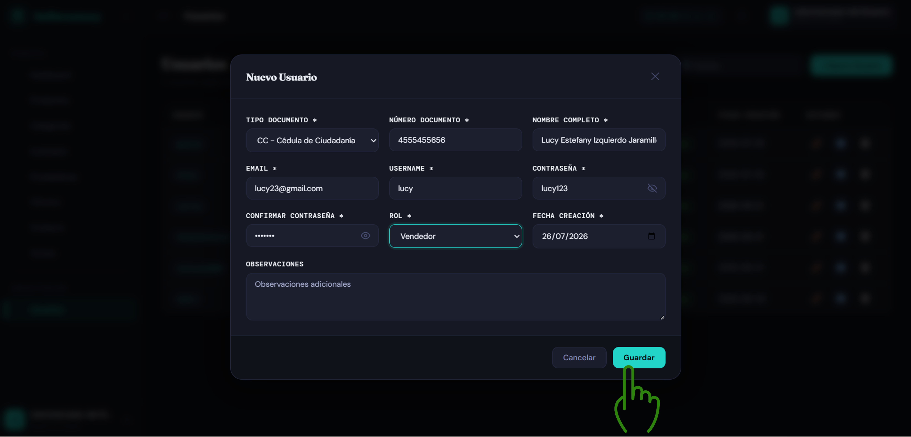

---

### 7.4 Flujo: Registrar una Compra

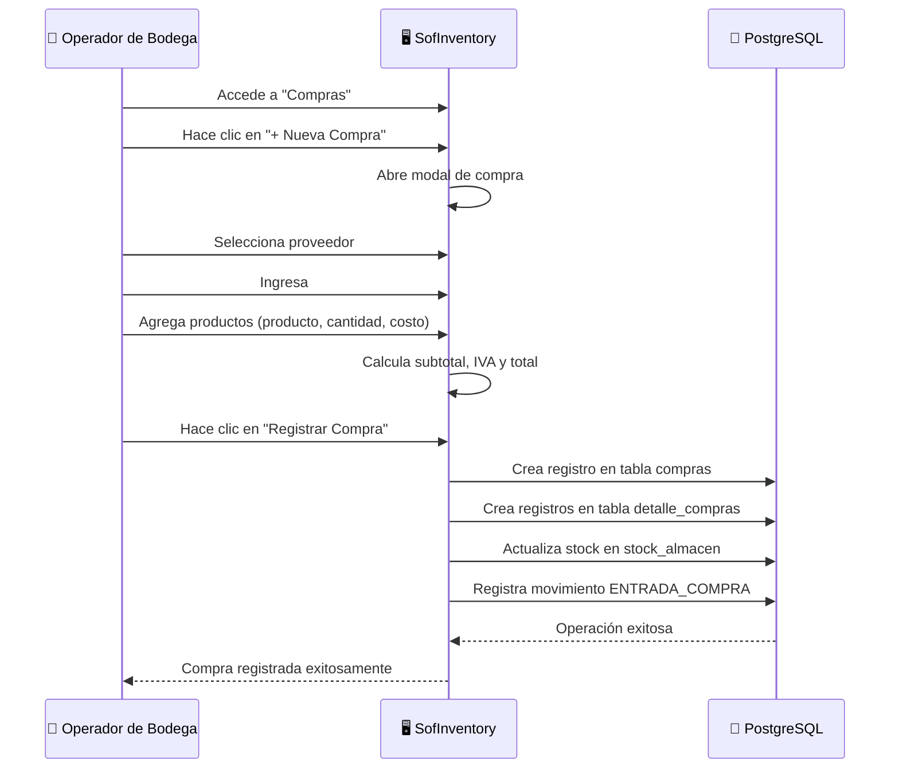
```mermaid
sequenceDiagram
    participant B as 👤 Operador de Bodega
    participant S as 🖥️ SofInventory
    participant DB as 🐘 PostgreSQL

    B->>S: Accede a "Compras"
    B->>S: Hace clic en "+ Nueva Compra"
    S->>S: Abre modal de compra
    B->>S: Selecciona proveedor
    B->>S: Ingresa # factura y fecha
    B->>S: Agrega productos (producto, cantidad, costo)
    S->>S: Calcula subtotal, IVA y total
    B->>S: Hace clic en "Registrar Compra"
    S->>DB: Crea registro en tabla compras
    S->>DB: Crea registros en tabla detalle_compras
    S->>DB: Actualiza stock en stock_almacen
    S->>DB: Registra movimiento ENTRADA_COMPRA
    DB-->>S: Operación exitosa
    S-->>B: Compra registrada exitosamente
```

**Pasos detallados:**

1. Acceda al módulo **"Compras"** desde el menú lateral.
2. Haga clic en **"+ Nueva Compra"**.
3. Seleccione el **Proveedor**.
4. Ingrese el **Número de Factura** del proveedor.
5. Ingrese la **Fecha de Compra**.
6. Seleccione el **Tipo de Compra** (Contado o Crédito).
7. Haga clic en **"+ Agregar"** para agregar productos.
8. Para cada producto: seleccione el producto, ingrese la cantidad y el costo unitario.
9. Revise los **totales** (Subtotal, IVA, Total).
10. Haga clic en **"Registrar Compra"**.
11. El sistema aumentará automáticamente el stock y registrará el movimiento `ENTRADA_COMPRA`.

> 📷 **[EVIDENCIA FOTOGRÁFICA]**
> *Descripción: Captura del modal de nueva compra con el formulario completo: datos del proveedor, factura, y tabla de productos con al menos un producto, mostrando los totales calculados.*
>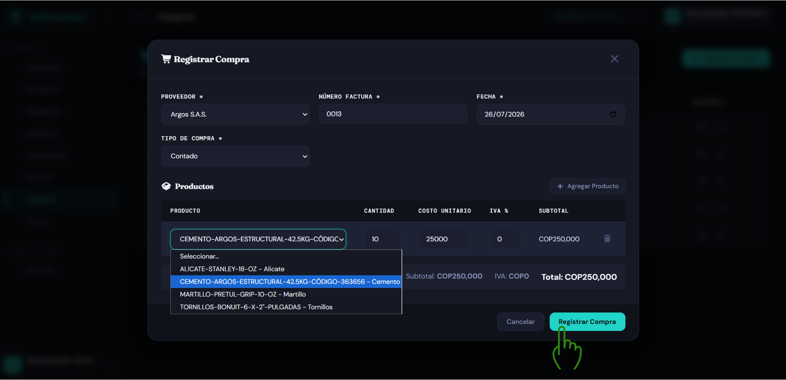

---

### 7.5 Flujo: Gestionar Alertas de Stock

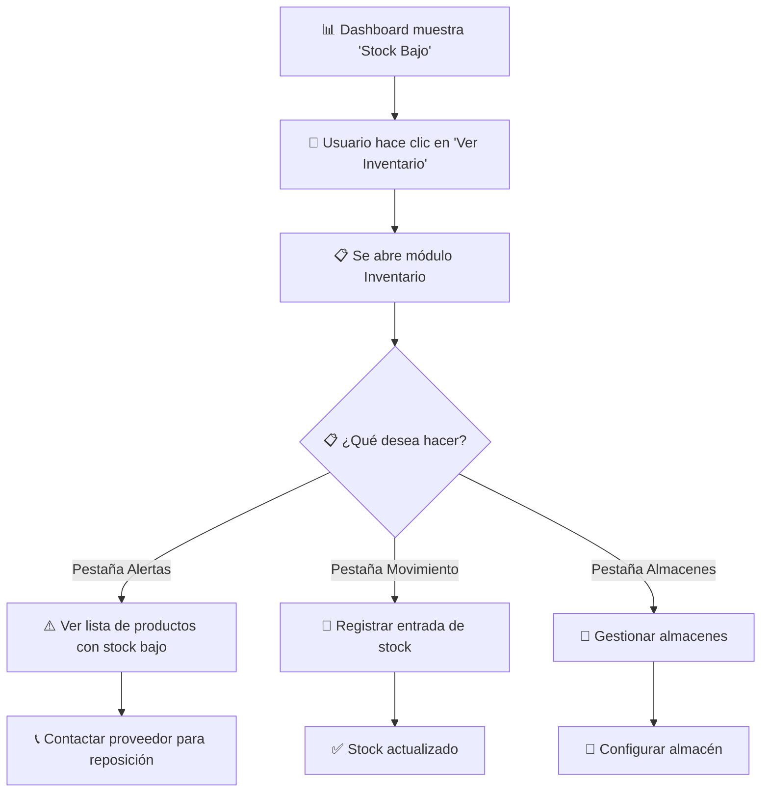
```mermaid
graph TD
    A["📊 Dashboard muestra 'Stock Bajo'"] --> B["👤 Usuario hace clic en 'Ver Inventario'"]
    B --> C["📋 Se abre módulo Inventario"]
    C --> D{"📋 ¿Qué desea hacer?"}
    D -->|"Pestaña Alertas"| E["⚠️ Ver lista de productos con stock bajo"]
    D -->|"Pestaña Movimiento"| F["🔄 Registrar entrada de stock"]
    D -->|"Pestaña Almacenes"| G["🏢 Gestionar almacenes"]
    E --> H["📞 Contactar proveedor para reposición"]
    F --> I["✅ Stock actualizado"]
    G --> J["📝 Configurar almacén"]
```
**Pasos detallados para consultar y gestionar alertas:**

1. Observe en el Dashboard o menú principal el contador/notificación de "Stock Bajo" o "Alertas".
2. Diríjase al módulo "Inventario" desde el menú lateral.
3. Haga clic en la pestaña "Alertas" (o filtro de productos con stock mínimo).
4. Revise el listado de productos cuyo stock actual es menor o igual al límite mínimo configurado.
5. Identifique el producto a reponer y proceda a contactar al proveedor o generar una Nueva Compra para abastecer la bodega.

>📷 [EVIDENCIA FOTOGRÁFICA]
>*Descripción: Captura de la pestaña o sección de Alertas dentro del módulo de Inventario, donde se visualiza la lista de productos en estado crítico o con bajo stock y sus cantidades mínimas.*
>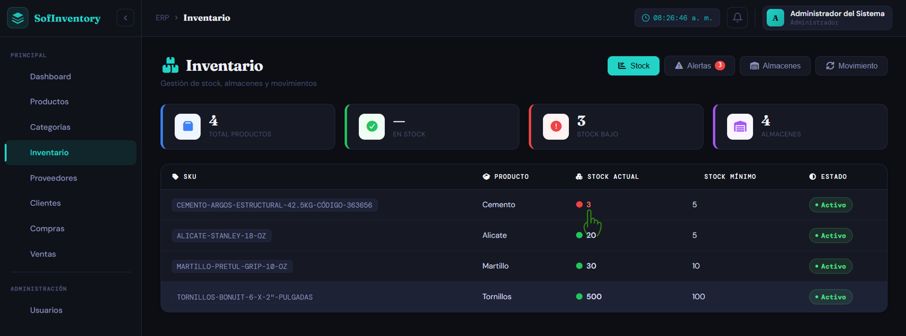
---

## 8. Glosario de Términos

| Término | Definición |
|---|---|
| **SKU** | Código único asignado a un producto para su seguimiento y control en inventario. |
| **Stock Mínimo** | Cantidad mínima permisible de un producto antes de requerir reabastecimiento. |
| **Rol de Usuario** | Nivel de acceso y permisos asignados a un perfil (Administrador, Supervisor, Vendedor, Bodega). |
| **Modal** | Ventana emergente en la interfaz que permite capturar datos sin salir de la vista actual. |
| **Dashboard** | Panel de control principal que resume los indicadores más importantes del negocio. |
| **KPI** | Indicador clave de desempeño (Key Performance Indicator); métrica numérica que resume el estado de un proceso del negocio. |
| **IVA** | Impuesto al Valor Agregado; se calcula automáticamente sobre el valor de productos en ventas y compras. |
| **Movimiento de Inventario** | Registro de una entrada, salida o ajuste de stock, con su cantidad, motivo y fecha. |
| **ENTRADA_COMPRA** | Tipo de movimiento que registra el aumento de stock generado por una compra a proveedor. |
| **SALIDA_VENTA** | Tipo de movimiento que registra la disminución de stock generada por una venta. |
| **DEVOLUCION_VENTA** | Tipo de movimiento que restaura el stock cuando una venta es anulada. |
| **Almacén** | Ubicación física donde se almacena el inventario de productos. |
| **Cliente General** | Cliente genérico utilizado en una venta cuando no se identifica a un cliente específico. |
| **Persona Natural / Jurídica** | Clasificación del cliente o proveedor según sea un individuo (natural) o una empresa (jurídica). |
| **Contraseña Cifrada (Hash)** | Representación irreversible de una contraseña, almacenada de forma segura; ni siquiera el administrador puede leerla en texto plano. |
| **Cuenta Bloqueada** | Estado de un usuario que superó el número máximo de intentos fallidos de inicio de sesión (5) y requiere ser desbloqueado por un Administrador. |

---

## 9. Preguntas Frecuentes (FAQ)

**1. ¿Qué debo hacer si no recuerdo mi contraseña de acceso?**
> Contacte al usuario con perfil **Administrador** para que restablezca sus credenciales desde el módulo de administración de usuarios.

**2. ¿Puedo registrar una venta si el stock está en cero?**
> No. El sistema valida automáticamente las existencias disponibles para evitar descuadres en el inventario físico.

**3. ¿Qué pasa si anulo una venta por error?**
> El sistema restaura automáticamente el stock descontado mediante un movimiento `DEVOLUCION_VENTA`. Sin embargo, la anulación en sí misma es irreversible, por lo que deberá registrar una nueva venta si el cliente aún desea completar la compra.

**4. ¿Por qué no veo el módulo de Usuarios en mi menú lateral?**
> El módulo de Usuarios solo es visible para el rol **Administrador**. Si su cuenta requiere este acceso, contacte al administrador del sistema.

**5. ¿Qué significa que mi cuenta esté "Bloqueada"?**
> Significa que se superaron los 5 intentos fallidos de inicio de sesión permitidos. Un Administrador debe desbloquear la cuenta desde el módulo de Usuarios.

**6. ¿Puedo editar una compra o venta ya registrada?**
> No se pueden editar directamente. Si el registro es incorrecto, debe anularse (si el estado lo permite) y registrarse nuevamente con los datos correctos.

**7. ¿Qué diferencia hay entre "Inactivo" y "Bloqueado" en un cliente?**
> "Inactivo" es un estado administrativo reversible que puede activar cualquier usuario autorizado. "Bloqueado" indica una restricción adicional sobre ese cliente y sigue el ciclo: activo → inactivo → bloqueado → activo.

**8. ¿El sistema funciona sin conexión a internet?**
> No. SofInventory es una aplicación web y requiere conexión a internet estable para funcionar correctamente, tanto en el entorno local como en producción.

---

## 10. Solución de Problemas Comunes

| Problema | Posible causa | Solución |
|---|---|---|
| No puedo iniciar sesión aunque la contraseña es correcta | La cuenta está bloqueada por intentos fallidos previos | Solicite a un Administrador que desbloquee la cuenta desde el módulo de Usuarios |
| El botón "Registrar Venta" no responde | Falta seleccionar un campo obligatorio (almacén, método de pago o al menos un producto) | Revise que todos los campos obligatorios del modal estén completos |
| No aparece un producto al buscarlo en Ventas | El producto está en estado "Inactivo" o "Pendiente" | Verifique el estado del producto en el módulo Productos; solo los productos "Activos" están disponibles para la venta |
| La página no carga o se queda en blanco | Pérdida de conexión a internet o el servidor está iniciando (arranque en frío) | Verifique su conexión; si accede a la URL de producción tras un periodo de inactividad, espere unos segundos a que el servicio inicie |
| El modal no se cierra después de guardar | Error de validación no visible o campo con formato incorrecto | Revise que no haya mensajes de error en rojo dentro del formulario antes de reintentar |
| Los totales de una venta o compra no cuadran | Se modificó la cantidad o el precio después de calcular el subtotal | Vuelva a verificar cada línea de producto; los totales se recalculan automáticamente al cambiar cantidad o precio |
| No veo los mismos módulos que un compañero | Cada rol tiene un conjunto distinto de módulos habilitados | Consulte la matriz de permisos de la sección 3.3 para confirmar qué le corresponde a su rol |

---

## 11. Mesa de Ayuda y Soporte Técnico

Si presenta inconsistencias en el sistema, errores de ejecución o requiere asistencia técnica adicional, puede comunicarse con el equipo de soporte a través de los siguientes canales:

* **Canal de Soporte:** Mesa de Ayuda SofInventory
* **Correo Electrónico:** alejosepulveda981@gmail.com
* **Línea de Atención:** 3197751596
* **Horario de Atención:** Lunes a Viernes de 8:00 a.m. a 6:00 p.m.

> **Antes de contactar a soporte:** revise la sección 9 (Preguntas Frecuentes) y la sección 10 (Solución de Problemas Comunes) de este manual; la mayoría de los inconvenientes reportados tienen solución inmediata sin necesidad de escalar el caso.

---

## 12. Referencias y Fuentes Consultadas

### 12.1 Normas y Guías Oficiales de Documentación

| Guía / Norma | Entidad / Fuente | Descripción |
|---|---|---|
| **Guía para la Elaboración de Manuales de Usuario de Sistemas de Información** | DNP (Departamento Nacional de Planeación) — [Ver Documento](https://bit.ly/31aMsek) | Lineamientos de estructura, claridad y presentación para la elaboración de documentos dirigidos a usuarios finales. |
| **Elaborar el Manual del Usuario** | SENA — Ecosistema de Recursos Educativos Digitales (2022) — [Ver Video](https://www.youtube.com/watch?v=L6KrmflE4jU) | Orientaciones y buenas prácticas metodológicas para la redacción y estructuración de manuales de usuario en proyectos de software. |

---

---

### 🛠️ **SofInventory ERP**
*Sistema de Gestión de Inventarios y Ventas para Ferreterías*

**© 2026 SofInventory.** Todos los derechos reservados.  
Documento elaborado por el Equipo de Desarrollo de Software — SENA

---

