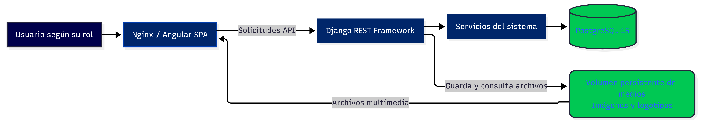
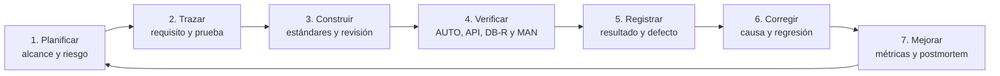
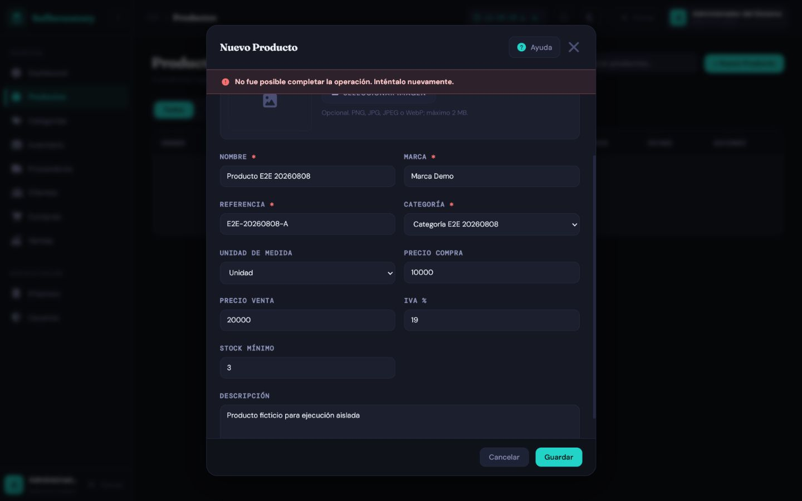

<div style="text-align: center" markdown="1">

{ width="300" }

# Aplicación de Buenas Prácticas de Calidad de Software

**Instrumentos, trazabilidad y mejora continua aplicados a SofInventory**

`Versión v1.0` | `10 de agosto de 2026`

</div>

---

### Control del documento

| Campo | Información |
|---|---|
| **Título** | Aplicación de buenas prácticas de calidad de software en el proyecto SofInventory |
| **Código** | `SQA-SOF-EVD-001` |
| **Versión** | **v1.0** |
| **Fecha de actualización** | 10 de agosto de 2026 |
| **Autores / Aprendices** | Alejandro Sepúlveda Duarte / Lucy Estefany Izquierdo Jaramillo |
| **Instructor evaluador** | José Ignacio Botero Osorio |
| **Centro de formación** | Centro de Comercio Regional Antioquia — SENA |
| **Programa** | Tecnología en Análisis y Desarrollo de Software |
| **Ficha** | 3118526 |
| **Alcance** | Proceso de calidad, instrumentos de prueba, trazabilidad, resultados, defectos, métricas y mejora continua |
| **Estado** | Línea base ejecutada; aprobación funcional condicionada al cierre y re-prueba de defectos abiertos |

### Convenciones

| Convención | Uso |
|---|---|
| **Aprobado** | El comportamiento fue demostrado con evidencia reproducible. |
| **Parcial** | Una parte del criterio fue demostrada y otra requiere corrección o re-prueba. |
| **Falló** | El resultado real no coincide con el esperado. |
| `AUTO` | Suite automatizada ejecutada. |
| `API` | Solicitud y respuesta sanitizadas. |
| `DB-R` | Consulta de solo lectura o aserción de persistencia. |
| `MAN` | Verificación manual documentada. |
| `CAPTURA` | Evidencia visual sin credenciales, tokens ni datos sensibles. |

## Resumen 

En este documento presentamos la aplicación de buenas prácticas de calidad de software durante el desarrollo y la revisión de SofInventory. Para ello, reunimos y organizamos los instrumentos utilizados para planificar las pruebas, verificar las funcionalidades, registrar los resultados, identificar defectos y establecer acciones de mejora.

El informe comprende el alcance del proceso de calidad, los referentes que orientaron nuestro trabajo, la caracterización del sistema, la matriz de trazabilidad, los casos de prueba, los resultados de ejecución, el registro de defectos, las métricas y el plan de mejora. También documentamos las prácticas aplicadas para proteger la información utilizada como evidencia y evitar la exposición de credenciales, datos personales o información sensible.

Como resultado de este proceso, consolidamos 78 casos funcionales, de los cuales 67 fueron aprobados, uno obtuvo un resultado parcial y 10 presentaron fallos. Además, registramos la ejecución satisfactoria de 99 pruebas del backend en SQLite, 99 en PostgreSQL y 24 pruebas del frontend, junto con la compilación del proyecto Angular. Estos resultados nos permitieron reconocer los avances alcanzados y, al mismo tiempo, identificar los aspectos que todavía requieren corrección y una nueva verificación.

De acuerdo con la evidencia recopilada, determinamos una aprobación condicionada para continuar utilizando el sistema en un entorno controlado. Antes de considerar una liberación definitiva, será necesario corregir los defectos críticos y altos, ejecutar nuevamente los casos afectados y comprobar que las soluciones no generen fallos en otras funcionalidades.

| Indicador | Resultado vigente |
|---|---:|
| Casos funcionales consolidados | **78** |
| Casos aprobados | **67** |
| Casos parciales | **1** |
| Casos fallidos | **10** |
| Aprobación estricta | **85,9 %** |
| Pruebas backend en SQLite temporal | **99/99 aprobadas** |
| Pruebas backend en PostgreSQL 15 aislado | **99/99 aprobadas** |
| Pruebas frontend Node | **24/24 aprobadas** |
| Build Angular de producción | **Aprobado con dos advertencias de presupuesto** |
| Defectos registrados | **11: 9 abiertos y 2 resueltos/revalidados** |


## 1. Introducción

Durante el desarrollo de SofInventory comprendimos que la calidad de un software no depende solamente de que sus pantallas funcionen o de que permita registrar información. También es necesario revisar sus reglas, comprobar los resultados, identificar los errores y conservar evidencias que permitan demostrar lo que se evaluó.

Por esta razón, en este documento presentamos el proceso que seguimos para aplicar buenas prácticas de calidad en nuestro proyecto. Reunimos el plan de pruebas, la matriz de trazabilidad, los casos definidos para cada módulo, los resultados obtenidos, los defectos encontrados y las acciones de mejora que consideramos necesarias. De esta manera, buscamos que la documentación refleje tanto los avances alcanzados como los aspectos que todavía se encuentran pendientes.

Para realizar esta revisión tuvimos en cuenta las principales funcionalidades de SofInventory, entre ellas el inicio de sesión, la administración de usuarios, productos, categorías, proveedores, clientes, almacenes, inventario, compras, ventas, empresa y panel de control. También revisamos elementos compartidos del frontend, como las validaciones, los mensajes, los temas visuales, la adaptación a diferentes tamaños de pantalla y la ayuda contextual.

El proceso combinó pruebas automatizadas, verificaciones de la API y la base de datos, revisiones manuales y evidencias visuales obtenidas con información ficticia. Esto nos permitió conocer con mayor claridad el estado actual del proyecto, reconocer las mejoras incorporadas y establecer una ruta de trabajo para corregir los defectos encontrados.

Con la elaboración de esta evidencia no buscamos presentar el sistema como un producto terminado o libre de errores. Nuestro propósito es demostrar cómo aplicamos un proceso organizado de calidad, cómo respaldamos nuestras conclusiones con resultados verificables y cómo utilizamos los hallazgos para continuar mejorando SofInventory.

## 2. Objetivos

### 2.1 Objetivo general

Aplicar y documentar un proceso de calidad para SofInventory que permita planificar, ejecutar, registrar, evaluar y mejorar las actividades de desarrollo y prueba con criterios verificables y evidencia reproducible.

### 2.2 Objetivos específicos

- Caracterizar el sistema, su arquitectura, sus actores y activos críticos.
- Relacionar requisitos, riesgos, casos, automatización, resultados y defectos.
- Consolidar el plan, la matriz, los casos, los scripts y los registros de prueba.
- Presentar las mejoras incorporadas al proyecto desde la línea base inicial.
- Diferenciar los comportamientos aprobados de los defectos que aún requieren corrección.
- Establecer métricas y puertas de calidad proporcionales al riesgo.
- Mantener una ruta de mejora priorizada, con responsables y criterios de terminado.
- Evitar que la documentación exponga contraseñas, tokens, datos personales o secretos.

## 3. Alcance, exclusiones y método

### 3.1 Alcance funcional

La revisión cubre los módulos y capacidades vigentes:

| Área | Cobertura principal |
|---|---|
| Login y sesiones | Acceso, bloqueo, sesión única, expiración, logout y rutas protegidas |
| Usuarios y roles | CRUD, permisos, contraseña, estado, desbloqueo y auditoría |
| Categorías y productos | Validación semántica, precios, IVA, imagen, estado y relaciones |
| Proveedores y clientes | Identidad, contacto, ubicación Colombia/exterior y relaciones históricas |
| Almacenes e inventario | Stock por almacén, entradas, salidas, transferencias, concurrencia e idempotencia |
| Compras | Registro, impuestos, responsable, datos históricos de la operación, stock y anulación |
| Ventas | POS, pago, descuento, impuestos, responsable, comprobante y anulación |
| Empresa | Configuración singleton, identidad, ubicación, logo y comprobantes |
| Dashboard | Indicadores, periodos, gráficos, roles y estados vacíos/error |
| Frontend compartido | Temas, mensajes, validaciones, ayuda contextual, teclado y responsive |

### 3.2 Exclusiones

- Certificación formal ISO o auditoría externa.
- Pruebas exhaustivas de carga, estrés o recuperación ante desastre.
- Certificación en todas las combinaciones de navegador, sistema operativo y dispositivo.
- Uso de información real de producción.
- Presentación de una prueba como aprobada por el solo hecho de existir en el código.
- Cierre documental de un defecto sin corrección, re-prueba y regresión.

### 3.3 Método de análisis

1. Revisión del código, modelos, serializers, servicios, componentes y configuración.
2. Revisión de las suites automatizadas y su ejecución registrada.
3. Trazabilidad con los 78 casos por módulo.
4. Verificación API, base de datos y navegador en entornos aislados.
5. Revisión de evidencias sanitizadas.
6. Clasificación de resultados y defectos.
7. Definición de puertas, métricas y plan de mejora.


## 4. Caracterización actual de SofInventory

### 4.1 Arquitectura y entorno de ejecución

| Capa | Implementación verificada |
|---|---|
| Frontend | Angular 19.2.21, TypeScript 5.6.3, componentes standalone, signals, Router, HttpClient, RxJS y Chart.js |
| Backend | Python 3.12.13, Django 6.0.4 y Django REST Framework 3.17.1 |
| Persistencia | PostgreSQL 15.18 en el entorno integrado; SQLite en memoria para la suite rápida aislada |
| Publicación | Nginx 1.31.3 sobre Alpine 3.24.1 |
| Contenedores | Docker Compose con frontend, backend, PostgreSQL y volúmenes persistentes |
| Autenticación | Token Bearer propio con tabla de sesiones, vigencia de 12 horas y sesión única |


*Figura 1. Arquitectura y entorno de ejecución de SofInventory.*

### 4.2 Actores

| Rol | Responsabilidad general |
|---|---|
| Administrador | Configuración completa, empresa, usuarios y operaciones autorizadas |
| Supervisor | Supervisión de catálogos, terceros, inventario, compras y ventas según endpoint |
| Bodega | Almacenes, inventario, productos y compras autorizadas |
| Vendedor | Operación comercial, clientes, productos y ventas autorizadas |

La visibilidad de un botón o módulo no constituye autorización. Los permisos se validan en el backend para impedir evasión mediante solicitudes directas.

### 4.3 Activos críticos

- Credenciales, hashes de contraseña, tokens y sesiones.
- Identidad, rol, estado y auditoría de usuarios.
- Existencias por producto y almacén.
- Movimientos, transferencias y reversiones.
- Compras, ventas, responsables y anulaciones.
- Snapshots históricos de empresa, productos, precios, costos e impuestos.
- Imágenes de empresa y productos almacenadas en medios persistentes.
- Datos personales y comerciales de clientes y proveedores.

## 5. Referentes y características de calidad

### 5.1 Referentes aplicados

| Referente | Aplicación en SofInventory |
|---|---|
| ISO/IEC/IEEE 29119-3:2021 | Estructura del plan, casos, procedimientos, resultados, incidentes y trazabilidad |
| ISO/IEC 25010 | Evaluación de adecuación funcional, fiabilidad, seguridad, usabilidad, mantenibilidad y portabilidad |
| CMMI | Planificación, seguimiento, medición, prevención y mejora del proceso |
| PSP | Registro individual de tiempo, defectos y postmortem sin inventar datos históricos |
| TSP | Distribución de responsabilidades y seguimiento con métricas de equipo |
| Ágil/Scrum | Actualización de artefactos y riesgos en cada iteración |

### 5.2 Características prioritarias

| Característica | Interpretación | Ejemplo verificable |
|---|---|---|
| Adecuación funcional | Las reglas del negocio se cumplen en todas las capas. | Una venta descuenta stock exactamente una vez. |
| Fiabilidad | Los errores y reintentos no dejan estados parciales. | Una operación inválida hace rollback completo. |
| Seguridad | Sesiones, roles, archivos y secretos están protegidos. | Un vendedor no crea usuarios ni suplanta responsables. |
| Usabilidad | La interfaz guía, conserva datos válidos y muestra errores accionables. | El resumen enfoca el primer campo inválido. |
| Compatibilidad | Los datos y documentos históricos siguen siendo legibles. | Una operación antigua sin responsable muestra “No disponible”. |
| Mantenibilidad | La lógica común se centraliza y se prueba. | Ubicación, validación y notificaciones no se duplican por módulo. |
| Portabilidad | El entorno se reproduce con versiones controladas. | Docker levanta los servicios y conserva datos en volúmenes. |

### 5.3 Principios operativos

- **Prevenir antes que corregir:** revisar criterios, riesgos y validaciones antes de implementar.
- **Validar en profundidad:** frontend para experiencia; backend y base de datos para integridad.
- **Trazar de extremo a extremo:** requisito → riesgo → caso → ejecución → evidencia → defecto.
- **Conservar la historia:** no reescribir responsables, precios o impuestos antiguos.
- **Usar evidencia reproducible:** registrar ambiente, datos ficticios, comando, resultado y fecha.
- **Cerrar el ciclo:** todo defecto necesita corrección, re-prueba, regresión y actualización documental.

## 6. Línea base de calidad vigente

### 6.1 Resultado por módulo

| Módulo | Casos | Aprobados | Parciales | Fallidos | Aprobación estricta |
|---|---:|---:|---:|---:|---:|
| Usuarios | 8 | 7 | 0 | 1 | 87,5 % |
| Login y sesiones | 7 | 6 | 0 | 1 | 85,7 % |
| Categorías | 4 | 4 | 0 | 0 | 100 % |
| Productos | 6 | 4 | 1 | 1 | 66,7 % |
| Proveedores | 5 | 4 | 0 | 1 | 80 % |
| Clientes | 6 | 5 | 0 | 1 | 83,3 % |
| Almacenes | 5 | 5 | 0 | 0 | 100 % |
| Inventario | 7 | 7 | 0 | 0 | 100 % |
| Compras | 6 | 5 | 0 | 1 | 83,3 % |
| Ventas | 7 | 6 | 0 | 1 | 85,7 % |
| Empresa | 5 | 4 | 0 | 1 | 80 % |
| Dashboard | 5 | 4 | 0 | 1 | 80 % |
| Frontend compartido | 7 | 6 | 0 | 1 | 85,7 % |
| **Total** | **78** | **67** | **1** | **10** | **85,9 %** |

La distribución detallada se mantiene en la [matriz de cobertura](test-cases/MATRIZ_COBERTURA.md), que enlaza cada módulo con sus casos y evidencias.

### 6.2 Cobertura automatizada ejecutada

| Suite | Resultado | Finalidad |
|---|---|---|
| Backend `AUTO-SQLITE` | 99/99 aprobadas en 3,977 s | Retroalimentación rápida y aislada |
| Backend `AUTO-PG` | 99/99 aprobadas en 69,668 s | Restricciones, transacciones y comportamiento PostgreSQL |
| Frontend `AUTO-FE` | 24/24 aprobadas | Validadores semánticos, ubicación y ayuda contextual |
| Angular `BUILD-FE` | Build aprobado | TypeScript, plantillas, estilos y empaquetado |

Las suites automatizadas no equivalen a los 78 casos funcionales. Un caso puede necesitar API, consulta de persistencia, evidencia visual o combinación de varias fuentes.

### 6.3 Advertencias de compilación

| Presupuesto | Resultado |
|---|---|
| Bundle inicial | Exceso documentado de 7,02 kB |
| CSS del Dashboard | Exceso documentado de 3,05 kB |

Estas advertencias no impidieron compilar, pero deben medirse para evitar crecimiento acumulativo.

### 6.4 Evidencia visual representativa

{ loading=lazy }

*Figura 2. Interfaz integrada usada en la validación visual de tema, navegación y Dashboard.*

## 7. Mejoras incorporadas al proyecto

La línea base original identificaba ausencia de pruebas frontend, módulos sin pruebas backend y validaciones incompletas. El proyecto actual ya incorpora mejoras sustanciales:

### 7.1 Validaciones y mensajes

- Validadores semánticos compartidos para nombres de personas, lugares y nombres comerciales.
- Validación documental según tipo, sin bloquear pasaportes alfanuméricos o NIT con dígito de verificación.
- Normalización segura de espacios, sin eliminar tildes, `ñ`, apóstrofos o guiones válidos.
- Resumen general, borde rojo, mensaje por campo, desplazamiento y foco del primer error.
- Notificaciones globales en español y conservación de valores válidos.
- Política de contraseña aplicada en backend y formularios, con hash y confirmación.

### 7.2 Ubicación compartida

- Catálogo local único con los 32 departamentos y Bogotá D. C., asociado a municipios.
- Selectores dependientes para Colombia y modo manual para otro país.
- Validación backend de pertenencia municipio–departamento.
- Compatibilidad con datos históricos y limpieza de campos ocultos al cambiar de modalidad.

### 7.3 Inventario, compras y ventas

- Servicios transaccionales con bloqueos y reversiones idempotentes.
- Stock por almacén, movimientos auditables y pruebas de concurrencia PostgreSQL.
- Responsable obtenido de la sesión autenticada, sin aceptar suplantación desde el cliente.
- Snapshots de empresa y producto para preservar históricos.
- POS de venta con búsqueda, totales, IVA, efectivo y cambio.
- Comprobante térmico de venta y comprobante interno de compra.

### 7.4 Empresa e imágenes

- Configuración empresarial singleton, editable solo por Administrador y no eliminable por API.
- Logo e imágenes de producto con PNG/JPG/JPEG/WebP, validación real, límite de tamaño y nombres UUID.
- Volumen `sofinventory_media_data` compartido entre backend y Nginx.
- Conservación de la imagen anterior cuando una actualización falla.

### 7.5 Experiencia y documentación

- Temas Claro, Azul y Oscuro.
- Interfaz responsive, teclado, foco contenido en modales y ayuda contextual.
- Manual de usuario, manual técnico, arquitectura, estándares, guía visual y documentación QA por módulo.
- Evidencias E2E sanitizadas y matriz transversal de cobertura.

## 8. Riesgos y defectos vigentes

### 8.1 Defectos abiertos

| ID | Módulo | Severidad | Hallazgo | Caso relacionado |
|---|---|---|---|---|
| `BUG-PRD-001` | Productos | Crítica | El alta puede enviar `quitar_imagen` a `Producto.objects.create` y producir 500. | `TC-PRD-001` |
| `BUG-COM-001` | Compras | Crítica | Una compra admite un producto inactivo. | `TC-COM-004` |
| `BUG-PRV-001` | Proveedores | Alta | Una eliminación con compras relacionadas no controla `ProtectedError`. | `TC-PRV-005` |
| `BUG-CLI-001` | Clientes | Alta | Una eliminación con ventas relacionadas no controla `ProtectedError`. | `TC-CLI-006` |
| `BUG-VTA-001` | Ventas | Alta | Débito y otros pagos no exigen todos sus datos condicionales. | `TC-VTA-004` |
| `BUG-EMP-001` | Empresa | Alta | NIT y teléfono admiten valores semánticamente inválidos. | `TC-EMP-003` |
| `BUG-LOGIN-001` | Login | Media | La expiración puede devolver 403 y el interceptor solo gestiona 401. | `TC-LOGIN-007`, `TC-FE-007` |
| `BUG-USR-003` | Usuarios | Media | El buscador depende de una propiedad no reactiva. | `TC-USR-008` |
| `BUG-DSH-001` | Dashboard | Media | La interfaz expone el texto técnico de un error HTTP. | `TC-DSH-005`, `TC-FE-007` |

El impacto, la causa localizada y el criterio de cierre están en el [registro de defectos](test-cases/DEFECTOS.md).

### 8.2 Defectos resueltos y revalidados

| ID | Mejora confirmada | Evidencia |
|---|---|---|
| `BUG-USR-001` | Documento validado según tipo y de forma coherente en frontend/backend. | Suites de usuarios y validadores semánticos |
| `BUG-USR-002` | Política de contraseña, confirmación, hash y rechazo de reutilización. | `ValidacionFortalezaContrasenaTests` |

### 8.3 Mapa de riesgo actualizado

| Riesgo | Probabilidad | Impacto | Control prioritario |
|---|:---:|:---:|---|
| Creación de producto bloqueada | Alta | 5 — Crítico | Corregir datos auxiliares y agregar regresión API/UI |
| Compra con producto inactivo | Alta | 5 — Crítico | Validar estado antes de cabecera, detalle o movimiento |
| Eliminación de terceros relacionados | Alta | 4 — Alto | Capturar dependencia y responder 400/409 en español |
| Pago condicional incompleto | Media | 4 — Alto | Validación cruzada por método en backend y frontend |
| Identidad empresarial inválida | Media | 4 — Alto | Validadores específicos de NIT y teléfono |
| Sesión expirada sin recuperación uniforme | Media | 4 — Alto | Contrato 401/403, limpieza y redirección |
| Mensajes técnicos o búsqueda no reactiva | Media | 3 — Medio | Mensajes seguros y estado reactivo probado |

## 9. Proceso de calidad aplicado



### 9.1 Procedimiento `SQA-SOF-01`

| Fase | Entrada | Actividad | Salida / evidencia | Puerta |
|---|---|---|---|---|
| Planificar | Backlog priorizado | Definir alcance, riesgos, ambiente, esfuerzo y criterios. | Plan versionado | G0: requisito verificable |
| Trazar | Requisitos y diseño | Relacionar requisito, riesgo, caso, automatización y responsable. | Matriz | G1: críticos trazados |
| Construir | Diseño aprobado | Aplicar estándares, validaciones y revisión. | Código + checklist | G2: cambio revisado |
| Verificar | Versión candidata | Ejecutar pruebas funcionales, integración, seguridad y regresión. | Log y evidencias | G3: criterios de salida |
| Registrar | Resultados reales | Documentar esperado, real, severidad y reproducción. | Informe + defecto | G4: evidencia completa |
| Corregir | Defecto priorizado | Analizar causa, corregir, re-probar y ejecutar regresión. | Evidencia de cierre | G5: sin críticos/altos abiertos |
| Mejorar | Métricas del ciclo | Realizar retrospectiva PSP/TSP y ajustar el proceso. | Acciones con responsable | G6: aprendizaje incorporado |

### 9.2 Responsabilidades

Las siguientes responsabilidades representan funciones necesarias dentro del proceso de calidad y no cargos adicionales del proyecto. Debido a que SofInventory es desarrollado por un equipo de dos aprendices, una misma persona puede asumir varias funciones según la actividad realizada. La asignación concreta debe registrarse al iniciar cada ciclo.

| Actividad | Desarrollo | Líder técnico | QA | Responsable funcional |
|---|---|---|---|---|
| Plan y trazabilidad | Participa | Aprueba viabilidad | Responsable | Aprueba alcance |
| Código y pruebas unitarias | Responsable | Revisa | Consulta | Informado |
| Ejecución funcional | Participa | Consulta | Responsable | Valida aceptación |
| Defectos y causa raíz | Corrige | Responsable técnico | Administra | Prioriza |
| Puerta de liberación | Informado | Aprueba técnica | Recomienda | Aprueba negocio |
| PSP/TSP y retrospectiva | Registra | Facilita | Consolida métricas | Participa |

### 9.3 Criterios de control

| Control | Criterio |
|---|---|
| Entrada | Requisitos y aceptación aprobados; ambiente, datos ficticios y responsables disponibles; versión desplegable. |
| Suspensión | Ambiente inestable, pérdida de datos, más de 20 % de casos bloqueados o hallazgo crítico que invalida la ejecución. |
| Reanudación | Causa corregida, smoke aprobado, datos restaurados y decisión registrada. |
| Salida | 100 % de críticos ejecutados, al menos 95 % aprobados, cero críticos/altos abiertos y regresión aprobada. |

## 10. Instrumentos de calidad

### 10.1 Instrumento 1 — Plan de pruebas

| Campo | Definición actual |
|---|---|
| Identificación | `QA-PLAN-SOF-001` · versión interna 1.0 · propietario: QA |
| Objetivo | Verificar funciones críticas, seguridad, integridad y experiencia antes de liberar. |
| Alcance | Los 13 grupos funcionales documentados en la matriz. |
| Estrategia | Backend SQLite + PostgreSQL; frontend Node; build Angular; API/DB-R; E2E y revisión visual. |
| Ambiente | Angular 19.2.21, Django 6.0.4, DRF 3.17.1, PostgreSQL 15.18, Node 20 y Nginx 1.31.3. |
| Datos | Exclusivamente ficticios y temporales; limpieza posterior obligatoria. |
| Entregables | Plan, matriz, casos, scripts, resultados, defectos, evidencias, métricas y decisión. |
| Aprobación | Cumplimiento de la puerta de salida y aceptación técnica/funcional. |

#### Tipos de prueba

| Tipo | Objeto | Ejemplos | Prioridad |
|---|---|---|:---:|
| Smoke | Disponibilidad básica | Login, Dashboard y endpoints principales | P0 |
| Funcional | Reglas del negocio | Usuarios, compra, venta, anulaciones | P0 |
| Integración | Frontend–API–BD | Persistencia, relaciones y stock | P0 |
| Seguridad | Sesión, autorización y archivos | Expiración, rol, bloqueo y subida falsa | P0 |
| Regresión | Flujos después de cambios | Inventario tras compras/ventas | P1 |
| Usabilidad | Mensajes y recuperación | Foco, resúmenes, ayuda y errores | P1 |
| Compatibilidad | Navegadores y pantalla | Escritorio, tableta, móvil y temas | P2 |
| Rendimiento | Respuesta bajo carga acordada | Dashboard e inventario | P2 |

#### Calendario por ciclo

| Momento | Actividad | Evidencia |
|---|---|---|
| Inicio | Actualizar alcance, riesgos, matriz y datos. | Plan y trazabilidad |
| Desarrollo | Pruebas unitarias, revisión y checklist por cambio. | Resultados de construcción |
| Candidata | Smoke, suites, integración, seguridad y regresión. | Logs y evidencias |
| Cierre | Re-pruebas, decisión, métricas y retrospectiva. | Informe y acciones |

### 10.2 Instrumento 2 — Matriz de trazabilidad

La matriz completa se mantiene en un único documento para evitar duplicación: [MATRIZ_COBERTURA.md](test-cases/MATRIZ_COBERTURA.md).

| Área / requisito | Riesgo principal | Caso o evidencia | Automatización | Estado |
|---|---|---|---|---|
| Autenticación y sesión | Acceso indebido / expiración | `TC-LOGIN-001` a `007` | Backend + API + manual | Condicionado por `BUG-LOGIN-001` |
| Usuarios | Escalamiento / datos inválidos | `TC-USR-001` a `008` | Backend + frontend + API | Condicionado por `BUG-USR-003` |
| Categorías | Duplicados / relaciones | `TC-CAT-001` a `004` | Backend + E2E | Aprobado |
| Productos | Catálogo e imagen | `TC-PRD-001` a `006` | Backend + API + visual | Fallo crítico en alta |
| Proveedores | Datos / dependencia | `TC-PRV-001` a `005` | Backend + frontend + API | Fallo en eliminación relacionada |
| Clientes | Identidad / dependencia | `TC-CLI-001` a `006` | Backend + frontend + API | Fallo en eliminación relacionada |
| Almacenes | Integridad y permisos | `TC-ALM-001` a `005` | Backend + API | Aprobado |
| Inventario | Stock negativo / carrera | `TC-INV-001` a `007` | Backend PG + API + DB-R | Aprobado |
| Compras | Stock y atomicidad | `TC-COM-001` a `006` | Backend + API + DB-R | Producto inactivo pendiente |
| Ventas | Stock, pagos y totales | `TC-VTA-001` a `007` | Backend + API + UI | Pago condicional pendiente |
| Empresa | Singleton, identidad y logo | `TC-EMP-001` a `005` | Backend + API + visual | Validación NIT/teléfono pendiente |
| Dashboard | Métricas y recuperación | `TC-DSH-001` a `005` | Backend + E2E | Mensaje técnico pendiente |
| Frontend compartido | Tema, formulario y sesión | `TC-FE-001` a `007` | Node + manual | Condicionado por sesión/error |

#### Reglas de mantenimiento

- No aceptar un requisito sin identificador y criterio verificable.
- No marcar un caso como cubierto si falta resultado real, ambiente, fecha o evidencia.
- Vincular cada defecto con el requisito y el caso que lo detectó.
- Actualizar la matriz cuando cambien la regla, el código HTTP o el entorno.
- Mantener una sola fuente consolidada; los documentos por módulo detallan los pasos.

### 10.3 Instrumento 3 — Casos de prueba representativos

#### Caso A: `TC-INV-007` — Concurrencia sin stock negativo

| Campo | Especificación |
|---|---|
| Objetivo | Confirmar que dos salidas simultáneas no producen stock negativo. |
| Prioridad | P0 — Integridad crítica |
| Precondición | Producto activo con 5 unidades en PostgreSQL; dos sesiones autorizadas. |
| Datos | Dos solicitudes concurrentes de salida por 4 unidades. |
| Acción | Ejecutar ambas transacciones de forma simultánea. |
| Esperado | Una operación aprobada, otra rechazada y stock final igual a 1. |
| Resultado | **Aprobado** en PostgreSQL aislado. |
| Evidencia | `AUTO-PG`, API y consulta `DB-R`. |

#### Caso B: `TC-PRD-001` — Alta de producto con imagen opcional

| Campo | Especificación |
|---|---|
| Objetivo | Crear un producto válido con y sin imagen sin pasar campos auxiliares al modelo. |
| Prioridad | P0 — Función esencial |
| Precondición | Administrador/Supervisor autenticado y categoría activa. |
| Datos | Nombre comercial válido, marca, referencia, precios, IVA e imagen PNG válida opcional. |
| Esperado | HTTP 201, producto pendiente, stock inicial 0 e imagen segura cuando aplica. |
| Resultado actual | **Falló**: puede devolver 500 por `quitar_imagen`. |
| Evidencia | [Captura del error](./test-cases/04-modulo-productos/evidencias/frontend/PRD-alta-error-e2e.png) y `BUG-PRD-001`. |
| Cierre | Retirar el campo auxiliar antes de `Producto.objects.create` y ejecutar regresión API/UI. |

{ loading=lazy }

*Figura 3. Evidencia E2E del defecto crítico de creación de producto.*

#### Caso C: `TC-EMP-004` — Seguridad del logo

| Campo | Especificación |
|---|---|
| Objetivo | Validar contenido, tamaño, reemplazo, eliminación y conservación del logo. |
| Prioridad | P0 — Seguridad de archivos |
| Particiones válidas | PNG, JPG/JPEG y WebP reales dentro del límite. |
| Particiones inválidas | SVG, HTML, script disfrazado, MIME/extensión incoherentes y archivo mayor de 2 MB. |
| Esperado | Aceptar solo imágenes reales; usar nombre UUID; conservar el logo anterior ante otro error. |
| Resultado | **Aprobado** en backend y flujo de configuración. |

#### Caso D: `TC-VTA-007` — Detalle y comprobante histórico

| Campo | Especificación |
|---|---|
| Objetivo | Comprobar que el detalle y la reimpresión coinciden con la venta guardada. |
| Datos verificados | Empresa, cliente, vendedor, almacén, fecha, pago, productos, IVA, descuento, total, efectivo y cambio. |
| Históricos | Responsable nulo muestra “No disponible”; datos económicos provienen del registro/snapshot. |
| Resultado | **Aprobado**. |
| Evidencia | [Detalle y comprobante](./test-cases/10-modulo-ventas/evidencias/frontend/VTA-detalle-comprobante-e2e.png). |

{ loading=lazy }

*Figura 4. Comprobante generado a partir de una venta de prueba y su información histórica.*

### 10.4 Instrumento 4 — Scripts y comandos reproducibles

Los comandos se ejecutan sobre entornos de prueba. Nunca deben apuntar a una base productiva ni incluir secretos en la salida.

#### Suite backend rápida

```powershell
docker compose exec -T backend `
  python manage.py test --settings=config.test_settings
```

#### Comprobación de Django y migraciones

```powershell
docker compose exec -T backend python manage.py check
docker compose exec -T backend `
  python manage.py makemigrations --check --dry-run
```

#### Suite frontend y compilación

```powershell
Set-Location frontend
npm.cmd test
npm.cmd run build
```

#### Publicación documental

```powershell
mkdocs build --strict
mkdocs serve
```

El procedimiento completo, incluidos los resultados PostgreSQL, está registrado en el [manifiesto de evidencia automatizada](test-cases/evidencias-ejecucion/README.md).

### 10.5 Instrumento 5 — Resultados y defectos

| Campo | Línea base actual |
|---|---|
| Versión documental | **v1.0** |
| Fecha de referencia de ejecución integral | 8 de agosto de 2026 |
| Casos funcionales | 78 |
| Aprobados / parciales / fallidos | 67 / 1 / 10 |
| Suites backend | 99/99 SQLite y 99/99 PostgreSQL |
| Suite frontend | 24/24 |
| Build | Aprobado con advertencias |
| Defectos | 9 abiertos; 2 resueltos/revalidados |
| Decisión | Aprobación condicionada |

#### Ciclo obligatorio de un defecto

1. **Nuevo:** registrar entorno, pasos, esperado, real, evidencia, severidad y requisito.
2. **Confirmado:** reproducir y evaluar alcance e impacto.
3. **Asignado:** definir responsable, prioridad y objetivo.
4. **Corregido:** enlazar cambio, prueba nueva y causa raíz.
5. **Re-prueba:** ejecutar el caso original y la regresión relacionada.
6. **Cerrado:** actualizar matriz, resultados y documentación.

| Severidad | Criterio |
|---|---|
| Crítica | Compromete disponibilidad, seguridad o integridad esencial sin alternativa. |
| Alta | Afecta una función importante, datos o regla central. |
| Media | Degrada la experiencia o tiene una alternativa operativa. |
| Baja | Impacto cosmético o menor. |

### 10.6 Instrumento 6 — PSP y TSP

El repositorio conserva resultados y defectos, pero no una bitácora histórica completa de tiempo por fase. Para evitar fabricar métricas, los valores no medidos permanecen como **N/D**. La disciplina PSP/TSP se adopta desde el siguiente ciclo de corrección.

| Medida PSP-0 | Valor base |
|---|---|
| Tamaño funcional | 78 casos consolidados |
| Automatización ejecutada | 99 pruebas backend ejecutadas en SQLite y las mismas 99 en PostgreSQL; 24 pruebas frontend y build Angular |
| Tiempo histórico por fase | N/D |
| Defectos registrados | 11 |
| Defectos abiertos | 9 |
| Aprobación estricta | 85,9 % |
| Postmortem | Priorizar críticos, regresión, CI y coherencia documental |

#### Formato de tiempo PSP

| Fecha | Inicio | Fin | Interrupción | Fase | Actividad | Tiempo neto | Observación |
|---|---|---|---:|---|---|---:|---|
| AAAA-MM-DD | HH:MM | HH:MM | 0 min | PSP | Descripción breve | 0,00 h | Motivo de desvío |

#### Formato de defecto PSP

| ID | Fecha | Tipo | Inyección | Detección | Corrección | Causa | Prevención |
|---|---|---|---|---|---:|---|---|
| `PSP-DEF-###` | AAAA-MM-DD | Validación/lógica/datos | Diseño | Prueba | 0 min | Descripción | Cambio al proceso |

## 11. Métricas y puertas de calidad

### 11.1 Métricas

| Métrica | Fórmula | Línea base | Meta | Decisión |
|---|---|---:|---:|---|
| Aprobación funcional | Aprobados / ejecutados × 100 | 85,9 % | ≥95 % | Bloquea si falla P0/P1 |
| Cobertura de requisitos | Requisitos con evidencia / alcance × 100 | Consolidada por 78 casos | 100 % críticos | No liberar sin traza |
| Cierre de defectos | Cerrados verificados / registrados × 100 | 18,2 % | 100 % críticos/altos | Bloquea liberación |
| Automatización | Casos automáticos / regresión acordada × 100 | Requiere inventario homogéneo | Creciente | Priorizar repetitivos |
| Escape de defectos | Posliberación / total × 100 | N/D | Descendente | Activa causa raíz |
| Precisión PSP | Horas reales / planificadas | N/D | 0,8–1,2 | Ajustar estimación |
| Presupuesto frontend | Tamaño real / límite | Exceso en bundle y Dashboard | ≤100 % | Evitar crecimiento |

### 11.2 Puerta de liberación

- [x] Todos los requisitos críticos tienen caso, resultado y evidencia.
- [x] Se ejecutó el 100 % de los casos críticos.
- [ ] La aprobación funcional es al menos del 95 %.
- [ ] No existen defectos críticos o altos abiertos.
- [ ] Las re-pruebas y la regresión están aprobadas.
- [x] El ambiente, la versión y la fecha están identificados.
- [x] Las migraciones y `manage.py check` no presentan inconsistencias en la ejecución documentada.
- [x] El build y las suites automatizadas están aprobados.
- [x] La documentación y el código cuentan con trazabilidad vigente.
- [ ] La decisión final de liberación ha sido aprobada por los responsables correspondientes.

**Resultado actual:** la puerta de liberación definitiva no fue aprobada. Se alcanzó una aprobación funcional del **85,9 %**, inferior a la meta mínima del **95 %**, y permanecen abiertos dos defectos críticos y cuatro de severidad alta.

## 12. Plan priorizado de mejora

| Prioridad | Acción | Responsable | Criterio de terminado |
|---|---|---|---|
| P0 | Corregir `BUG-PRD-001`. | Backend / Frontend | Alta 201 con/sin imagen y regresión aprobada. |
| P0 | Corregir `BUG-COM-001`. | Backend | Producto inactivo rechazado antes de persistir o mover stock. |
| P1 | Controlar `ProtectedError` en clientes y proveedores. | Backend | Respuesta 400/409, mensaje español y relaciones intactas. |
| P1 | Validar datos condicionales de pago. | Backend / Frontend | Cada método exige solo sus datos aplicables. |
| P1 | Validar NIT y teléfono de empresa. | Backend / Frontend | Entradas inválidas rechazadas por campo. |
| P1 | Unificar expiración 401/403. | Backend / Frontend | Limpieza, redirección y mensaje aprobados en E2E. |
| P2 | Hacer reactivo el buscador de usuarios. | Frontend | Filtrado por nombre, usuario y correo probado. |
| P2 | Sustituir el mensaje técnico del Dashboard. | Frontend | Mensaje seguro, reintento y detalle solo en logs. |
| P2 | Incorporar CI, lint y cobertura. | Equipo / DevOps | Merge bloqueado ante fallo crítico. |
| P2 | Reducir advertencias de presupuesto. | Frontend | Bundle y CSS dentro de límites acordados. |
| P3 | Añadir rendimiento, accesibilidad avanzada y seguridad. | QA | Umbrales reproducibles y aprobados. |

### 12.1 Secuencia recomendada

1. Resolver los defectos críticos de Productos y Compras.
2. Corregir integridad y permisos de terceros, pagos y Empresa.
3. Unificar la recuperación de sesión y mensajes de error.
4. Agregar una prueba de regresión por cada corrección.
5. Reejecutar las suites y los 11 casos condicionados.
6. Actualizar matriz, resultados, defectos y decisión.
7. Automatizar la puerta mediante integración continua.

## 13. Seguridad, privacidad y gestión de evidencia

### 13.1 Controles vigentes

- Tokens aleatorios con vigencia, sesión única y revocación.
- Hash de contraseñas y política backend.
- Autorización por rol en endpoints.
- Responsables derivados del usuario autenticado.
- Transacciones y bloqueo de filas en operaciones críticas.
- Validación real de archivos, tamaño, MIME, extensión y nombre seguro.
- Configuración empresarial singleton.
- Snapshots históricos sin duplicar imágenes por operación.
- Volúmenes persistentes para PostgreSQL y medios.

### 13.2 Reglas para evidencias

- No incluir contraseñas, hashes completos, tokens, cookies o encabezados `Authorization`.
- Usar datos ficticios y entornos temporales.
- Sanitizar respuestas, capturas y trazas.
- Preferir consultas agregadas o de solo lectura.
- No presentar una captura como prueba de atomicidad, permisos o concurrencia.
- Eliminar usuarios, sesiones, contenedores y datos temporales al finalizar.
- Conservar evidencia histórica, pero rotularla cuando ya no demuestra el estado actual.

## 14. Conclusiones

- La elaboración de este documento nos permitió organizar en una sola evidencia el proceso de calidad aplicado a SofInventory, incluyendo el plan de pruebas, la matriz de trazabilidad, los casos por módulo, los resultados obtenidos, los defectos encontrados y las acciones de mejora.
- La consolidación de 78 casos funcionales nos ayudó a evaluar el sistema de una manera más amplia y ordenada. De estos casos, 67 fueron aprobados, uno obtuvo un resultado parcial y 10 presentaron fallos, lo que demuestra avances importantes, pero también la necesidad de continuar trabajando en las funciones afectadas.
- Las pruebas automatizadas del backend fueron aprobadas tanto en SQLite como en PostgreSQL, y las pruebas del frontend también finalizaron satisfactoriamente. Sin embargo, aprendimos que estos resultados no son suficientes por sí solos para afirmar que todo el sistema funciona correctamente, porque algunas dificultades solamente se identificaron mediante pruebas de integración, revisión manual y uso directo de la interfaz.
- La matriz de trazabilidad y el registro de defectos nos permitieron relacionar cada hallazgo con su respectivo módulo, caso de prueba, nivel de prioridad y criterio de cierre. Esto facilita saber qué debemos corregir y qué verificaciones debemos repetir después de realizar cada mejora.
- También comprobamos la importancia de utilizar información ficticia y evidencias sanitizadas. De esta manera, pudimos documentar los resultados sin exponer contraseñas, tokens, credenciales, datos personales ni otra información sensible.
- Con base en los resultados registrados, consideramos que SofInventory puede continuar utilizándose en un entorno controlado, pero su aprobación sigue siendo condicionada. Antes de una liberación definitiva debemos corregir los defectos críticos y altos, repetir los casos afectados y ejecutar las pruebas de regresión correspondientes.
- Finalmente, esta actividad nos permitió entender que aplicar buenas prácticas de calidad no consiste únicamente en llenar formatos. Se trata de planificar, comprobar, registrar los resultados con honestidad y utilizar lo aprendido para mejorar tanto el software como nuestra forma de trabajar en equipo.

## 15. Glosario

| Término | Definición |
|---|---|
| Aseguramiento de calidad (SQA) | Actividades planificadas que proporcionan confianza sobre procesos y resultados. |
| Atomicidad | Una operación termina completa o no deja cambios parciales. |
| Automatización | Verificación ejecutada por código con resultado repetible. |
| Caso de prueba | Precondiciones, datos, pasos, esperado, real y evidencia para verificar un requisito. |
| Cobertura | Proporción del alcance con pruebas y evidencia verificable. |
| Defecto | Diferencia entre el comportamiento esperado y el observado. |
| Idempotencia | Repetir una operación no duplica su efecto. |
| Integración continua | Compilación y prueba automática de cambios antes de integrarlos. |
| Matriz de trazabilidad | Relación entre requisito, riesgo, caso, resultado, defecto y evidencia. |
| Postmortem | Revisión del ciclo para comparar plan y ejecución y definir mejoras. |
| PSP | Disciplina personal para registrar tiempo, tamaño y defectos. |
| Puerta de calidad | Condiciones objetivas requeridas para aprobar una liberación. |
| Regresión | Reejecución para comprobar que un cambio no afectó funciones existentes. |
| Re-prueba | Ejecución del caso original para verificar una corrección. |
| Snapshot | Copia de valores relevantes conservada con una operación histórica. |
| TSP | Coordinación de roles, compromisos y métricas del equipo. |

El [glosario de pruebas](test-cases/GLOSARIO.md) conserva las definiciones técnicas y el ambiente de referencia completo.

## 16. Referencias

- Espejo Chavarría, A., Bayona Oré, S., & Pastor, C. (2016). [*Aseguramiento de la calidad en el proceso de desarrollo de software utilizando CMMI, TSP y PSP*](https://dialnet.unirioja.es/servlet/articulo?codigo=6671345). Revista Ibérica de Sistemas y Tecnologías de Información, 20, 62–77.

- International Organization for Standardization. (2021). [*ISO/IEC/IEEE 29119-3:2021. Pruebas de software — Parte 3: Documentación de pruebas*](https://www.iso.org/standard/79429.html). ISO.

- ISO 25000. (s. f.). [*ISO/IEC 25010: modelo de calidad del producto software*](https://iso25000.com/index.php/11-espanol/iso-iec-25010).

- Maida, E. G., & Pacienzia, J. (2015). [*Metodologías de desarrollo de software*](https://repositorio.uca.edu.ar/handle/123456789/522). Universidad Católica Argentina.

- Servicio Nacional de Aprendizaje. (s. f.). [*Fundamentos de calidad de software*](https://zajuna.sena.edu.co/Repositorio/Titulada/institution/SENA/Tecnologia/228118/Contenido/OVA/CF47/index.html#/). Componente formativo, plataforma Zajuna.

- SofInventory. (2026). [*Repositorio del proyecto SofInventory: código, manuales, arquitectura, estándares, casos de prueba, resultados, defectos y evidencias*](https://github.com/AlejandroSepulvedaDuarte/SofInventory). GitHub.

- Universidad Católica de Murcia. (s. f.). [*Calidad del software: concepto de calidad*](https://www.youtube.com/watch?v=Hf-47kSvkHc) [Video]. YouTube.

## 17. Anexos y navegación documental

### 17.1 Documentos transversales

| Documento | Propósito |
|---|---|
| [Manual de usuario](MANUAL_USUARIO.md) | Operación del sistema por roles y flujos. |
| [Manual técnico](MANUAL_TECNICO.md) | Arquitectura, datos, seguridad, despliegue y mantenimiento. |
| [Matriz de cobertura](test-cases/MATRIZ_COBERTURA.md) | Inventario consolidado de 78 casos. |
| [Resultados de ejecución](test-cases/RESULTADOS_EJECUCION_2026-08-08.md) | Ambiente, resultados y decisión vigente. |
| [Registro de defectos](test-cases/DEFECTOS.md) | Hallazgos, causas, impacto y cierre. |
| [Manifiesto de evidencias](test-cases/evidencias-ejecucion/README.md) | Evidencias automatizadas y manuales sanitizadas. |
| [Arquitectura frontend](frontend-architecture.md) | Componentes, servicios, estado y convenciones Angular. |
| [Estándares de codificación](coding-standards.md) | Reglas Python, TypeScript, HTML/CSS y seguridad. |
| [Guía visual y de accesibilidad](accessibility-visual-guide.md) | Temas, teclado, foco, responsive y mensajes. |

### 17.2 Casos por módulo

| Módulo | Documento |
|---|---|
| Usuarios | [Casos de Usuarios](test-cases/01-modulo-usuarios/casos-usuarios.md) |
| Login | [Casos de Login](test-cases/02-modulo-login/casos-login.md) |
| Categorías | [Casos de Categorías](test-cases/03-modulo-categorias/casos-categorias.md) |
| Productos | [Casos de Productos](test-cases/04-modulo-productos/casos-productos.md) |
| Proveedores | [Casos de Proveedores](test-cases/05-modulo-proveedores/casos-proveedores.md) |
| Clientes | [Casos de Clientes](test-cases/06-modulo-clientes/casos-clientes.md) |
| Almacenes | [Casos de Almacenes](test-cases/07-modulo-almacenes/casos-almacenes.md) |
| Inventario | [Casos de Inventario](test-cases/08-modulo-inventario/casos-inventario.md) |
| Compras | [Casos de Compras](test-cases/09-modulo-compras/casos-compras.md) |
| Ventas | [Casos de Ventas](test-cases/10-modulo-ventas/casos-ventas.md) |
| Empresa | [Casos de Empresa](test-cases/11-modulo-empresa/casos-empresa.md) |
| Dashboard | [Casos de Dashboard](test-cases/12-modulo-dashboard/casos-dashboard.md) |
| Frontend compartido | [Casos transversales](test-cases/13-frontend-compartido/casos-frontend-compartido.md) |

### 17.3 Registro de aprobación

| Rol | Nombre | Decisión | Fecha | Firma / observación |
|---|---|---|---|---|
| Aprendices / equipo de desarrollo | Alejandro Sepúlveda Duarte y Lucy Estefany Izquierdo Jaramillo | Elaborado | 10/08/2026 | Versión documental v1.0 |
| Responsable QA |  | Revisar |  |  |
| Líder técnico |  | Aprobar / devolver |  |  |
| Instructor / evaluador |  | Evaluar |  |  |

---

<div align="center">
<h3>🛠️ SofInventory ERP</h3>
<p>Aplicación de buenas prácticas de calidad de software</p>
<p><strong>Versión documental v1.0 · © 2026 SofInventory.</strong><br>
Documento elaborado por el Equipo de Desarrollo de Software — SENA</p>
</div>
