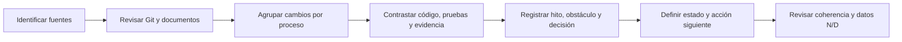

<div style="text-align: center" markdown="1">

{ width="300" }

# Bitácora de procesos documentados de SofInventory

**Avances, decisiones, obstáculos y aprendizajes reconstruidos con evidencia verificable**

`Código SQA-SOF-EVD-003` | `Versión v1.0` | `10 de agosto de 2026`

</div>

---

## 1. Portada

| Campo | Información |
|---|---|
| **Título** | Bitácora de procesos documentados de SofInventory |
| **Código documental** | `SQA-SOF-EVD-003` |
| **Versión documental** | **v1.0** |
| **Fecha de elaboración** | 10 de agosto de 2026 |
| **Autores / aprendices** | Alejandro Sepúlveda Duarte y Lucy Estefany Izquierdo Jaramillo |
| **Instructor evaluador** | José Ignacio Botero Osorio |
| **Centro de formación** | Centro de Comercio  Regional Antioquia — SENA |
| **Programa** | Tecnólogo en Análisis y Desarrollo de Software |
| **Ficha** | 3118526 |
| **Alcance** | Evolución documentada del proyecto, desde sus antecedentes académicos hasta la línea base de calidad vigente |
| **Estado académico** | **Pendiente de evaluación** |

## 2. Control del documento

| Versión | Fecha | Responsables | Descripción del cambio | Estado |
|---|---|---|---|---|
| **v1.0** | 10/08/2026 | Alejandro Sepúlveda Duarte / Lucy Estefany Izquierdo Jaramillo | Reconstrucción inicial de la bitácora a partir de Git, documentos académicos, código, pruebas y evidencias vigentes. | Elaborado y revisado por el equipo; pendiente de evaluación. |

## 3. Convenciones

| Convención | Significado |
|---|---|
| **Fecha comprobada** | Existe una fuente que respalda el día registrado. |
| **Periodo aproximado** | Las fuentes permiten ubicar el hito, pero no establecer un día exacto. |
| **Registro histórico reconstruido** | Entrada elaborada posteriormente a partir de fuentes existentes. |
| **Registro contemporáneo** | Entrada diligenciada durante la actividad, con sus tiempos y observaciones reales. |
| **Hito** | Avance significativo del proyecto. |
| **Obstáculo** | Situación que retrasó, bloqueó o afectó el trabajo o la calidad del resultado. |
| **Decisión** | Elección técnica, funcional o documental tomada por el equipo y respaldada por evidencia. |
| **Evidencia** | Commit, rama, documento, prueba, captura, acta o resultado verificable. |
| **Completado** | El entregable o actividad descrita quedó incorporado. No significa que todo el módulo esté libre de defectos. |
| **Corregido** | Existe una modificación orientada a resolver un problema identificado. |
| **Condicionado** | El avance puede continuar en un entorno controlado, pero mantiene criterios de cierre pendientes. |
| `N/D` | La información no está disponible en una fuente histórica confiable. |

!!! note "Cómo leer las fechas"
    Una fecha impresa dentro de un documento y una fecha de commit prueban cosas distintas. La primera permite ubicar el entregable académico; la segunda demuestra cuándo una versión fue incorporada al historial consultado. Ninguna permite calcular por sí sola las horas efectivas de trabajo.

## 4. Resumen

En esta bitácora reconstruimos la evolución de SofInventory mediante fuentes que podían verificarse: documentos académicos, 119 objetos `commit` visibles en las referencias locales y remotas al momento del corte histórico, ramas de trabajo, código, migraciones, manuales, casos de prueba, resultados de ejecución y registros de defectos. La consulta se realizó con la referencia más reciente de `main` identificada como `2023b68`, antes de incorporar esta bitácora al historial.

La reconstrucción muestra el paso desde la definición de casos de uso y decisiones de arquitectura hasta una solución integrada con Angular, Django REST Framework, PostgreSQL y Docker. También permite seguir la incorporación de autenticación, usuarios, productos, terceros, almacenes, inventario, compras, ventas, Dashboard, configuración empresarial, imágenes, validaciones, ubicaciones, ayuda contextual y documentación publicada con MkDocs.

No contamos desde el inicio con una bitácora uniforme de horas, interrupciones, costos reales o esfuerzo individual. Por esta razón, no restamos fechas de commits ni convertimos intervalos del calendario en tiempo trabajado. Esos datos se registran como `N/D`. El historial de Git nos ayudó a identificar hitos, autores técnicos y cambios; los documentos y las pruebas permitieron contrastar su propósito y su resultado.

El estado actual tampoco se presenta como perfecto. La ejecución del 8 de agosto consolidó 78 casos funcionales: 67 aprobados, uno parcial y 10 fallidos. Aunque las suites automatizadas aprobaron 99/99 pruebas backend en SQLite, las mismas 99/99 en PostgreSQL y 24/24 pruebas frontend, permanecen nueve defectos abiertos. Por ello, mantenemos una **aprobación condicionada** y priorizamos las correcciones, re-pruebas y regresiones pendientes.

## 5. Introducción

Una bitácora permite conservar lo que ocurrió durante un proyecto: actividades, ideas, observaciones, avances, resultados preliminares, obstáculos, decisiones y acciones siguientes. En SofInventory no utilizamos desde el primer día un único formato para reunir toda esa información. Sí conservamos un historial amplio de cambios y una colección de entregables académicos y técnicos que hacen posible reconstruir los principales procesos con un nivel razonable de trazabilidad.

Para elaborar este documento revisamos primero las fuentes y luego agrupamos los cambios relacionados en hitos comprensibles. Evitamos convertir cada commit en una entrada aislada, porque un commit puede contener una parte de una actividad, integrar trabajo conjunto o representar un ajuste técnico menor. También evitamos atribuir automáticamente todo un proceso a la persona que figura como autora de un commit: cuando las fuentes muestran colaboración o documentación elaborada por ambos aprendices, registramos al equipo.

Esta bitácora complementa [Aplicación de buenas prácticas de calidad de software](Aplicacion_buenas_practicas_calidad_SofInventory.md), donde definimos referentes e instrumentos, y [Diligenciamiento de instrumentos de calidad](Diligenciamiento_instrumentos_calidad_SofInventory.md), donde registramos resultados, defectos, métricas y la decisión vigente. Aquí el centro no es repetir el plan de pruebas ni sus tablas, sino explicar cómo evolucionó el proyecto, qué dificultades aparecieron, qué decisiones quedaron respaldadas y qué debemos continuar registrando.

## 6. Objetivos

### 6.1 Objetivo general

Documentar la evolución verificable de SofInventory mediante una bitácora histórica que relacione procesos, actividades, avances, resultados, obstáculos, decisiones, evidencias, aprendizajes y acciones siguientes, y dejar preparado un formato contemporáneo para los próximos ciclos.

### 6.2 Objetivos específicos

- Reconstruir los hitos principales sin inventar fechas, tiempos, costos o responsables.
- Relacionar los antecedentes académicos con el historial de Git, el código y la documentación vigente.
- Diferenciar los entregables planificados, implementados, verificados, corregidos y todavía condicionados.
- Registrar los obstáculos y las alternativas que pueden demostrarse mediante fuentes internas.
- Explicar cómo las buenas prácticas de calidad orientaron el control de versiones, las pruebas y la trazabilidad.
- Presentar el estado actual y las acciones pendientes sin confundir automatización aprobada con aceptación funcional total.
- Iniciar desde el siguiente ciclo una medición contemporánea de tiempo, interrupciones, decisiones y resultados.

## 7. Alcance y fuentes de la bitácora

### 7.1 Periodo reconstruido

| Alcance temporal | Fuente | Interpretación |
|---|---|---|
| **11/05/2025** | Portada de [diagramas y plantillas de casos de uso](Diagramas_Plantillas_casos_de_uso_del_proyecto.pdf) | Antecedente documental más antiguo localizado. |
| **27/09/2025** | Portada del [documento de arquitectura](Arquitectura_Software_Patrón_Diseño_Seleccionado.pdf) | Fecha del antecedente arquitectónico; el archivo indica actualización el 24/07/2026. |
| **07/02/2026** | Hoja “Datos del equipo” del [diccionario de datos](Diccionario_de_datos_de_SofInventory_PostgreSQL.xlsm) | Antecedente del diseño de datos; varias hojas indican actualización al 21/07/2026. |
| **05/05/2026–09/08/2026** | `git log --all` | Periodo exacto cubierto por los commits consultados. |
| **08/08/2026** | [Resultados de ejecución](test-cases/RESULTADOS_EJECUCION_2026-08-08.md) | Línea base comprobada de pruebas, defectos y build. |
| **10/08/2026** | Documentos de calidad `SQA-SOF-EVD-001`, `002` y `003` | Consolidación documental vigente. |

El periodo histórico documentable comienza el **11 de mayo de 2025**. No afirmamos que ese haya sido el día exacto de inicio del proyecto: es únicamente la fecha más temprana hallada en las fuentes disponibles.

### 7.2 Fuentes internas consultadas

| Grupo de fuentes | Contenido utilizado |
|---|---|
| Git | Estado no confirmado, ramas locales/remotas, autores, fechas, asuntos, archivos modificados, estadísticas, merges y publicaciones de `gh-pages`. |
| Documentos académicos | Casos de uso, arquitectura, modelo entidad-relación, diccionario de datos, mantenimiento, respaldo/migración, despliegue y acta académica histórica. |
| Documentación vigente | `README`, Manual de Usuario, Manual Técnico, arquitectura de frontend e inventario, estándar de codificación y guía visual/accesible. |
| Código y configuración | Apps Django, componentes Angular, migraciones, pruebas, Dockerfiles, `docker-compose.yml`, Nginx y `mkdocs.yml`. |
| Calidad | Matriz de 78 casos, resultados del 08/08/2026, 13 grupos funcionales, manifiestos de evidencia y registro de 11 defectos. |
| Entregables de proceso | Aplicación de buenas prácticas e instrumentos diligenciados. |

### 7.3 Lectura del historial de Git

Al momento del corte histórico, antes de incorporar esta bitácora, la consulta `git log --all` mostró **119 objetos commit** alcanzables desde las referencias disponibles.

| Identidad mostrada por Git | Commits visibles | Interpretación |
|---|---:|---|
| `AlejandroSepulvedaDuarte` | 74 | Identidad técnica de commits. |
| `Alejandro Sepúlveda` | 10 | Variante de nombre del mismo aprendiz; no se cuenta como una persona diferente. |
| `lucyjaramilo733-stack` | 26 | Identidad técnica de commits de Lucy Estefany Izquierdo Jaramillo. |
| `VS Code` | 9 | Checkpoints de herramienta; no se atribuyen como trabajo de una persona. |

También se localizaron ramas `feature/*`, `docs/*`, `security/*`, `integration/*`, `gh-pages` y referencias del proyecto anterior. Los merges y mensajes de pull request demuestran un flujo por ramas, pero no permiten reconstruir reuniones, revisiones verbales ni distribución exacta de esfuerzo.

### 7.4 Ramas recuperadas del proyecto anterior

El remoto `proyecto-antiguo` apunta a una copia local del repositorio anterior. El 4 de agosto de 2026, el commit [`ce5560f`](https://github.com/AlejandroSepulvedaDuarte/SofInventory/commit/ce5560ff11bc385f42b0df1ce2c95449a7cae60d) unió dos líneas de historia: el proyecto actual en `aced735` y `proyecto-antiguo/main` en `952ff53`. Esta integración conservó los commits anteriores como ancestros de `main`, en lugar de copiar únicamente una instantánea de archivos.

#### Ramas que conservan una referencia remota

| Referencia bajo `proyecto-antiguo/` | Último commit visible | Fecha | Aporte identificable por el historial |
|---|---|---|---|
| `main` | [`952ff53`](https://github.com/AlejandroSepulvedaDuarte/SofInventory/commit/952ff53204e63a16981b7808b20cd2fbd5624a71) | 21/06/2026 | Línea principal del proyecto anterior, con los ajustes de producción acumulados. |
| `agents/django-login-security-feature` | [`cfc6e6c`](https://github.com/AlejandroSepulvedaDuarte/SofInventory/commit/cfc6e6ca2e713f9bdc162ab8d8dcc5e30d5e348a) | 20/06/2026 | Validaciones de Clientes y ajustes integrados de módulos. |
| `agents/software-maintenance-plan-iso14724` | [`952ff53`](https://github.com/AlejandroSepulvedaDuarte/SofInventory/commit/952ff53204e63a16981b7808b20cd2fbd5624a71) | 21/06/2026 | Referencia de trabajo de mantenimiento cuyo puntero terminó en la línea principal anterior. |
| `agents/ventas-analisis-sin-errores` | [`b4a43ff`](https://github.com/AlejandroSepulvedaDuarte/SofInventory/commit/b4a43ff55b6c56a40d13f9924ed3c49d8b85c69f) | 17/06/2026 | Ajuste de la disposición del formulario de Proveedores dentro de un análisis relacionado con Ventas. |
| `docs/test-cases-update` | [`f99bde4`](https://github.com/AlejandroSepulvedaDuarte/SofInventory/commit/f99bde482348229d19a318f10acc4c2cf96fe47c) | 19/05/2026 | Actualización de casos de prueba en Markdown. |
| `feature/categorias` | [`db711f1`](https://github.com/AlejandroSepulvedaDuarte/SofInventory/commit/db711f186c3661b7e26cd2c32497e1c5541b5af8) | 05/05/2026 | Estructura y componente inicial de Categorías. |
| `feature/clientes` | [`ddffeb8`](https://github.com/AlejandroSepulvedaDuarte/SofInventory/commit/ddffeb80f56683147f612c7177a049e638dfcfa1) | 06/05/2026 | Implementación inicial del módulo de Clientes. |
| `feature/dashboard` | [`7bc8aa7`](https://github.com/AlejandroSepulvedaDuarte/SofInventory/commit/7bc8aa768a260bca6c50f7088cd630cb239500e4) | 05/05/2026 | Estructura y vista inicial del Dashboard. |
| `feature/login` | [`e316c98`](https://github.com/AlejandroSepulvedaDuarte/SofInventory/commit/e316c98b56fc2e6077f35d34a0375cca5743f411) | 06/05/2026 | Evolución visual del módulo de autenticación. |
| `feature/refactor-frontend` | [`38eeee2`](https://github.com/AlejandroSepulvedaDuarte/SofInventory/commit/38eeee2b870c305938279c0caafeed608574bc11) | 08/05/2026 | Reorganización transversal del frontend. |
| `feature/test-software-docs` | [`a115e13`](https://github.com/AlejandroSepulvedaDuarte/SofInventory/commit/a115e139c0b77fdc232f1b08d72eaff1196f69fa) | 16/05/2026 | Configuración de documentación QA y GitHub Pages. |
| `feature/ventas` | [`c9f624f`](https://github.com/AlejandroSepulvedaDuarte/SofInventory/commit/c9f624ff8cbc603e89be8e58f2e8d74e90d30b4b) | 06/05/2026 | Estructura inicial de Ventas. |
| `feature/ventas-modificaciones` | [`fe6bba0`](https://github.com/AlejandroSepulvedaDuarte/SofInventory/commit/fe6bba0a9154eff3381a7b9eb9ee7f16d1af1790) | 16/05/2026 | Modificación posterior de la lógica de Ventas. |
| `refactor-estructura-proyecto` | [`1e71a0c`](https://github.com/AlejandroSepulvedaDuarte/SofInventory/commit/1e71a0c164eaa9b63659b1c487f70cb35faacfc1) | 15/06/2026 | Reorganización de archivos y dependencias del proyecto. |

#### Ramas identificadas por merges, aunque ya no conservan puntero propio

| Rama mencionada en el merge histórico | Commit funcional relacionado | Merge conservado | Proceso identificado |
|---|---|---|---|
| `feature/usuarios` | [`c6aa418`](https://github.com/AlejandroSepulvedaDuarte/SofInventory/commit/c6aa418598460803be3223e4fb57ee7a9a249f38) | `c66230a` | Implementación inicial de Usuarios. |
| `feature/productos` | [`8194ffa`](https://github.com/AlejandroSepulvedaDuarte/SofInventory/commit/8194ffa2f41569387e163c9c847449e98ac3c8a6) | `481e1db` | Implementación inicial de Productos. |
| `feature/proveedores` | [`b9aba58`](https://github.com/AlejandroSepulvedaDuarte/SofInventory/commit/b9aba58fe80a57e557b85b9c0206b907f3260a46) | `26febe2` | Implementación inicial de Proveedores. |
| `feature/compras` | [`2507060`](https://github.com/AlejandroSepulvedaDuarte/SofInventory/commit/2507060fec4cc008c9d9a230b6a10a7cbc62f2b6) | `b2310d0` | Implementación inicial de Compras. |
| `feature/inventario` | [`5aaabb5`](https://github.com/AlejandroSepulvedaDuarte/SofInventory/commit/5aaabb5168e998757159c2266e26ce048da59d65) | `e1cb605` | Implementación inicial de Inventario. |
| `feature/test-cases-usuarios` | [`451d4e6`](https://github.com/AlejandroSepulvedaDuarte/SofInventory/commit/451d4e68123724e7220c95763a746c7d611a12d7) | `d7d08d8` | Funcionalidades y evidencias de prueba de Usuarios. |
| `agents/project-audit-for-production-deployment` | `758bac9` | [`2032921`](https://github.com/AlejandroSepulvedaDuarte/SofInventory/commit/2032921f391aa4391e76f97f8a34ab83a8012145) | Auditoría y preparación del despliegue. |

!!! info "Interpretación de las ramas"
    Una rama demuestra una línea de trabajo y un conjunto de commits relacionados; no equivale a una persona, una jornada ni una cantidad de horas. Las ramas ya integradas tampoco se cuentan como funcionalidades adicionales: sus cambios forman parte de la misma evolución del producto.

### 7.5 Limitaciones

- No existe una bitácora histórica uniforme de inicio, fin, interrupciones o tiempo neto.
- No se calcularon horas mediante diferencias entre commits.
- Los presupuestos o proyecciones académicas no se interpretaron como costos reales ejecutados.
- Las fechas de portada prueban la existencia declarada de un entregable, no todas las actividades utilizadas para producirlo.
- Algunos archivos fueron actualizados después de su fecha original; cuando ocurrió, se registraron ambas referencias.
- El video permite comprobar la realización de la capacitación académica. El acta histórica de entrega utiliza participantes, cliente y firmas simulados, por lo que no se interpreta como una aceptación comercial real.
- Un informe histórico de despliegue fue revisado localmente, pero no se enlaza desde esta bitácora porque contiene configuración heredada que debe depurarse antes de una publicación documental. No se reprodujo ningún valor sensible.
- El estado actual se basa en la última ejecución documentada; no se ejecutaron pruebas destructivas ni se alteraron datos para elaborar esta evidencia.

## 8. Método de reconstrucción histórica



Aplicamos el siguiente procedimiento:

1. Identificamos los documentos y entregables disponibles en el repositorio y en el historial.
2. Revisamos las ramas, los 119 commits alcanzables, sus autores, fechas, asuntos y archivos modificados.
3. Agrupamos los cambios relacionados por proceso, en lugar de crear una entrada para cada commit.
4. Contrastamos Git con manuales, diagramas, migraciones, código, casos y resultados de pruebas.
5. Separamos la fecha interna de un documento de la fecha de incorporación al repositorio.
6. Identificamos avances, resultados preliminares, obstáculos, decisiones y alternativas respaldadas.
7. Relacionamos cada entrada con enlaces internos o commits verificables.
8. Clasificamos las fechas como comprobadas o aproximadas.
9. Conservamos como `N/D` los tiempos, costos, interrupciones y asignaciones que no podían demostrarse.
10. Comparamos la reconstrucción con la línea base de calidad y consolidamos las acciones pendientes.

## 9. Buenas prácticas seleccionadas y aplicadas

| Referente o marco | Buena práctica seleccionada | Aplicación específica en la bitácora | Evidencia o resultado |
|---|---|---|---|
| Componente formativo “Fundamentos de calidad de software” del SENA | Registrar avances, resultados, obstáculos y decisiones mediante instrumentos comprensibles. | Organizamos una entrada vertical por hito y dejamos un formato para el siguiente ciclo. | 20 entradas históricas y una plantilla contemporánea. |
| ISO/IEC/IEEE 29119-3:2021 | Mantener documentación de prueba trazable y adaptable al ciclo de vida. | Enlazamos hitos con casos, ejecuciones, defectos y evidencias sin duplicar toda la matriz. | Línea base del 08/08/2026 y navegación a registros completos. |
| ISO/IEC 25010 | Evaluar más de una dimensión de calidad. | Registramos funcionalidad, fiabilidad, seguridad, usabilidad, compatibilidad y mantenibilidad cuando la evidencia lo permite. | Obstáculos técnicos y funcionales diferenciados. |
| CMMI | Conservar evidencia objetiva, seguimiento y acciones de mejora. | Cada entrada incluye estado, evidencia y acción siguiente; el consolidado conserva defectos abiertos. | Decisión de aprobación condicionada. |
| PSP | Medir datos personales de proceso en el momento de la actividad. | No reconstruimos horas retroactivas; dejamos el tiempo como `N/D` y preparamos el formato contemporáneo. | Regla de honestidad y plantilla del próximo ciclo. |
| TSP | Distribuir trabajo y revisar resultados como equipo. | Reconocemos identidades de Git y autoría documental sin convertir el número de commits en productividad individual. | Responsabilidades expresadas por proceso y revisión del equipo. |
| Trabajo iterativo y prácticas ágiles | Incorporar cambios pequeños, revisar, corregir y volver a probar. | Agrupamos ramas y commits en ciclos funcionales, de seguridad, UX, inventario y documentación. | Historial de features, correcciones, merges y regresiones. |
| Control de versiones con Git | Trabajar mediante ramas, commits descriptivos y merges trazables. | Usamos hashes, fechas, autores y archivos modificados como fuente histórica. | 119 objetos commit, ramas `feature`, `docs`, `security`, `integration` y `gh-pages`. |
| Trazabilidad documental | Relacionar afirmaciones con una fuente local o versionada. | Cada hito incluye commits o documentos; las cifras se enlazan a su consolidado. | Navegación interna y registro de fuentes. |
| Registro honesto | Declarar lo que no puede demostrarse. | Horas, costos reales, interrupciones y aceptación comercial permanecen como `N/D` o “no demostrada”. | Evita una precisión histórica ficticia. |

No utilizamos estos referentes como una certificación. Los aplicamos como guías para que la bitácora sea mantenible, verificable y útil durante el siguiente ciclo.

## 10. Línea de tiempo general del proyecto

| Fecha o periodo | Proceso | Resultado principal | Evidencia |
|---|---|---|---|
| 11/05/2025 | Idea, actores y requisitos iniciales | Casos de uso académicos para acceso, usuarios, productos e inventario. | [Diagramas y plantillas](Diagramas_Plantillas_casos_de_uso_del_proyecto.pdf) |
| 27/09/2025; actualización 24/07/2026 | Arquitectura | Documento de patrón y vistas de componentes/despliegue actualizado a la solución vigente. | [Arquitectura](Arquitectura_Software_Patrón_Diseño_Seleccionado.pdf) |
| 07/02/2026; actualización 21/07/2026 | Diseño de datos | Diccionario de datos adaptado a PostgreSQL y al modelo implementado. | [Diccionario](Diccionario_de_datos_de_SofInventory_PostgreSQL.xlsm) |
| 05–08/05/2026 | Construcción inicial | Base Django/Angular y primeras pantallas de los módulos principales. | Commits `f0f564c` a `38eeee2` |
| 16–19/05/2026 | Calidad inicial | Estructura de casos, documentación QA y primeras evidencias del módulo Usuarios. | Commits `a115e13`, `451d4e6`, `f99bde4` |
| 15–22/06/2026 | Seguridad, validaciones e integración | Bloqueo de cuentas, validaciones de usuarios/terceros y despliegue contenerizado. | Commits `fd99779` a `0b57323` |
| 05–28/07/2026 | Operación y documentación | Planes de mantenimiento/migración, artefactos técnicos, manuales y MkDocs. | Documentos fechados y commits `e3767c2` a `405cd2d` |
| 04/08/2026 | Inventario | Escritura de stock centralizada y reconciliación del historial. | Commit `aced735` y [arquitectura de inventario](ARQUITECTURA_INVENTARIO.md) |
| 05–07/08/2026 | UX, seguridad y trazabilidad | Temas, Dashboard, validaciones, ubicaciones, empresa, imágenes, mensajes y ayuda. | Commits `42ce9f1`, `38b12b6`, `6e127e4`, `e4457ed`, `06882ad` |
| 08–10/08/2026 | Pruebas y calidad | 78 casos ejecutados, 11 defectos, instrumentos diligenciados y decisión condicionada. | [Resultados](test-cases/RESULTADOS_EJECUCION_2026-08-08.md) y documentos `SQA-SOF-EVD-001/002` |

## 11. Bitácora histórica de procesos

Las siguientes entradas son **registros históricos reconstruidos**. En todas ellas el tiempo efectivo permanece como `N/D`, porque no se midió mediante una bitácora contemporánea.

### `BIT-SOF-001` — Definición inicial, actores y casos de uso

| Campo | Registro |
|---|---|
| **Fecha o periodo** | **Fecha comprobada:** 11/05/2025, según la portada del documento. |
| **Tipo** | Registro histórico reconstruido. |
| **Proceso o fase** | Formación de la idea, análisis de requisitos, actores, casos de uso y diagramas. |
| **Objetivo** | Delimitar el problema de inventario y describir interacciones iniciales del sistema. |
| **Actividades realizadas** | Se documentaron casos para acceso y gestión de usuarios, registro de productos, entradas/salidas y configuración de stock. |
| **Avances y resultados** | Quedó un antecedente académico con flujos, precondiciones y resultados esperados que orientó los módulos posteriores. |
| **Observaciones e ideas** | Los actores y el alcance evolucionaron; los roles actuales son Administrador, Supervisor, Bodega y Vendedor. El documento inicial se conserva como antecedente, no como contrato vigente completo. |
| **Obstáculos** | No se encontró una bitácora de reuniones ni una fecha demostrable anterior a la portada. |
| **Decisiones tomadas** | Utilizar casos de uso para relacionar necesidades operativas con funciones del sistema. |
| **Responsables** | Documento atribuido a Lucy Estefany Izquierdo Jaramillo y Alejandro Sepúlveda Duarte. |
| **Evidencias** | [Diagramas y plantillas para casos de uso](Diagramas_Plantillas_casos_de_uso_del_proyecto.pdf). |
| **Estado** | Completado como antecedente; requiere lectura junto con los manuales vigentes. |
| **Acción siguiente** | Mantener la correspondencia entre requisitos, módulos y casos de prueba actuales. |
| **Tiempo efectivo** | `N/D`: no existe registro contemporáneo de horas. |

### `BIT-SOF-002` — Selección y actualización de la arquitectura

| Campo | Registro |
|---|---|
| **Fecha o periodo** | **Fecha comprobada:** 27/09/2025; el archivo declara actualización el 24/07/2026. |
| **Tipo** | Registro histórico reconstruido. |
| **Proceso o fase** | Diseño de arquitectura, patrón, componentes y despliegue. |
| **Objetivo** | Definir una organización técnica que separara interfaz, reglas de negocio y persistencia. |
| **Actividades realizadas** | Se elaboraron vistas de componentes y despliegue; la versión actualizada documenta Angular, Django REST Framework y PostgreSQL. |
| **Avances y resultados** | Se consolidó una SPA Angular desacoplada de una API Django, con PostgreSQL como persistencia y Docker/Nginx para integración. |
| **Observaciones e ideas** | El archivo fue actualizado: no atribuimos automáticamente todo su contenido vigente a la versión del 27/09/2025. |
| **Obstáculos** | La versión original no está disponible por separado para comparar cada decisión. |
| **Decisiones tomadas** | Mantener Angular y Django REST Framework como tecnologías implementadas y PostgreSQL como motor de negocio. |
| **Responsables** | Documento atribuido al equipo SofInventory. |
| **Evidencias** | [Arquitectura de software y patrón seleccionado](Arquitectura_Software_Patrón_Diseño_Seleccionado.pdf) y [Manual Técnico](MANUAL_TECNICO.md). |
| **Estado** | Actualizado y vigente con las precisiones del Manual Técnico. |
| **Acción siguiente** | Revisar las vistas cuando cambien servicios, despliegue o contratos entre capas. |
| **Tiempo efectivo** | `N/D`. |

### `BIT-SOF-003` — Diseño y adaptación de la base de datos

| Campo | Registro |
|---|---|
| **Fecha o periodo** | **Fechas comprobadas:** 07/02/2026 en la hoja inicial; actualización de tablas al 21/07/2026; MER adaptado el 24/07/2026. |
| **Tipo** | Registro histórico reconstruido. |
| **Proceso o fase** | Modelo entidad-relación, diccionario de datos y adaptación a PostgreSQL. |
| **Objetivo** | Documentar las entidades, relaciones, claves y restricciones que sostienen la operación. |
| **Actividades realizadas** | Se construyó un diccionario por tablas y se actualizó el MER al motor PostgreSQL. |
| **Avances y resultados** | El diccionario registra 19 tablas de negocio de la versión revisada y diferencia el modelo implementado de decisiones teóricas anteriores. |
| **Observaciones e ideas** | El código actual incorpora entidades posteriores, como configuración empresarial y auditoría; el Manual Técnico es la referencia vigente para el modelo completo. |
| **Obstáculos** | Las proyecciones de tamaño del diccionario son estimaciones de diseño, no consumo real ni costo ejecutado. |
| **Decisiones tomadas** | Utilizar el ORM y migraciones Django para evolucionar el esquema de PostgreSQL de forma controlada. |
| **Responsables** | Entregables atribuidos a Lucy Estefany Izquierdo Jaramillo y Alejandro Sepúlveda Duarte. |
| **Evidencias** | [Diccionario de datos](Diccionario_de_datos_de_SofInventory_PostgreSQL.xlsm), [MER adaptado](Modelo_Entidad_Relacion_SofInventory_PostgreSQL.pdf) y [migraciones Django en el repositorio](https://github.com/AlejandroSepulvedaDuarte/SofInventory/tree/main/backend). |
| **Estado** | Completado como documentación histórica; el esquema vigente incluye evoluciones posteriores. |
| **Acción siguiente** | Actualizar el diccionario cuando se aprueben nuevas migraciones funcionales. |
| **Tiempo efectivo** | `N/D`. |

### `BIT-SOF-004` — Configuración inicial del backend y del frontend

| Campo | Registro |
|---|---|
| **Fecha o periodo** | **Fecha comprobada:** 05/05/2026. |
| **Tipo** | Registro histórico reconstruido. |
| **Proceso o fase** | Construcción inicial. |
| **Objetivo** | Incorporar una base funcional de Django y Angular para desarrollar el producto por módulos. |
| **Actividades realizadas** | El commit inicial agregó 131 archivos de configuración y código en backend, frontend y documentación técnica. |
| **Avances y resultados** | Quedaron disponibles apps para usuarios, productos, terceros, inventario, compras, ventas y Dashboard, junto con la estructura Angular. |
| **Observaciones e ideas** | El tamaño del commit evidencia un punto de incorporación, no el tiempo ni el reparto exacto de trabajo anterior. |
| **Obstáculos** | El historial no muestra horas ni etapas previas de preparación del contenido incorporado. |
| **Decisiones tomadas** | Organizar el backend por apps de dominio y el frontend por rutas/componentes. |
| **Responsables** | Autor Git: Alejandro Sepúlveda; el proyecto se documenta como trabajo del equipo. |
| **Evidencias** | [Commit `f0f564c`](https://github.com/AlejandroSepulvedaDuarte/SofInventory/commit/f0f564c70b1a60b9a0044a35fb77f1c83576b9c3), [README del repositorio](https://github.com/AlejandroSepulvedaDuarte/SofInventory) y estructura actual. |
| **Estado** | Completado como base; evolucionó en ciclos posteriores. |
| **Acción siguiente** | Desarrollar y conectar los módulos funcionales. |
| **Tiempo efectivo** | `N/D`. |

### `BIT-SOF-005` — Desarrollo inicial de módulos y reorganización visual

| Campo | Registro |
|---|---|
| **Fecha o periodo** | **Periodo comprobado por Git:** 05/05/2026–08/05/2026. |
| **Tipo** | Registro histórico reconstruido. |
| **Proceso o fase** | Frontend inicial, autenticación, usuarios, catálogo, terceros y transacciones. |
| **Objetivo** | Construir las primeras interfaces de los procesos centrales y unificar su navegación. |
| **Actividades realizadas** | Se incorporaron login, Dashboard, usuarios, categorías, productos, proveedores, clientes, compras, ventas e inventario; luego se reorganizó el frontend. |
| **Avances y resultados** | El sistema obtuvo pantallas iniciales para los módulos que posteriormente se conectaron y reforzaron. |
| **Observaciones e ideas** | Los commits muestran participación de ambas identidades del equipo y merges de ramas funcionales. |
| **Obstáculos** | La primera versión requirió una reorganización de 37 archivos para mejorar la interfaz y su estructura. |
| **Decisiones tomadas** | Integrar módulos mediante ramas `feature/*` y realizar una refactorización transversal antes de continuar. |
| **Responsables** | Autores Git: Alejandro Sepúlveda y Lucy Estefany Izquierdo Jaramillo; merges de colaboración. |
| **Evidencias** | Commits de [login](https://github.com/AlejandroSepulvedaDuarte/SofInventory/commit/618107ed0e1e771f1e25a742d1bc34df88d9f5e4), [Dashboard](https://github.com/AlejandroSepulvedaDuarte/SofInventory/commit/7bc8aa768a260bca6c50f7088cd630cb239500e4), [usuarios](https://github.com/AlejandroSepulvedaDuarte/SofInventory/commit/c6aa418598460803be3223e4fb57ee7a9a249f38), [categorías](https://github.com/AlejandroSepulvedaDuarte/SofInventory/commit/db711f186c3661b7e26cd2c32497e1c5541b5af8), [productos](https://github.com/AlejandroSepulvedaDuarte/SofInventory/commit/8194ffa2f41569387e163c9c847449e98ac3c8a6), [proveedores](https://github.com/AlejandroSepulvedaDuarte/SofInventory/commit/b9aba58fe80a57e557b85b9c0206b907f3260a46), [clientes](https://github.com/AlejandroSepulvedaDuarte/SofInventory/commit/ddffeb80f56683147f612c7177a049e638dfcfa1), [compras](https://github.com/AlejandroSepulvedaDuarte/SofInventory/commit/2507060fec4cc008c9d9a230b6a10a7cbc62f2b6), [ventas](https://github.com/AlejandroSepulvedaDuarte/SofInventory/commit/c9f624ff8cbc603e89be8e58f2e8d74e90d30b4b), [inventario](https://github.com/AlejandroSepulvedaDuarte/SofInventory/commit/5aaabb5168e998757159c2266e26ce048da59d65) y [refactor](https://github.com/AlejandroSepulvedaDuarte/SofInventory/commit/38eeee2b870c305938279c0caafeed608574bc11). |
| **Estado** | Completado como construcción inicial; no equivale a aprobación funcional. |
| **Acción siguiente** | Conectar reglas del backend, permisos, validaciones y persistencia. |
| **Tiempo efectivo** | `N/D`. |

### `BIT-SOF-006` — Estructura inicial de pruebas y documentación QA

| Campo | Registro |
|---|---|
| **Fecha o periodo** | **Periodo comprobado por Git:** 16/05/2026–19/05/2026. |
| **Tipo** | Registro histórico reconstruido. |
| **Proceso o fase** | Pruebas, evidencia y publicación documental inicial. |
| **Objetivo** | Organizar casos de prueba por módulo y comenzar a reunir evidencia reproducible. |
| **Actividades realizadas** | Se configuró documentación QA/GitHub Pages, se incorporaron casos y evidencias del módulo Usuarios y se ajustaron archivos Markdown. |
| **Avances y resultados** | Quedó una estructura modular que más tarde creció hasta 13 grupos funcionales y 78 casos. |
| **Observaciones e ideas** | La existencia temprana de casos no demuestra su aprobación; los resultados vigentes provienen de la ejecución del 08/08/2026. |
| **Obstáculos** | Las primeras evidencias no tenían aún un consolidado homogéneo de ejecución, defectos y métricas. |
| **Decisiones tomadas** | Separar casos y evidencias por módulo y publicarlos como documentación navegable. |
| **Responsables** | Autores Git: Alejandro Sepúlveda y Lucy Estefany Izquierdo Jaramillo. |
| **Evidencias** | [Commit QA `a115e13`](https://github.com/AlejandroSepulvedaDuarte/SofInventory/commit/a115e139c0b77fdc232f1b08d72eaff1196f69fa), [evidencias de Usuarios `451d4e6`](https://github.com/AlejandroSepulvedaDuarte/SofInventory/commit/451d4e68123724e7220c95763a746c7d611a12d7) y [ajuste de casos `f99bde4`](https://github.com/AlejandroSepulvedaDuarte/SofInventory/commit/f99bde482348229d19a318f10acc4c2cf96fe47c). |
| **Estado** | Completado como estructura; resultados posteriores. |
| **Acción siguiente** | Ejecutar, consolidar resultados y vincular defectos. |
| **Tiempo efectivo** | `N/D`. |

### `BIT-SOF-007` — Autenticación, bloqueo y validaciones de usuarios

| Campo | Registro |
|---|---|
| **Fecha o periodo** | **Periodo comprobado por Git:** 15/06/2026–17/06/2026. |
| **Tipo** | Registro histórico reconstruido. |
| **Proceso o fase** | Autenticación, gestión de usuarios, permisos y validación. |
| **Objetivo** | Reducir accesos indebidos y mejorar la calidad de los datos de usuarios. |
| **Actividades realizadas** | Se implementó registro de intentos fallidos, bloqueo de cuentas, mensajes en login, desbloqueo exclusivo del Administrador y validaciones de usuario/contraseña. |
| **Avances y resultados** | El backend y el frontend incorporaron estados de bloqueo, rutas de desbloqueo y manejo de errores más claro. |
| **Observaciones e ideas** | Los defectos `BUG-USR-001` y `BUG-USR-002` figuran actualmente resueltos y revalidados; la búsqueda de Usuarios sigue abierta como `BUG-USR-003`. |
| **Obstáculos** | Fue necesario alinear el modelo frontend con `cuenta_bloqueada` y corregir errores de plantilla. |
| **Decisiones tomadas** | Hacer efectiva la autorización en backend y reservar el desbloqueo al rol Administrador. |
| **Responsables** | Autor Git de los commits técnicos: Alejandro Sepúlveda Duarte. |
| **Evidencias** | [Bloqueo `fd99779`](https://github.com/AlejandroSepulvedaDuarte/SofInventory/commit/fd99779705e67874e4b9f0b143a80f82d52931ab), [desbloqueo `f4bed75`](https://github.com/AlejandroSepulvedaDuarte/SofInventory/commit/f4bed750790195f78e4b4899fb0ed38a72d2e89f), [validaciones `9ca30cc`](https://github.com/AlejandroSepulvedaDuarte/SofInventory/commit/9ca30cccb1833a940fc7c76a44a19df1d5818ec5) y [defectos](test-cases/DEFECTOS.md). |
| **Estado** | Corregido parcialmente: controles principales vigentes; `BUG-USR-003` continúa abierto. |
| **Acción siguiente** | Corregir el buscador y reejecutar `TC-USR-008`. |
| **Tiempo efectivo** | `N/D`. |

### `BIT-SOF-008` — Validaciones de proveedores, clientes y datos de contacto

| Campo | Registro |
|---|---|
| **Fecha o periodo** | **Periodo comprobado por Git:** 17/06/2026–20/06/2026. |
| **Tipo** | Registro histórico reconstruido. |
| **Proceso o fase** | Proveedores, clientes, formularios y API. |
| **Objetivo** | Mejorar la coherencia de documentos, teléfonos, mensajes y operaciones de terceros. |
| **Actividades realizadas** | Se añadieron validaciones de documento y teléfono en frontend/backend, pruebas de serializer y ajustes en clientes, proveedores y ventas. |
| **Avances y resultados** | Las validaciones dejaron de depender exclusivamente de la interfaz y se incorporaron pruebas API. |
| **Observaciones e ideas** | La política inicial de “solo números” para algunos documentos evolucionó después a una validación dependiente del tipo, para admitir pasaportes alfanuméricos. |
| **Obstáculos** | Las reglas debían ser consistentes entre Angular y DRF sin romper tipos documentales válidos. |
| **Decisiones tomadas** | Validar en ambas capas y presentar mensajes específicos en español. |
| **Responsables** | Autor Git: Alejandro Sepúlveda Duarte; proceso documentado como parte del trabajo del equipo. |
| **Evidencias** | [Documento y mensajes `48f77d8`](https://github.com/AlejandroSepulvedaDuarte/SofInventory/commit/48f77d862d8057ce03f26f70dbc07d98fca4f713), [teléfono `5600523`](https://github.com/AlejandroSepulvedaDuarte/SofInventory/commit/560052310a6e612a51aec6862b6cc0d3488e243c) y [ajustes integrados `cfc6e6c`](https://github.com/AlejandroSepulvedaDuarte/SofInventory/commit/cfc6e6ca2e713f9bdc162ab8d8dcc5e30d5e348a). |
| **Estado** | Completado para el alcance registrado; las eliminaciones relacionadas conservan defectos abiertos `BUG-PRV-001` y `BUG-CLI-001`. |
| **Acción siguiente** | Controlar la respuesta de eliminación con relaciones y ejecutar regresión de terceros. |
| **Tiempo efectivo** | `N/D`. |

### `BIT-SOF-009` — Integración mediante Docker y ajustes de despliegue

| Campo | Registro |
|---|---|
| **Fecha o periodo** | **Periodo comprobado por Git:** 20/06/2026–22/06/2026. |
| **Tipo** | Registro histórico reconstruido. |
| **Proceso o fase** | Integración, migraciones, configuración, servidor web y despliegue. |
| **Objetivo** | Ejecutar frontend, backend y base de datos en un entorno reproducible. |
| **Actividades realizadas** | Se incorporaron Dockerfiles, Compose, PostgreSQL, migraciones, scripts de inicio, proxy Nginx, archivos estáticos/media y alternativas de despliegue en un solo servicio. |
| **Avances y resultados** | La arquitectura quedó reproducible con servicios `db`, `backend` y `frontend`, además de una variante combinada. |
| **Observaciones e ideas** | Los numerosos commits de dos días muestran iteración sobre problemas de entorno; no representan horas continuas de trabajo. |
| **Obstáculos** | Configuración de base de datos, dependencias, `collectstatic`, CORS, finales de línea, memoria de Node y archivos media del SPA. |
| **Decisiones tomadas** | Centralizar variables en el entorno, usar Nginx como proxy, aplicar migraciones al iniciar y limitar memoria en builds restringidos. |
| **Responsables** | Commits de Alejandro Sepúlveda Duarte y Lucy Estefany Izquierdo Jaramillo; existen coautorías técnicas en mensajes de Git. |
| **Evidencias** | [Docker y migraciones `3e46a79`](https://github.com/AlejandroSepulvedaDuarte/SofInventory/commit/3e46a79987aa715d58e9262feb8693375f297935), [instantánea integrada `0b57323`](https://github.com/AlejandroSepulvedaDuarte/SofInventory/commit/0b573237f2096d77ac69f7418e19ce239e323d71), [Docker Compose](https://github.com/AlejandroSepulvedaDuarte/SofInventory/blob/main/docker-compose.yml) y [Manual Técnico](MANUAL_TECNICO.md). |
| **Estado** | Completado para el entorno documentado; requiere variables seguras y verificación por instalación. |
| **Acción siguiente** | Mantener pruebas de arranque, migraciones y conexión en entornos aislados. |
| **Tiempo efectivo** | `N/D`. |

### `BIT-SOF-010` — Planes de mantenimiento, respaldo y migración

| Campo | Registro |
|---|---|
| **Fecha o periodo** | **Fechas comprobadas en portadas:** 05/07/2026 y 11/07/2026; incorporación a Git el 27/07/2026. |
| **Tipo** | Registro histórico reconstruido. |
| **Proceso o fase** | Mantenimiento, soporte, respaldo y migración de datos. |
| **Objetivo** | Preparar lineamientos para sostener, recuperar y trasladar la solución. |
| **Actividades realizadas** | Se documentaron tipos de mantenimiento, análisis de impacto, inventario de configuración, políticas de respaldo, retención, restauración y migración. |
| **Avances y resultados** | El equipo dejó procedimientos y responsabilidades planificadas para la operación futura. |
| **Observaciones e ideas** | Un plan documentado no demuestra que todos los respaldos o simulacros se hayan ejecutado. |
| **Obstáculos** | No se encontró un historial de ejecuciones periódicas, tiempos de recuperación o costos reales. |
| **Decisiones tomadas** | Tratar base de datos, archivos multimedia, configuración y código como activos con mecanismos de respaldo diferenciados. |
| **Responsables** | Documentos atribuidos al equipo SofInventory. |
| **Evidencias** | [Plan de mantenimiento](Plan_de_Mantenimiento_y_Soporte_del_Software.pdf), [plan de respaldo y migración](Plan_Migracion_Respaldo_SofInventory.pdf) y [commit de incorporación](https://github.com/AlejandroSepulvedaDuarte/SofInventory/commit/b3197db2277f8f6b41ecbe1b1bfe3dff1ee48dab). |
| **Estado** | Completado como diseño documental; ejecución histórica periódica `N/D`. |
| **Acción siguiente** | Registrar cada respaldo, restauración y simulacro con fecha, resultado y evidencia. |
| **Tiempo efectivo** | `N/D`. |

### `BIT-SOF-011` — Manual Técnico, modelo y artefactos de arquitectura

| Campo | Registro |
|---|---|
| **Fecha o periodo** | **Periodo comprobado por Git:** 24/07/2026–25/07/2026. |
| **Tipo** | Registro histórico reconstruido. |
| **Proceso o fase** | Documentación técnica, casos de uso, datos y arquitectura. |
| **Objetivo** | Reunir una guía técnica coherente con la implementación y anexar los artefactos de soporte. |
| **Actividades realizadas** | Se añadió el Manual Técnico y se actualizaron/anexaron arquitectura, casos de uso, diccionario y MER en `docs/`. |
| **Avances y resultados** | Quedó documentada la instalación, arquitectura, API, modelo de datos, Docker y operación técnica. |
| **Observaciones e ideas** | El manual continuó actualizándose en agosto; su versión actual es la fuente técnica principal. |
| **Obstáculos** | Fue necesario reemplazar artefactos editables por versiones publicables y ajustar rutas/diagramas. |
| **Decisiones tomadas** | Publicar los entregables históricos junto con un Manual Técnico vivo en Markdown. |
| **Responsables** | Autor Git: Alejandro Sepúlveda Duarte; documentos atribuidos a ambos aprendices. |
| **Evidencias** | [Commit inicial `e3767c2`](https://github.com/AlejandroSepulvedaDuarte/SofInventory/commit/e3767c2a96e99bc770b69a30aa79b0fa2dbf02f5), [actualización `5fb4818`](https://github.com/AlejandroSepulvedaDuarte/SofInventory/commit/5fb4818f54a7415f934b57471b8cdb23aebac66a) y [Manual Técnico](MANUAL_TECNICO.md). |
| **Estado** | Completado y actualizado; debe evolucionar con el sistema. |
| **Acción siguiente** | Mantener comandos, versiones y diagramas sincronizados con cada cambio de arquitectura. |
| **Tiempo efectivo** | `N/D`. |

### `BIT-SOF-012` — Manual de Usuario, capacitación y ejercicio académico de entrega

| Campo | Registro |
|---|---|
| **Fecha o periodo** | **Fecha interna del acta:** 26/07/2026; **incorporación a Git:** 27/07/2026; fecha de la capacitación según el video: **30/07/2026**. |
| **Tipo** | Registro histórico reconstruido. |
| **Proceso o fase** | Documentación de uso, capacitación y ejercicio académico de entrega. |
| **Objetivo** | Explicar la operación de SofInventory según sus roles, realizar una demostración guiada y documentar académicamente el proceso de capacitación. |
| **Actividades realizadas** | Se elaboró el Manual de Usuario, se documentaron sus principales flujos y se realizó una capacitación grabada mediante Google Meet, en la que se presentaron funcionalidades del sistema y se desarrolló un ejercicio práctico con la participante. |
| **Avances y resultados** | La capacitación permitió explicar la navegación, los roles, el Dashboard y los principales procesos operativos de SofInventory. El video conserva evidencia audiovisual de la sesión realizada y el Manual de Usuario queda disponible como material de consulta posterior. |
| **Observaciones e ideas** | El video demuestra que la capacitación fue realizada. El acta de entrega conservada en el historial corresponde a una simulación académica y, por sí sola, no constituye una aceptación comercial emitida por un cliente real. |
| **Obstáculos** | La duración de la capacitación fue inferior a los 45 minutos planteados inicialmente, pero permitió cubrir los contenidos prioritarios y desarrollar la demostración prevista. No se cuenta con una medición formal de satisfacción de un cliente comercial. |
| **Decisiones tomadas** | Utilizar el video como evidencia de la capacitación efectivamente realizada, conservar el Manual de Usuario como material complementario y mantener el acta como ejercicio académico diferenciado de una aceptación comercial real. |
| **Responsables** | Alejandro Sepúlveda Duarte como capacitador y Lucy Estefany Izquierdo Jaramillo como participante del ejercicio práctico. |
| **Evidencias** | [Manual de Usuario](MANUAL_USUARIO.md), [video de la capacitación](https://www.youtube.com/watch?v=yvCJZclgh1w), [commit `b3197db`](https://github.com/AlejandroSepulvedaDuarte/SofInventory/commit/b3197db2277f8f6b41ecbe1b1bfe3dff1ee48dab) y [acta académica histórica](https://github.com/AlejandroSepulvedaDuarte/SofInventory/blob/b3197db2277f8f6b41ecbe1b1bfe3dff1ee48dab/Actas.md). |
| **Estado** | Manual y capacitación completados; aceptación comercial real no demostrada porque el ejercicio fue realizado en un contexto académico. |
| **Acción siguiente** | Conservar el video y el manual como evidencias académicas, y registrar futuras capacitaciones con participantes, fecha, alcance, resultados y evidencia sanitizada. |
| **Tiempo efectivo** | La duración visible del video puede registrarse como duración de la capacitación; las horas de preparación permanecen como `N/D`. |

### `BIT-SOF-013` — Publicación de manuales mediante MkDocs y GitHub Pages

| Campo | Registro |
|---|---|
| **Fecha o periodo** | **Fecha comprobada:** 28/07/2026; publicaciones posteriores el 09/08/2026. |
| **Tipo** | Registro histórico reconstruido. |
| **Proceso o fase** | Publicación documental. |
| **Objetivo** | Presentar los manuales en un sitio navegable, consistente y accesible desde GitHub Pages. |
| **Actividades realizadas** | Se configuró MkDocs Material, navegación, estilos, logo y despliegues de la rama `gh-pages`. |
| **Avances y resultados** | Los manuales quedaron publicados con tema claro/oscuro y navegación profesional. |
| **Observaciones e ideas** | Los commits de despliegue registran MkDocs 1.6.1; no deben confundirse con cambios funcionales. |
| **Obstáculos** | La documentación necesitó ajustes de rutas, imágenes, portada y consistencia entre manuales. |
| **Decisiones tomadas** | Mantener `mkdocs.yml` como fuente de navegación y agrupar los documentos de calidad sin cambiar sus URL directas. |
| **Responsables** | Autor Git: Alejandro Sepúlveda Duarte. |
| **Evidencias** | [Configuración `405cd2d`](https://github.com/AlejandroSepulvedaDuarte/SofInventory/commit/405cd2d1486ae6d37dfd09d3e9821a9694db9dda), `mkdocs.yml` y rama `gh-pages`. |
| **Estado** | Completado; navegación ampliada con las tres evidencias de calidad. |
| **Acción siguiente** | Ejecutar `mkdocs build --strict` en un entorno que tenga MkDocs Material disponible. |
| **Tiempo efectivo** | `N/D`. |

### `BIT-SOF-014` — Centralización del inventario y corrección de stock

| Campo | Registro |
|---|---|
| **Fecha o periodo** | **Fecha comprobada:** 04/08/2026. |
| **Tipo** | Registro histórico reconstruido. |
| **Proceso o fase** | Inventario, compras, ventas, transacciones y migraciones. |
| **Objetivo** | Eliminar escrituras divergentes de stock y proteger la consistencia ante concurrencia y anulaciones. |
| **Actividades realizadas** | Se centralizaron operaciones en `ServicioInventario`, se añadieron constraints, bloqueos `select_for_update`, reconciliación y referencias de movimientos. |
| **Avances y resultados** | `StockAlmacen.cantidad` quedó como fuente operativa y `Producto.stock` como caché de compatibilidad sincronizada. |
| **Observaciones e ideas** | Las pruebas posteriores confirmaron las invariantes principales de stock; la integración del historial anterior se documenta como un hito separado. |
| **Obstáculos** | Existían rutas de escritura de stock dispersas y riesgo de inconsistencias entre compras, ventas y movimientos. |
| **Decisiones tomadas** | Usar una única puerta de dominio, transacciones atómicas y movimientos compensatorios en anulaciones. |
| **Responsables** | Autor Git: Alejandro Sepúlveda Duarte; decisión documentada para el equipo. |
| **Evidencias** | [Corrección `aced735`](https://github.com/AlejandroSepulvedaDuarte/SofInventory/commit/aced7352b5601f79178b7dbe40452c141179249d), [arquitectura de inventario](ARQUITECTURA_INVENTARIO.md) y pruebas de Inventario. |
| **Estado** | Corregido y revalidado en los casos de Inventario; `BUG-COM-001` mantiene un fallo distinto sobre productos inactivos. |
| **Acción siguiente** | Mantener regresión PostgreSQL de concurrencia, anulaciones e idempotencia. |
| **Tiempo efectivo** | `N/D`. |

### `BIT-SOF-015` — Integración del historial y las ramas del proyecto anterior

| Campo | Registro |
|---|---|
| **Fecha o periodo** | **Fecha comprobada:** 04/08/2026; historial integrado correspondiente al 05/05/2026–21/06/2026. |
| **Tipo** | Registro histórico reconstruido. |
| **Proceso o fase** | Colaboración con Git, integración de repositorios y trazabilidad histórica. |
| **Objetivo** | Conservar en el proyecto actual la evolución desarrollada previamente en `SofInventory_Django_Angular`. |
| **Actividades realizadas** | Se configuró el remoto local `proyecto-antiguo`, se conservaron sus referencias y se creó el merge `ce5560f` con dos padres: `aced735` del proyecto actual y `952ff53` de la línea principal anterior. |
| **Avances y resultados** | Los commits, merges, autores y ramas funcionales del periodo mayo–junio quedaron alcanzables desde el historial del repositorio actual. |
| **Observaciones e ideas** | Catorce ramas anteriores conservan referencia remota propia y otras siete se identifican mediante mensajes de merge. El historial integrado evita presentar la instantánea de junio como si hubiera surgido en un solo commit. |
| **Obstáculos** | Los trabajos estaban distribuidos entre dos repositorios; algunas ramas ya no conservaban puntero y solo podían reconstruirse mediante merges. |
| **Decisiones tomadas** | Unir las historias con un merge explícito, sin reescribir autores, fechas o commits y sin convertir cada rama en horas de trabajo. |
| **Responsables** | Autor Git de la integración: Alejandro Sepúlveda Duarte; historial previo con commits de Alejandro Sepúlveda y Lucy Estefany Izquierdo Jaramillo. |
| **Evidencias** | [Integración `ce5560f`](https://github.com/AlejandroSepulvedaDuarte/SofInventory/commit/ce5560ff11bc385f42b0df1ce2c95449a7cae60d), remoto `proyecto-antiguo`, rama `integration/historial-antiguo` y [catálogo de ramas recuperadas](#74-ramas-recuperadas-del-proyecto-anterior). |
| **Estado** | Completado: la historia anterior forma parte de la ascendencia de `main`. |
| **Acción siguiente** | Conservar la relación rama–commit en la bitácora y usar `git log --all` cuando se investiguen hitos anteriores. |
| **Tiempo efectivo** | `N/D`: la integración demuestra el hito, no las horas del desarrollo histórico. |

### `BIT-SOF-016` — Temas visuales, protección de configuración y sesión

| Campo | Registro |
|---|---|
| **Fecha o periodo** | **Fecha comprobada:** 05/08/2026. |
| **Tipo** | Registro histórico reconstruido. |
| **Proceso o fase** | Interfaz, seguridad de configuración, autenticación y documentación. |
| **Objetivo** | Mejorar la presentación visual y reducir la exposición de credenciales/configuración insegura. |
| **Actividades realizadas** | Se incorporaron temas Claro, Azul y Oscuro; se ajustaron variables de entorno, cierre de sesión, scripts y documentación. |
| **Avances y resultados** | La interfaz obtuvo una fuente visual compartida y la configuración pasó a depender de valores de entorno. |
| **Observaciones e ideas** | La presencia de tres temas requiere revisar contraste, estados y capturas en cada ciclo. |
| **Obstáculos** | Había valores de configuración sensibles y estilos dispersos que necesitaban centralización. |
| **Decisiones tomadas** | Utilizar variables CSS semánticas y variables de entorno, sin incluir secretos en documentación ni repositorio. |
| **Responsables** | Autora Git: Lucy Estefany Izquierdo Jaramillo; merge integrado al proyecto. |
| **Evidencias** | [Commit `42ce9f1`](https://github.com/AlejandroSepulvedaDuarte/SofInventory/commit/42ce9f1441c44c1def596063f9a1a5cd35213120), [guía visual](accessibility-visual-guide.md) y [README del repositorio](https://github.com/AlejandroSepulvedaDuarte/SofInventory). |
| **Estado** | Completado para el alcance actual; conserva deuda accesible documentada. |
| **Acción siguiente** | Repetir verificación visual y de contraste ante nuevos componentes. |
| **Tiempo efectivo** | `N/D`. |

### `BIT-SOF-017` — Dashboard e indicadores adaptables

| Campo | Registro |
|---|---|
| **Fecha o periodo** | **Fecha comprobada:** 06/08/2026. |
| **Tipo** | Registro histórico reconstruido. |
| **Proceso o fase** | Dashboard, informes, roles y responsive. |
| **Objetivo** | Mejorar los indicadores, periodos, gráficos y visualización por rol. |
| **Actividades realizadas** | Se modificaron backend y frontend del Dashboard, configuración temporal y estilos adaptables. |
| **Avances y resultados** | Quedaron disponibles métricas por periodo, comparaciones, alertas, actividad y vistas por perfil. |
| **Observaciones e ideas** | El resultado funcional es mixto: los indicadores principales aprobaron, pero el estado de error conserva `BUG-DSH-001`. |
| **Obstáculos** | Un error 502 todavía puede mostrarse como texto técnico en lugar de un mensaje seguro. |
| **Decisiones tomadas** | Separar indicadores según rol y adaptar las visualizaciones a escritorio y móvil. |
| **Responsables** | Autor Git: Alejandro Sepúlveda Duarte. |
| **Evidencias** | [Commit `38b12b6`](https://github.com/AlejandroSepulvedaDuarte/SofInventory/commit/38b12b6a71d65fcdf3f1f8b785fee18ef2bebb44), [casos de Dashboard](test-cases/12-modulo-dashboard/casos-dashboard.md) y [registro de defectos](test-cases/DEFECTOS.md). |
| **Estado** | Parcial: indicadores incorporados; manejo del error pendiente. |
| **Acción siguiente** | Mostrar mensaje comprensible, permitir reintento y reejecutar `TC-DSH-005`/`TC-FE-007`. |
| **Tiempo efectivo** | `N/D`. |

### `BIT-SOF-018` — validación de imágenes y conservación de datos históricos de las operaciones

| Campo | Registro |
|---|---|
| **Fecha o periodo** | **Fecha comprobada:** 07/08/2026. |
| **Tipo** | Registro histórico reconstruido. |
| **Proceso o fase** | UX, trazabilidad, terceros, empresa, catálogo, compras, ventas e imágenes. |
| **Objetivo** | Unificar la experiencia de formularios y reforzar reglas de negocio e información histórica. |
| **Actividades realizadas** | Se añadieron resumen de errores, foco al primer inválido, notificaciones, validadores semánticos, catálogo local de Colombia, selector Colombia/exterior, empresa singleton, validación de imágenes y datos históricos de operaciones. |
| **Avances y resultados** | Clientes y proveedores comparten catálogo/lógica territorial; Angular y DRF validan nombres y ubicaciones; compras/ventas preservan datos históricos; la empresa y sus imágenes se administran con controles. |
| **Observaciones e ideas** | Los campos territoriales siguen enviándose como texto, lo que conservó el contrato y permitió compatibilidad con registros existentes. |
| **Obstáculos** | Había mensajes dispersos, valores numéricos en campos semánticos, ubicaciones manuales incoherentes y riesgo de imágenes no válidas. |
| **Decisiones tomadas** | Reutilizar componentes/servicios compartidos, mantener un catálogo local único y validar definitivamente en backend. |
| **Responsables** | Autor Git: Alejandro Sepúlveda Duarte; cambio transversal del equipo. |
| **Evidencias** | [Commit `6e127e4`](https://github.com/AlejandroSepulvedaDuarte/SofInventory/commit/6e127e48ea3fb75c411f2116389b18910aa62df1), [arquitectura frontend](frontend-architecture.md#7-capa-shared), [casos de Proveedores](test-cases/05-modulo-proveedores/casos-proveedores.md), [Clientes](test-cases/06-modulo-clientes/casos-clientes.md) y [Empresa](test-cases/11-modulo-empresa/casos-empresa.md). |
| **Estado** | Completado para el alcance compartido; persisten defectos funcionales específicos documentados. |
| **Acción siguiente** | Corregir `BUG-PRD-001`, `BUG-COM-001`, `BUG-PRV-001`, `BUG-CLI-001`, `BUG-VTA-001` y `BUG-EMP-001`; luego re-probar. |
| **Tiempo efectivo** | `N/D`. |

### `BIT-SOF-019` — Ayuda contextual y refuerzo de seguridad

| Campo | Registro |
|---|---|
| **Fecha o periodo** | **Fecha comprobada:** 07/08/2026. |
| **Tipo** | Registro histórico reconstruido. |
| **Proceso o fase** | Ayuda de formularios, accesibilidad, autenticación y configuración segura. |
| **Objetivo** | Facilitar el uso de formularios y reforzar controles de sesión/configuración. |
| **Actividades realizadas** | Se creó un panel de ayuda contextual reutilizable con teclado/foco y nueve pruebas; después se reforzaron autenticación, configuración y Nginx. |
| **Avances y resultados** | La ayuda se integró en los formularios y la suite frontend alcanzó nueve verificaciones específicas de ayuda. |
| **Observaciones e ideas** | El cierre de seguridad no elimina el defecto de expiración: backend e interceptor aún difieren entre 403 y 401. |
| **Obstáculos** | Era necesario integrar ayuda sin romper modales, foco, responsive ni temas, y revisar rutas de autenticación. |
| **Decisiones tomadas** | Centralizar el contenido de ayuda y mantener los permisos definitivos en Django. |
| **Responsables** | Autor Git: Alejandro Sepúlveda Duarte. |
| **Evidencias** | [Ayuda `e4457ed`](https://github.com/AlejandroSepulvedaDuarte/SofInventory/commit/e4457ed294be7371a622c761431d4b3fa0ddf60c), [seguridad `06882ad`](https://github.com/AlejandroSepulvedaDuarte/SofInventory/commit/06882adee51337a2913a05d8da455b5f7b8b865e), [casos frontend compartido](test-cases/13-frontend-compartido/casos-frontend-compartido.md) y [registro de defectos](test-cases/DEFECTOS.md). |
| **Estado** | Completado para ayuda; seguridad condicionada por el contrato de expiración pendiente. |
| **Acción siguiente** | Unificar el código de expiración, limpiar la sesión y revalidar redirección/mensaje. |
| **Tiempo efectivo** | `N/D`. |

### `BIT-SOF-020` — Ejecución consolidada y documentación de calidad

| Campo | Registro |
|---|---|
| **Fecha o periodo** | **Fechas comprobadas:** ejecución 08/08/2026; actualización documental 09–10/08/2026. |
| **Tipo** | Registro histórico reconstruido. |
| **Proceso o fase** | Pruebas automatizadas, funcionales, integración, defectos, métricas y documentación de calidad. |
| **Objetivo** | Determinar el estado real del sistema y convertir los resultados en decisiones y acciones de mejora. |
| **Actividades realizadas** | Se ejecutaron 78 casos funcionales, suites backend en SQLite/PostgreSQL, 24 pruebas frontend y build Angular; se revisaron API, persistencia, interfaz y evidencias; se registraron defectos e instrumentos. |
| **Avances y resultados** | 67 casos aprobados, uno parcial, 10 fallidos; 99/99 backend en cada motor; 24/24 frontend; build aprobado con dos advertencias; 11 defectos, nueve abiertos y dos resueltos/revalidados. |
| **Observaciones e ideas** | Las suites verdes no reemplazan los recorridos funcionales, API, base de datos y revisión manual. |
| **Obstáculos** | Permanecen dos defectos críticos, cuatro altos y tres medios abiertos; la aprobación estricta es 85,9 %, menor a la meta del 95 %. |
| **Decisiones tomadas** | Declarar aprobación condicionada para entorno controlado y bloquear la liberación definitiva hasta corrección, re-prueba y regresión. |
| **Responsables** | Equipo SofInventory en desarrollo/calidad; documentos atribuidos a ambos aprendices. |
| **Evidencias** | [Resultados](test-cases/RESULTADOS_EJECUCION_2026-08-08.md), [matriz](test-cases/MATRIZ_COBERTURA.md), [defectos](test-cases/DEFECTOS.md), [manifiesto](test-cases/evidencias-ejecucion/README.md), [buenas prácticas](Aplicacion_buenas_practicas_calidad_SofInventory.md) e [instrumentos diligenciados](Diligenciamiento_instrumentos_calidad_SofInventory.md). |
| **Estado** | **Condicionado**: documentación completa; puerta de liberación definitiva no aprobada. |
| **Acción siguiente** | Corregir críticos/altos, reejecutar casos afectados, ejecutar regresión y actualizar métricas/evidencias. |
| **Tiempo efectivo** | `N/D`. |

## 12. Obstáculos, decisiones y aprendizajes consolidados

| Obstáculo principal | Impacto | Decisión tomada | Resultado obtenido | Evidencia | Aprendizaje | Acción preventiva |
|---|---|---|---|---|---|---|
| Requisitos y roles evolucionaron respecto del antecedente inicial. | Los primeros casos no describen todo el alcance vigente. | Mantener los antecedentes y actualizar manuales/casos actuales. | Cuatro roles y 13 grupos funcionales documentados. | Casos de uso, manuales y matriz. | Un documento inicial no debe tratarse como contrato inmutable. | Revisar trazabilidad cuando cambie un rol o flujo. |
| Problemas de dependencias, CORS, estáticos, memoria y base de datos durante despliegue. | Arranques y builds inconsistentes entre entornos. | Docker, Nginx proxy, variables de entorno, migraciones y scripts de inicio. | Entorno reproducible documentado. | Historial 20–22/06 y `docker-compose.yml`. | La infraestructura también requiere iteración y pruebas. | Probar arranque limpio sin publicar secretos. |
| Escrituras de stock dispersas. | Riesgo de stock negativo, cache desactualizada o anulación incoherente. | Centralizar en `ServicioInventario`, usar atomicidad y bloqueos. | Casos de Inventario aprobados y concurrencia PostgreSQL verificada. | `aced735`, arquitectura y `TC-INV-007`. | Las invariantes deben tener una única puerta de escritura. | Mantener regresión PostgreSQL y auditoría. |
| Validaciones y mensajes no uniformes. | Datos semánticamente inválidos y errores poco comprensibles. | Compartir feedback/validadores en Angular y validar de nuevo en DRF. | Validaciones semánticas y mensajes integrados; defectos específicos todavía abiertos. | `6e127e4`, pruebas frontend/backend y registro de defectos. | La interfaz ayuda, pero la API debe ser la defensa definitiva. | Agregar prueba de regresión por cada regla corregida. |
| País, departamento y ciudad se escribían manualmente. | Combinaciones territoriales incoherentes. | Catálogo local único para Colombia, selectores dependientes y modo exterior manual. | Lógica compartida en Clientes/Proveedores y validación backend. | Código `shared/locations`, catálogo y casos de terceros. | Reutilizar datos y componentes reduce divergencias. | Validar pertenencia municipio–departamento en cada cambio. |
| Imágenes y datos históricos requerían controles. | Riesgo de archivos inválidos y comprobantes alterados por cambios futuros. | Validar contenido/ruta y conservar datos históricos en operaciones. | Empresa, productos, compras y ventas cuentan con controles históricos. | `6e127e4`, Manual Técnico y casos. | La trazabilidad incluye archivos y valores del momento de la transacción. | Probar alta, reemplazo, limpieza y acceso seguro. |
| La pantalla podía mostrar mensajes técnicos. | Experiencia confusa y posible exposición de detalle interno. | Centralizar mensajes seguros y reservar detalle para registros técnicos. | Mejora general; `BUG-DSH-001` sigue abierto. | Guía visual y defectos. | Un mensaje de error forma parte de la calidad del producto. | Revalidar estados 4xx/5xx en cada módulo. |
| Automatización aprobada frente a fallos funcionales. | Riesgo de declarar una aprobación total incorrecta. | Separar `AUTO`, `API`, `DB-R`, `MAN` y `CAPTURA`. | 85,9 % funcional y puerta condicionada, pese a suites verdes. | Resultados, matriz e instrumentos. | Ninguna fuente aislada demuestra el sistema completo. | Mantener matriz uno-a-uno y ampliar pruebas E2E. |
| Publicación documental con artefactos históricos heterogéneos. | Rutas, contenido desactualizado o información no apta para publicación. | Usar MkDocs y enlazar solo fuentes pertinentes/sanitizadas. | Manuales y evidencias navegables; un informe heredado queda sin enlace directo. | `mkdocs.yml`, `gh-pages` y revisión documental. | Publicar también exige revisión de privacidad y vigencia. | Sanitizar cada anexo antes de incorporarlo al menú. |
| Falta de medición contemporánea de tiempo. | No es posible calcular esfuerzo o productividad histórica fiable. | Mantener `N/D` y preparar una plantilla de bitácora. | Documento honesto sin horas retroactivas. | Instrumentos PSP/TSP y esta evidencia. | Un dato ausente es preferible a una precisión inventada. | Diligenciar la bitácora desde el inicio del siguiente ciclo. |

## 13. Estado actual del proyecto

### 13.1 Línea base vigente

| Indicador | Resultado comprobado | Lectura correcta |
|---|---:|---|
| Grupos funcionales | **13** | Módulos 01–12 y frontend compartido. |
| Casos funcionales | **78** | Todos cuentan con un resultado documentado. |
| Aprobados | **67** | Coinciden con el resultado esperado. |
| Parcial | **1** | Cumplimiento incompleto. |
| Fallidos | **10** | Diferencias reproducidas respecto del resultado esperado. |
| Aprobación estricta | **85,9 %** | `67 / 78 × 100`; meta documental: 95 %. |
| Backend SQLite | **99/99** | Suite rápida aprobada; no sustituye PostgreSQL. |
| Backend PostgreSQL | **99/99** | Los mismos 99 métodos ejecutados en el motor integrado. |
| Frontend Node | **24/24** | Siete validaciones semánticas, ocho de ubicación y nueve de ayuda. |
| Build Angular | **Aprobado** | Conserva dos advertencias de presupuesto. |
| Defectos registrados | **11** | Nueve abiertos; dos resueltos y revalidados. |
| Críticos/altos abiertos | **6** | Dos críticos y cuatro altos bloquean liberación definitiva. |
| Decisión | **Aprobación condicionada** | Continuidad en entorno controlado, no liberación definitiva. |

### 13.2 Defectos y actividades pendientes

| Prioridad | Pendiente | Defectos / casos | Criterio de continuidad |
|---|---|---|---|
| P0 | Corregir alta de Producto y rechazo de producto inactivo en Compras. | `BUG-PRD-001`, `BUG-COM-001` | Re-prueba API/UI y regresión PostgreSQL aprobadas. |
| P1 | Controlar eliminación relacionada de Proveedores/Clientes. | `BUG-PRV-001`, `BUG-CLI-001` | Respuesta 400/409 en español y relaciones intactas. |
| P1 | Exigir datos condicionales por método de pago. | `BUG-VTA-001` | Validación en frontend/backend y regresión de ventas. |
| P1 | Reforzar NIT y teléfono de Empresa. | `BUG-EMP-001` | Rechazo semántico y conservación de datos válidos. |
| P2 | Unificar expiración de sesión, búsqueda y errores del Dashboard. | `BUG-LOGIN-001`, `BUG-USR-003`, `BUG-DSH-001` | Flujos manuales/E2E y mensajes seguros aprobados. |
| Técnica | Reducir advertencias de presupuesto y ampliar pruebas de componentes. | Build y frontend compartido | Build sin nuevas regresiones y cobertura medible. |
| Proceso | Empezar bitácora contemporánea. | PSP/TSP | Horas e interrupciones registradas durante la actividad. |

!!! warning "Decisión vigente"
    SofInventory puede continuar en corrección, demostración y re-prueba dentro de un entorno controlado. No recomendamos una liberación definitiva mientras existan defectos críticos o altos abiertos, falten regresiones de cierre o la aprobación funcional permanezca por debajo de la meta.

## 14. Formato de bitácora para próximos ciclos

La siguiente plantilla se utilizará desde el inicio del próximo ciclo de correcciones. Debe diligenciarse durante la actividad y actualizarse cuando ocurra un obstáculo o una decisión; no debe completarse retroactivamente al finalizar.

### `BIT-SOF-###` — Nombre de la actividad

| Campo | Registro |
|---|---|
| **Fecha** | AAAA-MM-DD |
| **Hora de inicio** | HH:MM |
| **Hora de finalización** | HH:MM |
| **Interrupciones** | 0 min |
| **Tiempo neto** | 0,00 h |
| **Responsable** | Nombre |
| **Proceso o fase** | Análisis / diseño / desarrollo / pruebas / documentación |
| **Objetivo** | Descripción |
| **Actividad realizada** | Descripción |
| **Avance o resultado** | Descripción |
| **Observaciones e ideas** | Descripción |
| **Obstáculo** | Descripción o “Ninguno” |
| **Decisión** | Descripción y fundamento |
| **Evidencia** | Enlace, commit, captura, prueba o documento |
| **Estado** | Completado / parcial / pendiente / bloqueado |
| **Acción siguiente** | Descripción |

### 14.1 Reglas de diligenciamiento

1. Registrar la hora con la zona `America/Bogota` y no aproximarla al final del día.
2. Descontar únicamente interrupciones realmente medidas.
3. Calcular el tiempo neto como duración total menos interrupciones.
4. No usar el número de commits como medida de productividad.
5. Referenciar datos ficticios y evidencia sanitizada.
6. Crear una entrada por actividad significativa, no por cada modificación pequeña.
7. Actualizar el resultado después de la re-prueba; no cerrar un defecto solo porque cambió el código.
8. Si falta un dato, utilizar `N/D` y explicar por qué.
9. Revisar la entrada con otra persona del equipo cuando afecte seguridad, stock o liberación.
10. Tras cada ciclo, actualizar métricas, defectos, matriz y acción siguiente.

### 14.2 Primer uso previsto

El formato empezará a utilizarse en el ciclo de corrección de los defectos críticos y altos. La primera entrada debe registrar la preparación del entorno aislado, la corrección seleccionada, la prueba que reproduce el defecto, el cambio realizado, la re-prueba, la regresión y la actualización documental.

## 15. Conclusiones

1. Reconstruir la evolución de SofInventory nos permitió observar el proyecto como un proceso continuo y no solamente como el estado actual del código. Los documentos académicos aportaron antecedentes y Git permitió ubicar cambios, ramas e integraciones verificables.

2. Aprendimos que registrar un hito no equivale a medir tiempo efectivo. Una portada, una entrega o un commit pueden confirmar que existió un resultado, pero no revelan por sí solos las horas, interrupciones o esfuerzo individual. Conservar esos valores como `N/D` mejora la honestidad del informe.

3. Los avances más importantes fueron la construcción modular, la integración Docker, la centralización del inventario, el refuerzo de autenticación y permisos, las validaciones compartidas, el catálogo territorial, la configuración empresarial, los manuales y la consolidación de pruebas. Cada avance también dejó obligaciones de mantenimiento y regresión.

4. La bitácora hizo visibles decisiones que antes estaban repartidas entre código y documentos: PostgreSQL como motor integrado, Django como autoridad de validación y permisos, `ServicioInventario` como puerta de stock, componentes compartidos para formularios y MkDocs como publicación documental.

5. Comparar los resultados automatizados con los casos funcionales evitó una conclusión equivocada. Las suites aprobaron, pero diez casos fallaron y uno fue parcial; por eso la aprobación condicionada es una decisión más coherente que declarar el sistema terminado.

6. La trazabilidad fue útil para relacionar un obstáculo con la decisión tomada y con su estado real. También permitió no presentar como resueltos los nueve defectos que continúan abiertos ni como aceptación real una simulación académica de entrega.

7. El principal aprendizaje de proceso es que la bitácora debe acompañar el trabajo, no reconstruirse únicamente al final. Desde el próximo ciclo registraremos fechas, horas, interrupciones, resultados y decisiones mientras ocurren, para calcular métricas personales y de equipo con datos reales.

8. Esta evidencia no cierra la documentación de SofInventory. La bitácora, la matriz, los defectos, los manuales y las métricas deben actualizarse después de cada corrección, re-prueba, cambio de alcance o decisión de liberación.

## 16. Referencias

- [Fundamentos de la calidad del software — SENA](https://zajuna.sena.edu.co/Repositorio/Titulada/institution/SENA/Tecnologia/228118/Contenido/OVA/CF47/index.html#/)
- [Aseguramiento de la calidad en el proceso de desarrollo de software utilizando CMMI, TSP y PSP](https://dialnet.unirioja.es/servlet/articulo?codigo=6671345)
- [ISO/IEC/IEEE 29119-3:2021 — Documentación de pruebas](https://www.iso.org/standard/79429.html)
- [ISO/IEC 25010 — Modelo de calidad del producto software](https://iso25000.com/index.php/11-espanol/iso-iec-25010)
- [Metodologías de desarrollo de software](https://repositorio.uca.edu.ar/handle/123456789/522)
- [Repositorio de SofInventory](https://github.com/AlejandroSepulvedaDuarte/SofInventory)

## 17. Anexos y navegación documental

### 17.1 Evidencias y manuales

- [Aplicación de buenas prácticas de calidad](Aplicacion_buenas_practicas_calidad_SofInventory.md)
- [Diligenciamiento de instrumentos de calidad](Diligenciamiento_instrumentos_calidad_SofInventory.md)
- [Manual de Usuario](MANUAL_USUARIO.md)
- [Manual Técnico](MANUAL_TECNICO.md)
- [Arquitectura del frontend](frontend-architecture.md)
- [Arquitectura de inventario](ARQUITECTURA_INVENTARIO.md)
- [Estándar de codificación](coding-standards.md)
- [Guía de accesibilidad y diseño visual](accessibility-visual-guide.md)

### 17.2 Calidad y evidencia de ejecución

- [Matriz de cobertura](test-cases/MATRIZ_COBERTURA.md)
- [Resultados de ejecución del 8 de agosto de 2026](test-cases/RESULTADOS_EJECUCION_2026-08-08.md)
- [Registro maestro de defectos](test-cases/DEFECTOS.md)
- [Glosario y ambiente de pruebas](test-cases/GLOSARIO.md)
- [Manifiesto de evidencias de ejecución](test-cases/evidencias-ejecucion/README.md)

### 17.3 Casos de prueba por módulo

- [Usuarios](test-cases/01-modulo-usuarios/casos-usuarios.md)
- [Login](test-cases/02-modulo-login/casos-login.md)
- [Categorías](test-cases/03-modulo-categorias/casos-categorias.md)
- [Productos](test-cases/04-modulo-productos/casos-productos.md)
- [Proveedores](test-cases/05-modulo-proveedores/casos-proveedores.md)
- [Clientes](test-cases/06-modulo-clientes/casos-clientes.md)
- [Almacenes](test-cases/07-modulo-almacenes/casos-almacenes.md)
- [Inventario](test-cases/08-modulo-inventario/casos-inventario.md)
- [Compras](test-cases/09-modulo-compras/casos-compras.md)
- [Ventas](test-cases/10-modulo-ventas/casos-ventas.md)
- [Empresa](test-cases/11-modulo-empresa/casos-empresa.md)
- [Dashboard](test-cases/12-modulo-dashboard/casos-dashboard.md)
- [Frontend compartido](test-cases/13-frontend-compartido/casos-frontend-compartido.md)

### 17.4 Documentos históricos relevantes

- [Diagramas y plantillas de casos de uso](Diagramas_Plantillas_casos_de_uso_del_proyecto.pdf)
- [Arquitectura de software y patrón seleccionado](Arquitectura_Software_Patrón_Diseño_Seleccionado.pdf)
- [Modelo entidad-relación adaptado a PostgreSQL](Modelo_Entidad_Relacion_SofInventory_PostgreSQL.pdf)
- [Diccionario de datos](Diccionario_de_datos_de_SofInventory_PostgreSQL.xlsm)
- [Plan de mantenimiento y soporte](Plan_de_Mantenimiento_y_Soporte_del_Software.pdf)
- [Plan de respaldo y migración](Plan_Migracion_Respaldo_SofInventory.pdf)
- [Acta académica simulada conservada en el historial](https://github.com/AlejandroSepulvedaDuarte/SofInventory/blob/b3197db2277f8f6b41ecbe1b1bfe3dff1ee48dab/Actas.md)
- [Video de capacitación de SofInventory](https://www.youtube.com/watch?v=yvCJZclgh1w)

### 17.5 Historial utilizado para la reconstrucción

| Grupo | Referencia resumida |
|---|---|
| Inicio versionado | [`f0f564c`](https://github.com/AlejandroSepulvedaDuarte/SofInventory/commit/f0f564c70b1a60b9a0044a35fb77f1c83576b9c3) |
| Calidad inicial | [`a115e13`](https://github.com/AlejandroSepulvedaDuarte/SofInventory/commit/a115e139c0b77fdc232f1b08d72eaff1196f69fa) |
| Producción e integración | [`0b57323`](https://github.com/AlejandroSepulvedaDuarte/SofInventory/commit/0b573237f2096d77ac69f7418e19ce239e323d71) |
| Inventario centralizado | [`aced735`](https://github.com/AlejandroSepulvedaDuarte/SofInventory/commit/aced7352b5601f79178b7dbe40452c141179249d) |
| Historia del proyecto anterior | [`ce5560f`](https://github.com/AlejandroSepulvedaDuarte/SofInventory/commit/ce5560ff11bc385f42b0df1ce2c95449a7cae60d) |
| UX y trazabilidad | [`6e127e4`](https://github.com/AlejandroSepulvedaDuarte/SofInventory/commit/6e127e48ea3fb75c411f2116389b18910aa62df1) |
| Seguridad | [`06882ad`](https://github.com/AlejandroSepulvedaDuarte/SofInventory/commit/06882adee51337a2913a05d8da455b5f7b8b865e) |
| Calidad/documentación vigentes | [`8e69334`](https://github.com/AlejandroSepulvedaDuarte/SofInventory/commit/8e693346c2fcfabd8be6a224e40e17e9fb418d8a) |
| Última integración de `main` consultada | [`2023b68`](https://github.com/AlejandroSepulvedaDuarte/SofInventory/commit/2023b6858916ea25e2336d95e9a4ebc69e5fdbc4) |

Comandos de consulta no destructiva utilizados:

```text
git status --short
git branch --all --verbose --no-abbrev
git log --all --date=short --pretty=format:"%h|%ad|%an|%s"
git log --all --stat
git log main --first-parent
git log proyecto-antiguo/main --first-parent
git shortlog --summary --numbered --all
git show --name-status <commit>
git show --shortstat <commit>
git merge-base --is-ancestor <commit-anterior> <commit-posterior>
git rev-list --objects --all
```

## 18. Registro de elaboración y evaluación académica

| Rol | Nombre | Estado | Fecha | Observación |
|---|---|---|---|---|
| Aprendices / equipo de desarrollo | Alejandro Sepúlveda Duarte y Lucy Estefany Izquierdo Jaramillo | Elaborado y revisado | 10/08/2026 | Bitácora reconstruida con fuentes verificables; tiempos históricos no medidos conservados como `N/D`. |
| Instructor evaluador | José Ignacio Botero Osorio | Pendiente de evaluación |  | No se anticipa una aprobación no emitida. |
