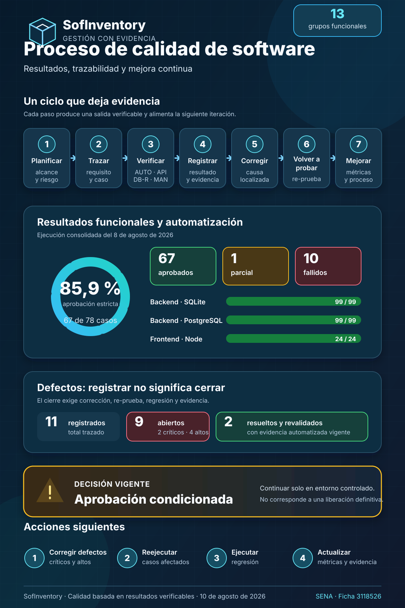

{ width="300" }

# Diligenciamiento de instrumentos para documentar el proceso de calidad de SofInventory

**Resultados, trazabilidad y mejora continua a partir de evidencia verificable**

`Versión v1.0` | `Actualizado: 10 de agosto de 2026`

---

## 1. Portada

| Campo | Información |
|---|---|
| **Título** | Diligenciamiento de instrumentos para documentar el proceso de calidad de SofInventory |
| **Código documental** | `SQA-SOF-EVD-002` |
| **Versión documental** | **v1.0** |
| **Fecha de actualización** | 10 de agosto de 2026 |
| **Autores / aprendices** | Alejandro Sepúlveda Duarte y Lucy Estefany Izquierdo Jaramillo |
| **Instructor evaluador** | José Ignacio Botero Osorio |
| **Centro de formación** | Centro de Comercio Regional Antioquia — SENA |
| **Programa** | Tecnólogo en Análisis y Desarrollo de Software |
| **Ficha** | 3118526 |
| **Evidencia relacionada** | Diseño y diligenciamiento de instrumentos para documentar procesos de calidad del software |
| **Estado** | Instrumentos diligenciados; decisión de calidad condicionada |

## 2. Control del documento

| Versión | Fecha | Responsables | Descripción |
|---|---|---|---|
| **v1.0** | 10/08/2026 | Alejandro Sepúlveda Duarte / Lucy Estefany Izquierdo Jaramillo | Consolidación de los instrumentos diligenciados con resultados, evidencias, defectos, métricas, decisión y acciones de mejora de SofInventory. |

## 3. Convenciones

| Convención | Significado en este documento |
|---|---|
| **Aprobado** | El resultado esperado fue demostrado con una ejecución o combinación trazable de evidencias. |
| **Parcial** | Una parte del objetivo fue demostrada y otra quedó bloqueada o pendiente. |
| **Falló** | El comportamiento observado no coincide con el esperado. |
| **Abierto** | El defecto está reproducido, pero todavía no cuenta con corrección revalidada. |
| **Resuelto y revalidado** | Existe corrección y evidencia de re-prueba; no basta con cambiar el código. |
| `AUTO` | Ejecución automatizada reproducible. |
| `API` | Solicitud y respuesta sanitizadas. |
| `DB-R` | Aserción o consulta de persistencia de solo lectura. |
| `MAN` | Verificación manual con pasos y resultado. |
| `CAPTURA` | Evidencia visual real, sanitizada y vinculada a un comportamiento visible. |
| `N/D` | No disponible en una fuente histórica confiable; el valor no se inventa. |

## 4. Resumen

En este documento presentamos cómo diligenciamos los instrumentos de calidad diseñados previamente y cómo utilizamos los resultados obtenidos para valorar el estado de SofInventory. Partimos del plan de pruebas, la matriz de trazabilidad, los casos, los registros de ejecución y los defectos existentes; posteriormente, comprobamos que cada cifra contara con una fuente identificable y que cada tipo de evidencia se utilizara de acuerdo con su verdadero alcance.

El consolidado contiene **78 casos funcionales**: 67 aprobados, uno parcial y 10 fallidos. La aprobación estricta es de **85,9 %**. De forma complementaria, las 99 pruebas backend aprobaron tanto en SQLite como en PostgreSQL, las 24 pruebas Node del frontend aprobaron y el build Angular finalizó correctamente con dos advertencias de presupuesto. Estos resultados automatizados son favorables, pero no reemplazan la ejecución funcional ni eliminan los defectos encontrados en integración y uso real.

Registramos **11 defectos**: nueve siguen abiertos y dos fueron resueltos y revalidados. Entre los pendientes existen dos de severidad crítica y cuatro de severidad alta. Por esta razón, nuestra decisión sigue siendo una **aprobación condicionada** para continuar en un entorno controlado. No recomendamos una liberación definitiva hasta corregir los hallazgos críticos y altos, reejecutar los casos afectados y completar la regresión.

## 5. Introducción

Al diligenciar los instrumentos dejamos de trabajar con formatos generales y empezamos a comparar de manera ordenada lo que esperábamos de SofInventory con lo que realmente observamos. Esta diferencia fue importante: una suite completa podía terminar en verde y, aun así, una operación integrada podía aceptar un producto inactivo, una pantalla podía mostrar un error técnico o una eliminación relacionada podía responder con un error no controlado.

Para evitar conclusiones apresuradas, separamos los tipos de evidencia. Las pruebas automatizadas comprobaron comportamientos repetibles; las solicitudes API mostraron contratos HTTP; las verificaciones de persistencia demostraron stock, sesiones y atomicidad; la revisión manual permitió evaluar foco, mensajes y navegación; y las capturas respaldaron únicamente estados visibles. La decisión final se tomó a partir del conjunto, no de una sola fuente.

Esta actividad también nos permitió reconocer los límites de la información disponible. Aunque durante la formación elaboramos documentos de planificación, entregables y presupuesto, no contamos con una bitácora histórica uniforme que registre las horas efectivas por fase, las interrupciones, los costos reales ejecutados y la productividad. Por ello, esas mediciones permanecen como `N/D`. Preferimos dejar un dato pendiente y preparar el formato para el siguiente ciclo antes que presentar una precisión que no podemos demostrar.

## 6. Objetivos

### 6.1 Objetivo general

Diligenciar los instrumentos del proceso de calidad de SofInventory con información real, trazable y verificable para analizar resultados, registrar defectos, calcular métricas, tomar una decisión de calidad y definir acciones de mejora.

### 6.2 Objetivos específicos

- Registrar el alcance, los entornos, los responsables y los criterios aplicados en la ejecución.
- Relacionar los 13 grupos funcionales con sus riesgos, casos, tipos de verificación, evidencias y defectos.
- Documentar casos representativos aprobados, fallidos, de seguridad, integración, experiencia de usuario e inventario.
- Diferenciar las suites automatizadas de las comprobaciones API, `DB-R`, manuales y visuales.
- Conservar el estado verificable de los defectos y sus criterios de cierre.
- Calcular métricas sin inventar tiempos, costos, esfuerzo ni cobertura automatizada no medida.
- Utilizar los resultados para establecer una puerta de calidad y una ruta priorizada de mejora.

## 7. Procedencia de los instrumentos

Los instrumentos diligenciados en este documento fueron definidos previamente en [Aplicación de buenas prácticas de calidad de software](Aplicacion_buenas_practicas_calidad_SofInventory.md). Allí se establecieron sus fundamentos, propósito, estructura, campos y criterios de utilización.

A partir de ese diseño, en el presente informe registramos la información obtenida durante el proceso de calidad de SofInventory. Esto incluye el alcance de las pruebas, la trazabilidad por módulo, los resultados de ejecución, los defectos identificados, las métricas calculadas, la decisión de calidad y las acciones de mejora.

De esta manera, conservamos la relación entre el diseño de los instrumentos y su diligenciamiento, pero evitamos repetir el contenido teórico ya documentado.

## 8. Método de diligenciamiento

### 8.1 Referentes aplicados

### 8.1 Referentes aplicados

Para diligenciar los instrumentos tomamos como base el componente formativo “Fundamentos de calidad de software” del SENA y lo complementamos con referentes reconocidos de documentación de pruebas, evaluación de calidad, seguimiento y trabajo en equipo. Los referentes seleccionados fueron ISO/IEC/IEEE 29119-3:2021, ISO/IEC 25010, CMMI, PSP, TSP y el trabajo iterativo.

La siguiente tabla muestra las prácticas concretas seleccionadas, su aplicación en SofInventory y los instrumentos en los que quedaron registradas.

### 8.2 Buenas prácticas seleccionadas y aplicadas

| Referente o marco | Buena práctica seleccionada | Aplicación en SofInventory | Instrumento relacionado |
|---|---|---|---|
| Componente formativo del SENA | Diseñar, diligenciar y analizar instrumentos de calidad. | Organizamos los resultados mediante planes, matrices, casos, registros y métricas. | Todos los instrumentos. |
| ISO/IEC/IEEE 29119-3:2021 | Documentar la planificación, ejecución e incidentes de prueba. | Registramos alcance, condiciones, casos, resultados, evidencias y defectos. | Plan de pruebas, casos, ejecución y defectos. |
| ISO/IEC 25010 | Evaluar distintas características de calidad. | Analizamos funcionalidad, fiabilidad, seguridad, usabilidad y mantenibilidad. | Matriz de trazabilidad y análisis consolidado. |
| CMMI | Realizar seguimiento, medición y mejora del proceso. | Calculamos métricas, aplicamos una puerta de calidad y definimos acciones de mejora. | Métricas, decisión y acciones de mejora. |
| PSP | Registrar defectos, resultados y aprendizajes sin inventar información histórica. | Conservamos como `N/D` los tiempos y costos reales no medidos y preparamos el formato para el siguiente ciclo. | Registro PSP. |
| TSP | Distribuir responsabilidades y revisar el trabajo del equipo. | Organizamos las funciones de planeación, backend, frontend, calidad y evidencia. | Registro TSP. |
| Trabajo iterativo | Corregir, volver a probar y actualizar la documentación. | Cada defecto requiere corrección, re-prueba, regresión y actualización de métricas. | Defectos, puerta de calidad y acciones de mejora. |

### 8.3 Fuentes y jerarquía de evidencia

Aplicamos el siguiente orden para diligenciar los instrumentos:

1. Revisamos el resultado individual de los 78 casos.
2. Contrastamos los totales con la matriz consolidada.
3. Verificamos la salida registrada de las suites y del build.
4. Relacionamos los resultados fallidos con el registro de defectos.
5. Confirmamos en el código la existencia de 99 métodos backend y 24 pruebas frontend.
6. Comprobamos versiones, comandos y presupuestos en los archivos de configuración.
7. Revisamos los índices de evidencias para no atribuir a una captura un alcance que no posee.

### 8.4 Reglas utilizadas

- Un método existente no se marca como aprobado sin salida de ejecución.
- Una suite verde no convierte automáticamente en aprobados los 78 casos funcionales.
- Una captura demuestra presentación o estado visible, no permisos, atomicidad o concurrencia.
- Los códigos inesperados se registran como resultados fallidos aunque la operación ficticia haya sido revertida.
- Un defecto solo se cierra con corrección, re-prueba, regresión y actualización documental.
- Los datos no medidos permanecen como `N/D`.
- Toda evidencia debe usar datos ficticios y omitir secretos o información personal.

## 9. Infografía del proceso de calidad

*La infografía resume el ciclo planificar–trazar–verificar–registrar–corregir–volver a probar–mejorar, presenta las métricas comprobadas, diferencia defectos abiertos de defectos revalidados y comunica la aprobación condicionada junto con las siguientes acciones.*

## 10. Instrumentos diligenciados

### 10.1 Instrumento 1 — Plan de pruebas diligenciado

#### Identificación y propósito

| Campo | Diligenciamiento |
|---|---|
| **Identificador** | `QA-PLAN-SOF-001` |
| **Versión del instrumento** | 1.0 |
| **Ejecución integral de referencia** | 8 de agosto de 2026 |
| **Objetivo** | Evaluar las funciones críticas, la integridad, la seguridad y la experiencia de uso de SofInventory antes de recomendar una liberación. |
| **Alcance** | 13 grupos funcionales y 78 casos: Usuarios, Login, Categorías, Productos, Proveedores, Clientes, Almacenes, Inventario, Compras, Ventas, Empresa, Dashboard y frontend compartido. |
| **Estado final** | Ejecutado; criterios de salida no cumplidos; aprobación condicionada. |

#### Alcance y exclusiones

| Incluido | Excluido o no medido |
|---|---|
| Flujos positivos, negativos, permisos, seguridad, integración, persistencia, interfaz y regresión disponible. | Pruebas exhaustivas de carga, estrés, recuperación ante desastre y pentesting formal. |
| SQLite para retroalimentación rápida y PostgreSQL para integración, restricciones y concurrencia. | Certificación completa en todas las combinaciones de navegador, sistema operativo y dispositivo. |
| Build Angular, temas, responsive, mensajes, validaciones y ayuda contextual. | Uso de datos productivos o modificación de una base operativa. |
| Compras, ventas, inventario, anulaciones, sesiones, archivos y registros históricos. | Horas efectivas por fase, costos reales ejecutados, productividad y esfuerzo individual no registrados mediante una bitácora histórica uniforme. |

#### Responsables

| Responsabilidad | Asignación documentada |
|---|---|
| Planeación, trazabilidad y consolidación | Equipo aprendiz SofInventory: Alejandro Sepúlveda Duarte y Lucy Estefany Izquierdo Jaramillo. |
| Preparación y ejecución técnica | Equipo de desarrollo de SofInventory, sobre entornos aislados y datos ficticios. |
| Registro, sanitización y custodia de evidencias | Equipo aprendiz SofInventory. |
| Priorización técnica de defectos | Equipo de desarrollo, según severidad y riesgo. |
| Evaluación académica | José Ignacio Botero Osorio, instructor evaluador. |

La documentación disponible no permite atribuir horas o ejecuciones individuales con precisión; por eso la responsabilidad se registra por función y no como una bitácora personal retroactiva.

#### Tipos y prioridades

| Tipo | Propósito | Prioridad aplicada |
|---|---|:---:|
| Smoke | Confirmar disponibilidad de Login, Dashboard y rutas principales. | P0 |
| Funcional | Verificar reglas y resultados de cada módulo. | P0/P1 |
| Integración | Comprobar frontend–API–Django–PostgreSQL y relaciones entre módulos. | P0 |
| Seguridad y permisos | Validar sesión, roles, bloqueo, archivos y ausencia de suplantación. | P0 |
| Persistencia | Verificar stock, movimientos, sesiones, auditoría y rollback. | P0 |
| Regresión | Confirmar que una corrección no afecte comportamientos aprobados. | P0/P1 |
| Usabilidad y accesibilidad | Revisar mensajes, foco, teclado, temas, ayuda y responsive. | P1 |
| Rendimiento básico | Vigilar consultas y presupuestos de compilación disponibles. | P2 |

#### Entornos y datos

| Capa | Entorno utilizado |
|---|---|
| Backend rápido | Python 3.12.13, Django 6.0.4, DRF 3.17.1 y SQLite en memoria. |
| Integración backend | Python 3.12.13 y PostgreSQL 15.18 en contenedores aislados. |
| Frontend | Node.js 20.20.2 para la suite Node; Angular 19.2.21 y TypeScript 5.6.3 para el build. |
| Interfaz servida | Nginx 1.31.3 sobre Alpine 3.24.1. |
| Zona horaria | `America/Bogota`. |
| Datos | Usuarios, terceros, productos, facturas, operaciones y archivos exclusivamente ficticios. |

#### Criterios operativos

| Criterio | Definición | Resultado del ciclo |
|---|---|---|
| **Entrada** | Versión desplegable, alcance, datos ficticios, ambiente aislado y casos disponibles. | **Cumplido.** Se contó con los elementos necesarios para iniciar la ejecución. |
| **Suspensión** | Ambiente inestable, pérdida de datos, más del 20 % de casos bloqueados o un defecto crítico que invalide el resto de la ejecución. | **No fue necesario suspender la ejecución completa.** La primera preparación incorrecta del build se descartó y la compilación se repitió correctamente en un entorno Linux limpio. |
| **Reanudación** | Corregir el ambiente, ejecutar pruebas de humo, restaurar los datos temporales y registrar la decisión. | **Aplicado únicamente al proceso de compilación.** Después de corregir la preparación del entorno, la ejecución válida del build fue aprobada. |
| **Salida** | Ejecutar el 100 % de los casos críticos, alcanzar una aprobación mínima del 95 %, no tener defectos críticos ni altos abiertos y aprobar la regresión. | **Criterio de salida no alcanzado.** Se ejecutaron todos los casos y se obtuvo una aprobación del **85,9 %**, pero la meta establecida era de al menos **95 %**. Además, permanecen abiertos dos defectos críticos y cuatro de severidad alta, y la regresión completa depende de sus correcciones. |

#### Entregables y cierre

- Matriz consolidada y documentos de 13 grupos funcionales.
- Registro de ejecución con ambientes, comandos y resultados.
- Evidencias `AUTO`, `API`, `DB-R`, `MAN` y `CAPTURA`.
- Registro de 11 defectos con criterios de cierre.
- Métricas, puerta de calidad, decisión y acciones de mejora.
- Infografía vectorial del proceso.

**Estado final del plan:** completado como actividad de evaluación, pero con **salida de liberación no aprobada**.

### 10.2 Instrumento 2 — Matriz de trazabilidad diligenciada

El consolidado evita repetir los 78 casos. La relación individual se consulta en la [matriz completa](test-cases/MATRIZ_COBERTURA.md) y en los [resultados por caso](test-cases/RESULTADOS_EJECUCION_2026-08-08.md).

| Área / requisito | Riesgo principal | Casos | Tipo de verificación | Automatización existente | Evidencia principal | Defecto | Estado |
|---|---|---|---|---|---|---|---|
| Usuarios | Escalación, identidad inválida o búsqueda inoperante | `TC-USR-001`–`008` | AUTO, API, DB-R, MAN, CAPTURA | Backend + Node parcial | [Casos](test-cases/01-modulo-usuarios/casos-usuarios.md) | `BUG-USR-003` | 7 aprobados / 1 fallido |
| Login | Acceso indebido o expiración sin recuperación | `TC-LOGIN-001`–`007` | AUTO, API, DB-R, MAN, CAPTURA | Backend; frontend de sesión pendiente | [Casos](test-cases/02-modulo-login/casos-login.md) | `BUG-LOGIN-001` | 6 aprobados / 1 fallido |
| Categorías | Duplicados o eliminación inconsistente | `TC-CAT-001`–`004` | AUTO, API, DB-R, MAN, CAPTURA | Serializer + integración E2E | [Casos](test-cases/03-modulo-categorias/casos-categorias.md) | — | 4 aprobados |
| Productos | Alta bloqueada, datos inválidos o imagen insegura | `TC-PRD-001`–`006` | AUTO, API, DB-R, MAN, CAPTURA | Backend parcial + E2E | [Casos](test-cases/04-modulo-productos/casos-productos.md) | `BUG-PRD-001` | 4 aprobados / 1 parcial / 1 fallido |
| Proveedores | Ubicación inválida o error al eliminar relaciones | `TC-PRV-001`–`005` | AUTO, API, DB-R, MAN, CAPTURA | Backend + Node parcial | [Casos](test-cases/05-modulo-proveedores/casos-proveedores.md) | `BUG-PRV-001` | 4 aprobados / 1 fallido |
| Clientes | Documento, ubicación o dependencia histórica | `TC-CLI-001`–`006` | AUTO, API, DB-R, MAN, CAPTURA | Backend + Node parcial | [Casos](test-cases/06-modulo-clientes/casos-clientes.md) | `BUG-CLI-001` | 5 aprobados / 1 fallido |
| Almacenes | Pérdida de stock o eliminación indebida | `TC-ALM-001`–`005` | AUTO, API, DB-R, MAN, CAPTURA | Backend parcial + E2E | [Casos](test-cases/07-modulo-almacenes/casos-almacenes.md) | — | 5 aprobados |
| Inventario | Stock negativo, doble efecto o carrera | `TC-INV-001`–`007` | AUTO-PG, API, DB-R, MAN, CAPTURA | Backend + concurrencia PostgreSQL | [Casos](test-cases/08-modulo-inventario/casos-inventario.md) | — | 7 aprobados |
| Compras | Estado parcial, stock incorrecto o anulación doble | `TC-COM-001`–`006` | AUTO-PG, API, DB-R, MAN, CAPTURA | Backend parcial + E2E | [Casos](test-cases/09-modulo-compras/casos-compras.md) | `BUG-COM-001` | 5 aprobados / 1 fallido |
| Ventas | Sobreventa, pago inválido o histórico incoherente | `TC-VTA-001`–`007` | AUTO-PG, API, DB-R, MAN, CAPTURA | Backend + E2E | [Casos](test-cases/10-modulo-ventas/casos-ventas.md) | `BUG-VTA-001` | 6 aprobados / 1 fallido |
| Empresa | Múltiples configuraciones, identidad o archivo inseguro | `TC-EMP-001`–`005` | AUTO, API, DB-R, MAN, CAPTURA | Backend + E2E | [Casos](test-cases/11-modulo-empresa/casos-empresa.md) | `BUG-EMP-001` | 4 aprobados / 1 fallido |
| Dashboard | Indicadores incorrectos o error técnico visible | `TC-DSH-001`–`005` | AUTO, API, MAN, CAPTURA | Backend + revisión E2E | [Casos](test-cases/12-modulo-dashboard/casos-dashboard.md) | `BUG-DSH-001` | 4 aprobados / 1 fallido |
| Frontend compartido | Pérdida de datos, foco, tema o sesión inconsistente | `TC-FE-001`–`007` | AUTO-FE, MAN, CAPTURA, API | 24 pruebas Node; DOM Angular pendiente | [Casos](test-cases/13-frontend-compartido/casos-frontend-compartido.md) | `BUG-LOGIN-001`, `BUG-DSH-001` | 6 aprobados / 1 fallido |

### 10.3 Instrumento 3 — Casos de prueba diligenciados

#### Caso aprobado — `TC-CAT-002`: rechazo de categoría duplicada

| Campo | Diligenciamiento |
|---|---|
| **Objetivo** | Confirmar que la unicidad de la categoría ignore mayúsculas y espacios innecesarios. |
| **Prioridad** | Alta. |
| **Precondiciones** | Categoría `Herramientas` existente; sesión de Administrador o Supervisor; ambiente aislado. |
| **Datos ficticios** | Intento de alta con `  herramientas  `. |
| **Procedimiento resumido** | Enviar el alta equivalente, observar la respuesta y comprobar que no exista una segunda categoría. |
| **Resultado esperado** | HTTP 400 por `nombre`; no crear duplicado. |
| **Resultado real** | HTTP 400; la equivalencia por mayúsculas/espacios fue rechazada. |
| **Estado** | **Aprobado**. |
| **Evidencia** | `AUTO` + `API` + [captura del rechazo](test-cases/03-modulo-categorias/evidencias/frontend/CAT-duplicado-e2e.png). |
| **Defecto relacionado** | Ninguno. |
| **Criterio de cierre** | Mantener la variante en la regresión y conservar el mensaje por campo. |

#### Caso fallido — `TC-PRD-001`: alta de producto

| Campo | Diligenciamiento |
|---|---|
| **Objetivo** | Crear un producto válido, con imagen opcional, sin pasar campos auxiliares al modelo. |
| **Prioridad** | P0 — crítica. |
| **Precondiciones** | Categoría activa; sesión de Administrador o Supervisor. |
| **Datos ficticios** | `Taladro 20V`, marca `Marca Demo`, referencia `TAL-20V-A`, precios e IVA válidos. |
| **Procedimiento resumido** | Completar el formulario, enviar el alta y verificar respuesta, persistencia y stock inicial. |
| **Resultado esperado** | HTTP 201; producto visible, stock inicial cero e imagen segura cuando aplica. |
| **Resultado real** | HTTP 500; `quitar_imagen` llegó a `Producto.objects.create`. |
| **Estado** | **Falló**. |
| **Evidencia** | `API` + [captura E2E](test-cases/04-modulo-productos/evidencias/frontend/PRD-alta-error-e2e.png). |
| **Defecto relacionado** | `BUG-PRD-001`. |
| **Criterio de cierre** | Retirar el dato auxiliar en la ruta efectiva de creación; agregar regresión y aprobar alta con/sin imagen en API e interfaz. |

#### Caso de seguridad y permisos — `TC-USR-005`: impedir escalación de rol

| Campo | Diligenciamiento |
|---|---|
| **Objetivo** | Comprobar que un Vendedor no pueda ejecutar acciones administrativas declarando otro rol en el payload. |
| **Prioridad** | P0 — crítica. |
| **Precondiciones** | Sesiones ficticias de Administrador y Vendedor; endpoint administrativo disponible. |
| **Datos ficticios** | Solicitud del Vendedor con un valor de rol solicitante equivalente a Administrador. |
| **Procedimiento resumido** | Ejecutar la operación con ambos roles y verificar respuesta y ausencia de cambios no autorizados. |
| **Resultado esperado** | Vendedor recibe 403; Administrador cumple el contrato; la decisión se toma con `request.user`. |
| **Resultado real** | El Vendedor recibió 403 y no logró escalar privilegios. |
| **Estado** | **Aprobado** para la combinación Administrador/Vendedor. |
| **Evidencia** | `AUTO` backend + `API` sanitizada. |
| **Defecto relacionado** | Ninguno. |
| **Criterio de cierre** | Mantener la prueba y ampliar la matriz automatizada a Supervisor y Bodega por endpoint. |

#### Caso de integración — `TC-COM-001`: compra y entrada de stock

| Campo | Diligenciamiento |
|---|---|
| **Objetivo** | Verificar que una compra válida persista cabecera y detalles, calcule totales y aumente el stock una sola vez. |
| **Prioridad** | P0 — crítica. |
| **Precondiciones** | Proveedor, almacén y productos activos; sesión autorizada; PostgreSQL aislado. |
| **Datos ficticios** | Factura `900001`, líneas controladas, total esperado de 238.000 y entrada total de 20 unidades. |
| **Procedimiento resumido** | Registrar la compra, consultar el detalle, el stock y el movimiento, y contrastar el responsable y los datos históricos almacenados. |
| **Resultado esperado** | HTTP 201; total correcto; 20 unidades en el almacén; movimiento y responsable trazables. |
| **Resultado real** | Compra registrada; total 238.000; stock incrementado en 20 unidades y detalle histórico coherente. |
| **Estado** | **Aprobado**. |
| **Evidencia** | `AUTO-PG` + `API` + `DB-R` + [detalle visual](test-cases/09-modulo-compras/evidencias/frontend/COM-detalle-e2e.png). |
| **Defecto relacionado** | Ninguno para este caso positivo; `BUG-COM-001` corresponde a producto inactivo en `TC-COM-004`. |
| **Criterio de cierre** | Conservar el flujo en regresión y agregar la variante Crédito en automatización de interfaz. |

#### Caso de experiencia de usuario — `TC-FE-003`: ayuda, Escape y foco

| Campo | Diligenciamiento |
|---|---|
| **Objetivo** | Comprobar que `Esc` cierre únicamente la ayuda, conserve el formulario y devuelva el foco al disparador. |
| **Prioridad** | Crítica para accesibilidad del modal. |
| **Precondiciones** | Formulario abierto con ayuda contextual visible y un valor ficticio parcial. |
| **Datos ficticios** | Texto no sensible escrito en un campo antes de abrir la ayuda. |
| **Procedimiento resumido** | Abrir ayuda, presionar `Esc`, revisar modal, dato y elemento enfocado. |
| **Resultado esperado** | Ayuda cerrada; formulario abierto; dato intacto; foco en el botón Ayuda. |
| **Resultado real** | La verificación manual cumplió los cuatro puntos; la prueba Node confirmó el contrato fuente. |
| **Estado** | **Aprobado**, con automatización DOM Angular todavía pendiente. |
| **Evidencia** | `AUTO-FE` parcial + `MAN` + [ayuda de edición móvil](test-cases/01-modulo-usuarios/evidencias/frontend/USR-formulario-ayuda-editar-movil.png). |
| **Defecto relacionado** | Ninguno. |
| **Criterio de cierre** | Agregar una prueba de componente con DOM real sin retirar la verificación manual de teclado. |

#### Caso de inventario y concurrencia — `TC-INV-007`: stock no negativo

| Campo | Diligenciamiento |
|---|---|
| **Objetivo** | Confirmar que dos salidas simultáneas no produzcan stock negativo ni doble efecto. |
| **Prioridad** | P0 — integridad crítica. |
| **Precondiciones** | Producto activo con cinco unidades; dos operaciones autorizadas; PostgreSQL 15 aislado. |
| **Datos ficticios** | Dos solicitudes concurrentes de salida por cuatro unidades. |
| **Procedimiento resumido** | Lanzar ambas transacciones, recoger resultados y consultar el stock final. |
| **Resultado esperado** | Una salida aprobada, una rechazada y stock final de una unidad. |
| **Resultado real** | Se obtuvo un resultado `OK`, un `InventarioError` y stock final igual a uno. |
| **Estado** | **Aprobado**. |
| **Evidencia** | `AUTO-PG` + concurrencia PostgreSQL + `DB-R`. |
| **Defecto relacionado** | Ninguno. |
| **Criterio de cierre** | Mantener la ejecución obligatoria en PostgreSQL; SQLite no sustituye esta comprobación. |

### 10.4 Instrumento 4 — Registro de ejecución diligenciado

| Fecha | Entorno | Herramienta o comando | Alcance | Esperado | Obtenido | Evidencia | Observaciones |
|---|---|---|---|---|---|---|---|
| 08/08/2026 | Matriz transversal | Ejecución por módulos con `AUTO`, `API`, `DB-R`, `MAN` y `CAPTURA` | 78 casos funcionales | Registrar resultado de cada caso | 67 aprobados, 1 parcial, 10 fallidos | [Resultados completos](test-cases/RESULTADOS_EJECUCION_2026-08-08.md) | Aprobación estricta 85,9 %. |
| 08/08/2026 | Backend + SQLite en memoria | `python manage.py test --settings=config.test_settings --verbosity 2` | Suite rápida | 99 pruebas sin fallos | **99/99**, 3,977 s | [Manifiesto](test-cases/evidencias-ejecucion/README.md) | Base temporal destruida; no prueba concurrencia PostgreSQL. |
| 08/08/2026 | Backend + PostgreSQL 15 aislado | `python manage.py test` con configuración PostgreSQL de prueba | Integración de backend | 99 pruebas sin fallos | **99/99**, 69,668 s | [Manifiesto](test-cases/evidencias-ejecucion/README.md) | Base de prueba destruida. |
| 08/08/2026 | Node.js 20.20.2 | `npm test` | Validadores, ubicación y ayuda | 24 pruebas sin fallos | **24/24** | [Frontend compartido](test-cases/13-frontend-compartido/casos-frontend-compartido.md) | Son pruebas Node de funciones/contratos, no DOM Angular completo. |
| 08/08/2026 | Node 20 Linux limpio | `npm ci` y `npm run build` | Build Angular de producción | Compilación exitosa | **Aprobado** | [Resultados](test-cases/RESULTADOS_EJECUCION_2026-08-08.md#3-ejecuciones-automatizadas) | Advertencias: bundle +7,02 kB y CSS Dashboard +3,05 kB. |
| 08/08/2026 | API E2E aislada | Cliente HTTP y endpoints reales | Contratos, permisos y validaciones | Códigos esperados sin trazas | Resultados mixtos; detectó códigos 201/500 inesperados | [Salida sanitizada](test-cases/evidencias-ejecucion/README.md#salidas-sanitizadas-de-integracion-e2e) | Originó defectos de Productos, terceros, Compras, Ventas y Empresa. |
| 08/08/2026 | PostgreSQL 15 aislado | Aserciones y consultas `DB-R` | Stock, rollback, sesiones y auditoría | Persistencia coherente | Stock final 20 en escenario principal; concurrencia final 1; una sesión activa; reversiones exactas | [Manifiesto](test-cases/evidencias-ejecucion/README.md) | No se capturaron tokens ni datos personales. |
| 08/08/2026 | Interfaz Docker, escritorio/móvil | Recorridos `MAN` | Temas, ayuda, foco, búsqueda, sesión y errores | Interacción comprensible | Resultado mixto: varios flujos aprobados; búsqueda, expiración y error técnico pendientes | [Casos frontend](test-cases/13-frontend-compartido/casos-frontend-compartido.md) | No se contabiliza como suite automatizada. |
| 08/08/2026 | Interfaz servida | Evidencias `CAPTURA` | Estados visibles por módulo | Capturas legibles y sanitizadas | Evidencias vigentes en los módulos 01–13 | [Índice transversal](test-cases/13-frontend-compartido/evidencias/frontend/README.md) | Las capturas no prueban permisos, atomicidad ni cálculos por sí solas. |

### 10.5 Instrumento 5 — Registro de defectos diligenciado

#### Defectos abiertos

| ID | Módulo | Descripción resumida | Severidad | Caso | Estado | Criterio de cierre | Evidencia |
|---|---|---|---|---|---|---|---|
| `BUG-PRD-001` | Productos | Alta devuelve 500 por el campo auxiliar `quitar_imagen`. | Crítica | `TC-PRD-001` | Abierto | Alta 201 con/sin imagen y regresión API/UI. | [Captura](test-cases/04-modulo-productos/evidencias/frontend/PRD-alta-error-e2e.png) + API |
| `BUG-COM-001` | Compras | Acepta producto inactivo e incrementa stock. | Crítica | `TC-COM-004` | Abierto | Rechazo antes de cabecera, detalle o movimiento; regresión PG. | API + `DB-R` |
| `BUG-PRV-001` | Proveedores | Eliminar proveedor con compras devuelve 500. | Alta | `TC-PRV-005` | Abierto | Respuesta 400/409 en español; relaciones intactas. | API + `DB-R` |
| `BUG-CLI-001` | Clientes | Eliminar cliente con ventas devuelve 500. | Alta | `TC-CLI-006` | Abierto | Respuesta 400/409 en español; relaciones intactas. | API + `DB-R` |
| `BUG-VTA-001` | Ventas | Débito puede aceptarse sin datos condicionales. | Alta | `TC-VTA-004` | Abierto | Validación por método en API y formulario; regresión de pagos. | API + reversión `DB-R` |
| `BUG-EMP-001` | Empresa | NIT y teléfono semánticamente inválidos son aceptados. | Alta | `TC-EMP-003` | Abierto | Errores por campo en frontend/backend y conservación de datos. | API con restauración |
| `BUG-LOGIN-001` | Login | Sesión expirada devuelve 403 y el interceptor solo gestiona 401. | Media | `TC-LOGIN-007`, `TC-FE-007` | Abierto | Contrato unificado, limpieza, mensaje y redirección E2E. | API + `DB-R` + MAN |
| `BUG-USR-003` | Usuarios | El buscador no actualiza la tabla. | Media | `TC-USR-008` | Abierto | Filtrado reactivo por usuario, nombre y correo con prueba. | MAN + inspección de código |
| `BUG-DSH-001` | Dashboard | Un 502 muestra texto HTTP técnico. | Media | `TC-DSH-005`, `TC-FE-007` | Abierto | Mensaje seguro, reintento y detalle reservado a logs. | MAN |

#### Defectos resueltos y revalidados

| ID | Módulo | Corrección comprobada | Estado | Evidencia de cierre |
|---|---|---|---|---|
| `BUG-USR-001` | Usuarios | Documento validado según tipo y coherente en frontend/backend. | Resuelto y revalidado | Validadores frontend 7/7 y suite backend de Usuarios 26/26. |
| `BUG-USR-002` | Usuarios | Política de contraseña, confirmación, hash y rechazo de reutilización. | Resuelto y revalidado | Seis pruebas de `ValidacionFortalezaContrasenaTests` aprobadas. |

El detalle de causa, impacto y reproducción se conserva en el [registro maestro de defectos](test-cases/DEFECTOS.md). Ninguno de los nueve abiertos se presenta como cerrado.

### 10.6 Instrumento 6 — Registro PSP y TSP diligenciado

#### Línea base PSP comprobable

| Medida | Valor diligenciado | Interpretación |
|---|---:|---|
| Tamaño funcional | 78 casos | Escenarios mínimos consolidados, no líneas de código. |
| Casos aprobados / parciales / fallidos | 67 / 1 / 10 | Resultado funcional trazable. |
| Pruebas backend distintas | 99 | Métodos localizados en el repositorio. |
| Ejecuciones backend | 99 SQLite + 99 PostgreSQL | Los mismos 99 métodos se ejecutaron en dos motores; no se presentan como 198 pruebas distintas. |
| Pruebas frontend | 24 | Siete semánticas, ocho de ubicación y nueve de ayuda. |
| Build Angular | 1 aprobado | Con dos advertencias de presupuesto. |
| Defectos registrados | 11 | Nueve abiertos y dos resueltos/revalidados. |
| Aprobación estricta | 85,9 % | 67 aprobados sobre 78 ejecutados. |
| Tiempo por fase | `N/D` | No existe bitácora histórica confiable. |
| Costos reales ejecutados | `N/D` | Los presupuestos académicos o planificados no permiten demostrar el costo real ejecutado. |
| Esfuerzo individual | `N/D` | No se reconstruye de manera retroactiva. |
| Productividad | `N/D` | No puede calcularse sin tamaño y tiempo homogéneos. |

El formato de tiempo queda preparado para el siguiente ciclo con los campos: fecha, inicio, fin, interrupción, fase, actividad, tiempo neto y observación. Su diligenciamiento debe comenzar al iniciar la corrección, no después de terminarla.

#### Distribución TSP por función

| Función de equipo | Responsabilidad en el ciclo | Salida verificable |
|---|---|---|
| Planeación y seguimiento | Definir alcance, prioridad, entrada, salida y suspensión. | Plan diligenciado. |
| Desarrollo backend | Ejecutar y mantener suites, reglas API, transacciones y persistencia. | Resultados SQLite/PostgreSQL y correcciones futuras. |
| Desarrollo frontend | Ejecutar pruebas Node, build y verificaciones de interfaz. | Resultado frontend, build y evidencias visuales. |
| Calidad y documentación | Relacionar caso, evidencia, defecto, métrica y decisión. | Matriz, registros y este informe. |
| Seguridad de evidencia | Sanitizar datos y evitar secretos o información personal. | Manifiesto y capturas seguras. |
| Revisión académica | Evaluar coherencia, presentación y cumplimiento de la evidencia. | Retroalimentación del instructor. |

#### Retrospectiva del equipo

| Aspecto | Aprendizaje obtenido | Acción preventiva |
|---|---|---|
| Suites en dos motores | SQLite ayuda a iterar, pero PostgreSQL es necesario para constraints y concurrencia. | Mantener ambos pasos en la puerta. |
| Automatización verde | Una suite aprobada no cubre todos los contratos ni recorridos de interfaz. | Vincular automatización y pruebas E2E por riesgo. |
| Evidencia visual | Es útil para presentación, pero insuficiente para stock, permisos o atomicidad. | Elegir `AUTO`, `API` o `DB-R` según la afirmación. |
| Defectos reproducidos | Revertir un dato ficticio evita residuos, pero no resuelve el defecto. | Mantener el estado abierto hasta re-prueba y regresión. |
| Frontend compartido | Las pruebas Node detectan contratos, no sustituyen un DOM Angular real. | Incorporar pruebas de componentes e interacción. |
| Medición personal | Sin registro contemporáneo no podemos calcular esfuerzo fiable. | Empezar bitácora PSP desde el próximo ciclo. |

### 10.7 Instrumento 7 — Métricas y puerta de calidad

| Métrica | Qué significa | Cálculo | Resultado | Meta | Decisión |
|---|---|---|---:|---:|---|
| Aprobación funcional | Proporción de casos estrictamente aprobados. | 67 / 78 × 100 | **85,9 % alcanzado** | Mínimo 95 % | La meta no fue alcanzada; faltaron 9,1 puntos porcentuales. |
| Casos aprobados | Funcionalidades demostradas sin condición pendiente. | Conteo | **67** | Al menos 75 si el alcance sigue en 78 | Requiere re-pruebas. |
| Casos parciales | Objetivos solo parcialmente demostrados. | 1 / 78 × 100 | **1,3 %** | 0 % | No cumple. |
| Casos fallidos | Diferencias entre esperado y observado. | 10 / 78 × 100 | **12,8 %** | 0 críticos/altos | No cumple. |
| Cobertura consolidada | Casos del alcance con resultado trazable. | 78 / 78 × 100 | **100 %** | 100 % | Cumple documentalmente. |
| Cierre de defectos | Defectos con corrección y revalidación. | 2 / 11 × 100 | **18,2 %** | 100 % críticos/altos | No cumple. |
| Críticos y altos abiertos | Riesgos que bloquean liberación definitiva. | 2 críticos + 4 altos | **6** | 0 | Bloquea la puerta. |
| Backend SQLite | Éxito de la suite rápida ejecutada. | 99 / 99 × 100 | **100 %** | 100 % | Cumple esta suite. |
| Backend PostgreSQL | Éxito de la integración backend ejecutada. | 99 / 99 × 100 | **100 %** | 100 % | Cumple esta suite. |
| Frontend Node | Éxito de las pruebas frontend ejecutadas. | 24 / 24 × 100 | **100 %** | 100 % | Cumple con límite de alcance estático. |
| Cobertura automatizada de los 78 casos | Proporción funcional con correspondencia automática homogénea. | Requiere inventario uno-a-uno | **N/D** | Creciente | No se inventa; debe medirse en el siguiente ciclo. |
| Presupuesto de build | Diferencia entre tamaño real y límite de advertencia. | Salida del build | **2 advertencias** | 0 | Build aprobado; optimización pendiente. |

#### Puerta de liberación diligenciada

| Condición | Estado | Evidencia |
|---|:---:|---|
| 100 % de los casos críticos ejecutados | Cumplida | Los 78 casos tienen resultado. |
| Aprobación funcional mínima del 95 % | **Meta no alcanzada** | Se obtuvo 85,9 %; faltaron 9,1 puntos porcentuales. |
| Cero defectos críticos o altos abiertos | **No cumplida** | Dos críticos y cuatro altos. |
| Re-pruebas y regresión de correcciones aprobadas | **No cumplida** | Nueve defectos siguen abiertos. |
| Backend SQLite aprobado | Cumplida | 99/99. |
| Backend PostgreSQL aprobado | Cumplida | 99/99. |
| Frontend aprobado | Cumplida con límite | 24/24 Node; DOM Angular pendiente. |
| Build de producción aprobado | Cumplida con advertencias | Dos excesos de presupuesto. |
| Evidencia sanitizada y trazable | Cumplida | Matriz, manifiesto, casos y defectos. |

**Resultado de la puerta:** **no aprobada para liberación definitiva**.

## 11. Análisis consolidado de resultados

### 11.1 Fortalezas observadas

- Los 78 casos cuentan con un resultado y una ruta de evidencia, por lo que la cobertura documental está completa.
- Categorías, Almacenes e Inventario aprobaron sus 16 casos consolidados.
- La ejecución backend fue satisfactoria en SQLite y PostgreSQL; la prueba concurrente confirmó que el stock no quedó negativo.
- Las validaciones semánticas, ubicación compartida y ayuda contextual cuentan con 24 verificaciones Node aprobadas y comprobaciones manuales complementarias.
- Las anulaciones y reversiones demostradas conservaron stock y auditoría en los escenarios válidos.

### 11.2 Hallazgos que limitan la aprobación

- Productos y Compras concentran los dos defectos críticos: el alta de producto puede fallar y una compra puede aceptar un producto inactivo.
- Proveedores y Clientes conservan los registros relacionados, pero responden con 500 en lugar de un rechazo controlado.
- Ventas necesita validar los campos condicionales de cada método de pago.
- Empresa todavía admite valores semánticamente inválidos para NIT y teléfono.
- La expiración de sesión, la búsqueda de Usuarios y el mensaje técnico del Dashboard muestran brechas de integración o experiencia que las suites actuales no detectaron por sí solas.

### 11.3 Lectura correcta de la automatización

Las ejecuciones **99/99**, **99/99** y **24/24** indican que las suites existentes aprobaron en sus entornos. No significan que los 78 casos funcionales estén aprobados ni que la cobertura automática sea 100 %. Los documentos por módulo identifican pruebas directas, parciales y ausentes; además, la suite frontend actual revisa funciones y contratos fuente, pero no ejecuta todos los componentes Angular en un navegador.

La automatización se complementó con:

- `API` para códigos, permisos y reglas expuestas por los endpoints.
- `DB-R` para stock, sesiones, auditoría, rollback e idempotencia.
- `MAN` para foco, teclado, temas, navegación, búsqueda y mensajes.
- `CAPTURA` para estados visibles y presentación responsive.

### 11.4 Aspectos no medidos

No contamos con evidencia suficiente para calcular horas efectivas por fase, costos reales ejecutados, esfuerzo individual, productividad, escape de defectos posproducción ni porcentaje homogéneo de automatización sobre los 78 casos.

## 12. Decisión de calidad

!!! Advertencia "Aprobación condicionada"
    Consideramos que SofInventory puede continuar en un entorno controlado para corrección, demostración y re-prueba. No recomendamos una liberación definitiva mientras existan defectos críticos y altos abiertos o mientras la aprobación funcional permanezca por debajo del 95 %.

La decisión se apoya en cuatro hechos:

1. La cobertura documental es completa, pero la aprobación funcional es 85,9 %.
2. Diez casos fallaron y uno quedó parcial.
3. Permanecen abiertos dos defectos críticos y cuatro altos.
4. Las suites automatizadas aprobaron, pero los recorridos API, persistencia y manuales encontraron brechas adicionales.

Para cambiar esta decisión se deben corregir los defectos priorizados, ejecutar el caso original de cada uno, agregar una prueba de regresión, reejecutar las suites y actualizar la matriz, los defectos y las métricas.

## 13. Acciones de mejora

| Prioridad | Acción | Casos / defectos | Responsable funcional | Criterio de terminado | Evidencia requerida | Estado |
|---|---|---|---|---|---|---|
| P0 | Corregir el alta de Producto. | `TC-PRD-001`, `BUG-PRD-001` | Backend / frontend | HTTP 201 con/sin imagen; stock inicial cero; regresión aprobada. | AUTO + API + MAN | Pendiente |
| P0 | Rechazar Productos inactivos en Compras. | `TC-COM-004`, `BUG-COM-001` | Backend | Rechazo previo a persistencia o movimiento; rollback PG. | AUTO-PG + API + DB-R | Pendiente |
| P1 | Controlar dependencias al eliminar terceros. | `TC-PRV-005`, `TC-CLI-006` | Backend | 400/409 en español; compras/ventas intactas. | AUTO + API + DB-R | Pendiente |
| P1 | Validar datos condicionales de pago. | `TC-VTA-004`, `BUG-VTA-001` | Backend / frontend | Cada método exige solo sus campos aplicables. | AUTO + API + MAN | Pendiente |
| P1 | Fortalecer NIT y teléfono de Empresa. | `TC-EMP-003`, `BUG-EMP-001` | Backend / frontend | Entradas inválidas rechazadas por campo; datos previos conservados. | AUTO + API + MAN | Pendiente |
| P1 | Unificar expiración de sesión. | `TC-LOGIN-007`, `TC-FE-007` | Backend / frontend | Limpieza local, mensaje y redirección para el contrato acordado. | AUTO + API + E2E | Pendiente |
| P2 | Hacer reactiva la búsqueda de Usuarios. | `TC-USR-008`, `BUG-USR-003` | Frontend | Filtrado real por usuario, nombre y correo. | Test de componente + MAN | Pendiente |
| P2 | Sustituir el mensaje técnico del Dashboard. | `TC-DSH-005`, `TC-FE-007` | Frontend | Mensaje seguro, reintento y detalle técnico solo en logs. | E2E + CAPTURA | Pendiente |
| P2 | Incorporar pruebas Angular con DOM real. | `TC-FE-002`–`007` | Frontend / QA | Interacción, foco, red, temas y responsive automatizados. | Suite de componentes/E2E | Pendiente |
| P2 | Reducir advertencias de presupuesto. | Build Angular | Frontend | Bundle y CSS dentro de límites acordados. | Build limpio | Pendiente |
| P2 | Automatizar la puerta de calidad. | Proceso transversal | Equipo | CI bloquea ante suite fallida o defectos P0/P1 no aceptados. | Log de pipeline | Pendiente |

No asignamos fechas de ejecución, costos reales ni horas estimadas a estas acciones porque no existe una planificación específica aprobada para el siguiente ciclo de correcciones. Estos valores deberán definirse antes de iniciar dicho ciclo y registrarse posteriormente en la bitácora.

## 14. Conclusiones

- Diligenciar los instrumentos nos permitió observar el proyecto con mayor claridad que una revisión basada únicamente en si el sistema abría o si las suites terminaban en verde. Al colocar juntos el esperado, el resultado real y la evidencia, encontramos diferencias que necesitaban quedar registradas.
- La trazabilidad evitó que los fallos quedaran como comentarios aislados. Cada hallazgo importante quedó relacionado con un módulo, un caso, un nivel de severidad, una evidencia y un criterio de cierre que podrá verificarse en la siguiente iteración.
- Aprendimos que no todas las evidencias responden la misma pregunta. Las capturas ayudan a revisar presentación; las solicitudes API muestran contratos; PostgreSQL demuestra persistencia y concurrencia; y la revisión manual sigue siendo necesaria para foco, mensajes y navegación.
- Las métricas nos ayudaron a tomar una decisión más responsable. Aunque las suites automatizadas aprobaron, el 85,9 % funcional y los seis defectos críticos/altos abiertos no permiten afirmar que SofInventory esté totalmente aprobado.
- También confirmamos la importancia de registrar resultados reales, incluidos los fallos y los datos no disponibles. Mantener tiempos y costos como `N/D` es más útil que completar el formato con valores sin respaldo.
- La aprobación condicionada no representa un cierre del proceso. Es una decisión temporal que orienta el siguiente ciclo: corregir, volver a probar, ejecutar regresión y actualizar los instrumentos con la nueva evidencia.
- Estos formatos deben mantenerse vivos. Si cambia una regla, un resultado o un defecto, también deben actualizarse la matriz, el registro de ejecución, las métricas y la decisión para que la documentación siga siendo coherente con el software.

## 15. Referencias

- [Fundamentos de la calidad del software — componente formativo del SENA](https://zajuna.sena.edu.co/Repositorio/Titulada/institution/SENA/Tecnologia/228118/Contenido/OVA/CF47/index.html#/)
- [Aseguramiento de la calidad en el proceso de desarrollo de software utilizando CMMI, TSP y PSP](https://dialnet.unirioja.es/servlet/articulo?codigo=6671345)
- [ISO/IEC/IEEE 29119-3:2021 — documentación de pruebas](https://www.iso.org/standard/79429.html)
- [ISO/IEC 25010 — modelo de calidad del producto software](https://iso25000.com/index.php/11-espanol/iso-iec-25010)
- [Metodologías de desarrollo de software](https://repositorio.uca.edu.ar/handle/123456789/522)
- [Repositorio de SofInventory](https://github.com/AlejandroSepulvedaDuarte/SofInventory)
- [Calidad del software: concepto de calidad — video en español](https://www.youtube.com/watch?v=Hf-47kSvkHc)

## 16. Anexos y navegación documental

### 16.1 Fuentes internas consultadas

| Documento | Uso en el diligenciamiento |
|---|---|
| [Aplicación de buenas prácticas de calidad](Aplicacion_buenas_practicas_calidad_SofInventory.md) | Fundamentos, diseño y propósito de los instrumentos utilizados. |
| [Matriz de cobertura](test-cases/MATRIZ_COBERTURA.md) | Alcance de 78 casos y convenciones de evidencia. |
| [Resultados de ejecución](test-cases/RESULTADOS_EJECUCION_2026-08-08.md) | Resultado por caso, entorno y decisión. |
| [Registro de defectos](test-cases/DEFECTOS.md) | Estado, severidad, causa y criterio de cierre. |
| [Glosario y ambiente](test-cases/GLOSARIO.md) | Definiciones, roles y runtime de referencia. |
| [Manifiesto de evidencias](test-cases/evidencias-ejecucion/README.md) | Comandos, tiempos de suite y salidas sanitizadas. |
| [Manual técnico](MANUAL_TECNICO.md) | Arquitectura, seguridad, despliegue y calidad vigente. |
| [Manual de usuario](MANUAL_USUARIO.md) | Operación, roles, validaciones, temas y flujos. |
| [Estándares de codificación](coding-standards.md) | Fuentes de verdad, pruebas, seguridad y revisión. |
| [Arquitectura frontend](frontend-architecture.md) | Alcance real de las pruebas Node y deuda técnica. |
| [Guía visual y de accesibilidad](accessibility-visual-guide.md) | Criterios de contraste, foco, mensajes y responsive. |

### 16.2 Casos completos por módulo

| Grupo funcional | Documento |
|---|---|
| Usuarios | [Casos de Usuarios](test-cases/01-modulo-usuarios/casos-usuarios.md) |
| Login | [Casos de Login](test-cases/02-modulo-login/casos-login.md) |
| Categorías | [Casos de Categorías](test-cases/03-modulo-categorias/casos-categorias.md) |
| Productos | [Casos de Productos](test-cases/04-modulo-productos/casos-productos.md) |
| Proveedores | [Casos de Proveedores](test-cases/05-modulo-proveedores/casos-proveedores.md) |
| Clientes | [Casos de Clientes](test-cases/06-modulo-clientes/casos-clientes.md) |
| Almacenes | [Casos de Almacenes](test-cases/07-modulo-almacenes/casos-almacenes.md) |
| Inventario | [Casos de Inventario](test-cases/08-modulo-inventario/casos-inventario.md) |
| Compras | [Casos de Compras](test-cases/09-modulo-compras/casos-compras.md) |
| Ventas | [Casos de Ventas](test-cases/10-modulo-ventas/casos-ventas.md) |
| Empresa | [Casos de Empresa](test-cases/11-modulo-empresa/casos-empresa.md) |
| Dashboard | [Casos de Dashboard](test-cases/12-modulo-dashboard/casos-dashboard.md) |
| Frontend compartido | [Casos transversales](test-cases/13-frontend-compartido/casos-frontend-compartido.md) |

### 16.3 Registro de aprobación académica

| Rol | Estado registrado | Observación |
|---|---|---|
| Equipo aprendiz SofInventory | Elaborado y revisado | Instrumentos diligenciados con la línea base del 08/08/2026. |
| Instructor evaluador | Pendiente de evaluación | La tabla no anticipa una aprobación académica no emitida. |

---

<h3>🛠️ SofInventory ERP</h3>

Diligenciamiento de instrumentos para documentar el proceso de calidad

<strong>Versión documental v1.0 · © 2026 SofInventory.</strong> 
Documento elaborado por el Equipo de Desarrollo de Software — SENA

