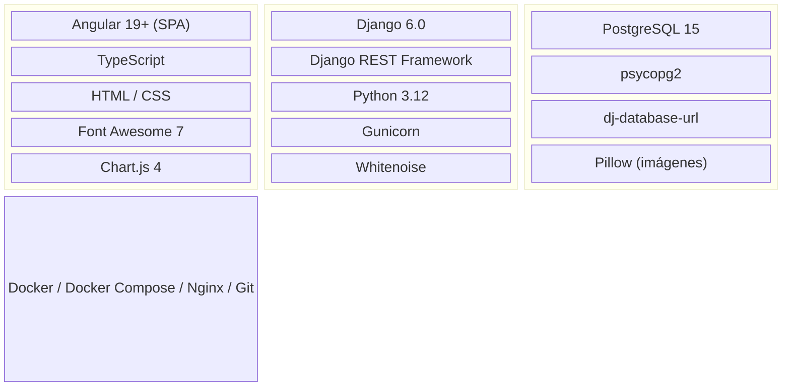
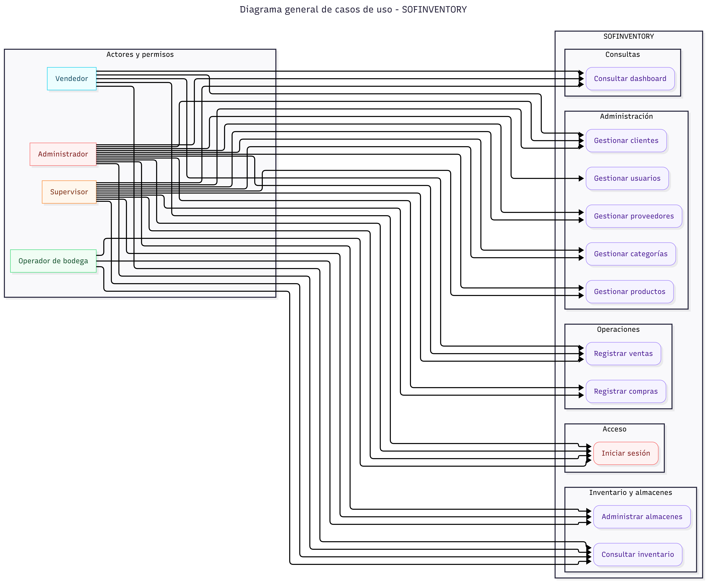
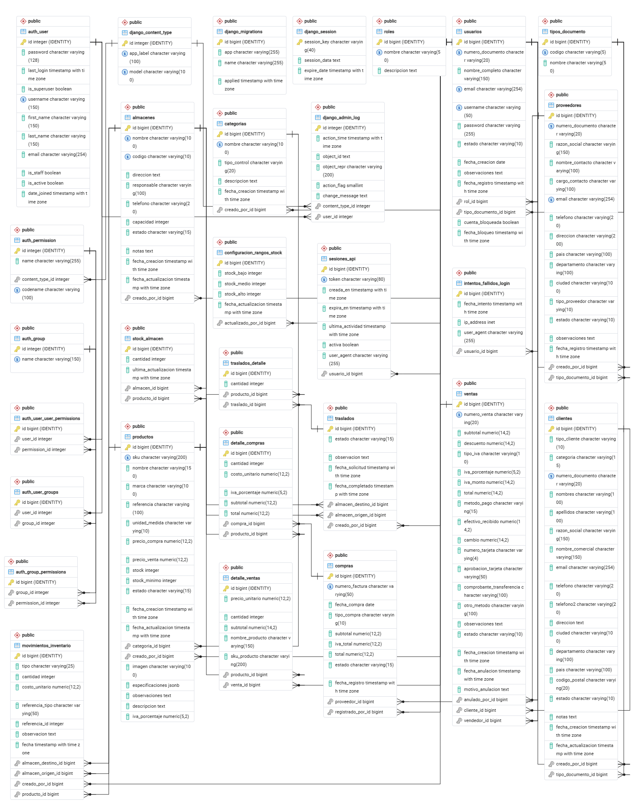
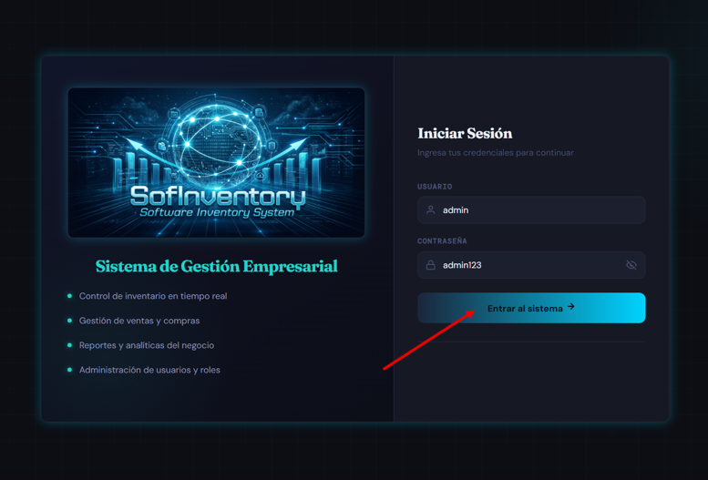
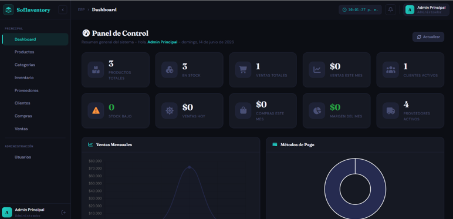
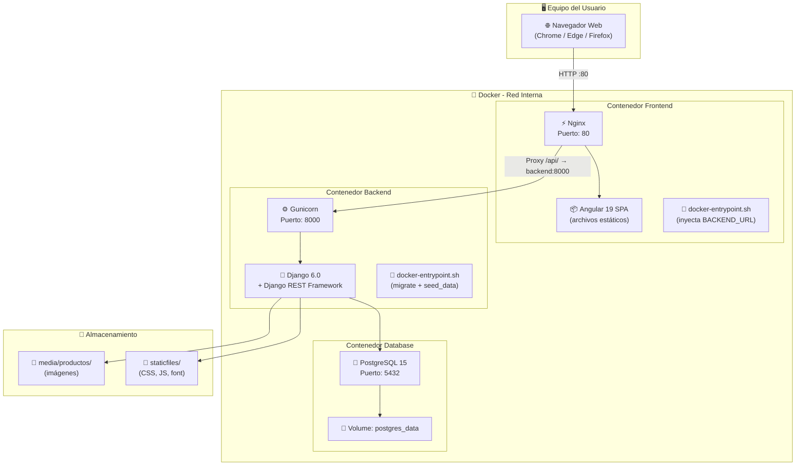
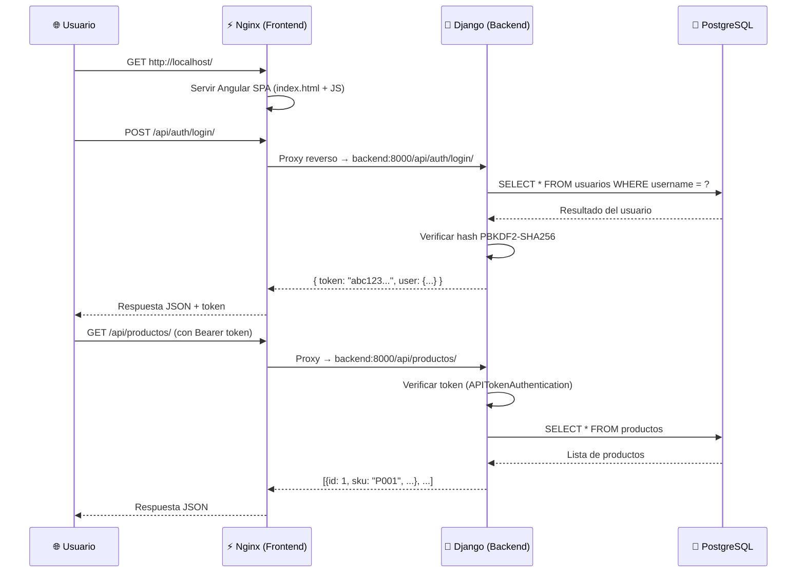
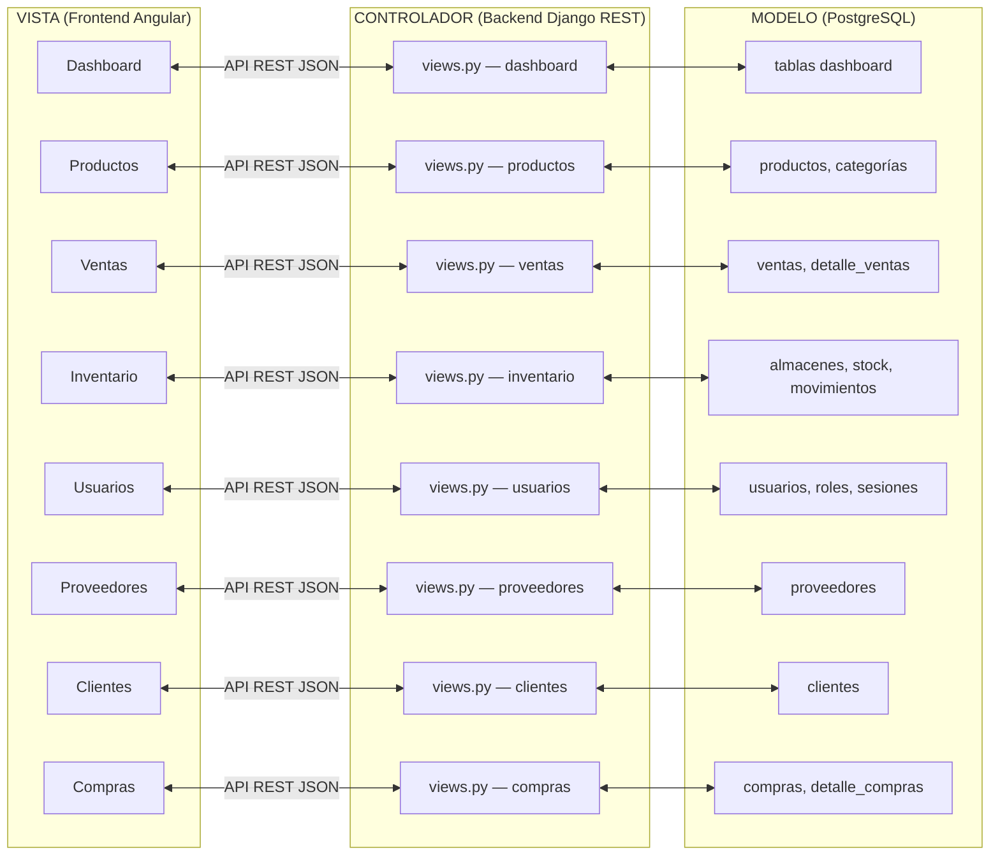
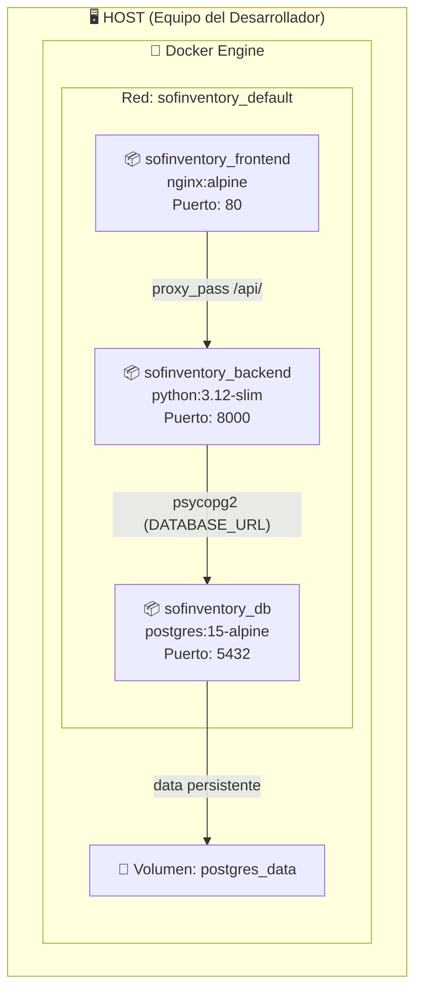

<div style="text-align: center"  markdown="1">

{ width="300" }
# Manual Técnico y Arquitectura del Software
**Sistema de Información SofInventory ERP**
`Versión 1.0` | `Fecha: 26 de julio de 2026`

</div>

---

**Autores:** Alejandro Sepúlveda Duarte / Lucy Estefany Izquierdo Jaramillo <br>
**Programa de Formación:** Tecnología en Análisis y Desarrollo de Software <br>
**Cede:** Centro de Comercio Regional Antioquia–SENA <br>
**Intructor:** José Ignacio Botero Osorio <br>
**Fecha:** Julio 25 de 2026 

---

### Control de versiones del documento

| Versión | Fecha | Autor(es) | Descripción del cambio |
|---|---|---|---|
| 1.0 | Julio 25 de 2026 | Alejandro Sepúlveda D. / Lucy Estefany Izquierdo | Versión inicial: introducción, arquitectura, diccionario de datos, despliegue con Docker, diagrama de componentes y conclusiones. |


### Convenciones del documento

| Símbolo | Significado |
|---|---|
| ⚠️ | Advertencia importante: acción irreversible, riesgo de seguridad o que requiere especial atención. |
| 📄 / 📊 / 🖼️ / 💻 | Enlace a un documento, hoja de cálculo, imagen o repositorio de código, respectivamente. |
| **Negrita** | Nombres de comandos, variables, botones o elementos clave. |
| `Texto en código` | Nombres técnicos literales (comandos, variables de entorno, endpoints, nombres de tablas). |


## 1. Introducción

### 1.1 Propósito

El presente Manual Técnico documenta de forma exhaustiva la arquitectura, configuración, estructura de datos, procedimientos de instalación y despliegue del sistema **SofInventory**. Su propósito es servir como referencia técnica para desarrolladores, arquitectos de software, analistas, administradores de bases de datos y personal de soporte que requiera comprender, implementar, mantener o escalar la solución.

### 1.2 Alcance

Este manual cubre los siguientes aspectos del sistema:

- Arquitectura técnica completa (backend, frontend, base de datos, contenedores Docker)
- Prerrequisitos de hardware y software para el despliegue
- Stack tecnológico y estándares de codificación aplicados
- Diagramas de casos de uso con descripción detallada de actores y flujos
- Modelo entidad-relación de la base de datos PostgreSQL
- Diccionario de datos completo con tipos, longitudes y restricciones
- Scripts reales de instalación y despliegue mediante Docker Compose
- Diagrama de componentes con orquestación Docker
- Protocolo de pruebas de aceptación

### 1.3 Descripción técnica del sistema

**SofInventory** es un sistema ERP (Enterprise Resource Planning) orientado a la gestión integral de inventarios y procesos comerciales para PYMES. El sistema permite administrar:

| Módulo | Funcionalidad Principal |
|---|---|
| **Usuarios y Roles** | Autenticación, autorización, control de accesos por rol |
| **Productos y Categorías** | Catálogo de productos con precios, stock, imágenes |
| **Proveedores** | Gestión de proveedores con datos de contacto y ubicación |
| **Clientes** | Clientes naturales y jurídicos con categorización comercial |
| **Compras** | Registro de compras con detalle y actualización automática de inventario |
| **Ventas** | Punto de venta con múltiples métodos de pago y cálculo de IVA |
| **Inventario y Almacenes** | Control de stock por almacén, movimientos, traslados y ajustes |
| **Dashboard** | Panel de indicadores con gráficos y métricas en tiempo real |

La arquitectura es **desacoplada (decoupled)**: un backend Django REST Framework que expone una API, y un frontend Angular SPA que consume dicha API. Ambos están containerizados con Docker y orquestados mediante Docker Compose.

### 1.4 Documentos de referencia integrados

Este manual ha sido elaborado consolidando la información de los siguientes documentos técnicos del proyecto:

| Documento | Contenido Integrado |
|---|---|
| Modelo Entidad-Relación SofInventory PostgreSQL | Estructura de la base de datos, normalización 3FN, relaciones |
| Desarrollo Arquitectura de Software (Patrón MVC) | Vista de componentes, vista de despliegue, justificación de herramientas |
| Informe Técnico de Despliegue v2.0 | Fases de despliegue Docker, variables de entorno, protocolo de pruebas |
| Diagramas y Plantillas para Casos de Uso | CU-001 a CU-004 con flujos principales, alternativos y de excepción |

---

## 2. Prerrequisitos de instalación del sistema

### 2.1 Requisitos mínimos de hardware

| Componente | Mínimo | Recomendado |
|---|---|---|
| **CPU** | 2 núcleos | 4 núcleos o superior |
| **RAM** | 4 GB | 8 GB o superior |
| **Disco** | 20 GB libres | 50 GB (SSD recomendado) |
| **Red** | Conexión a internet para clonación del repositorio | Conexión estable y de baja latencia |

> **Nota importante:** Estos requisitos aplican al **equipo anfitrión (host)** donde se ejecutarán los contenedores Docker. Las dependencias de Python, Node.js y PostgreSQL se ejecutan **dentro** de los contenedores, por lo que no se requiere instalarlas en el sistema operativo del host.

### 2.2 Requisitos de software en el equipo Host

| Herramienta | Versión Requerida | Propósito | ¿Obligatorio? |
|---|---|---|---|
| **Docker Desktop** | Última versión estable (incluye Docker Engine + Docker Compose) | Construcción y ejecución de contenedores | **Sí** |
| **Git** | Última versión estable | Obtención del código fuente del repositorio | **Sí** |
| **Navegador web** | Chrome, Edge o Firefox (actualizado) | Acceso a la interfaz de usuario | **Sí** |

> **No es necesario instalar** Python, Node.js, PostgreSQL, npm, entornos virtuales de Python, ni configurar bases de datos manualmente. Todo se ejecuta dentro de los contenedores Docker, lo que elimina problemas de compatibilidad entre versiones y garantiza un entorno idéntico en cualquier máquina.

### 2.3 Herramientas recomendadas (Opcional)

| Herramienta | Propósito |
|---|---|
| **Visual Studio Code** | Editor de código fuente |
| **Postman / Insomnia** | Pruebas de API REST |
| **pgAdmin 4 / DBeaver** | Administración de PostgreSQL (solo si se necesita inspeccionar la BD directamente) |
| **Docker Desktop** | Panel visual de contenedores, logs y redes |

### 2.4 Verificación de prerrequisitos

Antes de proceder con la instalación, verifique que Docker y Git estén correctamente instalados:

```bash
# Verificar Docker Engine
docker --version
# Resultado esperado: Docker version 24.x.x o superior

# Verificar Docker Compose
docker compose version
# Resultado esperado: Docker Compose version v2.x.x o superior

# Verificar Git
git --version
# Resultado esperado: git version 2.x.x
```

---

## 3. Frameworks y estándares de desarrollo

### 3.1 Stack tecnológico completo



| Capa | Tecnología | Versión | Función |
|---|---|---|---|
| **Frontend** | Angular | 19+ | Interfaz de usuario SPA (Single Page Application) |
| **Frontend — Lenguaje** | TypeScript | 5.6 | Lenguaje tipado basado en JavaScript |
| **Frontend — Íconos** | Font Awesome | 7.2 | Librería de íconos vectoriales |
| **Frontend — Gráficos** | Chart.js | 4.5 | Librería de visualización de datos |
| **Backend — Framework** | Django | 6.0 | Framework web Python de alto nivel |
| **Backend — API** | Django REST Framework | 3.17 | Toolkit para construir APIs RESTful |
| **Backend — Servidor** | Gunicorn | 23.0 | Servidor WSGI para producción |
| **Backend — Estáticos** | Whitenoise | 6.12 | Servir archivos estáticos en producción |
| **Base de datos** | PostgreSQL | 15 | Sistema de gestión de BD relacional |
| **Contenedorización** | Docker | 24+ | Empaquetado y ejecución de servicios |
| **Orquestación** | Docker Compose | v2 | Definición y levantamiento multi-contenedor |
| **Servidor web (frontend)** | Nginx | Alpine | Servidor de archivos estáticos + proxy reverso |
| **Control de versiones** | Git + GitHub | — | Repositorio remoto privado |

### 3.2 Patrón de arquitectura: MVC con API REST desacoplada

El sistema implementa el patrón **Modelo-Vista-Controlador (MVC)** adaptado a una arquitectura **cliente-servidor desacoplada** mediante API REST:

| Capa MVC | Implementación en SofInventory | Ubicación |
|---|---|---|
| **Modelo** | Modelos de Django (usuarios, productos, inventario, proveedores, clientes, compras, ventas) que gestionan datos, reglas de negocio e interacción con PostgreSQL | `backend/*/models.py` |
| **Vista** | Aplicación Angular (SPA) que renderiza la interfaz gráfica (formularios, tablas, dashboards) en el navegador del usuario | `frontend/src/app/pages/` |
| **Controlador** | Vistas de Django REST Framework (`views.py` de cada app) que reciben peticiones HTTP de Angular, aplican permisos por rol y devuelven respuestas JSON | `backend/*/views.py` |

> **Justificación:** El patrón MVC, adaptado a esta arquitectura desacoplada, permite escalar el frontend y el backend por separado, y habilita que otros clientes (app móvil, sistema externo) reutilicen la misma API REST sin duplicar lógica de negocio.

### 3.3 Aplicaciones (Apps) del backend

El backend Django se organiza en **8 aplicaciones modulares**, cada una responsable de un dominio del negocio:

| # | App Django | Modelo(s) | Tabla(s) PostgreSQL | Función |
|---|---|---|---|---|
| 1 | `usuarios` | TipoDocumento, Rol, Usuario, SesionAPI, IntentoFallidoLogin | `tipos_documento`, `roles`, `usuarios`, `sesiones_api`, `intentos_fallidos_login` | Gestión de usuarios, roles, autenticación y sesiones |
| 2 | `productos` | Categoria, Producto | `categorias`, `productos` | Catálogo de productos y categorías |
| 3 | `proveedores` | Proveedor | `proveedores` | Gestión de proveedores |
| 4 | `clientes` | Cliente | `clientes` | Clientes naturales y jurídicos |
| 5 | `compras` | Compra, DetalleCompra | `compras`, `detalle_compras` | Registro de compras y detalle |
| 6 | `ventas` | Venta, DetalleVenta | `ventas`, `detalle_ventas` | Punto de venta y detalle |
| 7 | `inventario` | Almacen, StockAlmacen, MovimientoInventario, Traslado, TrasladoDetalle, ConfiguracionRangosStock | `almacenes`, `stock_almacen`, `movimientos_inventario`, `traslados`, `traslados_detalle`, `configuracion_rangos_stock` | Control de inventario, almacenes y movimientos |
| 8 | `dashboard` | — | — | Agrega datos de los módulos para indicadores |

### 3.4 Variables de entorno

El sistema utiliza archivos `.env` para la configuración de cada componente. Las variables están documentadas en la sección de despliegue. Los archivos `.env` **nunca se suben al repositorio** (excluidos por `.gitignore`).

> 📄 **Documentación Complementaria:** Para profundizar en el análisis arquitectónico, los principios de diseño aplicados y la justificación del patrón seleccionado para **SofInventory**, consulte el documento anexo [Arquitectura_Software_Patrón_Diseño_Seleccionado.pdf](./Arquitectura_Software_Patrón_Diseño_Seleccionado.pdf) o diríjase a la sección de [13.2 Documentos Internos y externos del Proyecto](#122-documentos-internos-y-externos-del-proyecto).

### 3.5 Principales Endpoints de la API REST

A modo de referencia rápida, los siguientes son los endpoints principales expuestos por el backend. Todos, salvo el de autenticación, requieren un token de sesión válido en la cabecera de la solicitud.

| Método | Endpoint | Descripción |
|---|---|---|
| `POST` | `/api/auth/login/` | Autentica un usuario y devuelve el token de sesión |
| `POST` | `/api/auth/logout/` | Invalida el token de sesión activo |
| `GET / POST` | `/api/usuarios/` | Lista o crea usuarios del sistema |
| `GET / PUT / DELETE` | `/api/usuarios/{id}/` | Consulta, actualiza o desactiva un usuario específico |
| `GET / POST` | `/api/productos/` | Lista o crea productos del catálogo |
| `GET / PUT / DELETE` | `/api/productos/{id}/` | Consulta, actualiza o cambia el estado de un producto |
| `GET / POST` | `/api/categorias/` | Lista o crea categorías de producto |
| `GET / POST` | `/api/proveedores/` | Lista o crea proveedores |
| `GET / POST` | `/api/clientes/` | Lista o crea clientes |
| `GET / POST` | `/api/compras/` | Lista o registra compras a proveedores |
| `POST` | `/api/compras/{id}/anular/` | Anula una compra registrada |
| `GET / POST` | `/api/ventas/` | Lista o registra ventas |
| `POST` | `/api/ventas/{id}/anular/` | Anula una venta y restaura el stock afectado |
| `GET` | `/api/inventario/almacenes/` | Lista los almacenes registrados |
| `GET` | `/api/inventario/stock/` | Consulta el stock actual por producto y almacén |
| `GET` | `/api/inventario/movimientos/` | Consulta el historial de movimientos de inventario |
| `GET` | `/api/dashboard/resumen/` | Devuelve los indicadores agregados del panel principal |

> **Nota.** Esta tabla resume los endpoints de mayor uso con fines de orientación técnica; no reemplaza una colección de pruebas (Postman/Insomnia) ni la documentación autogenerada de la API, que se recomienda mantener como complemento para el equipo de desarrollo.

---

## 4. Diagrama y descripción de casos de uso

### 4.1 Diagrama de casos de uso general



### 4.2 Descripción de casos de uso principales

#### CU-001: Iniciar sesión

| Campo | Descripción |
|---|---|
| **Nombre** | Iniciar Sesión |
| **ID** | CU-001 |
| **Actor** | Todos los usuarios del sistema |
| **Precondiciones** | El usuario tiene credenciales válidas registradas en la base de datos |
| **Flujo Principal** | 1. El usuario ingresa al sistema desde el navegador → 2. Se muestra el formulario de autenticación → 3. El usuario ingresa username y contraseña → 4. El backend valida las credenciales (hash PBKDF2-SHA256) → 5. Se genera un token de acceso → 6. El usuario es redirigido al Dashboard principal |
| **Flujo Alternativo** | Si la cuenta está bloqueada: el sistema muestra un mensaje de bloqueo y no permite el intento |
| **Flujo de Excepción** | Si las credenciales son incorrectas: se registra el intento fallido; tras 3 intentos fallidos consecutivos, la cuenta se bloquea automáticamente |
| **Postcondiciones** | El usuario queda autenticado con un token activo; se inicia sesión en la tabla `sesiones_api` |

#### CU-002: Gestionar usuarios

| Campo | Descripción |
|---|---|
| **Nombre** | Gestionar Usuarios |
| **ID** | CU-002 |
| **Actor** | Administrador |
| **Precondiciones** | El administrador está autenticado con token activo |
| **Flujo Principal** | 1. El administrador accede al módulo de usuarios → 2. Visualiza la lista de usuarios registrados → 3. Puede crear, editar, activar/desactivar usuarios → 4. Al crear: selección de tipo documento, número de documento, nombre completo, email, username, contraseña, rol y estado → 5. El sistema valida unicidad de documento, email y username → 6. Se guarda el usuario con contraseña hasheada (PBKDF2) → 7. Se actualiza la tabla `usuarios` |
| **Flujo Alternativo** | Edición: se carga el formulario con los datos existentes del usuario |
| **Flujo de Excepción** | Si el número de documento o email ya existe: el sistema muestra error de duplicado |
| **Postcondiciones** | La tabla `usuarios` se actualiza con la información del nuevo o modificado usuario |

#### CU-003: Registrar productos

| Campo | Descripción |
|---|---|
| **Nombre** | Registrar Productos |
| **ID** | CU-003 |
| **Actor** | Administrador, Supervisor |
| **Precondiciones** | El usuario tiene permisos; existen categorías registradas |
| **Flujo Principal** | 1. El usuario accede al módulo de productos → 2. Crea un nuevo producto con: SKU, nombre, marca, referencia, unidad de medida, categoría, precio compra, precio venta, IVA, stock mínimo → 3. El sistema valida unicidad del SKU → 4. Se guarda el producto → 5. Se actualiza la tabla `productos` |
| **Flujo Alternativo** | Subir imagen del producto (upload a `media/productos/`) |
| **Flujo de Excepción** | Si el SKU ya existe: el sistema muestra error de duplicado |
| **Postcondiciones** | El producto queda disponible para compras, ventas y movimiento de inventario |

#### CU-004: Registrar compras

| Campo | Descripción |
|---|---|
| **Nombre** | Registrar Compras |
| **ID** | CU-004 |
| **Actor** | Administrador, Supervisor, Operador de Bodega |
| **Precondiciones** | El usuario está autenticado; existen proveedores y productos registrados |
| **Flujo Principal** | 1. El usuario selecciona el proveedor → 2. Ingresa número de factura y fecha de compra → 3. Agrega productos al detalle de la compra (producto, cantidad, costo unitario, IVA) → 4. El sistema calcula subtotal, IVA y total → 5. Se guarda la compra y su detalle → 6. Se actualiza el stock del producto en el almacén correspondiente → 7. Se registra el movimiento de inventario (tipo: ENTRADA_COMPRA) |
| **Flujo de Excepción** | Si la factura ya existe: el sistema muestra error de duplicado |
| **Postcondiciones** | Las tablas `compras`, `detalle_compras`, `stock_almacen` y `movimientos_inventario` se actualizan |

#### CU-005: Registrar ventas

| Campo | Descripción |
|---|---|
| **Nombre** | Registrar Ventas (Punto de Venta) |
| **ID** | CU-005 |
| **Actor** | Administrador, Supervisor, Vendedor |
| **Precondiciones** | El usuario está autenticado; existen productos con stock > 0 |
| **Flujo Principal** | 1. El vendedor selecciona los productos a vender → 2. El sistema valida stock disponible → 3. Se calcula subtotal, descuento, IVA y total → 4. Se selecciona método de pago (efectivo, débito, crédito, transferencia, Nequi, DaviPlata) → 5. Se registra la venta y su detalle → 6. Se descuenta las cantidades del stock → 7. Se genera el movimiento de inventario (tipo: SALIDA_VENTA) → 8. Se genera el número de venta automático (VTA-XXXXX) |
| **Flujo Alternativo** | Si el cliente es "General" (sin identificación): el campo `cliente` queda en null |
| **Flujo de Excepción** | Si el stock es insuficiente: el sistema muestra alerta y previene la venta |
| **Postcondiciones** | Las tablas `ventas`, `detalle_ventas`, `stock_almacen` y `movimientos_inventario` se actualizan; se genera el comprobante de venta |

#### CU-006: Consultar inventario

| Campo | Descripción |
|---|---|
| **Nombre** | Consultar Inventario |
| **ID** | CU-006 |
| **Actor** | Todos los usuarios autenticados |
| **Precondiciones** | El usuario está autenticado |
| **Flujo Principal** | 1. El usuario accede al módulo de inventario → 2. Consulta el stock por almacén → 3. Visualiza movimientos de inventario (entradas, salidas, ajustes, traslados) → 4. Puede filtrar por producto, tipo de movimiento o rango de fechas → 5. El sistema muestra alertas de stock bajo según la configuración de rangos |
| **Postcondiciones** | Se obtiene información actualizada del inventario sin modificaciones |

#### CU-007: Gestionar almacenes

| Campo | Descripción |
|---|---|
| **Nombre** | Gestionar Almacenes |
| **ID** | CU-007 |
| **Actor** | Administrador, Supervisor |
| **Precondiciones** | El usuario tiene permisos |
| **Flujo Principal** | 1. El usuario accede al módulo de almacenes → 2. Crea o edita almacenes con: nombre, código, dirección, responsable, teléfono, capacidad, estado → 3. El sistema valida unicidad del código → 4. Se guarda el almacén → 5. Se actualiza la tabla `almacenes` |
| **Postcondiciones** | El almacén queda disponible para recibir stock y registrar movimientos |

📌 **Nota:** Para consultar los diagramas de casos de uso extendidos, plantillas por módulo y la documentación funcional detallada del sistema, puede acceder al anexo [Diagramas_Plantillas_casos_de_uso_del_proyecto.pdf](./Diagramas_Plantillas_casos_de_uso_del_proyecto.pdf) o ir a la sección de [10.2 Documentos Internos y externos del Proyecto](#102-documentos-internos-y-externos-del-proyecto).
---

## 5. Modelo Entidad-Relación (Base de Datos)

### 5.1 Descripción general del modelo

El modelo entidad-relación de SofInventory está diseñado bajo los principios de:

- **Normalización en Tercera Forma Normal (3FN):** Eliminación de redundancias y dependencias transitivas
- **Integridad referencial:** Claves foráneas con acciones `ON DELETE PROTECT` o `CASCADE` según el caso
- **Restricciones de dominio:** Validaciones a nivel de base de datos
- **Índices optimizados:** Para consultas frecuentes y relaciones principales

### 5.2 Estructura del modelo por módulos
Figura 1.
Diagrama MER


### 5.3 Relaciones principales del modelo

| Relación | Cardinalidad | Descripción |
|---|---|---|
| TipoDocumento → Usuarios | 1:N | Un tipo de documento puede tener múltiples usuarios |
| Rol → Usuarios | 1:N | Un rol puede asignarse a múltiples usuarios |
| Categoría → Productos | 1:N | Una categoría agrupa múltiples productos |
| Producto → StockAlmacen | 1:N | Un producto tiene stock en múltiples almacenes |
| Almacén → StockAlmacen | 1:N | Un almacén contiene stock de múltiples productos |
| Producto → MovimientoInventario | 1:N | Un producto genera múltiples movimientos |
| Almacén → MovimientoInventario | 1:N | Un almacén es origen o destino de múltiples movimientos |
| Proveedor → Compras | 1:N | Un proveedor realiza múltiples compras |
| Compra → DetalleCompra | 1:N | Una compra contiene múltiples detalles |
| Producto → DetalleCompra | 1:N | Un producto aparece en múltiples detalles de compra |
| Cliente → Ventas | 1:N | Un cliente realiza múltiples compras |
| Venta → DetalleVenta | 1:N | Una venta contiene múltiples detalles |
| Producto → DetalleVenta | 1:N | Un producto se vende en múltiples ventas |
| Traslado → TrasladoDetalle | 1:N | Un traslado contiene múltiples productos |
| Usuario → SesionAPI | 1:N | Un usuario genera múltiples sesiones |

📊 **Especificación de Base de Datos:** Para revisar el diagrama completo generado desde la base de datos y la definición detallada de tablas, campos y restricciones, consulte el [Modelo Entidad-Relación en PDF](./Modelo_Entidad_Relacion_SofInventory_PostgreSQL.pdf) y el [Diccionario de Datos en Excel](https://drive.google.com/file/d/1UzqMEZIm0xpVfJMkq-4Cwno6ymZs9C7R/view?usp=sharing), ambos referenciados en la sección [10.2 Documentos Internos y externos del Proyecto](#102-documentos-internos-y-externos-del-proyecto).
---

## 6. Diccionario de datos

### 6.1 Tabla: `usuarios`

| Campo | Tipo de Dato | Longitud | Llave | Requerido | Descripción |
|---|---|---:|---|---|---|
| id | Integer (SERIAL) | — | PK | Sí | Identificador único del usuario (autogenerado) |
| tipo_documento_id | Integer | — | FK → `tipos_documento.id` | Sí | Tipo de documento de identidad del usuario |
| numero_documento | Varchar | 20 | UK | Sí | Número de documento de identidad (CC, CE, NIT) |
| nombre_completo | Varchar | 150 | — | Sí | Nombre completo del usuario |
| email | Varchar | 255 | UK | Sí | Correo electrónico único |
| username | Varchar | 50 | UK | Sí | Nombre de usuario para autenticación |
| password | Varchar | 255 | — | Sí | Contraseña cifrada con PBKDF2-SHA256 |
| rol_id | Integer | — | FK → `roles.id` | Sí | Rol asignado (Administrador, Vendedor) |
| estado | Varchar | 10 | — | Sí | Estado: `activo` o `inactivo` (default: `activo`) |
| fecha_creacion | Date | — | — | Sí | Fecha de creación (auto_now_add) |
| observaciones | Text | — | — | No | Observaciones adicionales del usuario |
| fecha_registro | Datetime | — | — | Sí | Fecha y hora de registro (auto_now_add) |
| cuenta_bloqueada | Boolean | — | — | No | Indica si la cuenta está bloqueada (default: false) |
| fecha_bloqueo | Datetime | — | — | No | Fecha y hora del último bloqueo |

### 6.2 Tabla: `tipos_documento`

| Campo | Tipo de Dato | Longitud | Llave | Requerido | Descripción |
|---|---|---:|---|---|---|
| id | Integer (SERIAL) | — | PK | Sí | Identificador único del tipo de documento |
| codigo | Varchar | 5 | UK | Sí | Código del tipo (CC, CE, NIT) |
| nombre | Varchar | 50 | — | Sí | Nombre completo del tipo de documento |

### 6.3 Tabla: `roles`

| Campo | Tipo de Dato | Longitud | Llave | Requerido | Descripción |
|---|---|---:|---|---|---|
| id | Integer (SERIAL) | — | PK | Sí | Identificador único del rol |
| nombre | Varchar | 50 | UK | Sí | Nombre del rol (Administrador, Vendedor) |
| descripcion | Text | — | — | No | Descripción detallada del rol |

### 6.4 Tabla: `productos`

| Campo | Tipo de Dato | Longitud | Llave | Requerido | Descripción |
|---|---|---:|---|---|---|
| id | Integer (SERIAL) | — | PK | Sí | Identificador único del producto |
| sku | Varchar | 200 | UK | Sí | Código SKU único del producto |
| nombre | Varchar | 150 | — | Sí | Nombre comercial del producto |
| marca | Varchar | 100 | — | Sí | Marca del producto |
| referencia | Varchar | 100 | — | Sí | Referencia interna del fabricante |
| unidad_medida | Varchar | 10 | — | Sí | Unidad: Unidad, Caja, Metro, Litro, Galón, Rollo, Bulto, Kilo |
| categoria_id | Integer | — | FK → `categorias.id` | Sí | Categoría del producto |
| precio_compra | Decimal | 12,2 | — | No | Precio de compra unitario (default: 0) |
| precio_venta | Decimal | 12,2 | — | No | Precio de venta unitario (default: 0) |
| iva_porcentaje | Decimal | 5,2 | — | No | Porcentaje de IVA (default: 0) |
| stock | Integer | — | — | No | Stock actual del producto (default: 0) |
| stock_minimo | Integer | — | — | No | Stock mínimo de seguridad (default: 0) |
| descripcion | Text | — | — | No | Descripción detallada del producto |
| observaciones | Text | — | — | No | Notas internas |
| especificaciones | JSONField | — | — | No | Especificaciones técnicas en formato JSON |
| estado | Varchar | 15 | — | Sí | Estado: `pendiente`, `activo`, `inactivo` |
| creado_por_id | Integer | — | FK → `usuarios.id` | Sí | Usuario que creó el registro |
| fecha_creacion | Datetime | — | — | Sí | Fecha de creación (auto_now_add) |
| fecha_actualizacion | Datetime | — | — | Sí | Última actualización (auto_now) |
| imagen | ImageField | 255 | — | No | Ruta de imagen del producto (`productos/`) |

### 6.5 Tabla: `categorias`

| Campo | Tipo de Dato | Longitud | Llave | Requerido | Descripción |
|---|---|---:|---|---|---|
| id | Integer (SERIAL) | — | PK | Sí | Identificador único de la categoría |
| nombre | Varchar | 100 | UK | Sí | Nombre de la categoría |
| tipo_control | Varchar | 20 | — | Sí | Tipo: GENERAL, HERRAMIENTA, ELECTRICO, LIQUIDO, TORNILLERIA |
| descripcion | Text | — | — | No | Descripción de la categoría |
| creado_por_id | Integer | — | FK → `usuarios.id` | Sí | Usuario que creó la categoría |
| fecha_creacion | Datetime | — | — | Sí | Fecha de creación (auto_now_add) |

### 6.6 Tabla: `proveedores`

| Campo | Tipo de Dato | Longitud | Llave | Requerido | Descripción |
|---|---|---:|---|---|---|
| id | Integer (SERIAL) | — | PK | Sí | Identificador único del proveedor |
| tipo_documento_id | Integer | — | FK → `tipos_documento.id` | Sí | Tipo de documento del proveedor |
| numero_documento | Varchar | 20 | UK | Sí | Número de documento (CC o NIT) |
| razon_social | Varchar | 150 | UK (CI) | Sí | Razón social o nombre del proveedor |
| nombre_contacto | Varchar | 100 | — | Sí | Nombre de la persona de contacto |
| cargo_contacto | Varchar | 100 | — | No | Cargo del contacto |
| email | Varchar | 255 | UK | Sí | Correo electrónico del proveedor |
| telefono | Varchar | 20 | — | Sí | Teléfono de contacto |
| direccion | Varchar | 200 | — | Sí | Dirección física |
| pais | Varchar | 100 | — | Sí | País de origen |
| departamento | Varchar | 100 | — | Sí | Departamento/Estado |
| ciudad | Varchar | 100 | — | Sí | Ciudad |
| tipo_proveedor | Varchar | 10 | — | Sí | Tipo: Bienes, Servicios, Mixto |
| estado | Varchar | 10 | — | Sí | Estado: Activo, Inactivo |
| observaciones | Text | — | — | No | Notas adicionales |
| creado_por_id | Integer | — | FK → `usuarios.id` | Sí | Usuario que registró el proveedor |
| fecha_registro | Datetime | — | — | Sí | Fecha de registro (auto_now_add) |

### 6.7 Tabla: `clientes`

| Campo | Tipo de Dato | Longitud | Llave | Requerido | Descripción |
|---|---|---:|---|---|---|
| id | Integer (SERIAL) | — | PK | Sí | Identificador único del cliente |
| tipo_cliente | Varchar | 10 | — | Sí | Tipo: natural, juridica |
| categoria | Varchar | 15 | — | Sí | Categoría: general, minorista, mayorista, corporativo |
| tipo_documento_id | Integer | — | FK → `tipos_documento.id` | Sí | Tipo de documento |
| numero_documento | Varchar | 20 | UK | Sí | Número de documento |
| nombres | Varchar | 100 | — | No | Nombres (persona natural) |
| apellidos | Varchar | 100 | — | No | Apellidos (persona natural) |
| razon_social | Varchar | 150 | — | No | Razón social (persona jurídica) |
| nombre_comercial | Varchar | 150 | — | No | Nombre comercial (persona jurídica) |
| email | Varchar | 255 | — | No | Correo electrónico |
| telefono | Varchar | 20 | — | No | Teléfono principal |
| telefono2 | Varchar | 20 | — | No | Teléfono secundario |
| direccion | Text | — | — | No | Dirección física |
| ciudad | Varchar | 100 | — | No | Ciudad |
| departamento | Varchar | 100 | — | No | Departamento/Estado |
| pais | Varchar | 100 | — | No | País (default: Colombia) |
| codigo_postal | Varchar | 20 | — | No | Código postal |
| estado | Varchar | 10 | — | Sí | Estado: activo, inactivo, bloqueado |
| notas | Text | — | — | No | Notas adicionales |
| creado_por_id | Integer | — | FK → `usuarios.id` | Sí | Usuario que registró el cliente |
| fecha_creacion | Datetime | — | — | Sí | Fecha de creación (auto_now_add) |
| fecha_actualizacion | Datetime | — | — | Sí | Última actualización (auto_now) |

### 6.8 Tabla: `compras`

| Campo | Tipo de Dato | Longitud | Llave | Requerido | Descripción |
|---|---|---:|---|---|---|
| id | Integer (SERIAL) | — | PK | Sí | Identificador único de la compra |
| proveedor_id | Integer | — | FK → `proveedores.id` | Sí | Proveedor de la compra |
| numero_factura | Varchar | 50 | UK | Sí | Número de factura del proveedor |
| fecha_compra | Date | — | — | Sí | Fecha de la compra |
| tipo_compra | Varchar | 10 | — | Sí | Tipo: Contado, Credito |
| subtotal | Decimal | 12,2 | — | No | Subtotal de la compra (default: 0) |
| iva_total | Decimal | 12,2 | — | No | Total de IVA (default: 0) |
| total | Decimal | 12,2 | — | No | Total de la compra (default: 0) |
| estado | Varchar | 15 | — | Sí | Estado: pendiente, completada, anulada |
| registrado_por_id | Integer | — | FK → `usuarios.id` | Sí | Usuario que registró la compra |
| fecha_registro | Datetime | — | — | Sí | Fecha de registro (auto_now_add) |

### 6.9 Tabla: `detalle_compras`

| Campo | Tipo de Dato | Longitud | Llave | Requerido | Descripción |
|---|---|---:|---|---|---|
| id | Integer (SERIAL) | — | PK | Sí | Identificador único del detalle |
| compra_id | Integer | — | FK → `compras.id` | Sí | Compra a la que pertenece |
| producto_id | Integer | — | FK → `productos.id` | Sí | Producto comprado |
| cantidad | Integer | — | — | Sí | Cantidad adquirida |
| costo_unitario | Decimal | 12,2 | — | Sí | Costo por unidad |
| iva_porcentaje | Decimal | 5,2 | — | No | Porcentaje de IVA (default: 0) |
| subtotal | Decimal | 12,2 | — | Sí | Subtotal (cantidad × costo_unitario) |
| total | Decimal | 12,2 | — | Sí | Total con IVA |

### 6.10 Tabla: `ventas`

| Campo | Tipo de Dato | Longitud | Llave | Requerido | Descripción |
|---|---|---:|---|---|---|
| id | Integer (SERIAL) | — | PK | Sí | Identificador único de la venta |
| numero_venta | Varchar | 20 | UK | Sí | Número de venta (auto: VTA-XXXXX) |
| cliente_id | Integer | — | FK → `clientes.id` | No | Cliente (null = Cliente General) |
| vendedor_id | Integer | — | FK → `usuarios.id` | Sí | Vendedor que realizó la venta |
| subtotal | Decimal | 14,2 | — | No | Subtotal (default: 0) |
| descuento | Decimal | 14,2 | — | No | Descuento aplicado (default: 0) |
| tipo_iva | Varchar | 10 | — | No | Tipo: automatico, manual (default: automatico) |
| iva_porcentaje | Decimal | 5,2 | — | No | Porcentaje IVA (default: 19) |
| iva_monto | Decimal | 14,2 | — | No | Monto del IVA (default: 0) |
| total | Decimal | 14,2 | — | No | Total de la venta (default: 0) |
| metodo_pago | Varchar | 15 | — | Sí | Efectivo, debito, credito, transferencia, nequi, daviplata, otro |
| efectivo_recibido | Decimal | 14,2 | — | No | Efectivo recibido del cliente |
| cambio | Decimal | 14,2 | — | No | Cambio devuelto |
| numero_tarjeta | Varchar | 4 | — | No | Últimos 4 dígitos de tarjeta |
| aprobacion_tarjeta | Varchar | 50 | — | No | Código de aprobación de tarjeta |
| comprobante_transferencia | Varchar | 100 | — | No | Número de comprobante de transferencia |
| otro_metodo | Varchar | 100 | — | No | Descripción de otro método de pago |
| observaciones | Text | — | — | No | Observaciones de la venta |
| estado | Varchar | 10 | — | Sí | Estado: completada, anulada |
| fecha_creacion | Datetime | — | — | Sí | Fecha de creación (auto_now_add) |
| fecha_anulacion | Datetime | — | — | No | Fecha de anulación |
| anulado_por_id | Integer | — | FK → `usuarios.id` | No | Usuario que anuló la venta |
| motivo_anulacion | Text | — | — | No | Motivo de la anulación |

### 6.11 Tabla: `detalle_ventas`

| Campo | Tipo de Dato | Longitud | Llave | Requerido | Descripción |
|---|---|---:|---|---|---|
| id | Integer (SERIAL) | — | PK | Sí | Identificador único del detalle |
| venta_id | Integer | — | FK → `ventas.id` | Sí | Venta a la que pertenece |
| producto_id | Integer | — | FK → `productos.id` | Sí | Producto vendido |
| precio_unitario | Decimal | 12,2 | — | Sí | Precio de venta por unidad |
| cantidad | Integer | — | — | Sí | Cantidad vendida |
| subtotal | Decimal | 14,2 | — | Sí | Subtotal (precio × cantidad) |
| nombre_producto | Varchar | 150 | — | Sí | Nombre del producto al momento de la venta |
| sku_producto | Varchar | 200 | — | Sí | SKU del producto al momento de la venta |

### 6.12 Tabla: `almacenes`

| Campo | Tipo de Dato | Longitud | Llave | Requerido | Descripción |
|---|---|---:|---|---|---|
| id | Integer (SERIAL) | — | PK | Sí | Identificador único del almacén |
| nombre | Varchar | 100 | UK | Sí | Nombre del almacén |
| codigo | Varchar | 10 | UK | Sí | Código único del almacén |
| direccion | Text | — | — | No | Dirección física |
| responsable | Varchar | 100 | — | No | Nombre del responsable |
| telefono | Varchar | 20 | — | No | Teléfono de contacto |
| capacidad | Integer | — | — | No | Capacidad máxima en unidades |
| estado | Varchar | 15 | — | Sí | Estado: activo, inactivo, mantenimiento |
| notas | Text | — | — | No | Notas adicionales |
| creado_por_id | Integer | — | FK → `usuarios.id` | Sí | Usuario que creó el almacén |
| fecha_creacion | Datetime | — | — | Sí | Fecha de creación (auto_now_add) |
| fecha_actualizacion | Datetime | — | — | Sí | Última actualización (auto_now) |

### 6.13 Tabla: `stock_almacen`

| Campo | Tipo de Dato | Longitud | Llave | Requerido | Descripción |
|---|---|---:|---|---|---|
| id | Integer (SERIAL) | — | PK | Sí | Identificador único del registro |
| producto_id | Integer | — | FK → `productos.id` | Sí | Producto del stock |
| almacen_id | Integer | — | FK → `almacenes.id` | Sí | Almacén del stock |
| cantidad | Integer | — | — | No | Cantidad en stock (default: 0) |
| ultima_actualizacion | Datetime | — | — | Sí | Última actualización (auto_now) |

> **Restricción:** `UNIQUE (producto_id, almacen_id)` — Un producto solo puede tener un registro de stock por almacén.

### 6.14 Tabla: `movimientos_inventario`

| Campo | Tipo de Dato | Longitud | Llave | Requerido | Descripción |
|---|---|---:|---|---|---|
| id | Integer (SERIAL) | — | PK | Sí | Identificador único del movimiento |
| tipo | Varchar | 25 | — | Sí | Tipo: ENTRADA_COMPRA, SALIDA_VENTA, TRASLADO_ENTRADA, TRASLADO_SALIDA, AJUSTE_POSITIVO, AJUSTE_NEGATIVO, DEVOLUCION_COMPRA, DEVOLUCION_VENTA |
| producto_id | Integer | — | FK → `productos.id` | Sí | Producto involucrado |
| almacen_origen_id | Integer | — | FK → `almacenes.id` | No | Almacén origen (nullable) |
| almacen_destino_id | Integer | — | FK → `almacenes.id` | No | Almacén destino (nullable) |
| cantidad | Integer | — | — | Sí | Cantidad del movimiento |
| costo_unitario | Decimal | 12,2 | — | No | Costo unitario al momento del movimiento (default: 0) |
| referencia_tipo | Varchar | 50 | — | No | Tipo de referencia (Compra, Venta, Traslado) |
| referencia_id | PositiveInteger | — | — | No | ID del registro referenciado |
| observacion | Text | — | — | No | Observación del movimiento |
| fecha | Datetime | — | — | Sí | Fecha del movimiento (auto_now_add) |
| creado_por_id | Integer | — | FK → `usuarios.id` | Sí | Usuario que registró el movimiento |

### 6.15 Tabla: `traslados`

| Campo | Tipo de Dato | Longitud | Llave | Requerido | Descripción |
|---|---|---:|---|---|---|
| id | Integer (SERIAL) | — | PK | Sí | Identificador único del traslado |
| almacen_origen_id | Integer | — | FK → `almacenes.id` | Sí | Almacén de origen |
| almacen_destino_id | Integer | — | FK → `almacenes.id` | Sí | Almacén de destino |
| estado | Varchar | 15 | — | Sí | Estado: PENDIENTE, EN_TRANSITO, COMPLETADO, ANULADO |
| observacion | Text | — | — | No | Observación del traslado |
| fecha_solicitud | Datetime | — | — | Sí | Fecha de solicitud (auto_now_add) |
| fecha_completado | Datetime | — | — | No | Fecha de completado |
| creado_por_id | Integer | — | FK → `usuarios.id` | Sí | Usuario que creó el traslado |

### 6.16 Tabla: `traslados_detalle`

| Campo | Tipo de Dato | Longitud | Llave | Requerido | Descripción |
|---|---|---:|---|---|---|
| id | Integer (SERIAL) | — | PK | Sí | Identificador único del detalle |
| traslado_id | Integer | — | FK → `traslados.id` | Sí | Traslado al que pertenece |
| producto_id | Integer | — | FK → `productos.id` | Sí | Producto trasladado |
| cantidad | Integer | — | — | Sí | Cantidad a trasladar |

---

## 7. Scripts de instalación y despliegue con Docker

### 7.1 Obtención del código fuente

```bash
# Clonar el repositorio del proyecto
git clone https://github.com/AlejandroSepulvedaDuarte/SofInventory.git

# Ingresar al directorio del proyecto
cd SofInventory

# Abrir en Visual Studio Code (opcional)
code .
```

### 7.2 Estructura del proyecto

```
SofInventory/
├── docker-compose.yml          # Orquestación de los 3 servicios
├── Dockerfile                  # Build multi-stage (frontend + backend)
├── .dockerignore               # Archivos excluidos del contexto Docker
├── .gitattributes              # Configuración de line endings (LF)
│
├── backend/
│   ├── Dockerfile              # Dockerfile del backend (microservicio)
│   ├── docker-entrypoint.sh    # Migraciones + collectstatic
│   ├── start.sh                # Script de inicio (Railway/Render)
│   ├── .env                    # Variables de entorno (NO se sube a Git)
│   ├── .env.example            # Plantilla de variables de entorno
│   ├── requirements.txt        # Dependencias Python
│   ├── manage.py               # CLI de Django
│   ├── config/                 # Configuración Django (settings, urls, wsgi)
│   ├── usuarios/               # App: Usuarios, Roles, Sesiones, Auth
│   ├── productos/              # App: Productos, Categorías
│   ├── proveedores/            # App: Proveedores
│   ├── clientes/               # App: Clientes
│   ├── compras/                # App: Compras, Detalle Compras
│   ├── ventas/                 # App: Ventas, Detalle Ventas
│   ├── inventario/             # App: Almacenes, Stock, Movimientos, Traslados
│   └── dashboard/              # App: Dashboard, Reportes
│
├── frontend/
│   ├── Dockerfile              # Build multi-stage Angular + Nginx
│   ├── docker-entrypoint.sh    # Inyección de BACKEND_URL en runtime
│   ├── nginx.conf              # Configuración Nginx (proxy reverso)
│   ├── .env.example            # Plantilla de variables del frontend
│   ├── package.json            # Dependencias Angular
│   ├── angular.json            # Configuración de build Angular
│   └── src/
│       └── app/
│           ├── core/           # Guards, Interceptors, Models, Services
│           ├── pages/          # Componentes por módulo
│           └── shared/         # Componentes compartidos
│
└── docs/                       # Documentación técnica del proyecto
```

### 7.3 Configuración de variables de entorno

#### 7.3.1 Archivo `backend/.env`

Cree el archivo `.env` dentro de la carpeta `backend/` con el siguiente contenido:

```env
# ========================================
# VARIABLES DE ENTorno - Backend SofInventory
# ========================================

# Clave secreta de Django (cambiar en producción)
SECRET_KEY=django-insecure-qnqdjpswh7=yoa*njm+j6b*cn-e(^@@l2a0*t-g1rz5^k57hnd

# Configuración de la base de datos PostgreSQL
DB_NAME=db_sofinventory
DB_USER=postgres
DB_PASSWORD=alejo123
DB_HOST=db
DB_PORT=5432

# Modo de depuración (0 = producción, 1 = desarrollo)
DEBUG=0

# Hosts permitidos por Django
ALLOWED_HOSTS=*

# Orígenes permitidos para CORS
CORS_ALLOW_ALL_ORIGINS=True

# Credenciales del usuario administrador inicial
INITIAL_ADMIN_USERNAME=admin
INITIAL_ADMIN_PASSWORD=admin123
INITIAL_ADMIN_EMAIL=admin@sofinventory.com
INITIAL_ADMIN_NOMBRE_COMPLETO=Administrador Principal
INITIAL_ADMIN_TIPO_DOCUMENTO=CC
INITIAL_ADMIN_NUMERO_DOCUMENTO=1000000000
```

**IMPORTANTE:** El valor de `DB_HOST` debe ser `db` (el nombre del servicio en `docker-compose.yml`), NO `localhost`. Los contenedores se comunican entre sí a través de la red Docker interna usando los nombres de servicio.

⚠️ **ADVERTENCIA DE SEGURIDAD:** Los valores de `SECRET_KEY`, `DB_PASSWORD` e `INITIAL_ADMIN_PASSWORD` mostrados arriba corresponden únicamente al entorno de despliegue de prueba/ejemplo de este proyecto formativo. Una vez ingrese al sistema con el usuario administrador inicial, debe cambiar inmediatamente la contraseña desde el módulo de Usuarios, por motivos de seguridad. Para cualquier despliegue distinto al de prueba, genere una `SECRET_KEY` nueva y una `DB_PASSWORD` propia — nunca reutilice los valores de ejemplo de este manual.

**Descripción de las variables principales:**

| Variable | Obligatoria | Descripción |
|---|---|---|
| `SECRET_KEY` | Sí | Clave criptográfica interna de Django (firma de sesiones y tokens). Debe ser única por entorno y nunca compartirse públicamente. |
| `DB_NAME` | Sí | Nombre de la base de datos PostgreSQL utilizada por el backend. |
| `DB_USER` | Sí | Usuario de conexión a PostgreSQL. |
| `DB_PASSWORD` | Sí | Contraseña de conexión a PostgreSQL. Debe reemplazarse por una contraseña propia en cualquier entorno distinto al de prueba. |
| `DB_HOST` | Sí | Nombre del servicio de base de datos dentro de la red de Docker Compose (`db`). |
| `DB_PORT` | Sí | Puerto de PostgreSQL (por defecto `5432`). |
| `DEBUG` | Sí | Modo de depuración de Django. Debe permanecer en `0` fuera del entorno de desarrollo. |
| `ALLOWED_HOSTS` | Sí | Dominios u hosts autorizados a servir el backend. |
| `CORS_ALLOW_ALL_ORIGINS` | No | Permite solicitudes desde cualquier origen. Se recomienda restringir en un entorno de producción real. |
| `INITIAL_ADMIN_USERNAME` / `PASSWORD` / `EMAIL` | Sí | Credenciales del usuario administrador que se crea automáticamente al iniciar el contenedor backend por primera vez. |

#### 7.3.2 Variables del frontend

El frontend **NO requiere** un archivo `.env` manual para el despliegue con Docker. El script `docker-entrypoint.sh` del frontend genera automáticamente el archivo `env.js` en tiempo de ejecución utilizando la variable `BACKEND_URL` definida en `docker-compose.yml`.

### 7.4 Despliegue con Docker Compose

#### 7.4.1 Verificar que Docker Desktop está en ejecución

```bash
# Verificar que el motor Docker está activo
docker info

# Si muestra información del daemon, Docker está funcionando correctamente
```

#### 7.4.2 Construir y levantar los servicios

```bash
# Construir imágenes y levantar todos los servicios en segundo plano
docker compose up --build -d
```

Este comando realiza las siguientes acciones:

1. **Construye la imagen del frontend:** Ejecuta el build multi-stage (compilación Angular con Node.js 20 + configuración Nginx)
2. **Construye la imagen del backend:** Instala dependencias Python 3.12, copia el código Django, ejecuta `collectstatic`
3. **Descarga la imagen de PostgreSQL 15 Alpine** desde Docker Hub
4. **Crea los contenedores** y los conecta a una red Docker interna
5. **Expone los puertos:** 80 (frontend), 8000 (backend), 5432 (base de datos)
6. **Crea el volumen persistente** `sofinventory_postgres_data` para la base de datos
7. **Ejecuta los entrypoints** que aplican migraciones automáticas y cargan datos iniciales

#### 7.4.3 Verificar el estado de los contenedores

```bash
# Verificar estado de todos los servicios
docker compose ps
```

Resultado esperado:

```
NAME                    STATUS          PORTS
sofinventory_db         Up (healthy)    0.0.0.0:5432->5432/tcp
sofinventory_backend    Up              0.0.0.0:8000->8000/tcp
sofinventory_frontend   Up              0.0.0.0:80->80/tcp
```

#### 7.4.4 Verificar los logs

```bash
# Ver logs de todos los servicios en tiempo real
docker compose logs -f

# Ver logs de un servicio específico
docker compose logs backend
docker compose logs frontend
docker compose logs db

# Ver las últimas 50 líneas de logs del backend
docker compose logs --tail 50 backend
```

#### 7.4.5 Scripts de migración de Django

Las migraciones se ejecutan automáticamente al iniciar el contenedor backend. Si necesita ejecutarlas manualmente:

```bash
# Ejecutar migraciones de Django
docker compose exec backend python manage.py migrate --noinput

# Crear superusuario (si no se creó automáticamente)
docker compose exec backend python manage.py createsuperuser

# Cargar datos iniciales (roles, tipos de documento, admin)
docker compose exec backend python manage.py seed_data

# Recolectar archivos estáticos
docker compose exec backend python manage.py collectstatic --noinput

# Acceder al shell de Django para inspección
docker compose exec backend python manage.py shell

# Verificar el conteo de registros en todas las tablas
docker compose exec backend python manage.py shell -c "
from usuarios.models import Usuario, Rol
from productos.models import Producto, Categoria
from inventario.models import Almacen, StockAlmacen
print(f'Usuarios: {Usuario.objects.count()}')
print(f'Roles: {Rol.objects.count()}')
print(f'Productos: {Producto.objects.count()}')
print(f'Categorías: {Categoria.objects.count()}')
print(f'Almacenes: {Almacen.objects.count()}')
print(f'Stocks: {StockAlmacen.objects.count()}')
"
```

### 7.5 Verificación de funcionamiento (Protocolo de Aceptación)

Una vez que los tres contenedores estén activos, ejecute el siguiente protocolo:

#### Paso 1: Verificar los tres contenedores

```bash
docker compose ps
# Los tres servicios deben mostrar estado "Up"
```

#### Paso 2: Verificar la base de datos

```bash
docker compose logs db
# Mensaje esperado: "database system is ready to accept connections"
```

#### Paso 3: Verificar el backend (API)

```bash
# Verificar que la API responde
curl http://localhost:8000/api/
# Debe retornar respuesta JSON (no error de conexión)
```

#### Paso 4: Verificar el frontend (interfaz web)

Abra el navegador e ingrese a:

```
http://localhost
```

Resultado esperado: Se carga la pantalla de inicio de sesión de SofInventory.

#### Paso 5: Iniciar sesión

| Campo | Valor |
|---|---|
| **Usuario** | `admin` |
| **Contraseña** | `admin123` |

Figura 2.
Pantalla de inicio de sesión 


Si las credenciales son correctas, el usuario será redirigido al Dashboard principal.

#### Paso 6: Verificar módulos principales

| # | Acción | Resultado Esperado |
|---|---|---|
| 1 | Visualizar Dashboard | Se muestra el panel de indicadores con gráficos |
| 2 | Acceder a Productos | Se lista el catálogo de productos |
| 3 | Acceder a Inventario | Se muestra el stock por almacén |
| 4 | Acceder a Usuarios | Se lista los usuarios registrados |
| 5 | Registrar una venta | Se descuenta stock y se genera el movimiento |

Figura 3.
Dashboard principal del sistema 

### 7.6 Comandos útiles de Docker Compose

| Comando | Descripción |
|---|---|
| `docker compose up -d` | Levantar servicios en segundo plano |
| `docker compose up --build -d` | Reconstruir imágenes y levantar |
| `docker compose down` | Detener y eliminar contenedores |
| `docker compose down -v` | Detener, eliminar contenedores Y volúmenes (borra la BD) |
| `docker compose ps` | Ver estado de contenedores |
| `docker compose logs -f` | Ver logs en tiempo real |
| `docker compose restart backend` | Reiniciar solo el backend |
| `docker compose exec backend bash` | Acceder al terminal del contenedor backend |
| `docker system prune` | Limpiar imágenes y contenedores no utilizados |

### 7.7 Solución de problemas comunes

| Problema | Causa Probable | Solución |
|---|---|---|
| `docker` no se reconoce | Docker Desktop no está instalado o no se reinició la terminal | Verifique la instalación y abra una nueva terminal |
| Contenedores no arrancan | Motor Docker no está en ejecución | Abra Docker Desktop y espere a que indique "Engine running" |
| Puerto 80/8000/5432 en uso | Otro proceso ocupa el puerto | Detenga el proceso o modifique el mapeo en `docker-compose.yml` |
| Backend se reinicia en bucle | Falta variable en `.env` o BD no está lista | Revise `docker compose logs backend` |
| Error al construir imagen (build) | Conexión inestable o espacio insuficiente | Verifique internet, ejecute `docker system prune` y reintente |
| Cambios no se reflejan | Imágenes construidas antes de modificar código | Ejecute `docker compose up --build` para reconstruir |
| Página no carga en localhost | Contenedor frontend falló | Revise `docker compose logs frontend` |
| Error de conexión a BD | `DB_HOST` configurado como `localhost` en vez de `db` | Verifique que `DB_HOST=db` en `backend/.env` |
| OOM (exit code 137) | Memoria insuficiente para build de Node.js | Verifique que `NODE_OPTIONS=--max-old-space-size=512` está en el Dockerfile |
| Error 401 (No autorizado) en la API | Token de sesión ausente, expirado o mal enviado en la cabecera | Verifique que el frontend envíe el token en la cabecera `Authorization`; solicite un nuevo inicio de sesión |
| Error 403 (Prohibido) en la API | El usuario autenticado no tiene el rol/permiso requerido para esa acción | Verifique la matriz de permisos por rol; use un usuario con el rol adecuado |
| Error 500 en un endpoint específico | Excepción no controlada en el backend (dato inválido, relación rota, etc.) | Revise `docker compose logs backend` para el stack trace exacto; valide los datos enviados en la solicitud |
| Las migraciones no se aplican al iniciar | El contenedor backend no esperó a que la base de datos estuviera lista, o hay un conflicto de migraciones | Revise `docker compose logs backend`; si hay conflicto, ejecute `docker compose exec backend python manage.py showmigrations` para identificar la migración pendiente o en conflicto |
| No se crea el usuario administrador inicial | Las variables `INITIAL_ADMIN_*` no están definidas en `backend/.env`, o el usuario ya existía de un arranque previo | Verifique el archivo `.env`; el script de datos semilla (`seed_data`) no sobrescribe un usuario ya existente |
| La cuenta de administrador queda bloqueada en pruebas | Se superaron los 5 intentos fallidos de inicio de sesión configurados en `IntentoFallidoLogin` | Desbloquee el usuario directamente en la base de datos o desde otro usuario con rol Administrador |

### 7.8 Despliegue en producción (Cloud)

El sistema está desplegado en las siguiente plataforma:

| Plataforma | URL | Descripción |
|---|---|---|
| **Render** | `sofinventory-app.onrender.com` | Despliegue completo con PostgreSQL administrado |

Esta Plataforma utiliza `Dockerfile` raíz (multi-stage) que compila el frontend Angular y lo sirve desde Django con Whitenoise.

🚀 **Manual Completo de Despliegue:** Para consultar la guía ilustrada paso a paso de instalación, la configuración de variables de entorno, la inicialización del contenedor de PostgreSQL y los comandos de troubleshooting, consulte el documento anexo [Informe_Tecnico_Despliegue_SofInventory_v2.pdf](./Informe_Tecnico_Despliegue_SofInventory_v2.pdf) o diríjase a la sección de [10.2 Documentos Internos y externos del Proyecto](#102-documentos-internos-y-externos-del-proyecto).
---

## 8. Diagrama de componentes

### 8.1 Arquitectura general del sistema



### 8.2 Flujo de comunicación entre contenedores



### 8.3 Vista de componentes — patrón MVC



### 8.4 Vista de despliegue — Docker Compose



---

## 9. Conclusiones

### 9.1 Mantenibilidad

La arquitectura modular de SofInventory, basada en 8 aplicaciones Django independientes y un frontend Angular desacoplado, facilita significativamente el mantenimiento del sistema. Cada módulo puede ser modificado, actualizado o extendido sin afectar a los demás, siempre que se respeten los contratos de la API REST. El uso de serializers proporciona una capa de transformación de datos que protege la API de cambios internos en los modelos.

### 9.2 Aislamiento de entorno mediante Docker

La adopción de Docker como plataforma de despliegue elimina los problemas de compatibilidad entre versiones de Python, Node.js y PostgreSQL. El sistema se ejecuta de forma idéntica en Windows, macOS y Linux, ya que todas las dependencias están empaquetadas dentro de los contenedores. Los Dockerfiles multi-stage reducen el tamaño de las imágenes finales: las herramientas de compilación (Node.js, npm) se descartan después de la fase de build, y solo se conservan los archivos estáticos servidos por Nginx en el frontend, y las dependencias mínimas de Python en el backend.

### 9.3 Escalabilidad

La separación entre frontend, backend y base de datos permite escalar cada componente de forma independiente. En un escenario de alta demanda, se podrían ejecutar múltiples instancias del backend (Gunicorn workers) detrás de un balanceador de carga, mientras que la base de datos podría migrarse a un servicio administrado en la nube (Amazon RDS, Google Cloud SQL) con replicación y respaldo automático. El frontend, al ser un conjunto de archivos estáticos servidos por Nginx, puede escalarse mediante CDN sin modificaciones al código.

### 9.4 Seguridad

El sistema implementa múltiples capas de seguridad: autenticación por tokens con expiración, hash de contraseñas con PBKDF2-SHA256, control de acceso basado en roles (RBAC), validación de entradas a nivel de serializer y ORM, protección CSRF, y exclusión de archivos sensibles (.env, venv) del repositorio mediante .gitignore. En producción, las contraseñas nunca se almacenan en texto plano, y los secretos se gestionan a través de variables de entorno inyectadas por Docker Compose.

### 9.5 Portabilidad

Gracias a la contenedorización con Docker, el sistema puede desplegarse en cualquier entorno (desarrollo, staging, producción) con un solo comando: `docker compose up --build -d`. Las plataformas cloud como Railway y Render permiten el despliegue continuo directamente desde el repositorio Git, eliminando la necesidad de configuración manual del servidor.

---

## 10. Glosario técnico

| Término | Definición |
|---|---|
| **API REST** | Interfaz de programación que expone los recursos del sistema mediante peticiones HTTP (GET, POST, PUT, DELETE) en formato JSON. |
| **ORM (Object-Relational Mapping)** | Capa de Django que traduce clases y objetos Python en tablas y filas de PostgreSQL, sin necesidad de escribir SQL directo. |
| **Serializer** | Componente de Django REST Framework que convierte instancias de modelos en JSON (y viceversa), validando los datos de entrada. |
| **Token de Sesión** | Cadena generada tras un login exitoso que identifica al usuario en cada solicitud posterior a la API. |
| **RBAC (Role-Based Access Control)** | Modelo de control de acceso en el que los permisos se asignan a roles (Administrador, Supervisor, Vendedor, Bodega) y no directamente a usuarios individuales. |
| **Hash PBKDF2-SHA256** | Algoritmo utilizado por Django para almacenar contraseñas de forma irreversible, de modo que ni siquiera el equipo técnico puede leerlas en texto plano. |
| **CORS (Cross-Origin Resource Sharing)** | Mecanismo que controla qué orígenes (dominios) pueden consultar la API del backend desde el navegador. |
| **Contenedor** | Instancia en ejecución de una imagen Docker que aísla un proceso (backend, frontend o base de datos) junto con todas sus dependencias. |
| **Imagen Docker** | Plantilla inmutable a partir de la cual se crean los contenedores, construida mediante un `Dockerfile`. |
| **Volumen (Docker)** | Mecanismo de almacenamiento persistente que conserva los datos de un contenedor (por ejemplo, la base de datos) aunque este se elimine o reconstruya. |
| **Multietapa (Multi-stage build)** | Técnica de construcción de imágenes Docker en varias etapas, copiando solo los archivos finales de una etapa a la siguiente para reducir el tamaño de la imagen. |
| **Migración (Django)** | Archivo generado automáticamente que describe cambios en la estructura de la base de datos y permite aplicarlos de forma controlada. |
| **Seed Data (Datos Semilla)** | Conjunto de datos iniciales que se cargan automáticamente al primer arranque del sistema (roles, tipos de documento, usuario administrador). |
| **WSGI** | Interfaz estándar de Python que permite a un servidor web (Gunicorn) comunicarse con la aplicación Django. |
| **Gunicorn** | Servidor de aplicaciones WSGI utilizado para ejecutar Django en producción dentro del contenedor backend. |
| **Nginx** | Servidor web utilizado en el contenedor frontend para servir los archivos compilados de Angular y actuar como proxy hacia el backend. |
| **SPA (Single Page Application)** | Aplicación web que carga una sola página HTML y actualiza su contenido dinámicamente sin recargar el navegador; así opera el frontend Angular. |
| **RTO / RPO** | Tiempo objetivo de recuperación y punto objetivo de recuperación; métricas que definen cuánto tiempo y cuántos datos se pueden perder ante un incidente (ver Plan de Migración y Respaldo). |

---

## 11. Mesa de ayuda y soporte técnico

### 11.1 Canales de escalamiento

| Canal | Detalle |
|---|---|
| **Repositorio (issues técnicos)** | https://github.com/AlejandroSepulvedaDuarte/SofInventory.git — registrar el error o solicitud de cambio con pasos para reproducirlo |
| **Correo Electrónico Técnico** | alejosepulveda981@gmail.com |
| **Responsables del mantenimiento** | Alejandro Sepúlveda Duarte / Lucy Estefany Izquierdo Jaramillo |
| **Horario de atención** | Lunes a Viernes de 8:00 a.m. a 6:00 p.m. |

### 11.2 Tiempos de respuesta según severidad

Estos tiempos corresponden a los definidos en el **Plan de Mantenimiento y Soporte del Software** (sección 12.2) y se reutilizan aquí como referencia rápida para el equipo técnico:

| Severidad | Criterio | Tiempo de respuesta | Tiempo de resolución |
|---|---|---|---|
| **Crítica** | El sistema no responde o un módulo esencial (ventas, inventario, autenticación) deja de funcionar por completo | ≤ 4 horas | ≤ 24 horas |
| **Alta** | Una funcionalidad importante falla parcialmente (por ejemplo, un error 500 real en el flujo de login) | ≤ 8 horas | ≤ 72 horas |
| **Media** | Un defecto afecta una validación o regla de negocio puntual, sin bloquear la operación general | ≤ 24 horas | ≤ 1 semana |
| **Baja** | Errores cosméticos, de texto o de estilo que no afectan la funcionalidad | ≤ 3 días | Próxima iteración |

**Antes de escalar un incidente:** revise primero la sección 7.7 (Solución de Problemas Comunes) de este manual; la mayoría de los errores de despliegue, autenticación y base de datos allí documentados tienen solución inmediata sin necesidad de abrir un nuevo issue.

---

## 12. Referencias y fuentes

### 12.1 Documentación oficial

| Tecnología | URL |
|---|---|
| Django 6.0 | https://docs.djangoproject.com/ |
| Django REST Framework | https://www.django-rest-framework.org/ |
| Angular 19 | https://angular.dev/ |
| PostgreSQL 15 | https://www.postgresql.org/docs/15/ |
| Docker | https://docs.docker.com/ |
| Docker Compose | https://docs.docker.com/compose/ |
| Nginx | https://nginx.org/en/docs/ |
| Gunicorn | https://docs.gunicorn.org/ |
| Node.js | https://nodejs.org/ |
| Python | https://docs.python.org/3/ |

### 12.2 Documentos internos y externos del proyecto

Para consultar la información complementaria y profundizar en el diseño, arquitectura y base de datos del proyecto **SofInventory**, se ponen a disposición los siguientes anexos:

| Documento / Recurso | Descripción | Enlace de Acceso |
| :--- | :--- | :--- |
| **Modelo Entidad-Relación PostgreSQL** | Diagrama detallado de la base de datos generado desde PostgreSQL | [🖼️ Ver MER](./Modelo_Entidad_Relacion_SofInventory_PostgreSQL.pdf) |
| **Arquitectura y Patrón de Diseño** | Documentación de la arquitectura de software y el patrón seleccionado | [📄 Ver Arquitectura y diseño](./Arquitectura_Software_Patrón_Diseño_Seleccionado.pdf) |
| **Diccionario de Datos** | Especificación técnica de tablas, campos, tipos y restricciones | [📊 Ver Excel](https://drive.google.com/file/d/1UzqMEZIm0xpVfJMkq-4Cwno6ymZs9C7R/view?usp=sharing) |
| **Manual de Despliegue** | Guía paso a paso para la instalación y despliegue del software | [📕 Ver Manual de despliegue](./Informe_Tecnico_Despliegue_SofInventory_v2.pdf) |
| **Casos de Uso Extendidos** | Diagramas y descripciones detalladas por módulo del sistema | [📄 Ver Diagrama y plantillas por casos de uso](./Diagramas_Plantillas_casos_de_uso_del_proyecto.pdf) |
| **Plan de Mantenimiento y Soporte del Software** | Plan de mantenimiento preventivo y correctivo con base en ISO/IEC 14764, incluyendo tiempos de respuesta por severidad | [📄 Ver Plan de Mantenimiento](./Plan_de_Mantenimiento_y_Soporte_del_Software.pdf)  |
| **Plan de Migración y Respaldo de Datos** | Plan de copias de seguridad, restauración y gestión del riesgo con base en ISO/IEC 27001 | [Ver Plan de Migración y Respaldo](./Plan_Migracion_Respaldo_SofInventory.pdf) |
| **Repositorio GitHub** | Código fuente del proyecto y configuración de contenedores Docker | [💻 Ver Repositorio](https://github.com/AlejandroSepulvedaDuarte/SofInventory.git) |

### 12.3 Guías de referencia

| Guía | Fuente |
|---|---|
| Guía para la Elaboración del Manual Técnico y de Operación del Sistema | DNP (Departamento Nacional de Planeación), 2020 |
| Marco de Referencia de Arquitectura | MinTIC — Directriz LI.SIS |
| ISO/IEC 27001:2022 — Seguridad de la Información | International Organization for Standardization |
| ISO/IEC/IEEE 42010:2022 — Software, systems and enterprise: Architecture description | International Organization for Standardization |

---

<div align="center">
<h3>🛠️ SofInventory ERP</h3>
<p>Sistema de Gestión de Inventarios y Ventas para Ferreterías</p>
<p><strong>© 2026 SofInventory.</strong> Todos los derechos reservados.  
Documento elaborado por el Equipo de Desarrollo de Software — SENA</p>
</div>

