<div style="text-align: center"  markdown="1">

{ width="300" }
# Manual Técnico y Arquitectura del Software
**Sistema de Información SofInventory ERP**
`Versión 2.0` | `Actualizado: 8 de agosto de 2026`

</div>

---

**Autores:** Alejandro Sepúlveda Duarte / Lucy Estefany Izquierdo Jaramillo <br>
**Programa de Formación:** Tecnología en Análisis y Desarrollo de Software <br>
**Sede:** Centro de Comercio Regional Antioquia — SENA <br>
**Instructor:** José Ignacio Botero Osorio <br>
**Fecha de actualización:** 8 de agosto de 2026

---

### Control de versiones del documento

| Versión | Fecha | Autor(es) | Descripción del cambio |
|---|---|---|---|
| 1.0 | Julio 25 de 2026 | Alejandro Sepúlveda D. / Lucy Estefany Izquierdo | Versión inicial: introducción, arquitectura, diccionario de datos, despliegue con Docker, diagrama de componentes y conclusiones. |
| 2.0 | Agosto 8 de 2026 | Alejandro Sepúlveda D. / Lucy Estefany Izquierdo | Actualización conforme al código vigente: runtimes Docker verificados, módulos Empresa y Catálogos, seguridad de sesiones, validaciones compartidas, inventario transaccional, ayudas contextuales, temas, pruebas, evidencias y diagramas. |


### Convenciones del documento

| Símbolo | Significado |
|---|---|
| ⚠️ | Advertencia importante: acción irreversible, riesgo de seguridad o que requiere especial atención. |
| 📄 / 📊 / 🖼️ / 💻 | Enlace a un documento, hoja de cálculo, imagen o repositorio de código, respectivamente. |
| **Negrita** | Nombres de comandos, variables, botones o elementos clave. |
| `Texto en código` | Nombres técnicos literales (comandos, variables de entorno, endpoints, nombres de tablas). |

## 1. Introducción

### 1.1 Propósito

El presente Manual Técnico documenta de forma exhaustiva la arquitectura, configuración, estructura de datos, procedimientos de instalación y despliegue del sistema **SofInventory**. Su propósito es servir como referencia técnica para desarrolladores, arquitectos de software, analistas, administradores de bases de datos y personal de soporte que requiera comprender, implementar, mantener o escalar la solución.

### 1.2 Alcance

Este manual cubre los siguientes aspectos del sistema:

- Arquitectura técnica completa (frontend, API, servicios de dominio, base de datos y contenedores Docker)
- Prerrequisitos de hardware y software para el despliegue
- Stack tecnológico y estándares de codificación aplicados
- Casos de uso, matriz de permisos y flujos transaccionales principales
- Modelo entidad-relación de la base de datos PostgreSQL
- Diccionario de datos completo con tipos, longitudes y restricciones
- Scripts reales de instalación y despliegue mediante Docker Compose
- Diagrama de componentes con orquestación Docker
- Estrategia de validación, seguridad, accesibilidad y protocolo de pruebas de aceptación

### 1.3 Descripción técnica del sistema

**SofInventory** es un sistema ERP (Enterprise Resource Planning) orientado a la gestión integral de inventarios y procesos comerciales para PYMES. El sistema permite administrar:

| Módulo | Funcionalidad Principal |
|---|---|
| **Usuarios y Roles** | Autenticación, autorización, control de accesos por rol |
| **Productos y Categorías** | Catálogo de productos con precios, stock, imágenes |
| **Proveedores** | Gestión de proveedores con datos de contacto y ubicación |
| **Clientes** | Clientes naturales y jurídicos con categorización comercial |
| **Compras** | Registro de compras con detalle y actualización automática de inventario |
| **Ventas** | Punto de venta con múltiples métodos de pago y cálculo de IVA |
| **Inventario y Almacenes** | Control de stock por almacén, movimientos, traslados y ajustes |
| **Dashboard** | Panel de indicadores con gráficos y métricas en tiempo real |
| **Empresa** | Configuración única de identidad, ubicación, logo y datos usados en comprobantes |
| **Catálogos territoriales** | Catálogo local de departamentos y municipios de Colombia para formularios de ubicación |
| **Frontend compartido** | Temas Claro, Azul y Oscuro; validaciones semánticas; notificaciones; ubicación reutilizable; ayuda contextual accesible y responsive |

La arquitectura es **desacoplada**: una SPA Angular consume una API Django REST Framework; los procesos críticos de inventario y Dashboard se encapsulan en servicios de dominio; PostgreSQL conserva datos, restricciones e históricos; y Nginx sirve el frontend y actúa como proxy inverso. Docker Compose orquesta las tres capas en desarrollo y validación.

### 1.4 Documentos de referencia integrados

Este manual ha sido elaborado consolidando la información de los siguientes documentos técnicos del proyecto:

| Documento | Contenido Integrado |
|---|---|
| Modelo Entidad-Relación SofInventory PostgreSQL | Estructura de la base de datos, normalización 3FN, relaciones |
| Desarrollo Arquitectura de Software (Patrón MVC) | Vista de componentes, vista de despliegue, justificación de herramientas |
| Informe Técnico de Despliegue v2.0 | Fases de despliegue Docker, variables de entorno, protocolo de pruebas |
| Diagramas y Plantillas para Casos de Uso | CU-001 a CU-004 con flujos principales, alternativos y de excepción |
| Arquitectura Frontend y Estándares de Codificación | Componentes standalone, servicios compartidos, tokens de diseño, accesibilidad y convenciones vigentes |
| Casos de Prueba y Resultados de Ejecución | Matriz de 78 casos, evidencias automatizadas, E2E y defectos abiertos |

---

## 2. Prerrequisitos de instalación del sistema

### 2.1 Requisitos mínimos de hardware

| Componente | Mínimo | Recomendado |
|---|---|---|
| **CPU** | 2 núcleos | 4 núcleos o superior |
| **RAM** | 4 GB | 8 GB o superior |
| **Disco** | 20 GB libres | 50 GB (SSD recomendado) |
| **Red** | Conexión a internet para clonación del repositorio | Conexión estable y de baja latencia |

> **Nota importante:** Estos requisitos aplican al **equipo anfitrión (host)** donde se ejecutarán los contenedores Docker. Las dependencias de Python, Node.js y PostgreSQL se ejecutan **dentro** de los contenedores, por lo que no se requiere instalarlas en el sistema operativo del host.

### 2.2 Requisitos de software en el equipo Host

| Herramienta | Versión Requerida | Propósito | ¿Obligatorio? |
|---|---|---|---|
| **Docker Desktop** | Versión estable compatible con Docker Compose v2 | Construcción y ejecución de contenedores | **Sí** |
| **Git** | 2.x o compatible | Obtención y control local del código fuente | **Sí** |
| **Navegador web** | Chrome, Edge o Firefox (actualizado) | Acceso a la interfaz de usuario | **Sí** |

> **No es necesario instalar** Python, Node.js, PostgreSQL ni npm en Windows para ejecutar SofInventory con Docker. Esas instalaciones del host pueden servir para tareas auxiliares, pero **no representan el runtime del sistema** ni deben usarse como evidencia de compatibilidad.

### 2.3 Runtime real verificado en Docker

| Contenedor o fase | Runtime verificado | Fuente |
|---|---|---|
| Backend | Python 3.12.13 · Django 6.0.4 · Django REST Framework 3.17.1 | Ejecución `AUTO-SQLITE` y `AUTO-PG` |
| Base de datos | PostgreSQL 15.18 | Contenedor PostgreSQL aislado |
| Frontend servido | Nginx 1.31.3 sobre Alpine 3.24.1 | Contenedor frontend |
| Compilación frontend | Node.js 20 Alpine · Angular 19.2.21 · TypeScript 5.6.3 | Build Linux limpio |

!!! warning "Windows no es el runtime de referencia"
    Los comandos `python --version`, `node --version` o `psql --version` ejecutados directamente en PowerShell describen el equipo anfitrión. Para documentación técnica y diagnóstico de SofInventory se deben usar las versiones reportadas desde `docker compose exec` o desde las imágenes de construcción.

### 2.4 Herramientas recomendadas (opcional)

| Herramienta | Propósito |
|---|---|
| **Visual Studio Code** | Editor de código fuente |
| **Postman / Insomnia** | Pruebas de API REST |
| **pgAdmin 4 / DBeaver** | Administración de PostgreSQL (solo si se necesita inspeccionar la BD directamente) |
| **Docker Desktop** | Panel visual de contenedores, logs y redes |

### 2.5 Verificación de prerrequisitos

Antes de proceder con la instalación, verifique que Docker y Git estén correctamente instalados:

```bash
# Verificar Docker Engine
docker --version
# El número exacto depende del equipo anfitrión; debe responder sin error

# Verificar Docker Compose
docker compose version
# Debe informar Docker Compose v2

# Verificar Git
git --version
# Debe informar Git 2.x o compatible
```

---

## 3. Frameworks y estándares de desarrollo

### 3.1 Stack tecnológico completo

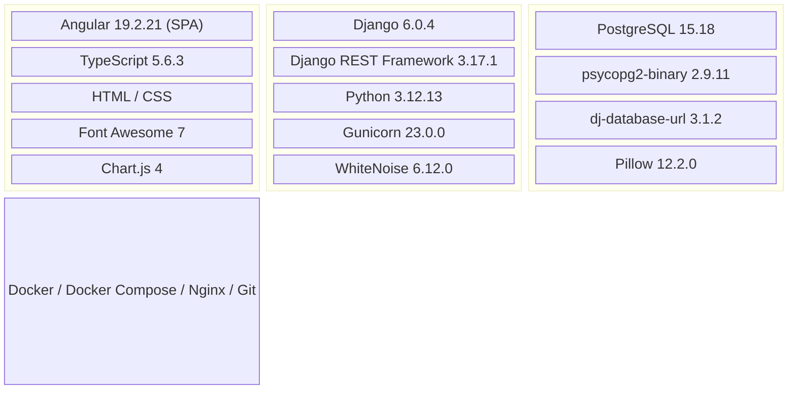

| Capa | Tecnología | Versión | Función |
|---|---|---|---|
| **Frontend** | Angular | 19.2.21 | Interfaz SPA con componentes standalone, rutas lazy y signals |
| **Frontend — Lenguaje** | TypeScript | 5.6.3 | Lenguaje tipado del frontend |
| **Frontend — Íconos** | Font Awesome | 7.2 | Librería de íconos vectoriales |
| **Frontend — Gráficos** | Chart.js | 4.5 | Librería de visualización de datos |
| **Backend — Runtime** | Python | 3.12.13 | Runtime verificado del contenedor backend |
| **Backend — Framework** | Django | 6.0.4 | Framework web y ORM |
| **Backend — API** | Django REST Framework | 3.17.1 | Autenticación, permisos, serialización y respuestas HTTP |
| **Backend — Servidor** | Gunicorn | 23.0.0 | Servidor WSGI del contenedor backend |
| **Backend — Estáticos** | WhiteNoise | 6.12.0 | Archivos estáticos en el despliegue unificado |
| **Base de datos** | PostgreSQL | 15.18 | Runtime relacional verificado en contenedor |
| **Build frontend** | Node.js | 20 Alpine | Compilación reproducible; no permanece en la imagen Nginx final |
| **Contenedorización** | Docker | Host compatible | Empaquetado y ejecución de servicios |
| **Orquestación** | Docker Compose | v2 | Definición y levantamiento multi-contenedor |
| **Servidor web (frontend)** | Nginx | 1.31.3 / Alpine 3.24.1 | Archivos estáticos, media y proxy inverso `/api/` |
| **Control de versiones** | Git + GitHub | — | Repositorio remoto privado |

### 3.2 Patrón de arquitectura: MVC con API REST desacoplada

El sistema parte del patrón **Modelo-Vista-Controlador (MVC)**, adaptado a una arquitectura cliente-servidor desacoplada y complementado con servicios de aplicación, componentes compartidos y persistencia relacional:

| Capa MVC | Implementación en SofInventory | Ubicación |
|---|---|---|
| **Presentación** | Páginas Angular standalone cargadas bajo demanda; formularios reactivos, tablas, Dashboard y modales responsive | `frontend/src/app/pages/` |
| **Frontend compartido** | Guards, interceptor, servicios API, notificaciones, temas, ubicación, validación y ayuda contextual | `frontend/src/app/core/`, `frontend/src/app/shared/` |
| **Control HTTP** | Vistas DRF que reciben solicitudes, aplican autenticación/permisos y componen respuestas | `backend/*/views.py` |
| **Dominio** | Servicios transaccionales de inventario, snapshots de empresa y agregación del Dashboard | `backend/inventario/services.py`, `backend/empresa/services.py`, `backend/dashboard/services.py` |
| **Persistencia** | Modelos, restricciones, claves foráneas, índices y transacciones PostgreSQL | `backend/*/models.py`, `backend/*/migrations/` |

> **Decisión arquitectónica:** las vistas no deben convertirse en la única ubicación de las reglas críticas. Las escrituras de existencias pasan por `ServicioInventario`, que usa transacciones y bloqueos de fila; Angular concentra comportamientos transversales en elementos compartidos para evitar duplicación entre formularios.

### 3.3 Aplicaciones (Apps) del backend

El backend se organiza en **nueve aplicaciones instaladas de dominio** y un módulo de catálogos locales incluido en el enrutamiento. `config` concentra la configuración transversal:

| # | App Django | Modelo(s) | Tabla(s) PostgreSQL | Función |
|---|---|---|---|---|
| 1 | `usuarios` | TipoDocumento, Rol, Usuario, SesionAPI, IntentoFallidoLogin | `tipos_documento`, `roles`, `usuarios`, `sesiones_api`, `intentos_fallidos_login` | Gestión de usuarios, roles, autenticación y sesiones |
| 2 | `productos` | Categoria, Producto | `categorias`, `productos` | Catálogo de productos y categorías |
| 3 | `proveedores` | Proveedor | `proveedores` | Gestión de proveedores |
| 4 | `clientes` | Cliente | `clientes` | Clientes naturales y jurídicos |
| 5 | `compras` | Compra, DetalleCompra | `compras`, `detalle_compras` | Registro de compras y detalle |
| 6 | `ventas` | Venta, DetalleVenta | `ventas`, `detalle_ventas` | Punto de venta y detalle |
| 7 | `inventario` | Almacen, StockAlmacen, MovimientoInventario, Traslado, TrasladoDetalle, ConfiguracionRangosStock | `almacenes`, `stock_almacen`, `movimientos_inventario`, `traslados`, `traslados_detalle`, `configuracion_rangos_stock` | Control de inventario, almacenes y movimientos |
| 8 | `dashboard` | — | — | Agrega datos de los módulos para indicadores |
| 9 | `empresa` | Empresa | `configuracion_empresa` | Configuración singleton y snapshots para comprobantes |
| — | `catalogos` | — | — | Catálogo territorial local y validación segura de archivos; no define tablas propias |

El frontend se estructura por páginas standalone (`pages`), elementos transversales (`shared`) y servicios de infraestructura (`core`). Los detalles y ejemplos de código se mantienen en [Arquitectura Frontend](./frontend-architecture.md) y [Estándares de Codificación](./coding-standards.md).

### 3.4 Variables de entorno

El sistema utiliza archivos `.env` para la configuración de cada componente. Las variables están documentadas en la sección de despliegue. Los archivos `.env` **nunca se suben al repositorio** (excluidos por `.gitignore`).

> 📄 **Documentación complementaria:** consulte [Arquitectura Frontend](./frontend-architecture.md), [Estándares de Codificación](./coding-standards.md) y el anexo [Arquitectura_Software_Patrón_Diseño_Seleccionado.pdf](./Arquitectura_Software_Patrón_Diseño_Seleccionado.pdf). Los documentos históricos deben interpretarse junto con el código y este manual actualizado.

### 3.5 Principales Endpoints de la API REST

A modo de referencia rápida, los siguientes son los endpoints principales expuestos por el backend. Todos, salvo el de autenticación, requieren un token de sesión válido en la cabecera de la solicitud.

| Método | Endpoint | Descripción |
|---|---|---|
| `POST` | `/api/auth/login/` | Autentica un usuario y devuelve el token de sesión |
| `POST` | `/api/auth/logout/` | Invalida el token de sesión activo |
| `GET` | `/api/auth/me/` | Devuelve la identidad pública de la sesión actual |
| `POST / GET` | `/api/usuarios/crear/` · `/api/usuarios/listar/` | Crea o lista usuarios |
| `PUT / DELETE / PATCH` | `/api/usuarios/editar/{id}/` · `/api/usuarios/eliminar/{id}/` · `/api/usuarios/estado/{id}/` | Administra una cuenta según permisos |
| `PATCH / GET` | `/api/usuarios/desbloquear/{id}/` · `/api/usuarios/auditoria/` | Desbloquea cuentas y consulta auditoría |
| `GET` | `/api/roles/listar/` · `/api/tipos-documento/listar/` · `/api/roles/reporte/` | Catálogos y reporte de roles |
| `POST / GET / DELETE` | `/api/categorias/crear/` · `/api/categorias/listar/` · `/api/categorias/eliminar/{id}/` | Gestiona categorías |
| `POST / GET` | `/api/productos/crear/` · `/api/productos/listar/` | Crea y lista productos |
| `PUT|PATCH / PATCH` | `/api/productos/editar/{id}/` · `/api/productos/cambiar-estado/{id}/` | Edita o activa/inactiva productos |
| `PUT|PATCH` | `/api/productos/configurar/{id}/` | Completa la configuración de un producto pendiente |
| `POST / GET / PUT / DELETE / PATCH` | `/api/proveedores/crear/` · `/listar/` · `/editar/{id}/` · `/eliminar/{id}/` · `/estado/{id}/` | Gestiona proveedores |
| `POST / GET / PUT / DELETE / PATCH` | `/api/clientes/crear/` · `/listar/` · `/editar/{id}/` · `/eliminar/{id}/` · `/estado/{id}/` | Gestiona clientes |
| `POST / GET / GET / PATCH` | `/api/compras/registrar/` · `/api/compras/listar/` · `/api/compras/detalle/{id}/` · `/api/compras/anular/{id}/` | Registra, consulta y anula compras |
| `POST / GET / GET / PATCH` | `/api/ventas/crear/` · `/api/ventas/listar/` · `/api/ventas/detalle/{id}/` · `/api/ventas/anular/{id}/` | Registra, consulta y anula ventas |
| `POST / GET / PUT / DELETE` | `/api/inventario/almacenes/crear/` · `/api/inventario/almacenes/listar/` · `/api/inventario/almacenes/editar/{id}/` · `/api/inventario/almacenes/eliminar/{id}/` | Gestiona almacenes |
| `GET / POST` | `/api/inventario/stock/listar/` · `/stock/movimiento/` | Consulta stock y registra entrada, salida o transferencia |
| `GET` | `/api/inventario/movimientos/listar/` · `/api/inventario/stock/estadisticas/` · `/api/inventario/stock/alertas/` · `/api/inventario/stock/por-almacen/` · `/api/inventario/stock/exportar/` | Historial, métricas, alertas, consulta por almacén y CSV |
| `GET` | `/api/catalogos/ubicaciones/colombia/` | Entrega el catálogo territorial local autenticado |
| `GET / POST / PUT / PATCH` | `/api/empresa/` | Consulta o administra la única configuración de empresa |
| `GET` | `/api/dashboard/` | Devuelve métricas, periodos, series y reglas de cálculo del Dashboard |

> **Nota.** Las rutas anteriores reflejan los archivos `urls.py` actuales; SofInventory no utiliza un router REST convencional para estos módulos. La tabla es una referencia, no sustituye la [matriz de cobertura](./test-cases/MATRIZ_COBERTURA.md).

### 3.6 Autenticación, sesiones y permisos

- `APITokenAuthentication` recibe `Authorization: Bearer <token>` y valida que la sesión esté activa, vigente y asociada a un usuario activo.
- Cada inicio de sesión correcto invalida las sesiones activas anteriores del mismo usuario; la sesión nueva expira a las **12 horas**.
- Cinco credenciales inválidas acumuladas bloquean la cuenta; el endpoint de Login tiene limitación configurable por IP (`LOGIN_THROTTLE_RATE`, por defecto `5/min`).
- `require_roles(...)` aplica autorización en el backend. Los guards y la visibilidad del menú mejoran la experiencia, pero no sustituyen ese control.
- Los roles operativos vigentes son **Administrador, Supervisor, Vendedor y Bodega**. Usuarios y Empresa son áreas administrativas; Compras e Inventario habilitan operaciones específicas para Bodega; Ventas habilita Vendedor.
- Creación, edición, cambios de rol/estado, desbloqueo y eliminación de usuarios generan registros en `auditoria_usuarios` sin guardar contraseñas ni tokens.

!!! danger "Manejo de secretos"
    Nunca copie tokens, contraseñas, `SECRET_KEY`, encabezados `Authorization` ni valores reales de `.env` en capturas, incidencias o documentación. Las evidencias del repositorio usan datos ficticios y salidas sanitizadas.

### 3.7 Validación, integridad y experiencia compartida

| Área | Implementación vigente |
|---|---|
| Texto semántico | Normalización de espacios y validadores para nombres de personas, lugares, cargos, nombres comerciales y usernames |
| Documentos | Reglas por tipo (`CC`, `CE`, `TI`, `NIT`, `PA`) y unicidad en módulos aplicables |
| Contraseñas | Validadores de Django, longitud mínima, rechazo de contraseñas comunes/numéricas/similares, confirmación y hash |
| Imágenes | Inspección de contenido, formato, tamaño y dimensiones; rutas seguras para Producto y Empresa |
| Ubicación | Componente Angular reutilizable y catálogo local de 33 territorios y 1.122 municipios de Colombia; modo manual para exterior |
| Formularios | Resumen de errores, errores por campo, notificaciones y validaciones compartidas sin sustituir la validación del backend |
| Ayuda contextual | Configuración central para 12 operaciones en 10 formularios; panel lateral/inferior, `Esc`, retorno de foco y estado efímero |
| Temas | Claro, Azul y Oscuro mediante variables CSS; selección persistida como preferencia visual |

### 3.8 Sistema visual, accesibilidad y responsive

La interfaz usa tokens semánticos en `frontend/src/styles.css`; los componentes deben consumir variables y no repetir colores fijos:

| Tema | Fondo principal | Superficie | Acento | Texto principal |
|---|---|---|---|---|
| Oscuro | `#0c0e14` | `#161923` | `#22d3c8` | `#eef0f8` |
| Claro | `#f3f5fb` | `#ffffff` | `#2563eb` | `#1c2333` |
| Azul | `#0f172a` | `#16223a` | `#38bdf8` | `#eaf1ff` |

- Los controles interactivos usan elementos nativos, estados `:focus-visible`, etiquetas accesibles y mensajes que no dependen solo del color.
- Los modales limitan su altura y mantienen scroll interno; a `768px` o menos se alinean al borde inferior y reducen espaciados.
- El botón de ayuda muestra icono y texto en escritorio y conserva etiqueta accesible cuando el texto se oculta en móvil.
- `Esc` cierra primero la ayuda abierta, detiene la propagación y evita cerrar por accidente el formulario principal.
- La preferencia de tema se guarda bajo `sof_inventory_theme`; la ayuda y los datos del formulario no se guardan en almacenamiento del navegador.

Consulte [Guía visual de accesibilidad](./accessibility-visual-guide.md) para criterios de contraste, teclado, lectores de pantalla, zoom y comprobación manual.

---

## 4. Diagrama y descripción de casos de uso

### 4.1 Diagrama de casos de uso general


El diagrama resume los flujos principales. La autorización efectiva se define por endpoint en el backend; que una opción no aparezca en el menú no concede ni revoca por sí sola un permiso.

### 4.2 Descripción de casos de uso principales

#### CU-001: Iniciar sesión

| Campo | Descripción |
|---|---|
| **Nombre** | Iniciar Sesión |
| **ID** | CU-001 |
| **Actor** | Todos los usuarios del sistema |
| **Precondiciones** | El usuario tiene credenciales válidas registradas en la base de datos |
| **Flujo Principal** | 1. El usuario abre Login → 2. Envía username y contraseña → 3. El backend valida cuenta, hash y límite de intentos → 4. Invalida cualquier sesión activa anterior → 5. Crea una sesión de 12 horas → 6. Angular conserva la sesión y redirige al Dashboard |
| **Flujo Alternativo** | Si la cuenta está bloqueada: el sistema muestra un mensaje de bloqueo y no permite el intento |
| **Flujo de Excepción** | Las credenciales inválidas devuelven un mensaje genérico; al quinto intento acumulado la cuenta se bloquea. El throttle por IP puede responder 429 cuando se supera la tasa configurada. |
| **Postcondiciones** | El usuario queda autenticado con un token activo; se inicia sesión en la tabla `sesiones_api` |

#### CU-002: Gestionar usuarios

| Campo | Descripción |
|---|---|
| **Nombre** | Gestionar Usuarios |
| **ID** | CU-002 |
| **Actor** | Administrador |
| **Precondiciones** | El administrador está autenticado con token activo |
| **Flujo Principal** | 1. Administración abre Usuarios → 2. Crea o edita identidad, documento, correo, username y rol → 3. En alta valida contraseña y confirmación → 4. El backend valida semántica, unicidad y política de contraseña → 5. Guarda el hash → 6. Registra el evento de auditoría |
| **Flujo Alternativo** | Edición: se carga el formulario con los datos existentes del usuario |
| **Flujo de Excepción** | Documento, email o username duplicados; contraseña débil; rol inexistente; intento de eliminar el último Administrador o de operar sin rol Administrador |
| **Postcondiciones** | Se actualizan `usuarios` y `auditoria_usuarios`; un cambio de estado o contraseña revoca las sesiones activas cuando corresponde |

#### CU-003: Registrar productos

| Campo | Descripción |
|---|---|
| **Nombre** | Registrar Productos |
| **ID** | CU-003 |
| **Actor** | Administrador, Supervisor |
| **Precondiciones** | El usuario tiene permisos; existen categorías registradas |
| **Flujo Principal** | 1. El usuario prepara nombre, marca, referencia, unidad, categoría y valores comerciales → 2. El backend normaliza y valida → 3. Genera el SKU a partir de nombre, marca y referencia → 4. Crea el producto con stock 0 y estado `pendiente` → 5. Una configuración posterior puede activarlo |
| **Flujo Alternativo** | Adjuntar una imagen PNG, JPG, JPEG o WebP válida; reemplazarla o retirarla durante una edición |
| **Flujo de Excepción** | Combinación que produce SKU duplicado; valores negativos; IVA fuera de 0–100; imagen inválida o categoría inexistente |
| **Postcondiciones** | El producto queda en catálogo; las existencias solo cambian mediante Compra, Venta o Movimiento de inventario |

#### CU-004: Registrar compras

| Campo | Descripción |
|---|---|
| **Nombre** | Registrar Compras |
| **ID** | CU-004 |
| **Actor** | Administrador, Supervisor, Operador de Bodega |
| **Precondiciones** | Sesión con rol Administrador, Supervisor o Bodega; proveedor y almacén activos; productos registrados |
| **Flujo Principal** | 1. Selecciona proveedor y almacén receptor → 2. Registra factura, fecha y tipo → 3. Agrega productos, cantidades, costos e IVA → 4. El servidor recalcula totales → 5. En una transacción crea cabecera, snapshots y detalles → 6. Incrementa stock y registra `ENTRADA_COMPRA` → 7. Actualiza costo e IVA del producto |
| **Flujo de Excepción** | Si la factura ya existe: el sistema muestra error de duplicado |
| **Postcondiciones** | Compra, detalles, stock y movimientos se confirman juntos; una anulación autorizada crea movimientos de reversión si aún existe stock suficiente |

#### CU-005: Registrar ventas

| Campo | Descripción |
|---|---|
| **Nombre** | Registrar Ventas (Punto de Venta) |
| **ID** | CU-005 |
| **Actor** | Administrador, Supervisor, Vendedor |
| **Precondiciones** | El usuario está autenticado; existen productos con stock > 0 |
| **Flujo Principal** | 1. Selecciona almacén y cliente o Cliente General → 2. Agrega productos y cantidades → 3. El servidor toma precio e IVA vigentes y valida stock → 4. Recalcula subtotal, descuento, IVA y total → 5. Valida efectivo cuando aplica → 6. Crea venta, snapshots y detalles → 7. Descuenta stock y registra `SALIDA_VENTA` → 8. Genera `VTA-XXXXX` y comprobante |
| **Flujo Alternativo** | Si el cliente es "General" (sin identificación): el campo `cliente` queda en null |
| **Flujo de Excepción** | Si el stock es insuficiente: el sistema muestra alerta y previene la venta |
| **Postcondiciones** | Las tablas `ventas`, `detalle_ventas`, `stock_almacen` y `movimientos_inventario` se actualizan; se genera el comprobante de venta |

#### CU-006: Consultar inventario

| Campo | Descripción |
|---|---|
| **Nombre** | Consultar Inventario |
| **ID** | CU-006 |
| **Actor** | Todos los usuarios autenticados |
| **Precondiciones** | El usuario está autenticado |
| **Flujo Principal** | 1. Consulta stock consolidado o por almacén → 2. Filtra por producto, categoría, estado o nivel → 3. Consulta movimientos → 4. Registra entrada, salida o transferencia si su rol lo permite → 5. Puede exportar CSV con rol Administrador, Supervisor o Bodega |
| **Postcondiciones** | Se obtiene información actualizada del inventario sin modificaciones |

#### CU-007: Gestionar almacenes

| Campo | Descripción |
|---|---|
| **Nombre** | Gestionar Almacenes |
| **ID** | CU-007 |
| **Actor** | Administrador, Supervisor, Bodega para crear/editar; Administrador o Supervisor para eliminar |
| **Precondiciones** | El usuario tiene permisos |
| **Flujo Principal** | 1. El usuario accede a Inventario → 2. Crea o edita nombre, código, dirección, responsable, teléfono, capacidad, estado y notas → 3. El backend valida nombre/código únicos y capacidad no negativa → 4. Guarda el almacén |
| **Postcondiciones** | El almacén queda disponible para recibir stock y registrar movimientos |

#### CU-008: Transferir inventario

| Campo | Descripción |
|---|---|
| **Actor** | Administrador, Supervisor, Bodega |
| **Precondiciones** | Producto y ambos almacenes activos; origen y destino diferentes; stock suficiente en origen |
| **Flujo Principal** | El servicio bloquea producto, almacenes y stocks en orden estable; descuenta origen, incrementa destino, crea el traslado completado y dos movimientos vinculados dentro de la misma transacción |
| **Flujo de Excepción** | Cantidad no positiva, almacén inactivo/inexistente, capacidad excedida, mismo origen/destino o stock insuficiente |
| **Postcondiciones** | La suma total del producto no cambia; sí cambia su distribución por almacén y queda trazabilidad completa |

#### CU-009: Configurar empresa

| Campo | Descripción |
|---|---|
| **Actor** | Administrador |
| **Precondiciones** | Sesión administrativa válida |
| **Flujo Principal** | Consulta o crea la única configuración; actualiza identidad, ubicación, contacto, logo, moneda, prefijo y mensaje; los documentos nuevos guardan un snapshot de los datos vigentes |
| **Flujo de Excepción** | Segundo `POST`, edición sin configuración previa, rol no autorizado o imagen inválida |
| **Postcondiciones** | Los comprobantes nuevos reflejan la configuración actual y los históricos conservan su snapshot |

📌 **Nota:** El anexo [Diagramas y plantillas de casos de uso](./Diagramas_Plantillas_casos_de_uso_del_proyecto.pdf) conserva el diseño histórico. Para validar el comportamiento vigente utilice este manual y la [matriz de cobertura](./test-cases/MATRIZ_COBERTURA.md).
---

## 5. Modelo Entidad-Relación (Base de Datos)

### 5.1 Descripción general del modelo

El modelo entidad-relación de SofInventory está diseñado bajo los principios de:

- **Normalización en Tercera Forma Normal (3FN):** Eliminación de redundancias y dependencias transitivas
- **Integridad referencial:** Claves foráneas con acciones `ON DELETE PROTECT` o `CASCADE` según el caso
- **Restricciones de dominio:** Validaciones a nivel de base de datos
- **Índices optimizados:** Para consultas frecuentes y relaciones principales

### 5.2 Modelo de dominio vigente

Figura 1.
Diagrama MER
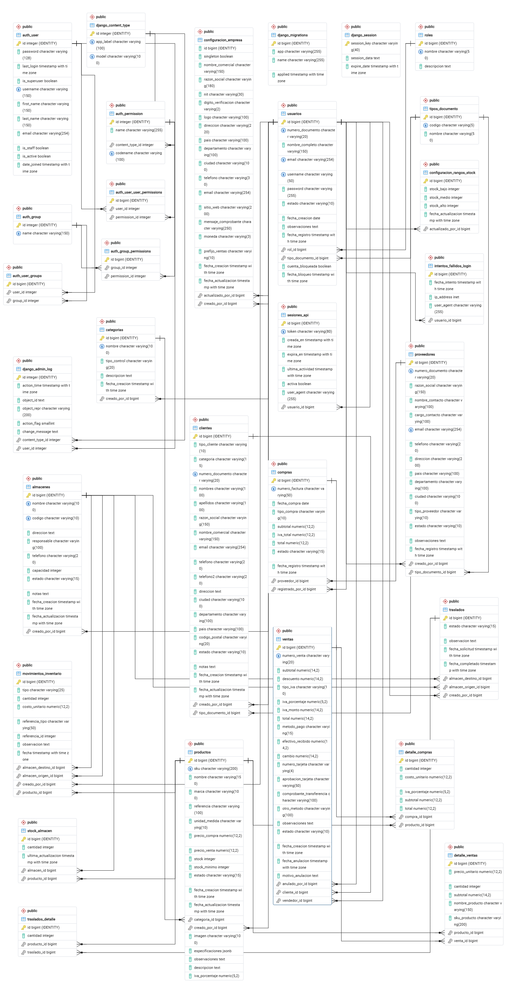

El diagrama representa relaciones de dominio. `empresa_snapshot` es un valor JSON histórico dentro de Compra y Venta, no una clave foránea: se dibuja como relación conceptual para explicar su procedencia. Las tablas internas de Django (`django_migrations`, permisos, sesiones administrativas y contenido) no forman parte del dominio funcional y se omiten para facilitar la lectura.

### 5.3 Relaciones principales del modelo

| Relación | Cardinalidad | Descripción |
|---|---|---|
| TipoDocumento → Usuarios | 1:N | Un tipo de documento puede tener múltiples usuarios |
| Rol → Usuarios | 1:N | Un rol puede asignarse a múltiples usuarios |
| Categoría → Productos | 1:N | Una categoría agrupa múltiples productos |
| Producto → StockAlmacen | 1:N | Un producto tiene stock en múltiples almacenes |
| Almacén → StockAlmacen | 1:N | Un almacén contiene stock de múltiples productos |
| Producto → MovimientoInventario | 1:N | Un producto genera múltiples movimientos |
| Almacén → MovimientoInventario | 1:N | Un almacén es origen o destino de múltiples movimientos |
| Proveedor → Compras | 1:N | Un proveedor realiza múltiples compras |
| Compra → DetalleCompra | 1:N | Una compra contiene múltiples detalles |
| Producto → DetalleCompra | 1:N | Un producto aparece en múltiples detalles de compra |
| Cliente → Ventas | 1:N | Un cliente realiza múltiples compras |
| Venta → DetalleVenta | 1:N | Una venta contiene múltiples detalles |
| Producto → DetalleVenta | 1:N | Un producto se vende en múltiples ventas |
| Traslado → TrasladoDetalle | 1:N | Un traslado contiene múltiples productos |
| Usuario → SesionAPI | 1:N | Un usuario genera múltiples sesiones |
| Usuario → EventoAuditoriaUsuario | 1:N | Un usuario puede recibir o ejecutar eventos administrativos auditados |
| Almacén → Compra / Venta | 1:N | Define el destino de la entrada o el origen de la salida |
| Compra / Venta / Traslado → MovimientoInventario | 1:N | Cada operación deja movimientos vinculados y reversibles de forma auditable |
| MovimientoInventario → MovimientoInventario | 0..1:0..1 | Una devolución referencia exactamente el movimiento original que revierte |
| Empresa → Compra / Venta | Conceptual 1:N | Los datos vigentes se copian como snapshot JSON para preservar comprobantes históricos |

📊 **Especificación de base de datos:** el [MER en PDF](./Modelo_Entidad_Relacion_SofInventory_PostgreSQL.pdf) y el diccionario externo siguen disponibles como anexos históricos. Antes de usarlos para migraciones o integración, contrástelos con `backend/*/models.py` y `backend/*/migrations/`, que son la fuente vigente.
---

## 6. Diccionario de datos

### 6.1 Tabla: `usuarios`

| Campo | Tipo de Dato | Longitud | Llave | Requerido | Descripción |
|---|---|---:|---|---|---|
| id | Integer (SERIAL) | — | PK | Sí | Identificador único del usuario (autogenerado) |
| tipo_documento_id | Integer | — | FK → `tipos_documento.id` | Sí | Tipo de documento de identidad del usuario |
| numero_documento | Varchar | 20 | UK | Sí | Número de documento de identidad (CC, CE, NIT) |
| nombre_completo | Varchar | 150 | — | Sí | Nombre completo del usuario |
| email | Varchar | 255 | UK | Sí | Correo electrónico único |
| username | Varchar | 50 | UK | Sí | Nombre de usuario para autenticación |
| password | Varchar | 255 | — | Sí | Contraseña cifrada con PBKDF2-SHA256 |
| rol_id | Integer | — | FK → `roles.id` | Sí | Rol asignado (Administrador, Supervisor, Vendedor o Bodega) |
| estado | Varchar | 10 | — | Sí | Estado: `activo` o `inactivo` (default: `activo`) |
| fecha_creacion | Date | — | — | Sí | Fecha de creación (auto_now_add) |
| observaciones | Text | — | — | No | Observaciones adicionales del usuario |
| fecha_registro | Datetime | — | — | Sí | Fecha y hora de registro (auto_now_add) |
| cuenta_bloqueada | Boolean | — | — | No | Indica si la cuenta está bloqueada (default: false) |
| fecha_bloqueo | Datetime | — | — | No | Fecha y hora del último bloqueo |

### 6.2 Tabla: `tipos_documento`

| Campo | Tipo de Dato | Longitud | Llave | Requerido | Descripción |
|---|---|---:|---|---|---|
| id | Integer (SERIAL) | — | PK | Sí | Identificador único del tipo de documento |
| codigo | Varchar | 5 | UK | Sí | Código del tipo (CC, CE, NIT) |
| nombre | Varchar | 50 | — | Sí | Nombre completo del tipo de documento |

### 6.3 Tabla: `roles`

| Campo | Tipo de Dato | Longitud | Llave | Requerido | Descripción |
|---|---|---:|---|---|---|
| id | Integer (SERIAL) | — | PK | Sí | Identificador único del rol |
| nombre | Varchar | 50 | UK | Sí | Nombre del rol (Administrador, Supervisor, Vendedor o Bodega) |
| descripcion | Text | — | — | No | Descripción detallada del rol |

### 6.4 Tabla: `productos`

| Campo | Tipo de Dato | Longitud | Llave | Requerido | Descripción |
|---|---|---:|---|---|---|
| id | Integer (SERIAL) | — | PK | Sí | Identificador único del producto |
| sku | Varchar | 200 | UK | Sí | Código SKU único del producto |
| nombre | Varchar | 150 | — | Sí | Nombre comercial del producto |
| marca | Varchar | 100 | — | Sí | Marca del producto |
| referencia | Varchar | 100 | — | Sí | Referencia interna del fabricante |
| unidad_medida | Varchar | 10 | — | Sí | Unidad: Unidad, Caja, Metro, Litro, Galón, Rollo, Bulto, Kilo |
| categoria_id | Integer | — | FK → `categorias.id` | Sí | Categoría del producto |
| precio_compra | Decimal | 12,2 | — | No | Precio de compra unitario (default: 0) |
| precio_venta | Decimal | 12,2 | — | No | Precio de venta unitario (default: 0) |
| iva_porcentaje | Decimal | 5,2 | — | No | Porcentaje de IVA (default: 0) |
| stock | Integer | — | — | No | Stock actual del producto (default: 0) |
| stock_minimo | Integer | — | — | No | Stock mínimo de seguridad (default: 0) |
| descripcion | Text | — | — | No | Descripción detallada del producto |
| observaciones | Text | — | — | No | Notas internas |
| especificaciones | JSONField | — | — | No | Especificaciones técnicas en formato JSON |
| estado | Varchar | 15 | — | Sí | Estado: `pendiente`, `activo`, `inactivo` |
| creado_por_id | Integer | — | FK → `usuarios.id` | Sí | Usuario que creó el registro |
| fecha_creacion | Datetime | — | — | Sí | Fecha de creación (auto_now_add) |
| fecha_actualizacion | Datetime | — | — | Sí | Última actualización (auto_now) |
| imagen | ImageField | 255 | — | No | Ruta de imagen del producto (`productos/`) |

> `productos.stock` es una caché sincronizada. La fuente operativa por ubicación es `stock_almacen`; las escrituras deben realizarse mediante `ServicioInventario`.

### 6.5 Tabla: `categorias`

| Campo | Tipo de Dato | Longitud | Llave | Requerido | Descripción |
|---|---|---:|---|---|---|
| id | Integer (SERIAL) | — | PK | Sí | Identificador único de la categoría |
| nombre | Varchar | 100 | UK | Sí | Nombre de la categoría |
| tipo_control | Varchar | 20 | — | Sí | Tipo: GENERAL, HERRAMIENTA, ELECTRICO, LIQUIDO, TORNILLERIA |
| descripcion | Text | — | — | No | Descripción de la categoría |
| creado_por_id | Integer | — | FK → `usuarios.id` | Sí | Usuario que creó la categoría |
| fecha_creacion | Datetime | — | — | Sí | Fecha de creación (auto_now_add) |

### 6.6 Tabla: `proveedores`

| Campo | Tipo de Dato | Longitud | Llave | Requerido | Descripción |
|---|---|---:|---|---|---|
| id | Integer (SERIAL) | — | PK | Sí | Identificador único del proveedor |
| tipo_documento_id | Integer | — | FK → `tipos_documento.id` | Sí | Tipo de documento del proveedor |
| numero_documento | Varchar | 20 | UK | Sí | Número de documento (CC o NIT) |
| razon_social | Varchar | 150 | UK (CI) | Sí | Razón social o nombre del proveedor |
| nombre_contacto | Varchar | 100 | — | Sí | Nombre de la persona de contacto |
| cargo_contacto | Varchar | 100 | — | No | Cargo del contacto |
| email | Varchar | 255 | UK | Sí | Correo electrónico del proveedor |
| telefono | Varchar | 20 | — | Sí | Teléfono de contacto |
| direccion | Varchar | 200 | — | Sí | Dirección física |
| pais | Varchar | 100 | — | Sí | País de origen |
| departamento | Varchar | 100 | — | Sí | Departamento/Estado |
| ciudad | Varchar | 100 | — | Sí | Ciudad |
| tipo_proveedor | Varchar | 10 | — | Sí | Tipo: Bienes, Servicios, Mixto |
| estado | Varchar | 10 | — | Sí | Estado: Activo, Inactivo |
| observaciones | Text | — | — | No | Notas adicionales |
| creado_por_id | Integer | — | FK → `usuarios.id` | Sí | Usuario que registró el proveedor |
| fecha_registro | Datetime | — | — | Sí | Fecha de registro (auto_now_add) |

### 6.7 Tabla: `clientes`

| Campo | Tipo de Dato | Longitud | Llave | Requerido | Descripción |
|---|---|---:|---|---|---|
| id | Integer (SERIAL) | — | PK | Sí | Identificador único del cliente |
| tipo_cliente | Varchar | 10 | — | Sí | Tipo: natural, juridica |
| categoria | Varchar | 15 | — | Sí | Categoría: general, minorista, mayorista, corporativo |
| tipo_documento_id | Integer | — | FK → `tipos_documento.id` | Sí | Tipo de documento |
| numero_documento | Varchar | 20 | UK | Sí | Número de documento |
| nombres | Varchar | 100 | — | No | Nombres (persona natural) |
| apellidos | Varchar | 100 | — | No | Apellidos (persona natural) |
| razon_social | Varchar | 150 | — | No | Razón social (persona jurídica) |
| nombre_comercial | Varchar | 150 | — | No | Nombre comercial (persona jurídica) |
| email | Varchar | 255 | — | No | Correo electrónico |
| telefono | Varchar | 20 | — | No | Teléfono principal |
| telefono2 | Varchar | 20 | — | No | Teléfono secundario |
| direccion | Text | — | — | No | Dirección física |
| ciudad | Varchar | 100 | — | No | Ciudad |
| departamento | Varchar | 100 | — | No | Departamento/Estado |
| pais | Varchar | 100 | — | No | País (default: Colombia) |
| codigo_postal | Varchar | 20 | — | No | Código postal |
| estado | Varchar | 10 | — | Sí | Estado: activo, inactivo, bloqueado |
| notas | Text | — | — | No | Notas adicionales |
| creado_por_id | Integer | — | FK → `usuarios.id` | Sí | Usuario que registró el cliente |
| fecha_creacion | Datetime | — | — | Sí | Fecha de creación (auto_now_add) |
| fecha_actualizacion | Datetime | — | — | Sí | Última actualización (auto_now) |

### 6.8 Tabla: `compras`

| Campo | Tipo de Dato | Longitud | Llave | Requerido | Descripción |
|---|---|---:|---|---|---|
| id | Integer (SERIAL) | — | PK | Sí | Identificador único de la compra |
| proveedor_id | Integer | — | FK → `proveedores.id` | Sí | Proveedor de la compra |
| numero_factura | Varchar | 50 | UK | Sí | Número de factura del proveedor |
| fecha_compra | Date | — | — | Sí | Fecha de la compra |
| tipo_compra | Varchar | 10 | — | Sí | Tipo: Contado, Credito |
| subtotal | Decimal | 12,2 | — | No | Subtotal de la compra (default: 0) |
| iva_total | Decimal | 12,2 | — | No | Total de IVA (default: 0) |
| total | Decimal | 12,2 | — | No | Total de la compra (default: 0) |
| estado | Varchar | 15 | — | Sí | Estado: pendiente, completada, anulada |
| almacen_id | Integer | — | FK → `almacenes.id` | No a nivel de esquema; requerido por el flujo actual | Almacén receptor de la compra |
| registrado_por_id | Integer | — | FK → `usuarios.id` | Sí | Usuario que registró la compra |
| fecha_registro | Datetime | — | — | Sí | Fecha de registro (auto_now_add) |
| fecha_anulacion | Datetime | — | — | No | Momento de la anulación |
| anulado_por_id | Integer | — | FK → `usuarios.id` | No | Usuario que anuló la compra |
| motivo_anulacion | Text | — | — | No | Justificación de anulación |
| observaciones | Text | — | — | No | Notas de la compra |
| empresa_snapshot | JSONField | — | — | Sí | Copia histórica de identidad y contacto de la empresa |

### 6.9 Tabla: `detalle_compras`

| Campo | Tipo de Dato | Longitud | Llave | Requerido | Descripción |
|---|---|---:|---|---|---|
| id | Integer (SERIAL) | — | PK | Sí | Identificador único del detalle |
| compra_id | Integer | — | FK → `compras.id` | Sí | Compra a la que pertenece |
| producto_id | Integer | — | FK → `productos.id` | Sí | Producto comprado |
| nombre_producto | Varchar | 150 | — | Sí | Nombre histórico del producto |
| sku_producto | Varchar | 200 | — | Sí | SKU histórico del producto |
| cantidad | Integer | — | — | Sí | Cantidad adquirida |
| costo_unitario | Decimal | 12,2 | — | Sí | Costo por unidad |
| iva_porcentaje | Decimal | 5,2 | — | No | Porcentaje de IVA (default: 0) |
| subtotal | Decimal | 12,2 | — | Sí | Subtotal (cantidad × costo_unitario) |
| total | Decimal | 12,2 | — | Sí | Total con IVA |

### 6.10 Tabla: `ventas`

| Campo | Tipo de Dato | Longitud | Llave | Requerido | Descripción |
|---|---|---:|---|---|---|
| id | Integer (SERIAL) | — | PK | Sí | Identificador único de la venta |
| numero_venta | Varchar | 20 | UK | Sí | Número de venta (auto: VTA-XXXXX) |
| cliente_id | Integer | — | FK → `clientes.id` | No | Cliente (null = Cliente General) |
| vendedor_id | Integer | — | FK → `usuarios.id` | Sí | Vendedor que realizó la venta |
| almacen_id | Integer | — | FK → `almacenes.id` | No a nivel de esquema; requerido por el flujo actual | Almacén del que se descuenta el stock |
| subtotal | Decimal | 14,2 | — | No | Subtotal (default: 0) |
| descuento | Decimal | 14,2 | — | No | Descuento aplicado (default: 0) |
| tipo_iva | Varchar | 10 | — | No | Tipo: automatico, manual (default: automatico) |
| iva_porcentaje | Decimal | 5,2 | — | No | Porcentaje IVA (default: 19) |
| iva_monto | Decimal | 14,2 | — | No | Monto del IVA (default: 0) |
| total | Decimal | 14,2 | — | No | Total de la venta (default: 0) |
| metodo_pago | Varchar | 15 | — | Sí | Efectivo, debito, credito, transferencia, nequi, daviplata, otro |
| efectivo_recibido | Decimal | 14,2 | — | No | Efectivo recibido del cliente |
| cambio | Decimal | 14,2 | — | No | Cambio devuelto |
| numero_tarjeta | Varchar | 4 | — | No | Últimos 4 dígitos de tarjeta |
| aprobacion_tarjeta | Varchar | 50 | — | No | Código de aprobación de tarjeta |
| comprobante_transferencia | Varchar | 100 | — | No | Número de comprobante de transferencia |
| otro_metodo | Varchar | 100 | — | No | Descripción de otro método de pago |
| observaciones | Text | — | — | No | Observaciones de la venta |
| estado | Varchar | 10 | — | Sí | Estado: completada, anulada |
| fecha_creacion | Datetime | — | — | Sí | Fecha de creación (auto_now_add) |
| fecha_anulacion | Datetime | — | — | No | Fecha de anulación |
| anulado_por_id | Integer | — | FK → `usuarios.id` | No | Usuario que anuló la venta |
| motivo_anulacion | Text | — | — | No | Motivo de la anulación |
| empresa_snapshot | JSONField | — | — | Sí | Copia histórica de la empresa usada en el comprobante |

### 6.11 Tabla: `detalle_ventas`

| Campo | Tipo de Dato | Longitud | Llave | Requerido | Descripción |
|---|---|---:|---|---|---|
| id | Integer (SERIAL) | — | PK | Sí | Identificador único del detalle |
| venta_id | Integer | — | FK → `ventas.id` | Sí | Venta a la que pertenece |
| producto_id | Integer | — | FK → `productos.id` | Sí | Producto vendido |
| precio_unitario | Decimal | 12,2 | — | Sí | Precio de venta por unidad |
| cantidad | Integer | — | — | Sí | Cantidad vendida |
| subtotal | Decimal | 14,2 | — | Sí | Subtotal (precio × cantidad) |
| iva_porcentaje | Decimal | 5,2 | — | Sí | IVA histórico aplicado a la línea |
| iva_monto | Decimal | 14,2 | — | Sí | Valor de IVA calculado para la línea |
| total | Decimal | 14,2 | — | Sí | Total histórico de la línea |
| nombre_producto | Varchar | 150 | — | Sí | Nombre del producto al momento de la venta |
| sku_producto | Varchar | 200 | — | Sí | SKU del producto al momento de la venta |

### 6.12 Tabla: `almacenes`

| Campo | Tipo de Dato | Longitud | Llave | Requerido | Descripción |
|---|---|---:|---|---|---|
| id | Integer (SERIAL) | — | PK | Sí | Identificador único del almacén |
| nombre | Varchar | 100 | UK | Sí | Nombre del almacén |
| codigo | Varchar | 10 | UK | Sí | Código único del almacén |
| direccion | Text | — | — | No | Dirección física |
| responsable | Varchar | 100 | — | No | Nombre del responsable |
| telefono | Varchar | 20 | — | No | Teléfono de contacto |
| capacidad | Integer | — | — | No | Capacidad máxima en unidades |
| estado | Varchar | 15 | — | Sí | Estado: activo, inactivo, mantenimiento |
| notas | Text | — | — | No | Notas adicionales |
| creado_por_id | Integer | — | FK → `usuarios.id` | Sí | Usuario que creó el almacén |
| fecha_creacion | Datetime | — | — | Sí | Fecha de creación (auto_now_add) |
| fecha_actualizacion | Datetime | — | — | Sí | Última actualización (auto_now) |

### 6.13 Tabla: `stock_almacen`

| Campo | Tipo de Dato | Longitud | Llave | Requerido | Descripción |
|---|---|---:|---|---|---|
| id | Integer (SERIAL) | — | PK | Sí | Identificador único del registro |
| producto_id | Integer | — | FK → `productos.id` | Sí | Producto del stock |
| almacen_id | Integer | — | FK → `almacenes.id` | Sí | Almacén del stock |
| cantidad | Integer | — | — | No | Cantidad en stock (default: 0) |
| ultima_actualizacion | Datetime | — | — | Sí | Última actualización (auto_now) |

> **Restricción:** `UNIQUE (producto_id, almacen_id)` — Un producto solo puede tener un registro de stock por almacén.

### 6.14 Tabla: `movimientos_inventario`

| Campo | Tipo de Dato | Longitud | Llave | Requerido | Descripción |
|---|---|---:|---|---|---|
| id | Integer (SERIAL) | — | PK | Sí | Identificador único del movimiento |
| tipo | Varchar | 25 | — | Sí | Tipo: ENTRADA_COMPRA, SALIDA_VENTA, TRASLADO_ENTRADA, TRASLADO_SALIDA, AJUSTE_POSITIVO, AJUSTE_NEGATIVO, DEVOLUCION_COMPRA, DEVOLUCION_VENTA |
| producto_id | Integer | — | FK → `productos.id` | Sí | Producto involucrado |
| almacen_origen_id | Integer | — | FK → `almacenes.id` | No | Almacén origen (nullable) |
| almacen_destino_id | Integer | — | FK → `almacenes.id` | No | Almacén destino (nullable) |
| cantidad | Integer | — | — | Sí | Cantidad del movimiento |
| costo_unitario | Decimal | 12,2 | — | No | Costo unitario al momento del movimiento (default: 0) |
| referencia_tipo | Varchar | 50 | — | No | Tipo de referencia (Compra, Venta, Traslado) |
| referencia_id | PositiveInteger | — | — | No | ID del registro referenciado |
| compra_id | Integer | — | FK → `compras.id` | No | Compra asociada cuando el movimiento proviene de una compra |
| venta_id | Integer | — | FK → `ventas.id` | No | Venta asociada cuando el movimiento proviene de una venta |
| traslado_id | Integer | — | FK → `traslados.id` | No | Traslado asociado a los movimientos de salida/entrada |
| movimiento_revertido_id | Integer | — | FK única → `movimientos_inventario.id` | No | Movimiento original que una devolución revierte |
| observacion | Text | — | — | No | Observación del movimiento |
| fecha | Datetime | — | — | Sí | Fecha del movimiento (auto_now_add) |
| creado_por_id | Integer | — | FK → `usuarios.id` | Sí | Usuario que registró el movimiento |

### 6.15 Tabla: `traslados`

| Campo | Tipo de Dato | Longitud | Llave | Requerido | Descripción |
|---|---|---:|---|---|---|
| id | Integer (SERIAL) | — | PK | Sí | Identificador único del traslado |
| almacen_origen_id | Integer | — | FK → `almacenes.id` | Sí | Almacén de origen |
| almacen_destino_id | Integer | — | FK → `almacenes.id` | Sí | Almacén de destino |
| estado | Varchar | 15 | — | Sí | Estado: PENDIENTE, EN_TRANSITO, COMPLETADO, ANULADO |
| observacion | Text | — | — | No | Observación del traslado |
| fecha_solicitud | Datetime | — | — | Sí | Fecha de solicitud (auto_now_add) |
| fecha_completado | Datetime | — | — | No | Fecha de completado |
| creado_por_id | Integer | — | FK → `usuarios.id` | Sí | Usuario que creó el traslado |

### 6.16 Tabla: `traslados_detalle`

| Campo | Tipo de Dato | Longitud | Llave | Requerido | Descripción |
|---|---|---:|---|---|---|
| id | Integer (SERIAL) | — | PK | Sí | Identificador único del detalle |
| traslado_id | Integer | — | FK → `traslados.id` | Sí | Traslado al que pertenece |
| producto_id | Integer | — | FK → `productos.id` | Sí | Producto trasladado |
| cantidad | Integer | — | — | Sí | Cantidad a trasladar |

### 6.17 Tabla: `sesiones_api`

| Campo | Tipo de Dato | Llave | Descripción |
|---|---|---|---|
| id | Integer | PK | Identificador de la sesión |
| usuario_id | Integer | FK → `usuarios.id` | Cuenta autenticada |
| token | Varchar(80) | UK | Token aleatorio; nunca debe registrarse en evidencias |
| creada_en / expira_en | Datetime | — | Inicio y expiración de la sesión; vigencia por defecto de 12 horas |
| ultima_actividad | Datetime | — | Última actualización de actividad |
| activa | Boolean | — | Indica si la sesión puede autenticarse |
| user_agent | Varchar(255) | — | Agente de usuario truncado para trazabilidad |

### 6.18 Tabla: `intentos_fallidos_login`

| Campo | Tipo de Dato | Llave | Descripción |
|---|---|---|---|
| id | Integer | PK | Identificador del intento |
| usuario_id | Integer | FK → `usuarios.id` | Cuenta objetivo |
| fecha_intento | Datetime | — | Momento del fallo |
| ip_address | IP | — | IP observada, si está disponible |
| user_agent | Varchar(255) | — | Agente de usuario truncado |

### 6.19 Tabla: `auditoria_usuarios`

| Campo | Tipo de Dato | Llave | Descripción |
|---|---|---|---|
| id | Integer | PK | Identificador del evento |
| usuario_id | Integer | FK nullable → `usuarios.id` | Cuenta afectada |
| usuario_nombre | Varchar(150) | — | Snapshot legible de la cuenta afectada |
| realizado_por_id | Integer | FK nullable → `usuarios.id` | Actor administrativo |
| realizado_por_nombre | Varchar(150) | — | Snapshot legible del actor |
| accion | Varchar(20) | — | Creación, edición, rol, estado, desbloqueo o eliminación |
| detalle | JSONField | — | Cambios auditables sin contraseñas ni tokens |
| fecha | Datetime | — | Momento del evento, indexado junto con la acción |

### 6.20 Tabla: `configuracion_empresa`

| Grupo de campos | Campos principales | Regla |
|---|---|---|
| Singleton | `id`, `singleton` | Solo puede existir una configuración |
| Identidad | `nombre_comercial`, `razon_social`, `nit`, `digito_verificacion` | Datos usados en comprobantes y snapshots |
| Presentación | `logo`, `mensaje_comprobante`, `prefijo_ventas`, `moneda` | Logo opcional; moneda por defecto `COP` |
| Ubicación/contacto | `direccion`, `pais`, `departamento`, `ciudad`, `telefono`, `email`, `sitio_web` | Información corporativa vigente |
| Auditoría | `creado_por_id`, `actualizado_por_id`, `fecha_creacion`, `fecha_actualizacion` | Registra responsables y fechas |

### 6.21 Tabla: `configuracion_rangos_stock`

| Campo | Tipo de Dato | Llave | Descripción |
|---|---|---|---|
| id | Integer | PK | Identificador de la configuración |
| stock_bajo / stock_medio / stock_alto | Integer | — | Umbrales configurables conservados por el modelo |
| actualizado_por_id | Integer | FK → `usuarios.id` | Responsable del último cambio |
| fecha_actualizacion | Datetime | — | Momento de actualización |

### 6.22 Restricciones operativas relevantes

- `stock_almacen` impone unicidad por producto y almacén y cantidad no negativa.
- Detalles de Compra, Venta, movimientos y traslados exigen cantidades positivas; porcentajes y totales tienen límites no negativos.
- Cada movimiento puede vincular como máximo un documento de negocio entre Compra, Venta o Traslado.
- Las anulaciones no borran documentos: crean movimientos compensatorios enlazados al original y cambian el estado de la operación.
- Las transacciones con `select_for_update()` evitan que dos escrituras concurrentes produzcan stock negativo o actualizaciones perdidas en PostgreSQL.
- Las relaciones comerciales protegidas no deben eliminarse si existen históricos; el tratamiento HTTP de esas excepciones debe probarse explícitamente.

---

## 7. Scripts de instalación y despliegue con Docker

### 7.1 Obtención del código fuente

```bash
# Clonar el repositorio del proyecto
git clone https://github.com/AlejandroSepulvedaDuarte/SofInventory.git

# Ingresar al directorio del proyecto
cd SofInventory

# Abrir en Visual Studio Code (opcional)
code .
```

### 7.2 Estructura del proyecto

```
SofInventory/
├── docker-compose.yml          # Orquestación de los 3 servicios
├── Dockerfile                  # Imagen unificada para despliegue cloud
├── .env.example               # Plantilla de variables para Compose
├── .dockerignore               # Archivos excluidos del contexto Docker
├── .gitattributes              # Configuración de line endings (LF)
│
├── backend/
│   ├── Dockerfile              # Imagen Python/Gunicorn usada por Compose
│   ├── docker-entrypoint.sh    # migrate + seed_data + collectstatic
│   ├── start.sh                # Inicio de la imagen unificada/cloud
│   ├── .env                    # Variables de entorno (NO se sube a Git)
│   ├── .env.example            # Plantilla de variables de entorno
│   ├── requirements.txt        # Dependencias Python
│   ├── manage.py               # CLI de Django
│   ├── config/                 # Configuración Django (settings, urls, wsgi)
│   ├── usuarios/               # App: Usuarios, Roles, Sesiones, Auth
│   ├── productos/              # App: Productos, Categorías
│   ├── proveedores/            # App: Proveedores
│   ├── clientes/               # App: Clientes
│   ├── compras/                # App: Compras, Detalle Compras
│   ├── ventas/                 # App: Ventas, Detalle Ventas
│   ├── inventario/             # App: Almacenes, Stock, Movimientos, Traslados
│   ├── dashboard/              # App: Métricas y series
│   ├── empresa/                # App: Configuración singleton y snapshots
│   └── catalogos/              # Ubicaciones y utilidades de imágenes
│
├── frontend/
│   ├── Dockerfile              # Build multi-stage Angular + Nginx
│   ├── docker-entrypoint.sh    # Inyección de BACKEND_URL en runtime
│   ├── nginx.conf              # Configuración Nginx (proxy reverso)
│   ├── .env.example            # Plantilla de variables del frontend
│   ├── package.json            # Dependencias Angular
│   ├── angular.json            # Configuración de build Angular
│   └── src/
│       └── app/
│           ├── core/           # Guards, Interceptors, Models, Services
│           ├── pages/          # Páginas standalone cargadas bajo demanda
│           └── shared/         # Ayuda, validación, ubicación y notificaciones
│
└── docs/                       # Documentación técnica del proyecto
```

### 7.3 Configuración de variables de entorno

#### 7.3.1 Archivos de variables para Docker Compose

Docker Compose usa dos plantillas versionadas. No documente ni comparta sus valores reales:

1. Copie `/.env.example` como `/.env`; Compose lo usa para sustituir `${POSTGRES_*}`, `${SECRET_KEY}`, hosts y credenciales de bootstrap.
2. Copie `/backend/.env.example` como `/backend/.env`; el servicio backend lo carga mediante `env_file`. Las variables declaradas en `environment:` dentro de `docker-compose.yml` tienen precedencia.

```env
POSTGRES_DB=db_backend_sofinventory
POSTGRES_USER=postgres
POSTGRES_PASSWORD=<secreto-postgresql>

SECRET_KEY=<clave-aleatoria-unica>
DEBUG=False
TIME_ZONE=America/Bogota
ALLOWED_HOSTS=localhost,127.0.0.1
CSRF_TRUSTED_ORIGINS=

# Bootstrap; defina valores privados para el entorno
INITIAL_ADMIN_USERNAME=<usuario-inicial>
INITIAL_ADMIN_PASSWORD=<secreto-inicial-o-vacio>
INITIAL_ADMIN_EMAIL=<correo-autorizado>
INITIAL_ADMIN_NOMBRE_COMPLETO=<nombre-del-responsable>
INITIAL_ADMIN_TIPO_DOCUMENTO=CC
INITIAL_ADMIN_NUMERO_DOCUMENTO=<documento-autorizado>
```

Dentro del contenedor backend, Compose completa la conexión con `DB_HOST=db`, no `localhost`. Los servicios se resuelven por nombre dentro de la red interna.

!!! warning "Secretos y bootstrap"
    Genere valores únicos para `SECRET_KEY`, `POSTGRES_PASSWORD` e `INITIAL_ADMIN_PASSWORD`. Si la contraseña inicial queda vacía, `seed_data` crea una aleatoria y la muestra una sola vez en los logs del primer arranque; no capture ni publique ese log.

| Variable | Obligatoria | Descripción |
|---|---|---|
| `SECRET_KEY` | Sí | Clave interna de Django; falta de valor impide iniciar el backend. |
| `POSTGRES_DB`, `POSTGRES_USER`, `POSTGRES_PASSWORD` | Sí | Creación y acceso al servicio PostgreSQL de Compose. |
| `DB_HOST`, `DB_PORT` | Sí en conexión separada | Servicio interno `db` y puerto `5432`. |
| `DATABASE_URL` | Alternativa | Conexión completa usada principalmente por la imagen unificada/cloud. |
| `DEBUG` | Sí | `False` fuera de desarrollo. Con `DEBUG=False`, `ALLOWED_HOSTS` no puede quedar vacío. |
| `TIME_ZONE` | Sí | Zona de negocio; por defecto `America/Bogota`, usada también por periodos del Dashboard. |
| `ALLOWED_HOSTS` | Sí en producción | Hosts atendidos por Django. No use `*` en producción. |
| `CORS_ALLOWED_ORIGINS`, `CSRF_TRUSTED_ORIGINS` | Según despliegue | Orígenes explícitamente autorizados. |
| `LOGIN_THROTTLE_RATE` | No | Tasa del endpoint Login; por defecto `5/min`. |
| `INITIAL_ADMIN_*` | Bootstrap | Datos iniciales consumidos por `seed_data`; no se deben registrar en documentación. |

#### 7.3.2 Variables del frontend

El frontend no requiere un `.env` manual en Compose. Su entrypoint sustituye `BACKEND_URL` en la configuración de Nginx y genera `assets/env.js` con `apiUrl: "/api"`; el navegador usa mismo origen y Nginx reenvía `/api/` al backend.

### 7.4 Despliegue con Docker Compose

#### 7.4.1 Verificar que Docker Desktop está en ejecución

```bash
# Verificar que el motor Docker está activo
docker info

# Si muestra información del daemon, Docker está funcionando correctamente
```

#### 7.4.2 Construir y levantar los servicios

```bash
# Construir imágenes y levantar todos los servicios en segundo plano
docker compose up --build -d
```

Este comando realiza las siguientes acciones:

1. **Construye la imagen del frontend:** compila Angular con Node.js 20 Alpine y copia el resultado a la imagen final Nginx.
2. **Construye la imagen del backend:** instala dependencias en Python 3.12 slim y prepara Gunicorn.
3. **Descarga la imagen de PostgreSQL 15 Alpine** desde Docker Hub
4. **Crea los contenedores** y los conecta a una red Docker interna
5. **Expone al host:** 80 (frontend) y 8000 (backend). PostgreSQL permanece en la red interna y no publica `ports`.
6. **Crea volúmenes persistentes:** `sofinventory_postgres_data` y `sofinventory_media_data`.
7. **Ejecuta los entrypoints:** el backend aplica migraciones, `seed_data` y `collectstatic`; el frontend configura el proxy e inicia Nginx.

#### 7.4.3 Verificar el estado de los contenedores

```bash
# Verificar estado de todos los servicios
docker compose ps
```

Resultado esperado:

```
NAME                    STATUS          PORTS
sofinventory_final_db         Up (healthy)    5432/tcp
sofinventory_final_backend    Up              0.0.0.0:8000->8000/tcp
sofinventory_final_frontend   Up              0.0.0.0:80->80/tcp
```

#### 7.4.4 Verificar los logs

```bash
# Ver logs de todos los servicios en tiempo real
docker compose logs -f

# Ver logs de un servicio específico
docker compose logs backend
docker compose logs frontend
docker compose logs db

# Ver las últimas 50 líneas de logs del backend
docker compose logs --tail 50 backend
```

#### 7.4.5 Scripts de migración de Django

Las migraciones se ejecutan automáticamente al iniciar el contenedor backend. Si necesita ejecutarlas manualmente:

```bash
# Ejecutar migraciones de Django
docker compose exec backend python manage.py migrate --noinput

# Cargar datos iniciales (roles, tipos de documento, admin)
docker compose exec backend python manage.py seed_data

# Recolectar archivos estáticos
docker compose exec backend python manage.py collectstatic --noinput

# Acceder al shell de Django para inspección de solo lectura
docker compose exec backend python manage.py shell

# Verificar el conteo de registros en todas las tablas
docker compose exec backend python manage.py shell -c "
from usuarios.models import Usuario, Rol
from productos.models import Producto, Categoria
from inventario.models import Almacen, StockAlmacen
print(f'Usuarios: {Usuario.objects.count()}')
print(f'Roles: {Rol.objects.count()}')
print(f'Productos: {Producto.objects.count()}')
print(f'Categorías: {Categoria.objects.count()}')
print(f'Almacenes: {Almacen.objects.count()}')
print(f'Stocks: {StockAlmacen.objects.count()}')
"
```

### 7.5 Verificación de funcionamiento (Protocolo de Aceptación)

Una vez que los tres contenedores estén activos, ejecute el siguiente protocolo:

#### Paso 1: Verificar los tres contenedores

```bash
docker compose ps
# Los tres servicios deben mostrar estado "Up"
```

#### Paso 2: Verificar la base de datos

```bash
docker compose logs db
# Mensaje esperado: "database system is ready to accept connections"
```

#### Paso 3: Verificar el backend (API)

```bash
# Verificar una ruta protegida sin exponer credenciales
curl -i http://localhost:8000/api/auth/me/
# Sin token debe responder 401 o 403; ambos demuestran que la API es accesible
```

#### Paso 4: Verificar el frontend (interfaz web)

Abra el navegador e ingrese a:

```
http://localhost
```

Resultado esperado: Se carga la pantalla de inicio de sesión de SofInventory.

#### Paso 5: Iniciar sesión

Use únicamente las credenciales definidas de forma privada para el entorno. No las copie en el manual, en capturas ni en comandos almacenados en el historial.

**Figura 1. Login vigente en tema Oscuro, sin credenciales expuestas.**

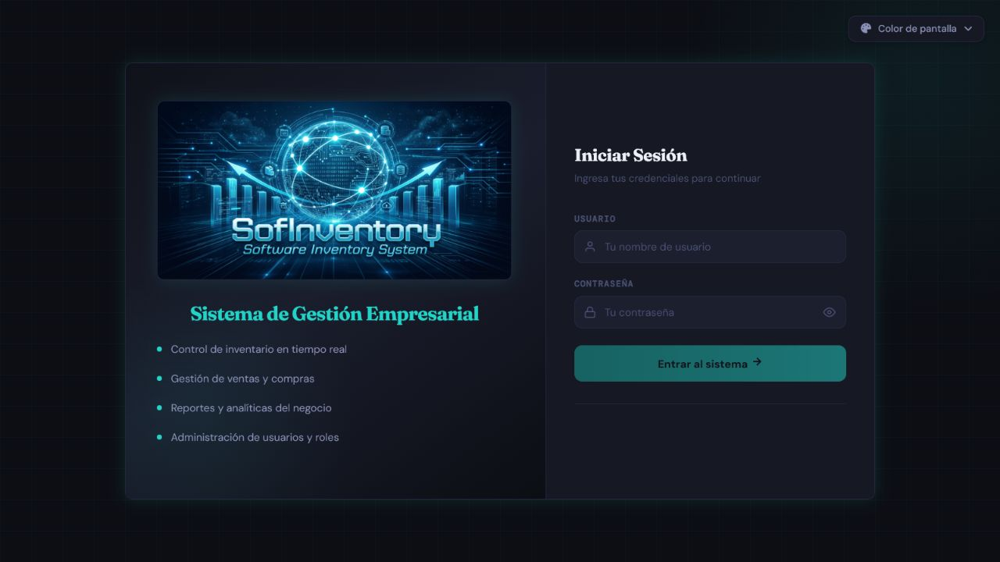

Si las credenciales son correctas, el usuario será redirigido al Dashboard principal.

#### Paso 6: Verificar módulos principales

| # | Acción | Resultado Esperado |
|---|---|---|
| 1 | Visualizar Dashboard | Se muestra el panel de indicadores con gráficos |
| 2 | Acceder a Productos | Se lista el catálogo de productos |
| 3 | Acceder a Inventario | Se muestra el stock por almacén |
| 4 | Acceder a Usuarios | Se lista los usuarios registrados |
| 5 | Registrar una venta | Se descuenta stock y se genera el movimiento |

**Figura 2. Dashboard vigente en tema Claro con datos ficticios.**

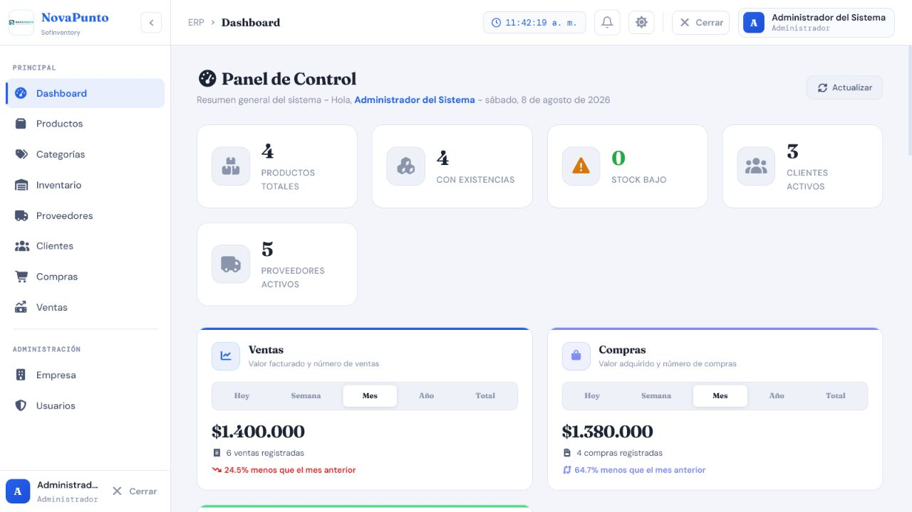

**Figura 3. Ayuda contextual reutilizable dentro del formulario de Producto.**

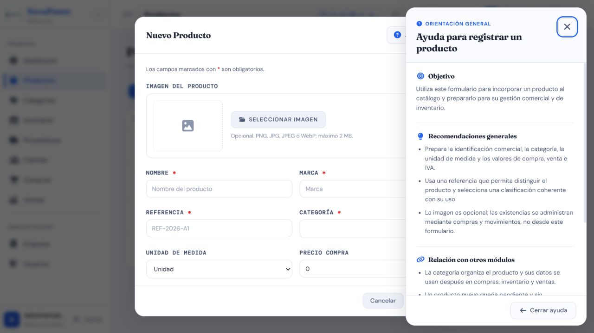

**Figura 4. Transferencia de inventario con orientación contextual.**

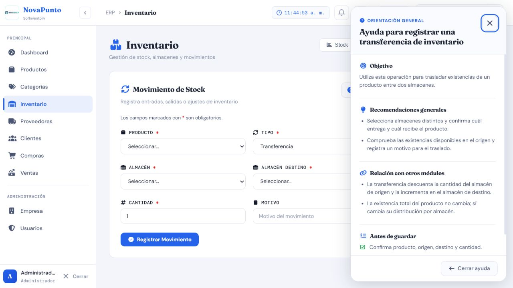

**Figura 5. Comprobante de Venta con snapshot ficticio de Empresa.**

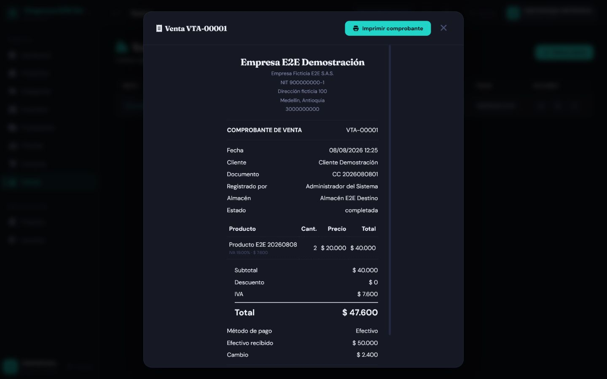
### 7.6 Comandos útiles de Docker Compose

| Comando | Descripción |
|---|---|
| `docker compose up -d` | Levantar servicios en segundo plano |
| `docker compose up --build -d` | Reconstruir imágenes y levantar |
| `docker compose down` | Detener y eliminar contenedores |
| `docker compose down -v` | **Destructivo:** elimina contenedores y volúmenes de datos/media |
| `docker compose ps` | Ver estado de contenedores |
| `docker compose logs -f` | Ver logs en tiempo real |
| `docker compose restart backend` | Reiniciar solo el backend |
| `docker compose exec backend bash` | Acceder al terminal del contenedor backend |
| `docker system prune` | **Operación global:** elimina recursos Docker no utilizados; revisar alcance antes de aprobar |

!!! danger "Comandos destructivos"
    No ejecute `docker compose down -v` ni `docker system prune` como parte de una comprobación rutinaria. El primero elimina los volúmenes de SofInventory; el segundo puede afectar recursos de otros proyectos del host. Exija respaldo verificado y autorización explícita.

### 7.7 Solución de problemas comunes

| Problema | Causa Probable | Solución |
|---|---|---|
| `docker` no se reconoce | Docker Desktop no está instalado o no se reinició la terminal | Verifique la instalación y abra una nueva terminal |
| Contenedores no arrancan | Motor Docker no está en ejecución | Abra Docker Desktop y espere a que indique "Engine running" |
| Puerto 80/8000/5432 en uso | Otro proceso ocupa el puerto | Detenga el proceso o modifique el mapeo en `docker-compose.yml` |
| Backend se reinicia en bucle | Falta variable en `.env` o BD no está lista | Revise `docker compose logs backend` |
| Error al construir imagen (build) | Conexión inestable o espacio insuficiente | Verifique internet, ejecute `docker system prune` y reintente |
| Cambios no se reflejan | Imágenes construidas antes de modificar código | Ejecute `docker compose up --build` para reconstruir |
| Página no carga en localhost | Contenedor frontend falló | Revise `docker compose logs frontend` |
| Error de conexión a BD | `DB_HOST` configurado como `localhost` en vez de `db` | Verifique que `DB_HOST=db` en `backend/.env` |
| OOM (exit code 137) | Memoria insuficiente para build de Node.js | Verifique que `NODE_OPTIONS=--max-old-space-size=512` está en el Dockerfile |
| Error 401 (No autorizado) en la API | Token ausente, inválido o revocado | Inicie una sesión nueva; no copie el token en incidencias ni documentación |
| Error 403 (Prohibido) en la API | Rol insuficiente, cuenta inactiva/bloqueada o sesión expirada según el contrato actual | Revise estado, rol y expiración; consulte `BUG-LOGIN-001` si la interfaz no redirige |
| Error 500 en un endpoint específico | Excepción no controlada en el backend (dato inválido, relación rota, etc.) | Revise `docker compose logs backend` para el stack trace exacto; valide los datos enviados en la solicitud |
| Las migraciones no se aplican al iniciar | El contenedor backend no esperó a que la base de datos estuviera lista, o hay un conflicto de migraciones | Revise `docker compose logs backend`; si hay conflicto, ejecute `docker compose exec backend python manage.py showmigrations` para identificar la migración pendiente o en conflicto |
| No se crea el usuario administrador inicial | Las variables `INITIAL_ADMIN_*` no están definidas en `backend/.env`, o el usuario ya existía de un arranque previo | Verifique el archivo `.env`; el script de datos semilla (`seed_data`) no sobrescribe un usuario ya existente |
| La cuenta queda bloqueada en pruebas | Se alcanzaron 5 intentos fallidos | Use el flujo administrativo de desbloqueo con otra cuenta Administrador; evite modificar la BD salvo procedimiento autorizado |

### 7.8 Despliegue en producción (Cloud)

El sistema está desplegado en las siguiente plataforma:

| Plataforma | URL | Descripción |
|---|---|---|
| **Render** | `sofinventory-app.onrender.com` | Despliegue unificado con PostgreSQL administrado; validar URL y estado antes de cada liberación |

Esta modalidad usa el `Dockerfile` raíz: Node compila Angular y la imagen final Python copia `frontend_dist`; Django sirve la SPA y los estáticos mediante WhiteNoise/Gunicorn. Es diferente de Compose local, donde Nginx y Django son contenedores separados.

🚀 **Manual completo de despliegue:** consulte [Informe_Tecnico_Despliegue_SofInventory_v2.pdf](./Informe_Tecnico_Despliegue_SofInventory_v2.pdf) y la sección [12.2 Documentos internos y externos](#122-documentos-internos-y-externos-del-proyecto). Si existe una diferencia, prevalecen los Dockerfiles, Compose y variables descritos en este manual actualizado.
---

## 8. Diagrama de componentes

### 8.1 Arquitectura general del sistema


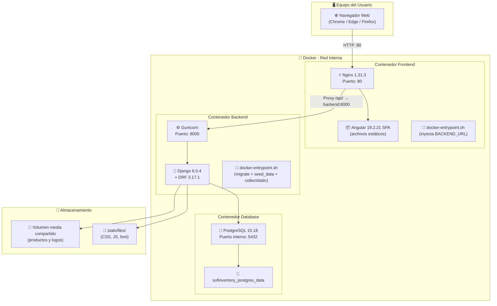

### 8.2 Flujo de comunicación entre contenedores

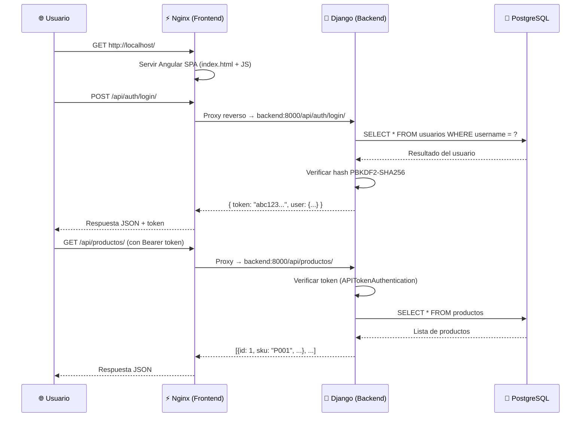

### 8.3 Vista de componentes

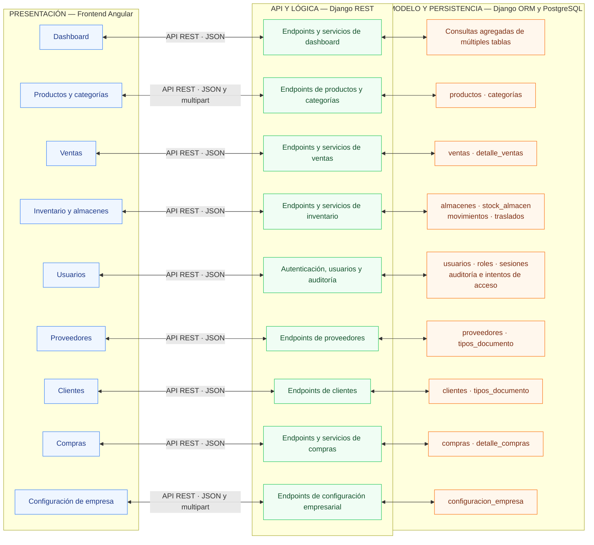

El Dashboard no posee una tabla propia: agrega consultas de Ventas, Compras, Inventario, Clientes, Proveedores y Productos. `catalogos` tampoco persiste tablas; lee el catálogo territorial local y comparte validación segura de imágenes.

### 8.4 Vista de despliegue — Docker Compose

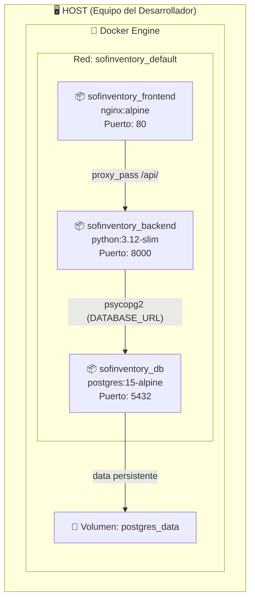

---

### 8.5 Transacción de Compra, Venta y anulación

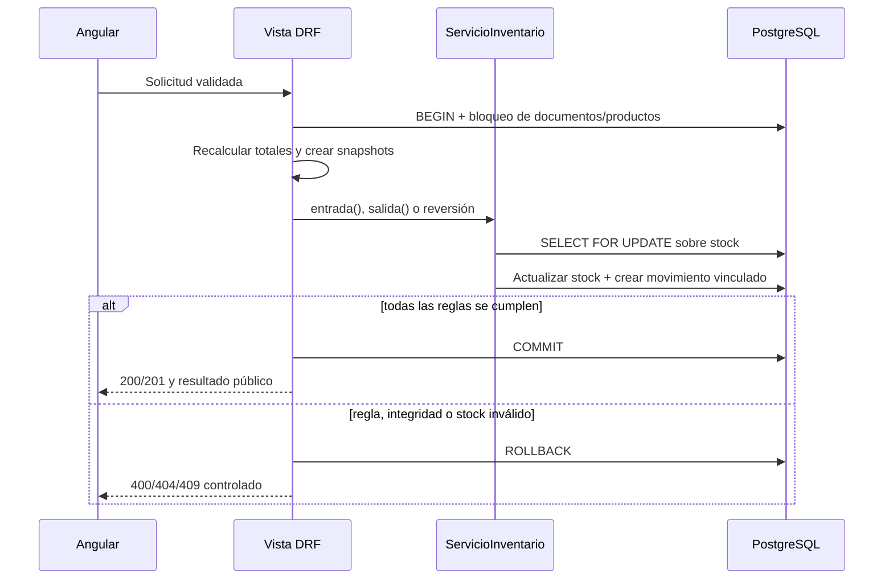

### 8.6 Estado del formulario y ayuda contextual

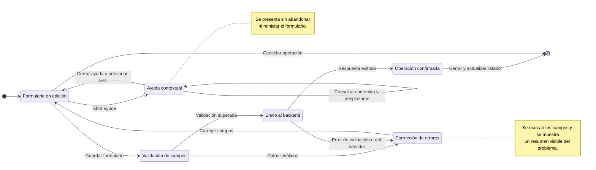

Abrir la ayuda no dispara peticiones, no toca controles, no reinicia valores y no usa almacenamiento. Al cerrar, el foco regresa al botón. En escritorio aparece como panel lateral; en móvil se adapta sin desbordamiento horizontal. El texto central se resuelve por formulario y operación (`registrar` o `actualizar`).

### 8.7 Verificación y estado de calidad

La última ejecución consolidada documentada utilizó contenedores y datos ficticios efímeros:

| Evidencia | Resultado ejecutado |
|---|---|
| Backend con SQLite en memoria | 99/99 pruebas aprobadas |
| Backend con PostgreSQL 15 aislado | 99/99 pruebas aprobadas |
| Pruebas Node del frontend compartido | 24/24 aprobadas |
| Build Angular de producción | Aprobado con advertencias de presupuesto: bundle inicial +7,02 kB y CSS de Dashboard +3,05 kB |
| Matriz funcional/E2E | 78 casos: 67 aprobados, 1 parcial y 10 fallidos |

!!! warning "No confundir suite verde con liberación completa"
    Las suites automatizadas aprobaron, pero los casos E2E detectaron defectos de contrato, interfaz y reglas de negocio. La liberación no debe declararse totalmente aprobada hasta corregir y reejecutar los casos fallidos. Consulte [Resultados de ejecución](./test-cases/RESULTADOS_EJECUCION_2026-08-08.md) y [Registro de defectos](./test-cases/DEFECTOS.md).

| Área pendiente en la última ejecución | Riesgo técnico |
|---|---|
| Expiración de sesión 403 frente a interceptor 401 | La interfaz puede permanecer en una vista protegida sin redirigir correctamente |
| Búsqueda de Usuarios no reactiva | El texto cambia, pero la tabla no se filtra |
| Alta de Producto | El resultado E2E registró un 500; el código actual ya retira `quitar_imagen` en `create()`, pero exige reejecución antes de cerrar el defecto |
| Eliminación de Proveedor/Cliente relacionados | `ProtectedError` no está controlado por esas vistas y puede producir 500 |
| Compra de Producto inactivo | El flujo no comprueba actualmente el estado del producto |
| Datos condicionales de pago | Débito/crédito pueden aceptar campos aplicables ausentes |
| Empresa | NIT y teléfono requieren validación semántica adicional |
| Dashboard ante 502 | La interfaz puede mostrar el texto técnico de la respuesta |

Las evidencias visuales demuestran presentación y estados visibles; permisos, stock, concurrencia, auditoría y cálculos se sustentan con pruebas automatizadas, respuestas sanitizadas y consultas de solo lectura.

---

## 9. Conclusiones

### 9.1 Mantenibilidad

La arquitectura modular de SofInventory, basada en nueve aplicaciones Django de dominio, un módulo auxiliar de catálogos y un frontend Angular desacoplado, facilita el mantenimiento. Los contratos HTTP, servicios transaccionales, serializers, validadores y componentes compartidos reducen el acoplamiento, siempre que cualquier cambio se acompañe de pruebas en PostgreSQL y frontend.

### 9.2 Aislamiento de entorno mediante Docker

La adopción de Docker como plataforma de despliegue elimina los problemas de compatibilidad entre versiones de Python, Node.js y PostgreSQL. El sistema se ejecuta de forma idéntica en Windows, macOS y Linux, ya que todas las dependencias están empaquetadas dentro de los contenedores. Los Dockerfiles multi-stage reducen el tamaño de las imágenes finales: las herramientas de compilación (Node.js, npm) se descartan después de la fase de build, y solo se conservan los archivos estáticos servidos por Nginx en el frontend, y las dependencias mínimas de Python en el backend.

### 9.3 Escalabilidad

La separación entre frontend, backend y base de datos permite evolucionar cada capa de forma independiente. Un escalado horizontal del backend exigiría revisar la semántica de sesión única, almacenamiento compartido de media, migraciones y afinidad; no debe asumirse como transparente solo por usar Gunicorn o contenedores.

### 9.4 Seguridad

El sistema implementa sesiones API de 12 horas, invalidación de la sesión anterior, bloqueo tras cinco fallos, throttle por IP, hash de contraseñas, RBAC en backend, validación semántica, auditoría de Usuarios, archivos de imagen inspeccionados y cabeceras defensivas en Nginx. Los secretos se inyectan por variables de entorno y no deben entrar al repositorio ni a las evidencias. La existencia de estas capas no sustituye la corrección de los defectos abiertos ni una revisión de seguridad previa a producción.

### 9.5 Portabilidad

Docker aporta reproducibilidad, pero Compose local y la imagen unificada cloud son topologías diferentes. Cada entorno necesita secretos, hosts, CORS/CSRF, persistencia de PostgreSQL/media, respaldo, observabilidad y prueba de restauración propios; `docker compose up --build -d` no reemplaza esas decisiones operativas.

---

## 10. Glosario técnico

| Término | Definición |
|---|---|
| **API REST** | Interfaz de programación que expone los recursos del sistema mediante peticiones HTTP (GET, POST, PUT, DELETE) en formato JSON. |
| **ORM (Object-Relational Mapping)** | Capa de Django que traduce clases y objetos Python en tablas y filas de PostgreSQL, sin necesidad de escribir SQL directo. |
| **Serializer** | Componente de Django REST Framework que convierte instancias de modelos en JSON (y viceversa), validando los datos de entrada. |
| **Token de Sesión** | Cadena generada tras un login exitoso que identifica al usuario en cada solicitud posterior a la API. |
| **RBAC (Role-Based Access Control)** | Modelo de control de acceso en el que los permisos se asignan a roles (Administrador, Supervisor, Vendedor, Bodega) y no directamente a usuarios individuales. |
| **Hash PBKDF2-SHA256** | Algoritmo utilizado por Django para almacenar contraseñas de forma irreversible, de modo que ni siquiera el equipo técnico puede leerlas en texto plano. |
| **CORS (Cross-Origin Resource Sharing)** | Mecanismo que controla qué orígenes (dominios) pueden consultar la API del backend desde el navegador. |
| **Contenedor** | Instancia en ejecución de una imagen Docker que aísla un proceso (backend, frontend o base de datos) junto con todas sus dependencias. |
| **Imagen Docker** | Plantilla inmutable a partir de la cual se crean los contenedores, construida mediante un `Dockerfile`. |
| **Volumen (Docker)** | Mecanismo de almacenamiento persistente que conserva los datos de un contenedor (por ejemplo, la base de datos) aunque este se elimine o reconstruya. |
| **Multietapa (Multi-stage build)** | Técnica de construcción de imágenes Docker en varias etapas, copiando solo los archivos finales de una etapa a la siguiente para reducir el tamaño de la imagen. |
| **Migración (Django)** | Archivo generado automáticamente que describe cambios en la estructura de la base de datos y permite aplicarlos de forma controlada. |
| **Seed Data (Datos Semilla)** | Conjunto de datos iniciales que se cargan automáticamente al primer arranque del sistema (roles, tipos de documento, usuario administrador). |
| **WSGI** | Interfaz estándar de Python que permite a un servidor web (Gunicorn) comunicarse con la aplicación Django. |
| **Gunicorn** | Servidor de aplicaciones WSGI utilizado para ejecutar Django en producción dentro del contenedor backend. |
| **Nginx** | Servidor web utilizado en el contenedor frontend para servir los archivos compilados de Angular y actuar como proxy hacia el backend. |
| **SPA (Single Page Application)** | Aplicación web que carga una sola página HTML y actualiza su contenido dinámicamente sin recargar el navegador; así opera el frontend Angular. |
| **RTO / RPO** | Tiempo objetivo de recuperación y punto objetivo de recuperación; métricas que definen cuánto tiempo y cuántos datos se pueden perder ante un incidente (ver Plan de Migración y Respaldo). |
| **Signal** | Primitiva reactiva de Angular usada para estado local y derivado en servicios y componentes. |
| **Snapshot histórico** | Copia de valores relevantes —empresa, producto, SKU, precio, IVA o costo— guardada al crear una operación para que el histórico no cambie al editar maestros. |
| **`select_for_update()`** | Bloqueo de filas de PostgreSQL dentro de una transacción para serializar escrituras críticas y evitar carreras de stock. |
| **Reversión idempotente** | Operación compensatoria que solo puede aplicarse una vez al movimiento original. |
| **Ayuda contextual** | Panel accesible asociado al formulario y a la operación actual que orienta sin modificar ni enviar sus datos. |

---

## 11. Mesa de ayuda y soporte técnico

### 11.1 Canales de escalamiento

| Canal | Detalle |
|---|---|
| **Repositorio (issues técnicos)** | [SofInventory en GitHub](https://github.com/AlejandroSepulvedaDuarte/SofInventory) — registrar el error o solicitud con pasos reproducibles y evidencia sanitizada |
| **Correo Electrónico Técnico** | alejosepulveda981@gmail.com |
| **Responsables del mantenimiento** | Alejandro Sepúlveda Duarte / Lucy Estefany Izquierdo Jaramillo |
| **Horario de atención** | Lunes a Viernes de 8:00 a.m. a 6:00 p.m. |

### 11.2 Tiempos de respuesta según severidad

Estos tiempos corresponden a los definidos en el **Plan de Mantenimiento y Soporte del Software** (sección 12.2) y se reutilizan aquí como referencia rápida para el equipo técnico:

| Severidad | Criterio | Tiempo de respuesta | Tiempo de resolución |
|---|---|---|---|
| **Crítica** | El sistema no responde o un módulo esencial (ventas, inventario, autenticación) deja de funcionar por completo | ≤ 4 horas | ≤ 24 horas |
| **Alta** | Una funcionalidad importante falla parcialmente (por ejemplo, un error 500 real en el flujo de login) | ≤ 8 horas | ≤ 72 horas |
| **Media** | Un defecto afecta una validación o regla de negocio puntual, sin bloquear la operación general | ≤ 24 horas | ≤ 1 semana |
| **Baja** | Errores cosméticos, de texto o de estilo que no afectan la funcionalidad | ≤ 3 días | Próxima iteración |

**Antes de escalar un incidente:** revise primero la sección 7.7 (Solución de Problemas Comunes) de este manual; la mayoría de los errores de despliegue, autenticación y base de datos allí documentados tienen solución inmediata sin necesidad de abrir un nuevo issue.

---

## 12. Referencias y fuentes

### 12.1 Documentación oficial

| Tecnología | URL |
|---|---|
| Django 6.0 | [Documentación oficial](https://docs.djangoproject.com/en/6.0/) |
| Django REST Framework | [Documentación oficial](https://www.django-rest-framework.org/) |
| Angular 19 | [Documentación oficial](https://v19.angular.dev/) |
| PostgreSQL 15 | [Documentación oficial](https://www.postgresql.org/docs/15/) |
| Docker | [Documentación oficial](https://docs.docker.com/) |
| Docker Compose | [Documentación oficial](https://docs.docker.com/compose/) |
| Nginx | [Documentación oficial](https://nginx.org/en/docs/) |
| Gunicorn | [Documentación oficial](https://docs.gunicorn.org/) |
| Node.js 20 | [Documentación oficial](https://nodejs.org/docs/latest-v20.x/api/) |
| Python 3.12 | [Documentación oficial](https://docs.python.org/3.12/) |

### 12.2 Documentos internos y externos del proyecto

Para consultar la información complementaria y profundizar en el diseño, arquitectura y base de datos del proyecto **SofInventory**, se ponen a disposición los siguientes anexos:

| Documento / Recurso | Descripción | Enlace de Acceso |
| :--- | :--- | :--- |
| **Modelo Entidad-Relación PostgreSQL** | Diagrama detallado de la base de datos generado desde PostgreSQL | [🖼️ Ver MER](./Modelo_Entidad_Relacion_SofInventory_PostgreSQL.pdf) |
| **Arquitectura y Patrón de Diseño** | Documentación de la arquitectura de software y el patrón seleccionado | [📄 Ver Arquitectura y diseño](./Arquitectura_Software_Patrón_Diseño_Seleccionado.pdf) |
| **Diccionario de Datos** | Especificación técnica de tablas, campos, tipos y restricciones | [📊 Ver Excel](https://drive.google.com/file/d/1UzqMEZIm0xpVfJMkq-4Cwno6ymZs9C7R/view?usp=sharing) |
| **Manual de Despliegue** | Guía paso a paso para la instalación y despliegue del software | [📕 Ver Manual de despliegue](./Informe_Tecnico_Despliegue_SofInventory_v2.pdf) |
| **Casos de Uso Extendidos** | Diagramas y descripciones detalladas por módulo del sistema | [📄 Ver Diagrama y plantillas por casos de uso](./Diagramas_Plantillas_casos_de_uso_del_proyecto.pdf) |
| **Plan de Mantenimiento y Soporte del Software** | Plan de mantenimiento preventivo y correctivo con base en ISO/IEC 14764, incluyendo tiempos de respuesta por severidad | [📄 Ver Plan de Mantenimiento](./Plan_de_Mantenimiento_y_Soporte_del_Software.pdf)  |
| **Plan de Migración y Respaldo de Datos** | Plan de copias de seguridad, restauración y gestión del riesgo con base en ISO/IEC 27001 | [Ver Plan de Migración y Respaldo](./Plan_Migracion_Respaldo_SofInventory.pdf) |
| **Repositorio GitHub** | Código fuente del proyecto y configuración de contenedores Docker | [💻 Ver Repositorio](https://github.com/AlejandroSepulvedaDuarte/SofInventory.git) |
| **Arquitectura Frontend** | Estructura Angular, rutas, componentes standalone y servicios compartidos | [📄 Ver arquitectura frontend](./frontend-architecture.md) |
| **Estándares de Codificación** | Convenciones Python, TypeScript, HTML/CSS, seguridad y ejemplos | [📄 Ver estándares](./coding-standards.md) |
| **Guía visual de accesibilidad** | Teclado, foco, contraste, temas y responsive | [📄 Ver guía](./accessibility-visual-guide.md) |
| **Documentación de pruebas** | Matriz por módulo, evidencias, resultados y defectos | [🧪 Ver matriz de cobertura](./test-cases/MATRIZ_COBERTURA.md) |

### 12.3 Guías de referencia

| Guía | Fuente |
|---|---|
| Guía para la Elaboración del Manual Técnico y de Operación del Sistema | DNP (Departamento Nacional de Planeación), 2020 |
| Marco de Referencia de Arquitectura | MinTIC — Directriz LI.SIS |
| ISO/IEC 27001:2022 — Seguridad de la Información | International Organization for Standardization |
| ISO/IEC/IEEE 42010:2022 — Software, systems and enterprise: Architecture description | International Organization for Standardization |

---

<div align="center">
<h3>🛠️ SofInventory ERP</h3>
<p>Sistema de Gestión de Inventarios y Ventas para Ferreterías</p>
<p><strong>© 2026 SofInventory.</strong> Todos los derechos reservados.  
Documento elaborado por el Equipo de Desarrollo de Software — SENA</p>
</div>

