

{ width="300" }
# Manual de Usuario 
**Sistema de Información SofInventory ERP**
`Versión 2.0.0` | `Fecha de actualización: 8 de agosto de 2026`

---

### 📋 Control administrativo

| Campo | Información |
|---|---|
| **Proyecto** | SofInventory — Sistema ERP de Gestión de Inventarios y Ventas |
| **Autores / Aprendices** | Alejandro Sepúlveda Duarte / Lucy Estefany Izquierdo Jaramillo |
| **Instructor Evaluador** | José Ignacio Botero Osorio |
| **Centro de Formación** | Centro de Comercio — Regional Antioquia (SENA) |
| **Programa de Formación** | Tecnología en Análisis y Desarrollo de Software (TADS) |
| **Ficha** | 3118526 |
| **Estado del Documento** | Vigente — actualizado para la versión funcional evaluada |

---

### Control de versiones del documento

| Versión | Fecha | Autor(es) | Descripción del cambio |
|---|---|---|---|
| 1.0 | Julio 2026 | Alejandro Sepúlveda D. / Lucy Estefany Izquierdo | Versión inicial del manual: introducción, objetivos, alcance, roles y flujos de trabajo. |
| 2.0.0 | Agosto 2026 | Alejandro Sepúlveda D. / Lucy Estefany Izquierdo | Actualización integral de módulos, permisos, formularios, ayuda contextual, ubicación, temas, responsive, validaciones, comprobantes y evidencias visuales. |

---

### Convenciones del documento

A lo largo del manual se usan los siguientes símbolos para facilitar la lectura:

| Símbolo | Significado |
|---|---|
| 📷 **Evidencia visual** | Captura real del sistema que ilustra una pantalla o comportamiento representativo. No contiene credenciales ni datos personales reales. |
| ⚠️ | Advertencia importante: acción irreversible o que requiere especial atención. |
| ✅ | Función o sección visible / disponible para el rol indicado. |
| ❌ | Función o sección oculta / no disponible para el rol indicado. |
| **Negrita** | Nombres de botones, campos de formulario o elementos de la interfaz. |
| `Texto en código` | Valores que deben reconocerse de forma exacta, como una dirección local o un identificador de operación. |

## 1. Introducción

### 1.1 Propósito

El presente Manual de Usuario describe de forma detallada, clara y paso a paso el proceso de uso del sistema **SofInventory**, un sistema ERP (Enterprise Resource Planning) diseñado para la gestión integral de inventarios, productos, compras, ventas, clientes, proveedores y usuarios de una empresa comercial.

Este manual está dirigido a los **usuarios finales** del sistema: administradores, supervisores, vendedores y operadores de bodega, proporcionando las instrucciones necesarias para aprovechar al máximo todas las funcionalidades de la plataforma.

### 1.2 Descripción del sistema

SofInventory es una aplicación web que permite:

- **Gestionar productos y categorías** con precios, stock e imágenes
- **Controlar el inventario** en tiempo real por almacén
- **Registrar ventas** con múltiples métodos de pago y cálculo automático de IVA
- **Registrar compras** a proveedores con actualización automática de stock
- **Administrar usuarios** con roles y permisos diferenciados
- **Visualizar indicadores** del negocio en un dashboard interactivo
- **Gestionar clientes y proveedores** con información completa de contacto
- **Configurar la identidad de la empresa** que aparece en la interfaz y en los comprobantes
- **Usar formularios guiados** con validaciones claras y ayuda contextual sin perder los datos ingresados
- **Adaptar la presentación** mediante los temas Claro, Azul y Oscuro en computador, tableta o móvil

### 1.3 Audiencia

| Rol | Descripción |
|---|---|
| **Usuario administrador** | Gestiona usuarios, configuración general y tiene acceso total al sistema |
| **Usuario supervisor** | Supervisa operaciones, gestiona productos, proveedores y reportes |
| **Usuario vendedor** | Realiza ventas, gestiona clientes y consulta productos |
| **Bodega (operador de bodega)** | Administra almacenes, recibe compras y registra movimientos o transferencias de inventario |

---

## 2. Objetivos

### 2.1 Objetivo general

Proporcionar a los usuarios finales del sistema SofInventory las instrucciones necesarias para el uso correcto, eficiente y seguro de todas las funcionalidades del sistema, según el rol que desempeñen en la organización.

### 2.2 Objetivos específicos

- Instruir al usuario en el proceso de autenticación y navegación general del sistema.
- Describir las funcionalidades disponibles para cada rol de usuario (Administrador, Supervisor, Vendedor y Bodega).
- Explicar los flujos de trabajo principales: registro de ventas, carga de inventario, creación de usuarios y registro de compras.
- Establecer las normas y buenas prácticas para el uso seguro del sistema.
- Orientar el uso de la ayuda contextual, las validaciones, los temas visuales y la interfaz responsive.
- Proporcionar referencias a las guías del DNP y estándares de documentación.

---

## 3. Alcance del sistema

### 3.1 Módulos funcionales

| # | Módulo | Funcionalidades principales | Operación autorizada |
|---|---|---|---|
| 1 | **Inicio de sesión** | Autenticación, sesión activa, cierre y bloqueo por intentos fallidos | Toda persona con una cuenta activa |
| 2 | **Dashboard** | Indicadores, comparaciones por periodo, gráficas, alertas y operaciones recientes | Todos los roles; el contenido se adapta al rol |
| 3 | **Productos** | Consulta, búsqueda, creación, edición, imagen, precios, IVA y estado | Crear/editar: Administrador y Supervisor |
| 4 | **Categorías** | Clasificación de productos por tipo de control | Crear/eliminar: Administrador y Supervisor |
| 5 | **Proveedores** | Identificación, contacto, ubicación y estado | Administrador y Supervisor |
| 6 | **Clientes** | Persona natural o jurídica, contacto, ubicación y estado | Crear/editar: Administrador, Supervisor y Vendedor |
| 7 | **Compras** | Recepción por proveedor y almacén, detalle, totales y anulación | Registrar: Administrador, Supervisor y Bodega; anular: Administrador y Supervisor |
| 8 | **Ventas** | Venta por almacén, pago, comprobante, detalle y anulación | Administrador, Supervisor y Vendedor |
| 9 | **Inventario y almacenes** | Stock, alertas, almacenes, entradas, salidas, transferencias y exportación | Operar: Administrador, Supervisor y Bodega |
| 10 | **Empresa** | Identidad, ubicación, logo, prefijo y mensaje de comprobantes | Consultar: sesión autenticada; configurar: Administrador |
| 11 | **Usuarios** | Cuentas, roles, estado, desbloqueo y auditoría | Solo Administrador |

### 3.2 Roles del sistema

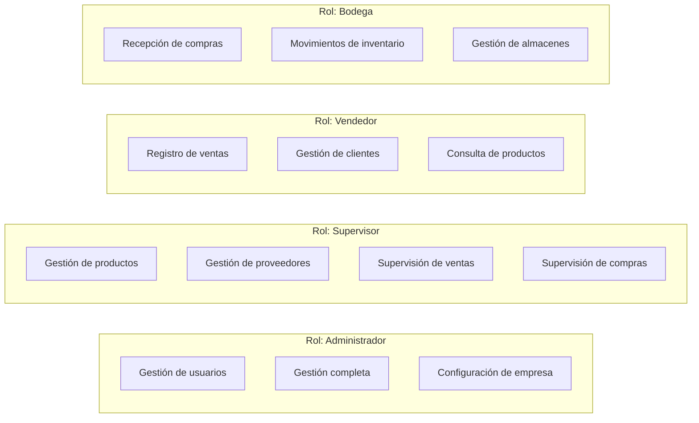
```mermaid
graph LR
    subgraph "Rol: Administrador"
        A1["Gestión de usuarios"]
        A2["Gestión completa"]
        A3["Configuración de empresa"]
    end
    subgraph "Rol: Supervisor"
        S1["Gestión de productos"]
        S2["Gestión de proveedores"]
        S3["Supervisión de ventas"]
        S4["Supervisión de compras"]
    end
    subgraph "Rol: Vendedor"
        V1["Registro de ventas"]
        V2["Gestión de clientes"]
        V3["Consulta de productos"]
    end
    subgraph "Rol: Bodega"
        B1["Recepción de compras"]
        B2["Movimientos de inventario"]
        B3["Gestión de almacenes"]
    end
```

### 3.3 Matriz de permisos por rol

| Funcionalidad | Administrador | Supervisor | Vendedor | Bodega |
|---|:---:|:---:|:---:|:---:|
| Dashboard | ✅ | ✅ | ✅ | ✅ |
| Crear/editar productos | ✅ | ✅ | ❌ | ❌ |
| Gestionar Categorías | ✅ | ✅ | ❌ | ❌ |
| Crear/Editar Proveedores | ✅ | ✅ | ❌ | ❌ |
| Crear/editar clientes | ✅ | ✅ | ✅ | ❌ |
| Cambiar estado o eliminar clientes | ✅ | ✅ | ❌ | ❌ |
| Registrar Ventas | ✅ | ✅ | ✅ | ❌ |
| Registrar Compras | ✅ | ✅ | ❌ | ✅ |
| Anular Ventas | ✅ | ✅ | ✅ | ❌ |
| Anular Compras | ✅ | ✅ | ❌ | ❌ |
| Gestionar Almacenes | ✅ | ✅ | ❌ | ✅ |
| Eliminar Almacenes | ✅ | ✅ | ❌ | ❌ |
| Entradas, salidas y transferencias | ✅ | ✅ | ❌ | ✅ |
| Exportar Inventario | ✅ | ✅ | ❌ | ✅ |
| Configurar Empresa | ✅ | ❌ | ❌ | ❌ |
| Gestionar Usuarios | ✅ | ❌ | ❌ | ❌ |
| Desbloquear Usuarios | ✅ | ❌ | ❌ | ❌ |

!!! note "Visibilidad y permisos"
    El menú principal facilita la navegación de las personas autenticadas, pero la autorización definitiva depende del rol. Que una pantalla o un botón sea visible no reemplaza el permiso necesario para ejecutar una operación.

---

## 4. Normas y buenas prácticas de uso

### 4.1 Seguridad de la cuenta

1. **No comparta sus credenciales** de acceso con terceros.
2. **Use una cuenta personal:** las operaciones quedan asociadas al usuario que las realiza.
3. **Cierre sesión** al terminar de usar el sistema, especialmente en equipos compartidos.
4. **No deje la sesión abierta** sin supervisión.
5. Si su cuenta es bloqueada por intentos fallidos, contacte al administrador.
6. Al iniciar sesión nuevamente se invalida cualquier sesión activa anterior de la misma cuenta.
7. La sesión actual tiene una vigencia predeterminada de **12 horas**; al expirar, vuelva a iniciar sesión antes de continuar.

### 4.2 Uso del sistema

1. **Use los navegadores soportados:** Google Chrome, Microsoft Edge o Mozilla Firefox (versiones actualizadas).
2. **Mantenga una conexión estable con el servidor** para el funcionamiento correcto del sistema.
3. **Registre información completa y veraz** en todos los formularios.
4. **Verifique los datos** antes de confirmar operaciones críticas, especialmente almacén, cantidades, costos, impuestos, pago y total.
5. **No cierre ni recargue el navegador** mientras se está guardando una venta, compra o movimiento.
6. Use el botón **Ayuda** cuando necesite orientación general; las indicaciones específicas permanecen junto a cada campo.

### 4.3 Gestión de contraseñas

- La contraseña debe tener **mínimo 8 caracteres**.
- No puede ser completamente numérica, demasiado común ni demasiado similar a los datos de la cuenta.
- Al crear o cambiar una contraseña, los campos de contraseña y confirmación deben coincidir.
- El sistema evita reutilizar una contraseña que ya esté asignada a otra cuenta.
- El sistema bloquea la cuenta después de **5 intentos fallidos** de inicio de sesión. Además, limita la frecuencia de intentos desde una misma conexión.
- Las contraseñas se conservan mediante un resumen criptográfico irreversible; nadie puede consultarlas en texto plano.

!!! warning "No pruebe contraseñas repetidamente"
    Si duda de sus credenciales, deténgase antes de agotar los intentos disponibles y solicite apoyo. Un administrador debe desbloquear una cuenta bloqueada.

---

## 5. Instrucciones de acceso y navegación general

### 5.1 Requisitos previos del sistema

| Requisito | Especificación |
|---|---|
| **Navegador web** | Google Chrome, Microsoft Edge o Mozilla Firefox en una versión vigente |
| **Conexión** | Acceso estable a la red donde se encuentre desplegado SofInventory |
| **Pantalla** | Computador, tableta o móvil; la interfaz adapta navegación, tablas, formularios y paneles |
| **URL de acceso (local)** | `http://localhost` (despliegue Docker) |
| **URL de acceso institucional** | La dirección suministrada por el administrador del despliegue |

### 5.2 Proceso de inicio de sesión

#### Paso 1: Acceder al sistema

Abra su navegador web e ingrese la URL de acceso suministrada para SofInventory. La pantalla de acceso permite elegir el tema visual antes de iniciar sesión.

📷 **Evidencia visual — acceso actual en tema Oscuro**
{ loading=lazy }

#### Paso 2: Ingresar credenciales

1. En el campo **Usuario**, ingrese su nombre de usuario asignado por el administrador.
2. En el campo **Contraseña**, ingrese su contraseña.
3. Puede hacer clic en el ícono del **ojo** (👁) para mostrar u ocultar la contraseña mientras la escribe.
4. Haga clic en el botón **"Entrar al sistema"**.

!!! tip "Proteja sus credenciales"
    El control de visibilidad sirve para revisar lo escrito, pero no debe dejar la contraseña expuesta en lugares compartidos. Este manual no incluye capturas con credenciales diligenciadas.

#### Paso 3: Respuesta del sistema

- **Si las credenciales son correctas:** El sistema lo redirigirá automáticamente al **Panel de Control (Dashboard)**.
- **Si las credenciales son incorrectas:** aparecerá un mensaje de error y, cuando corresponda, el número de intentos restantes.
- **Si la cuenta está bloqueada:** Aparecerá un mensaje: *"Cuenta bloqueada. Contacta con el administrador para desbloquearla."*
- **Si se excede la frecuencia permitida:** espere antes de volver a intentar e informe a soporte si el bloqueo persiste.

📷 **Evidencia visual — error accesible en móvil y tema Claro**
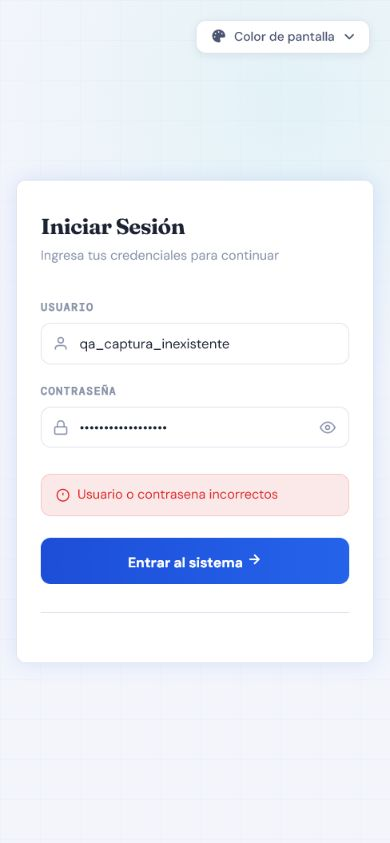{ loading=lazy width="420" }

📷 **Evidencia visual — acceso exitoso al Dashboard en móvil**
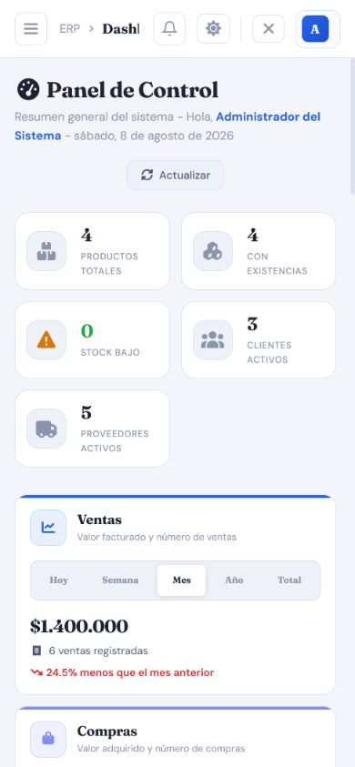{ loading=lazy width="420" }

### 5.3 Descripción de la interfaz general

#### 5.3.1 Menú lateral (Sidebar)

El menú lateral izquierdo contiene los accesos principales. **Dashboard, Productos, Categorías, Inventario, Proveedores, Clientes, Compras y Ventas** conforman la navegación general. El bloque **Administración**, con **Empresa** y **Usuarios**, solo se muestra al rol Administrador.

| Ícono | Módulo | Descripción | Roles con Acceso |
|---|---|---|---|
| 📊 | **Dashboard** | Panel de control con indicadores y gráficos | Todos |
| 📦 | **Productos** | Catálogo y datos comerciales | Navegación general; acciones según rol |
| 🏷️ | **Categorías** | Clasificación de productos | Navegación general; acciones según rol |
| 🚛 | **Proveedores** | Identificación, contacto y ubicación | Navegación general; acciones según rol |
| 👥 | **Clientes** | Personas y empresas compradoras | Navegación general; acciones según rol |
| 🛒 | **Compras** | Recepción de productos | Administrador, Supervisor y Bodega |
| 💰 | **Ventas** | Punto de venta y comprobantes | Administrador, Supervisor y Vendedor |
| 📦 | **Inventario** | Stock, alertas, almacenes y movimientos | Navegación general; operación según rol |
| 🏢 | **Empresa** | Identidad y datos de comprobantes | Solo Administrador en la interfaz |
| 👤 | **Usuarios** | Gestión de usuarios del sistema | Solo Administrador |

La evidencia actual del Dashboard incluida en la sección 5.3.2 muestra el menú completo, con los bloques **Principal** y **Administración**.

#### 5.3.2 Barra superior (Header)

La barra superior contiene:

- **Ruta de navegación:** indica el módulo actual mediante una miga de pan.
- **Hora local:** muestra la hora de referencia de la interfaz.
- **Notificaciones:** el ícono está reservado para evolución futura; no debe asumirse que ya genera alertas operativas.
- **Selector de tema:** permite alternar entre Claro, Azul y Oscuro.
- **Cerrar sesión:** invalida la sesión actual y regresa a la pantalla de acceso.
- **Identidad del usuario:** muestra inicial, nombre y rol de la cuenta autenticada.

📷 **Evidencia visual — navegación, barra superior y Dashboard actual**
{ loading=lazy }

#### 5.3.3 Navegación entre módulos

Para acceder a cualquier módulo:

1. Haga clic en el nombre del módulo en el **menú lateral izquierdo**.
2. El sistema cargará la página correspondiente con la tabla de datos y las opciones disponibles.
3. Puede volver al Panel de Control en cualquier momento haciendo clic en **"Dashboard"** en el menú.

El módulo activo queda resaltado en el menú y también se identifica en la ruta de la barra superior.

### 5.4 Temas visuales

SofInventory ofrece tres presentaciones. El cambio es inmediato y no modifica la información del sistema:

| Tema | Uso recomendado |
|---|---|
| **Claro** | Ambientes bien iluminados y lectura con fondo claro |
| **Azul** | Presentación corporativa con superficies claras y acentos azules |
| **Oscuro** | Ambientes de menor iluminación o preferencia por fondos oscuros |

Para cambiar el tema:

1. Abra el selector **Color de pantalla** en Login o en la barra superior.
2. Seleccione **Claro**, **Azul** u **Oscuro**.
3. Continúe trabajando; el sistema recuerda únicamente esta preferencia visual en el navegador.

!!! note
    El tema no altera roles, datos, cálculos ni permisos. Si un texto pierde legibilidad, actualice el navegador y comunique el tema, la pantalla y el módulo al equipo de soporte.

### 5.5 Ayuda contextual de formularios

Los formularios de **Productos, Categorías, Clientes, Proveedores, Usuarios, Empresa, Almacenes, Compras, Ventas e Inventario** incluyen un botón de ayuda en el encabezado, ubicado antes del botón de cierre.

- En computador aparece **? Ayuda**; en pantallas pequeñas se conserva el ícono **?** con una etiqueta accesible.
- En creación, el título usa **“Ayuda para registrar…”**; en edición usa **“Ayuda para actualizar…”**.
- El panel resume el objetivo, recomendaciones generales, relación con otros módulos y verificaciones antes de guardar.
- La ayuda no reemplaza los ejemplos, restricciones o errores que aparecen junto a los campos.
- Abrir o cerrar el panel **no borra valores, no ejecuta el guardado y no cambia el formulario**.
- Puede cerrarlo con **Cerrar ayuda**, con el botón **X** del panel o con la tecla **Esc**. Al cerrarse, el foco regresa al botón de ayuda.

📷 **Evidencia visual — ayuda de Producto en escritorio**
{ loading=lazy }

📷 **Evidencia visual — ayuda de edición adaptada a móvil**
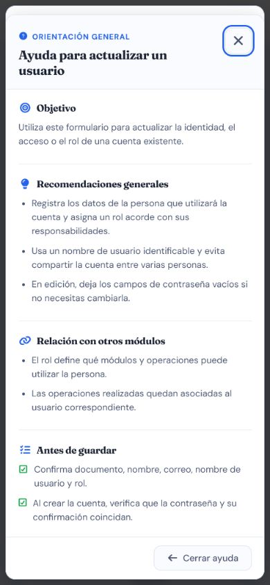{ loading=lazy width="420" }

### 5.6 Formularios, validaciones y diseño responsive

Los formularios actuales comparten las siguientes pautas:

1. Los campos marcados con **\*** son obligatorios.
2. Los errores se muestran junto al campo correspondiente y, cuando existen varios, también se presenta un resumen general.
3. Al intentar guardar información inválida, el sistema lleva la atención al primer campo que debe corregirse.
4. Un error no debe borrar la información ya diligenciada; corrija los campos señalados y vuelva a guardar.
5. Las notificaciones de éxito o error aparecen sobre la interfaz sin sustituir el contenido del formulario.
6. En móvil, los formularios se reorganizan en una columna, mantienen desplazamiento interno y evitan el desbordamiento horizontal.

Las validaciones más representativas son:

| Tipo de dato | Comportamiento actual |
|---|---|
| **Nombres de personas** | Deben corresponder a texto válido; el sistema rechaza números en nombres personales |
| **Nombres comerciales y marcas** | Deben contener al menos una letra y se normalizan los espacios innecesarios |
| **Documentos** | El formato se valida de acuerdo con CC, CE, NIT, TI o PA |
| **Teléfonos** | Deben usar los dígitos y la longitud admitidos por el formulario; dos teléfonos de un cliente no pueden ser iguales |
| **Cantidades y valores** | Las cantidades deben ser positivas; costos, precios, descuentos y mínimos no pueden ser negativos |
| **IVA** | Debe encontrarse entre 0 y 100 |
| **Imágenes** | Se admiten PNG, JPG, JPEG o WebP hasta 2 MB y se muestra una vista previa |
| **Duplicados** | Se comprueba la unicidad de identificaciones, usuarios, correos, referencias o códigos según el módulo |

📷 **Evidencia visual — Dashboard responsive en tema Azul**
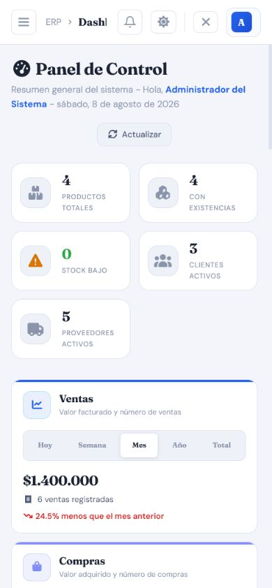{ loading=lazy width="420" }

### 5.7 Ubicación para Colombia y otros países

Los formularios de **Clientes, Proveedores y Empresa** usan el mismo selector de ubicación:

- Si elige **Colombia**, seleccione primero el departamento y después la ciudad o municipio disponible.
- La ciudad permanece deshabilitada hasta elegir un departamento válido.
- Si elige **Otro país**, diligencie manualmente país, estado/provincia/departamento y ciudad.
- Al cambiar de modalidad, revise nuevamente la ubicación antes de guardar; el formulario limpia los valores que ya no corresponden para evitar mezclar datos.

📷 **Evidencia visual — ubicación dependiente para Colombia**
{ loading=lazy }

📷 **Evidencia visual — ubicación manual para otro país**
{ loading=lazy }

### 5.8 Cierre de sesión

1. Haga clic en **Cerrar** en la barra superior o en el control de cierre del menú lateral.
2. El sistema cerrará su sesión y lo redirigirá a la pantalla de inicio de sesión.
3. Si necesita acceder nuevamente, deberá ingresar sus credenciales.

⚠️ **Importante:** Siempre cierre sesión al terminar de usar el sistema, especialmente en equipos compartidos, para proteger la información.

### 5.9 Mapa de navegación del sistema

El siguiente mapa presenta, de forma general, cómo se organizan las pantallas del sistema a partir del inicio de sesión. El acceso a cada módulo depende del rol del usuario autenticado (ver matriz de permisos en la sección 3.3).

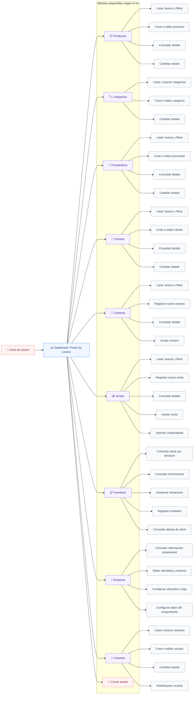
```mermaid

  flowchart LR
    L["🔐 Inicio de sesión"] --> D["📊 Dashboard / Panel de control"]

    subgraph MOD["Módulos disponibles según el rol"]
        direction TB
        P["📦 Productos"]
        C["🏷️ Categorías"]
        PR["🚛 Proveedores"]
        CL["👥 Clientes"]
        CO["🛒 Compras"]
        V["💰 Ventas"]
        I["📋 Inventario"]
        E["🏢 Empresa"]
        U["👤 Usuarios"]
        LO["🚪 Cerrar sesión"]
    end

    D --> P
    D --> C
    D --> PR
    D --> CL
    D --> CO
    D --> V
    D --> I
    D --> E
    D --> U
    D --> LO

    P --> P1["Listar, buscar y filtrar"]
    P --> P2["Crear o editar producto"]
    P --> P3["Consultar detalle"]
    P --> P4["Cambiar estado"]

    C --> C1["Listar y buscar categorías"]
    C --> C2["Crear o editar categoría"]
    C --> C3["Cambiar estado"]

    PR --> PR1["Listar, buscar y filtrar"]
    PR --> PR2["Crear o editar proveedor"]
    PR --> PR3["Consultar detalle"]
    PR --> PR4["Cambiar estado"]

    CL --> CL1["Listar, buscar y filtrar"]
    CL --> CL2["Crear o editar cliente"]
    CL --> CL3["Consultar detalle"]
    CL --> CL4["Cambiar estado"]

    CO --> CO1["Listar, buscar y filtrar"]
    CO --> CO2["Registrar nueva compra"]
    CO --> CO3["Consultar detalle"]
    CO --> CO4["Anular compra"]

    V --> V1["Listar, buscar y filtrar"]
    V --> V2["Registrar nueva venta"]
    V --> V3["Consultar detalle"]
    V --> V4["Anular venta"]
    V --> V5["Imprimir comprobante"]

    I --> I1["Consultar stock por almacén"]
    I --> I2["Consultar movimientos"]
    I --> I3["Gestionar almacenes"]
    I --> I4["Registrar traslados"]
    I --> I5["Consultar alertas de stock"]

    E --> E1["Consultar información empresarial"]
    E --> E2["Editar identidad y contacto"]
    E --> E3["Configurar ubicación y logo"]
    E --> E4["Configurar datos del comprobante"]

    U --> U1["Listar y buscar usuarios"]
    U --> U2["Crear o editar usuario"]
    U --> U3["Cambiar estado"]
    U --> U4["Desbloquear usuario"]

    classDef access fill:#fef2f2,stroke:#f87171,color:#7f1d1d
    classDef dashboard fill:#eff6ff,stroke:#3b82f6,color:#1e3a8a
    classDef module fill:#f5f3ff,stroke:#8b5cf6,color:#4c1d95
    classDef action fill:#f8fafc,stroke:#94a3b8,color:#334155

    class L,LO access
    class D dashboard
    class P,C,PR,CL,CO,V,I,E,U module
    class P1,P2,P3,P4,C1,C2,C3,PR1,PR2,PR3,PR4 action
    class CL1,CL2,CL3,CL4,CO1,CO2,CO3,CO4 action
    class V1,V2,V3,V4,V5,I1,I2,I3,I4,I5 action
    class E1,E2,E3,E4,U1,U2,U3,U4 action
```

**Cómo leer este mapa:** desde el Dashboard se accede a los módulos del menú. Las acciones que modifican información se autorizan de acuerdo con la matriz de la sección 3.3; **Empresa** y **Usuarios** pertenecen al bloque de Administración.

## 6. Guía de uso por roles de usuario

### 6.1 Rol: Administrador

El **Administrador** tiene acceso total al sistema. Puede gestionar usuarios, configurar el sistema, supervisar todas las operaciones y acceder a todos los módulos.

#### 6.1.1 Panel de control (Dashboard)

El Dashboard muestra una vista general del negocio con:

| Elemento | Descripción |
|---|---|
| **Tarjetas de inventario y terceros** | Productos totales, productos con existencias, stock bajo, clientes activos y proveedores activos |
| **Indicadores financieros** | Ventas, compras y utilidad bruta; permiten seleccionar Hoy, Semana, Mes, Año o Total según corresponda y comparan con el periodo anterior |
| **Gráficos** | Ventas frente a compras, métodos de pago, top de vendedores y estado del stock |
| **Mejor Vendedor del Mes** | Nombre, total de ventas y número de transacciones |
| **Alertas de Stock** | Lista de productos con stock por debajo del mínimo |
| **Ventas Recientes** | Últimas ventas registradas con número, cliente, fecha y total |
| **Productos Más Vendidos** | Ranking de productos más vendidos |
| **Acciones Rápidas** | Botones de acceso directo: Nueva Venta, Gestionar Productos, Gestionar Clientes, Ver Inventario |

La evidencia vigente del Dashboard del Administrador se encuentra en la sección 5.3.2.

!!! info "Interpretación de los indicadores"
    Las ventas anuladas y las compras anuladas o pendientes no se contabilizan como operaciones completadas. La utilidad bruta usa el ingreso neto sin IVA y el costo histórico disponible; si una operación no cuenta con costo auditable, el Dashboard lo informa.

#### 6.1.2 Gestión de usuarios

Solo el Administrador puede acceder a este módulo (protegido por `adminGuard`).

##### Listar usuarios

1. Haga clic en **"Usuarios"** en el menú lateral.
2. Se mostrará una tabla con todos los usuarios registrados: Usuario, Nombre Completo, Email, Rol, Estado y Fecha de Creación.
3. Puede **buscar** un usuario específico escribiendo en el campo de búsqueda.

La tabla permite reconocer visualmente el rol, el estado activo/inactivo y el bloqueo de la cuenta mediante texto y distintivos de estado.

##### Crear un nuevo usuario

1. Haga clic en el botón **"+ Nuevo Usuario"**.
2. Se abrirá un modal con el formulario de creación.
3. Complete los campos obligatorios y luego haga clic en **"Guardar"** para crear el usuario:

| Campo | Descripción | Obligatorio |
|---|---|---|
| Tipo Documento | Seleccione del catálogo vigente: CC, CE, NIT, TI o PA | Sí |
| Número Documento | Identificación con el formato correspondiente al tipo seleccionado | Sí |
| Nombre Completo | Nombre completo del usuario | Sí |
| Email | Correo electrónico único | Sí |
| Username | Nombre de usuario para login (único) | Sí |
| Contraseña | Contraseña nueva que cumpla las reglas de la sección 4.3 | Sí en creación |
| Confirmar Contraseña | Repetir la contraseña nueva | Sí en creación; opcional en edición |
| Rol | Administrador, Supervisor, Vendedor o Bodega | Sí |
| Fecha Creación | Fecha de vinculación mostrada por el formulario | Sí |
| Observaciones | Notas adicionales (opcional) | No |

📷 **Evidencia visual — formulario de usuario con ayuda contextual**
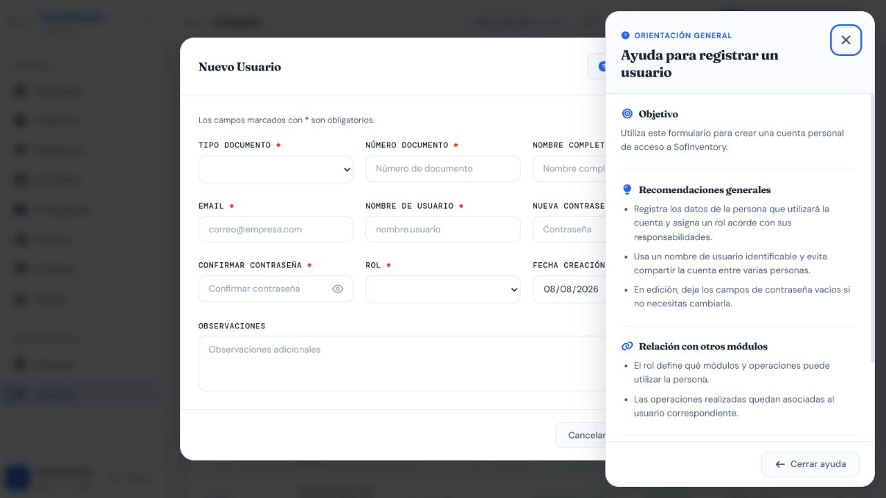{ loading=lazy }

##### Editar un usuario

1. En la tabla de usuarios, haga clic en el ícono **✏️ (Editar)** de la fila del usuario a modificar.
2. Se abrirá el modal con los datos actuales del usuario.
3. Modifique los campos deseados. El campo **Contraseña** es opcional al editar; si lo deja vacío, la contraseña no se cambiará.
4. Haga clic en **"Guardar"**.

El título de la ayuda cambia a **“Ayuda para actualizar un usuario”**, como se muestra en la evidencia móvil de la sección 5.5.

##### Cambiar estado de un usuario

1. En la tabla de usuarios, haga clic en el ícono **🔄 (Cambiar Estado)** de la fila del usuario.
2. El sistema cambiará el estado del usuario de **activo** a **inactivo**, o viceversa.
3. Un usuario inactivo no podrá iniciar sesión en el sistema.

Al inactivar una cuenta, sus sesiones activas se invalidan para impedir que continúe operando.

##### Desbloquear un usuario

Si un usuario ha sido bloqueado por intentos fallidos de login (5 intentos):

1. En la tabla de usuarios, identifique el usuario con estado **"Bloqueado"** (badge rojo).
2. Haga clic en el ícono **🔓 (Desbloquear)** que aparece junto a los demás botones de acción.
3. El usuario podrá intentar iniciar sesión nuevamente.

El botón de desbloqueo solo aparece cuando la cuenta está bloqueada. Desbloquearla limpia los intentos fallidos e invalida sesiones anteriores.

##### Eliminar un usuario

1. En la tabla de usuarios, haga clic en el ícono **🗑️ (Eliminar)** de la fila del usuario.
2. Se mostrará una confirmación de eliminación.
3. Confirme para eliminar permanentemente el usuario.

⚠️ **Precaución:** Esta acción es irreversible. El sistema protege la última cuenta con rol Administrador para evitar que la administración quede sin responsable.

#### 6.1.3 Gestión de productos

##### Listar productos

1. Haga clic en **"Productos"** en el menú lateral.
2. Se mostrará la tabla de productos con: SKU, Nombre, Marca, Categoría, Precio Venta, Stock y Estado.
3. Use el **campo de búsqueda** para filtrar por nombre, SKU o marca.
4. Use los **botones de filtro** para mostrar: Todos, Activos, Pendientes o Inactivos.

📷 **Evidencia visual — listado actual de Productos**
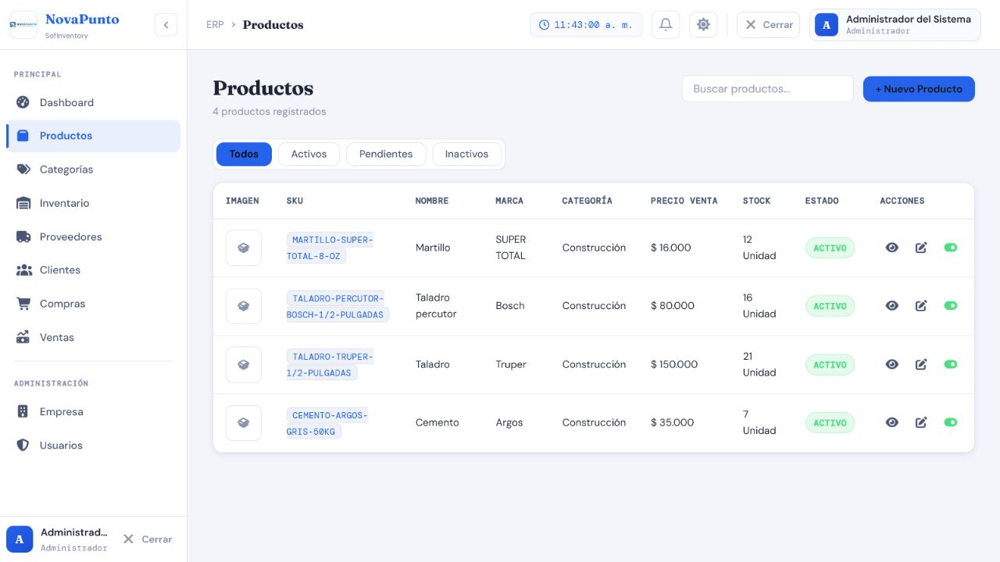{ loading=lazy }

##### Crear un nuevo producto

1. Haga clic en **"+ Nuevo Producto"**.
2. Complete los campos del formulario y luego haga clic en **"Guardar"**.

| Campo | Descripción |
|---|---|
| Imagen | Archivo opcional PNG, JPG, JPEG o WebP, con vista previa y límite indicado por el formulario |
| Nombre | Nombre comercial del producto |
| Marca | Marca del producto |
| Referencia | Referencia que permite distinguir el producto |
| Unidad de Medida | Unidad, Caja, Metro, Litro, Galón, Rollo, Bulto, Kilo |
| Categoría | Seleccione la categoría del producto |
| Precio Compra | Precio de compra unitario |
| Precio Venta | Precio de venta unitario |
| IVA (%) | Porcentaje aplicable entre 0 y 100 |
| Stock Mínimo | Stock mínimo de seguridad |
| Descripción | Información complementaria opcional |

El **SKU se genera automáticamente** a partir de la identificación comercial. Un producto nuevo inicia con stock en cero y estado pendiente; las existencias se administran mediante compras y movimientos de inventario, no desde este formulario.

La evidencia vigente del formulario y su panel de ayuda se encuentra en la sección 5.5.

##### Cambiar estado de un producto

Los productos pueden tener tres estados:
- **Pendiente:** Producto registrado pero no configurado para venta
- **Activo:** Producto disponible para ventas y compras
- **Inactivo:** Producto deshabilitado

1. Haga clic en el ícono **🔄 (Cambiar Estado)** del producto.
2. El sistema rotará el estado del producto.

#### 6.1.4 Gestión de categorías

1. Haga clic en **"Categorías"** en el menú lateral.
2. Se mostrará la lista de categorías existentes con su nombre, tipo de control y fecha de creación.
3. Para crear una categoría, haga clic en **"+ Nueva Categoría"** y complete:
   - **Nombre:** Nombre de la categoría
   - **Tipo de Control:** General, Herramienta, Eléctrico, Líquido o Tornillería
   - **Descripción:** Descripción de la categoría (opcional)

La categoría queda disponible para clasificar productos. Evite duplicar nombres o eliminar una categoría que ya esté relacionada con registros que deban conservarse.

📷 **Evidencia visual — ayuda de creación de Categoría**
{ loading=lazy }

#### 6.1.5 Gestión de proveedores

1. Haga clic en **"Proveedores"** en el menú lateral.
2. Se mostrará la tabla de proveedores con: Razón Social, Documento, Contacto, Email, Teléfono, Ciudad y Estado.
3. Use el **campo de búsqueda** para filtrar por razón social, documento o email.
4. Para crear un proveedor, haga clic en **"+ Nuevo Proveedor"** y complete identificación, razón social, persona de contacto, correo, teléfono, tipo de proveedor, ubicación, dirección y las observaciones que correspondan.
5. En **País / tipo de ubicación**, utilice el catálogo dependiente para Colombia o diligencie manualmente la ubicación de otro país, como se explica en la sección 5.7.

El proveedor podrá seleccionarse al registrar compras. Revise el documento y la razón social para evitar duplicados.

La sección 5.7 muestra el formulario vigente de Proveedor con el botón **Ayuda** y la ubicación para Colombia.

#### 6.1.6 Gestión de clientes

1. Haga clic en **"Clientes"** en el menú lateral.
2. Se mostrará la tabla de clientes con: Nombre/Razón Social, Documento, Tipo, Categoría, Email, Teléfono, Ciudad y Estado.
3. Los clientes pueden ser **Personas Naturales** o **Personas Jurídicas**, con campos diferentes según el tipo.
4. Complete la ubicación como se explica en la sección 5.7. Para persona natural se solicitan nombres y apellidos; para persona jurídica, razón social y nombre comercial opcional.
5. Los estados disponibles son Activo, Inactivo y Bloqueado. El cambio administrativo de estado corresponde a Administrador o Supervisor.

La sección 5.7 muestra el formulario vigente de Cliente con ubicación para otro país.

#### 6.1.7 Configuración de empresa

El módulo **Empresa** permite mantener una única configuración con la identidad de la organización que opera SofInventory. Solo el rol Administrador puede crearla o modificarla.

1. Ingrese a **Empresa** desde el bloque Administración.
2. Seleccione **Configurar empresa** o **Editar configuración**, según el estado actual.
3. Revise nombre comercial, razón social, NIT, dígito de verificación, dirección, ubicación, teléfono, correo y sitio web.
4. Si corresponde, cargue un logo PNG, JPG, JPEG o WebP y confirme su vista previa.
5. Revise el prefijo de ventas y el mensaje final que aparecerá en los comprobantes.
6. Guarde la configuración.

La moneda actual es **COP — Peso colombiano**. Los comprobantes de compras y ventas usan la identidad de empresa asociada a la operación para mantener una presentación consistente.

📷 **Evidencia visual — ayuda para actualizar Empresa**
{ loading=lazy width="420" }

---

### 6.2 Rol: Supervisor

El **Supervisor** tiene acceso a la gestión de productos, categorías, proveedores, clientes, ventas, compras e inventario. **No puede** gestionar usuarios.

#### 6.2.1 Panel de control del supervisor

El Dashboard del Supervisor muestra las siguientes secciones:

| Sección | Visible |
|---|---|
| Total Productos | ✅ |
| En Stock | ✅ |
| Clientes Activos | ✅ |
| Stock Bajo | ✅ |
| Ventas por periodo | ✅ |
| Ventas Recientes | ✅ |
| Productos Más Vendidos | ✅ |
| Gráfico Ventas vs. Compras | ✅ |
| Gráfico de Métodos de Pago | ✅ |
| Gráfico de Estado del Stock | ✅ |
| Top Vendedores | ❌ Oculto |
| Mejor Vendedor del Mes | ❌ Oculto |
| Compras por periodo | ❌ Oculto |
| Utilidad bruta | ❌ Oculto |
| Proveedores Activos | ❌ Oculto |

La composición es responsive y conserva las métricas textuales cuando las gráficas se reorganizan en pantallas pequeñas. Consulte la evidencia vigente de la sección 5.6.

#### 6.2.2 Supervisión de stock y reportes

El Supervisor puede:

1. **Consultar el inventario completo** en la pestaña "Stock" del módulo de Inventario.
2. **Revisar alertas de stock bajo** en la pestaña "Alertas".
3. **Crear y editar almacenes** en la pestaña "Almacenes".
4. **Registrar movimientos de inventario** (entradas, salidas y transferencias) en la pestaña "Movimiento".
5. **Exportar inventario a CSV** para análisis externo.

La evidencia vigente de stock y sus estados se encuentra en la sección 6.4.5.

#### 6.2.3 Auditoría de catálogo y movimientos

El Supervisor puede:

- **Ver y editar productos** existentes.
- **Crear categorías** de productos.
- **Gestionar proveedores** (crear, editar, activar/desactivar).
- **Gestionar clientes** (crear, editar).
- **Registrar y anular compras** y ventas.
- **Registrar movimientos rápidos** de inventario.

---

### 6.3 Rol: Vendedor

El **Vendedor** se enfoca en el módulo de **ventas**, la gestión de **clientes** y la consulta de **productos**.

#### 6.3.1 Panel de control del vendedor

El Dashboard del Vendedor muestra las siguientes secciones:

| Sección | Visible |
|---|---|
| Total Productos | ✅ |
| En Stock | ✅ |
| Clientes Activos | ❌ Oculto |
| Stock Bajo | ✅ |
| Ventas por periodo | ✅ |
| Ventas Recientes | ✅, limitadas al vendedor autenticado |
| Productos Más Vendidos | ✅ |
| Gráfico Ventas vs. Compras | ✅ |
| Gráfico de Métodos de Pago | ✅ |
| Gráfico de Estado del Stock | ✅ |
| Top Vendedores | ❌ Oculto |
| Mejor Vendedor del Mes | ❌ Oculto |
| Compras por periodo | ❌ Oculto |
| Utilidad bruta | ❌ Oculto |
| Proveedores Activos | ❌ Oculto |
| Acción rápida "Nueva venta" | ✅ |

Las ventas recientes se filtran para mostrar las asociadas al vendedor autenticado. Consulte la composición responsive vigente en la sección 5.6.

#### 6.3.2 Módulo de Facturación/Ventas

##### Registrar una nueva venta

1. Haga clic en **"Ventas"** en el menú lateral.
2. Haga clic en el botón **"+ Nueva Venta"**.
3. Se abrirá el modal de registro de venta con las siguientes secciones:

**Datos Generales:**

| Campo | Descripción |
|---|---|
| Cliente | Seleccione un cliente o deje "Cliente General" si no identifica al cliente |
| Almacén | Seleccione el almacén de origen del stock |
| Método de Pago | Efectivo, Tarjeta débito, Tarjeta crédito, Transferencia, Nequi o DaviPlata |
| Descuento | Descuento adicional en pesos (opcional) |
| Efectivo Recibido | (Solo si pago en efectivo) Dinero entregado por el cliente |
| Cambio | (Calculado automáticamente) Cambio a devolver |
| Observaciones | Notas adicionales de la venta (opcional) |

**Detalle de Productos:**

1. Haga clic en **"+ Agregar"** para agregar una línea de producto.
2. Seleccione el **producto** del desplegable.
3. Verifique el **precio unitario** tomado del producto e ingrese la **cantidad**.
4. El sistema muestra el **stock disponible**, el IVA configurado y calcula el **subtotal**.
5. Puede agregar múltiples productos haciendo clic en "+ Agregar" nuevamente.
6. Para eliminar una línea, haga clic en el ícono **🗑️ (basura)**.
7. Haga clic en **"Registrar Venta"** para confirmar.

**Totales (calculados automáticamente):**

| Campo | Descripción |
|---|---|
| Subtotal | Suma de (precio × cantidad) de todos los productos |
| Descuento | Descuento aplicado |
| IVA | Suma del impuesto configurado para cada producto |
| **Total** | **Monto total a pagar** |

📷 **Evidencia visual — Venta actual con resumen, pago y ayuda contextual**
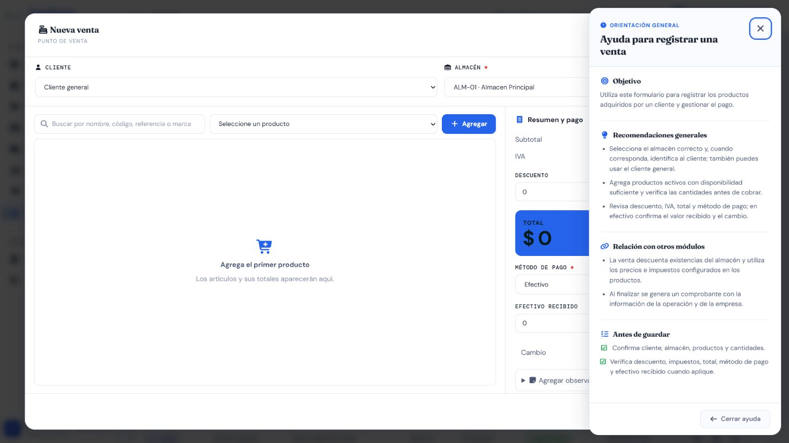{ loading=lazy }

##### Ver detalle de una venta

1. En la tabla de ventas, haga clic en el ícono **👁 (Ver)** de la venta a consultar.
2. Se abrirá un comprobante con número de venta, datos de la empresa, cliente, responsable, almacén, método de pago, productos, cantidades, precios, impuestos y totales.
3. Use **Imprimir comprobante** cuando necesite una copia; confirme previamente que los datos de Empresa estén configurados.

📷 **Evidencia visual — detalle y comprobante de Venta**
{ loading=lazy }

##### Anular una venta

1. En la tabla de ventas, haga clic en el ícono **🚫 (Anular)** de la venta a anular.
2. Confirme la operación e indique el motivo solicitado.
3. El sistema restaurará automáticamente el stock descontado y registrará el movimiento de inventario correspondiente (DEVOLUCION_VENTA).

⚠️ **Importante:** La anulación de ventas es irreversible. Asegúrese de que sea necesario antes de confirmar.

📷 **Evidencia visual — Venta anulada**
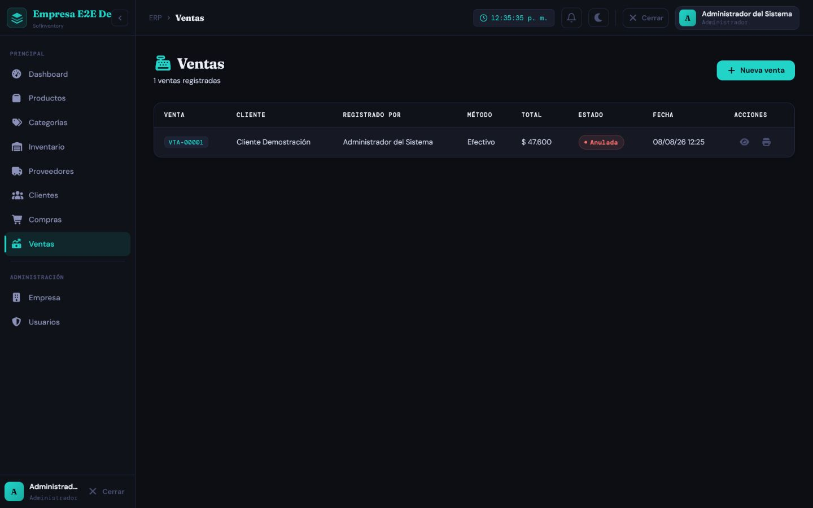{ loading=lazy }

#### 6.3.3 Gestión de clientes

El Vendedor puede crear y editar clientes:

1. Haga clic en **"Clientes"** en el menú lateral.
2. Haga clic en **"+ Nuevo Cliente"**.
3. Seleccione el tipo de cliente:
   - **Persona Natural:** Ingrese nombres, apellidos, tipo y número de documento.
   - **Persona Jurídica:** Ingrese razón social, nombre comercial, tipo y número de documento.
4. Complete los campos de contacto y seleccione **Colombia** u **Otro país** para diligenciar la ubicación correcta.
5. Seleccione la categoría: General, Minorista, Mayorista o Corporativo.
6. Haga clic en **"Guardar"**.

Consulte la evidencia vigente de ubicación para Colombia y otros países en la sección 5.7.

#### 6.3.4 Consulta rápida de productos

El Vendedor puede **ver** la lista de productos (sin poder crear ni editar):

1. Haga clic en **"Productos"** en el menú lateral.
2. Use el campo de búsqueda para encontrar un producto por nombre, SKU o marca.
3. Filtre por estado: Todos, Activos, Pendientes o Inactivos.
4. Consulte el precio de venta y el stock disponible de cada producto.

Las acciones de modificación requieren autorización aunque el catálogo sea consultable desde la navegación general.

---

### 6.4 Rol: Bodega

El rol **Bodega** se enfoca en la recepción de compras, los movimientos de inventario y la gestión de almacenes.

#### 6.4.1 Panel de control de Bodega

El Dashboard de Bodega muestra las siguientes secciones:

| Sección | Visible |
|---|---|
| Total Productos | ✅ |
| En Stock | ✅ |
| Clientes Activos | ✅ |
| Proveedores Activos | ✅ |
| Stock Bajo | ✅ |
| Ventas por periodo | ❌ Oculto |
| Compras por periodo | ❌ Oculto |
| Utilidad bruta | ❌ Oculto |
| Gráfico Ventas vs. Compras | ✅ |
| Gráfico de Métodos de Pago | ✅ |
| Gráfico de Estado del Stock | ✅ |
| Top Vendedores | ❌ Oculto |
| Mejor Vendedor del Mes | ❌ Oculto |
| Ventas Recientes | ❌ Oculto |
| Alertas y Productos Más Vendidos | ✅ |

El rol Bodega recibe una vista operativa centrada en existencias, alertas y consulta; las secciones financieras de ventas, compras y utilidad permanecen ocultas.

#### 6.4.2 Recepción de compras

1. Haga clic en **"Compras"** en el menú lateral.
2. Haga clic en **"+ Nueva Compra"**.
3. Complete los datos de la compra:

**Datos Generales:**

| Campo | Descripción |
|---|---|
| Proveedor | Seleccione el proveedor |
| Almacén receptor | Seleccione el almacén que recibirá las existencias |
| Número de Factura | Número de factura del proveedor |
| Fecha de Compra | Fecha de la compra |
| Tipo de Compra | Contado o Crédito |
| Observaciones | Información opcional sobre la recepción |

**Detalle de Productos:**

1. Agregue líneas de producto haciendo clic en **"+ Agregar"**.
2. Seleccione el producto, ingrese la cantidad, el costo unitario y el IVA de la línea.
3. El sistema calcula automáticamente subtotal, IVA y total.
4. Haga clic en **"Registrar Compra"**.

**Efecto en el Inventario:**

Al registrar una compra, el sistema automáticamente:
- **Aumenta el stock** del producto en el almacén correspondiente.
- **Registra un movimiento** de inventario de tipo `ENTRADA_COMPRA`.

La compra queda inicialmente en estado **Completada**. El rol Bodega puede registrarla y consultar su detalle; la anulación corresponde a Administrador o Supervisor y revierte las existencias si la operación es válida.

📷 **Evidencia visual — Compra con almacén receptor y ayuda contextual**
{ loading=lazy }

**Consultar detalle y comprobante**

1. En el listado, use **Ver detalle** sobre la compra requerida.
2. Revise empresa, proveedor, responsable, almacén, productos, cantidades, costos, IVA y totales.
3. Use la acción de impresión cuando necesite conservar el comprobante.

📷 **Evidencia visual — detalle de Compra**
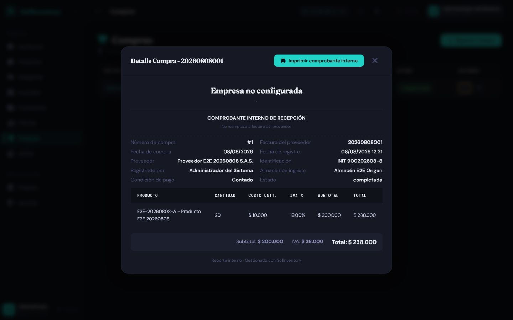{ loading=lazy }

**Anular una compra — Administrador o Supervisor**

1. Confirme que la compra correcta está en estado completado.
2. Seleccione **Anular**, confirme la operación y registre el motivo solicitado.
3. El sistema intenta revertir las existencias incorporadas. La anulación se rechaza si la reversión dejaría stock negativo.

⚠️ **Importante:** la anulación es irreversible y debe quedar respaldada por una justificación operativa.

📷 **Evidencia visual — Compra anulada**
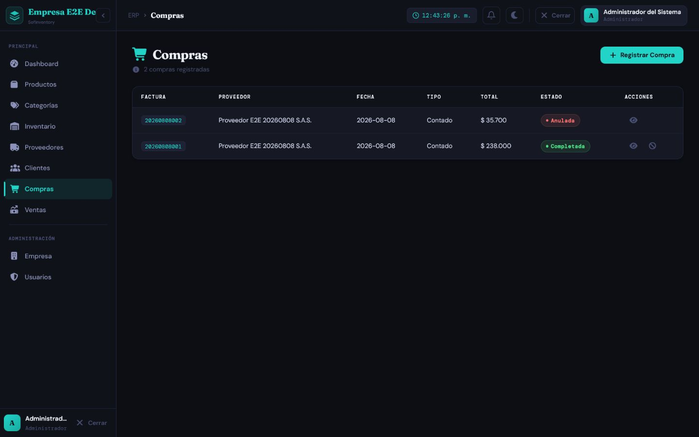{ loading=lazy }

#### 6.4.3 Gestión de almacenes

##### Listar almacenes

1. Haga clic en **"Inventario"** en el menú lateral.
2. Haga clic en la pestaña **"Almacenes"**.
3. Se mostrará la tabla de almacenes con: Nombre, Código, Dirección y Acciones.

📷 **Evidencia visual — pestaña actual de Almacenes**
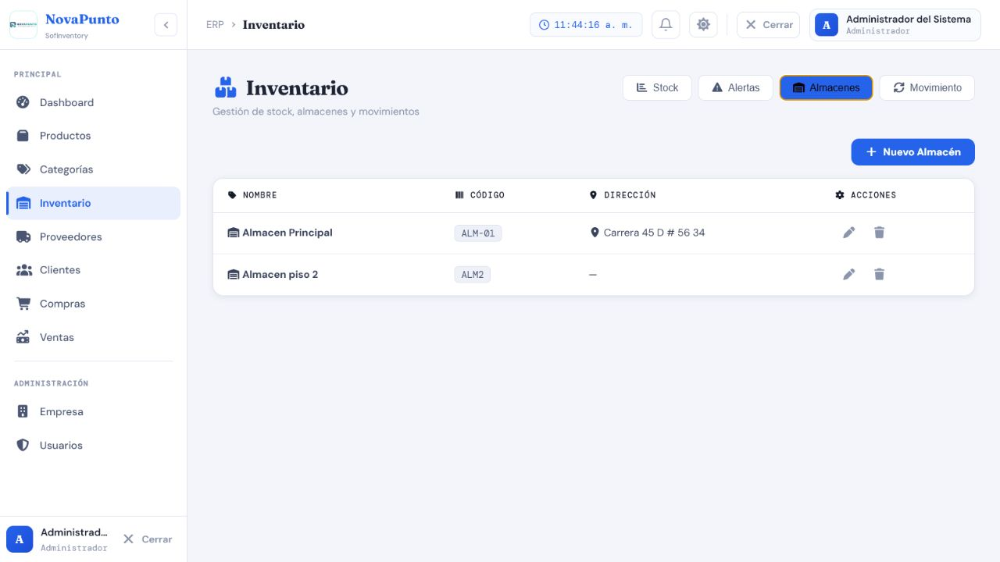{ loading=lazy }

##### Crear un nuevo almacén

1. Haga clic en **"+ Nuevo Almacén"**.
2. Complete los campos:

| Campo | Descripción | Obligatorio |
|---|---|---|
| Nombre | Nombre del almacén | Sí |
| Código | Código único del almacén (ej: ALM001) | Sí |
| Dirección | Dirección física del almacén | No |
| Notas | Observaciones adicionales | No |

3. Haga clic en **"Guardar"**.

📷 **Evidencia visual — formulario de Almacén con ayuda contextual**
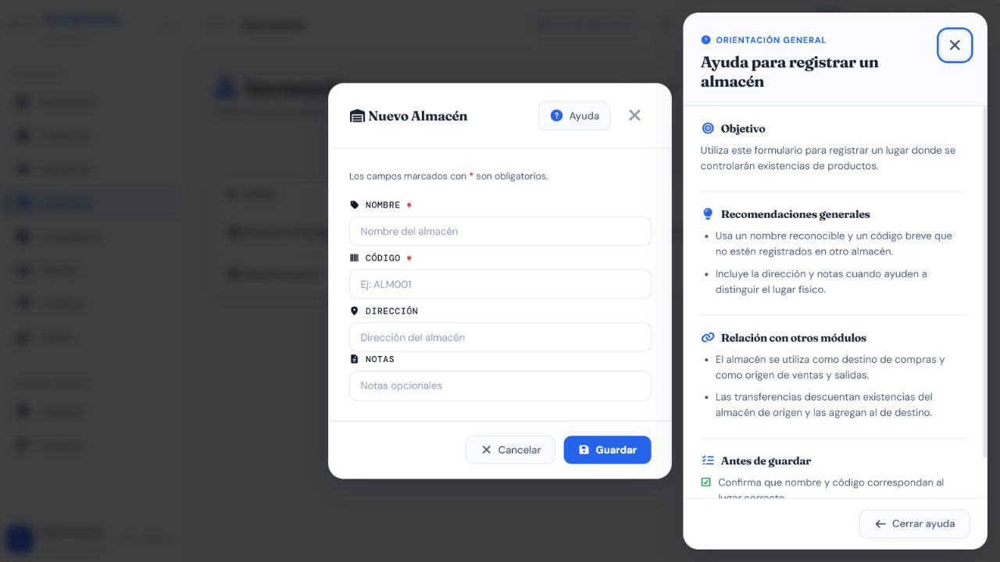{ loading=lazy }

#### 6.4.4 Movimientos de inventario

1. Haga clic en **"Inventario"** en el menú lateral.
2. Haga clic en la pestaña **"Movimiento"**.
3. Complete el formulario de movimiento y luego haga clic en **"Registrar Movimiento"**.

| Campo | Descripción |
|---|---|
| Producto | Seleccione el producto |
| Tipo | Entrada, Salida o Transferencia |
| Almacén | Almacén afectado; en una transferencia corresponde al origen |
| Almacén destino | Aparece y es obligatorio únicamente para una transferencia |
| Cantidad | Cantidad de unidades |
| Motivo | Descripción del motivo del movimiento |

**Tipos de movimiento:**

| Tipo | Efecto en Stock | Uso |
|---|---|---|
| **Entrada** | Aumenta el stock del almacén seleccionado | Ajuste positivo o ingreso manual justificado |
| **Salida** | Disminuye el stock del almacén seleccionado | Ajuste negativo, merma o salida manual justificada |
| **Transferencia** | Descuenta del origen e incrementa en el destino | Traslado de existencias entre almacenes diferentes |

En una salida o transferencia, el sistema comprueba que exista stock suficiente. Una transferencia no cambia la existencia total del producto; cambia su distribución por almacén.

📷 **Evidencia visual — transferencia entre almacenes y ayuda contextual**
{ loading=lazy }

#### 6.4.5 Consulta de almacenes y stock

1. En la pestaña **"Stock"**, consulte el inventario completo con: SKU, Producto, Stock Actual, Stock Mínimo y Estado.
2. Los estados de stock son:
   - **Agotado:** Stock = 0
   - **Bajo:** Stock ≤ Stock Mínimo
   - **Medio:** Stock > Stock Mínimo y ≤ dos veces el Stock Mínimo
   - **Alto:** Stock > dos veces el Stock Mínimo; si el mínimo es 0, cualquier existencia positiva se considera alta
3. Use las **estadísticas resumidas** en la parte superior para ver: Total Productos, En Stock, Stock Bajo y Almacenes.

📷 **Evidencia visual — resumen y tabla de stock**
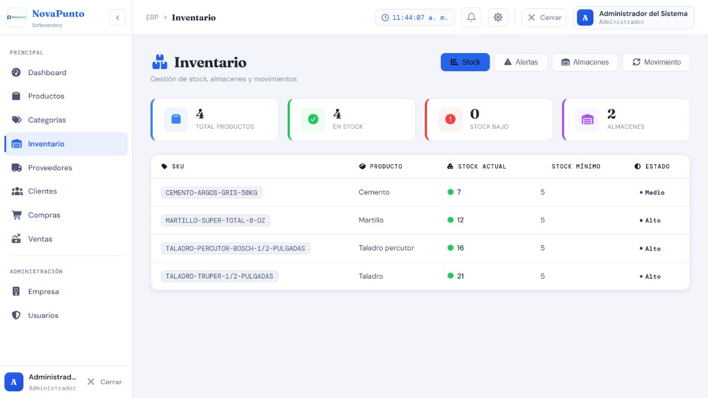{ loading=lazy }

---

## 7. Flujos de trabajo principales

### 7.1 Flujo: Registrar una venta

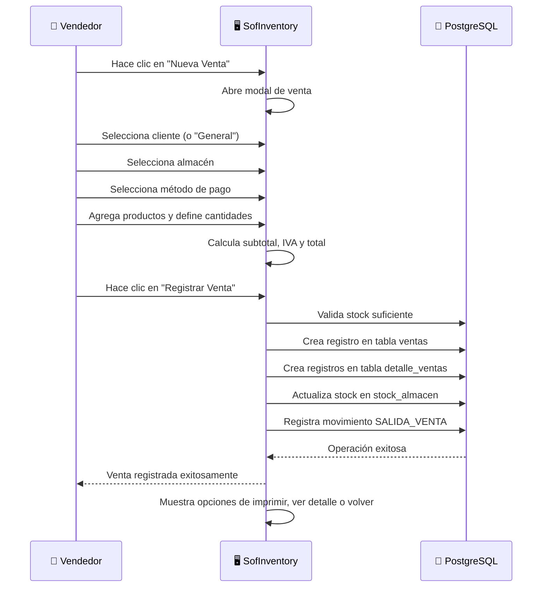
```mermaid
sequenceDiagram
    participant V as 👤 Vendedor
    participant S as 🖥️ SofInventory
    participant DB as 🐘 PostgreSQL

    V->>S: Hace clic en "Nueva Venta"
    S->>S: Abre modal de venta
    V->>S: Selecciona cliente (o "General")
    V->>S: Selecciona almacén
    V->>S: Selecciona método de pago
    V->>S: Agrega productos y define cantidades
    S->>S: Calcula subtotal, IVA y total
    V->>S: Hace clic en "Registrar Venta"
    S->>DB: Valida stock suficiente
    S->>DB: Crea registro en tabla ventas
    S->>DB: Crea registros en tabla detalle_ventas
    S->>DB: Actualiza stock en stock_almacen
    S->>DB: Registra movimiento SALIDA_VENTA
    DB-->>S: Operación exitosa
    S-->>V: Venta registrada exitosamente
    S->>S: Muestra opciones de imprimir, ver detalle o volver
```

**Pasos detallados:**

1. Acceda al módulo **"Ventas"** desde el menú lateral.
2. Haga clic en **"+ Nueva Venta"**.
3. Seleccione el **cliente** (o deje "Cliente General" si no aplica).
4. Seleccione el **almacén** de donde saldrá la mercancía.
5. Seleccione el **método de pago** (Efectivo, Débito, Crédito, Transferencia, Nequi, DaviPlata).
6. Haga clic en **"+ Agregar"** para agregar productos.
7. Para cada producto: seleccione el producto, verifique el precio e IVA configurados e ingrese la cantidad.
8. Si es pago en efectivo, ingrese el **efectivo recibido** y el sistema calculará el **cambio**.
9. Revise los **totales** (Subtotal, Descuento, IVA, Total).
10. Haga clic en **"Registrar Venta"**.
11. El sistema descontará automáticamente el stock y registrará el movimiento de inventario.
12. En la confirmación, elija **Imprimir comprobante**, **Ver detalle** o **Volver a ventas**.

📷 **Evidencia visual — confirmación del registro de Venta**
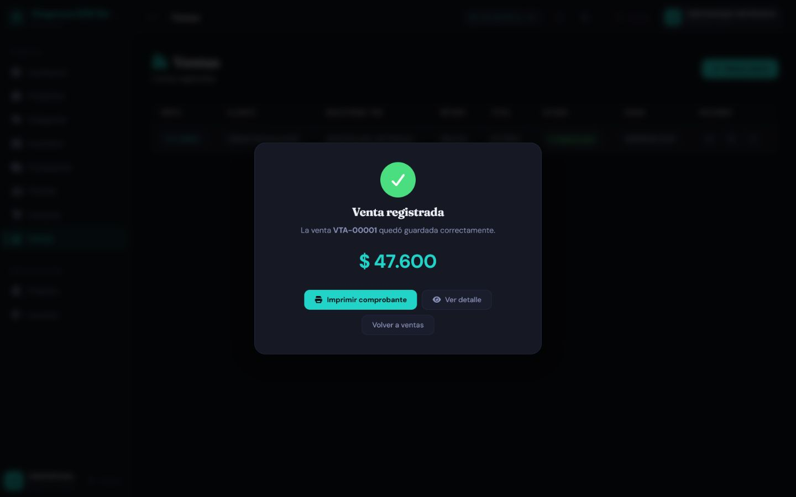{ loading=lazy }

---

### 7.2 Flujo: Registrar una entrada manual de inventario

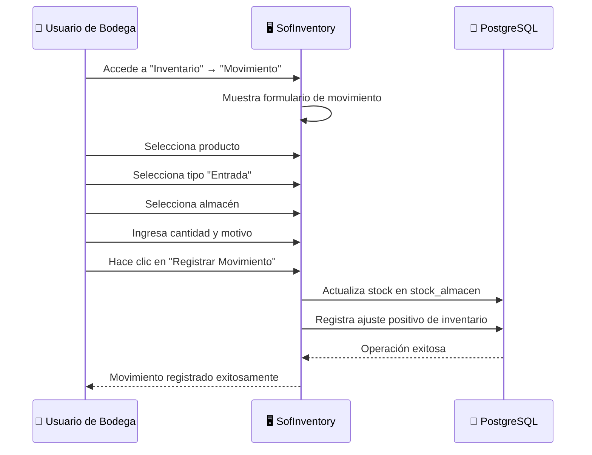
```mermaid
sequenceDiagram
    participant B as 👤 Usuario de Bodega
    participant S as 🖥️ SofInventory
    participant DB as 🐘 PostgreSQL

    B->>S: Accede a "Inventario" → "Movimiento"
    S->>S: Muestra formulario de movimiento
    B->>S: Selecciona producto
    B->>S: Selecciona tipo "Entrada"
    B->>S: Selecciona almacén
    B->>S: Ingresa cantidad y motivo
    B->>S: Hace clic en "Registrar Movimiento"
    S->>DB: Actualiza stock en stock_almacen
    S->>DB: Registra ajuste positivo de inventario
    DB-->>S: Operación exitosa
    S-->>B: Movimiento registrado exitosamente
```

**Pasos detallados:**

1. Acceda al módulo **"Inventario"** desde el menú lateral.
2. Haga clic en la pestaña **"Movimiento"**.
3. Seleccione el **producto** del desplegable.
4. Seleccione el tipo de movimiento: **Entrada**.
5. Seleccione el **almacén** que recibirá las existencias.
6. Ingrese la **cantidad** de unidades a incorporar.
7. Registre un **motivo** claro que permita comprender el ajuste.
8. Haga clic en **"Registrar Movimiento"**.
9. El sistema actualizará el stock y conservará el movimiento para consulta.

!!! warning
    Una compra debe registrarse desde el módulo Compras. Use la entrada manual solo cuando el ajuste tenga una justificación operativa diferente y autorizada.

El formulario actual y la relación entre almacenes se ilustran en la sección 6.4.4.

---

### 7.3 Flujo: Crear un usuario

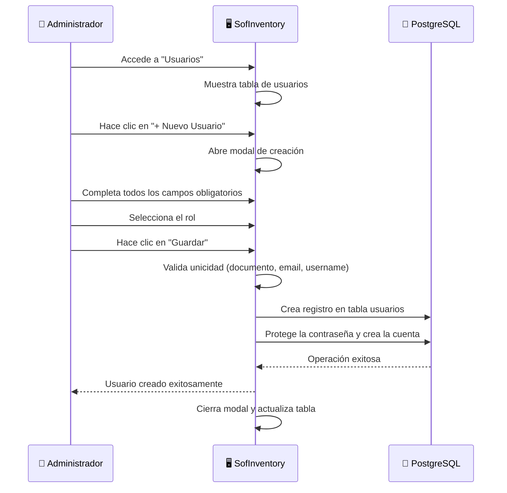
```mermaid
sequenceDiagram
    participant A as 👤 Administrador
    participant S as 🖥️ SofInventory
    participant DB as 🐘 PostgreSQL

    A->>S: Accede a "Usuarios"
    S->>S: Muestra tabla de usuarios
    A->>S: Hace clic en "+ Nuevo Usuario"
    S->>S: Abre modal de creación
    A->>S: Completa todos los campos obligatorios
    A->>S: Selecciona el rol
    A->>S: Hace clic en "Guardar"
    S->>S: Valida unicidad (documento, email, username)
    S->>DB: Crea registro en tabla usuarios
    S->>DB: Protege la contraseña y crea la cuenta
    DB-->>S: Operación exitosa
    S-->>A: Usuario creado exitosamente
    S->>S: Cierra modal y actualiza tabla
```

**Pasos detallados:**

1. Acceda al módulo **"Usuarios"** desde el menú lateral.
2. Haga clic en **"+ Nuevo Usuario"**.
3. Seleccione el **Tipo de Documento** (CC, CE, NIT, TI o PA).
4. Ingrese el **Número de Documento** con el formato correspondiente al tipo seleccionado.
5. Ingrese el **Nombre Completo** del usuario.
6. Ingrese el **Email** (debe ser único en el sistema).
7. Ingrese el **Username** (debe ser único en el sistema).
8. Ingrese y confirme la **Contraseña** (mín. 8 caracteres).
9. Seleccione el **Rol** (Administrador, Supervisor, Vendedor o Bodega).
10. Seleccione la **Fecha de Creación**.
11. Ingrese **Observaciones** si es necesario.
12. Haga clic en **"Guardar"**.
13. El sistema validará que el documento, email y username no existan previamente.
14. Si la validación es exitosa, la cuenta quedará activa y la contraseña se conservará de forma irreversible.

📷 **Evidencia visual — validación de campos obligatorios en móvil**
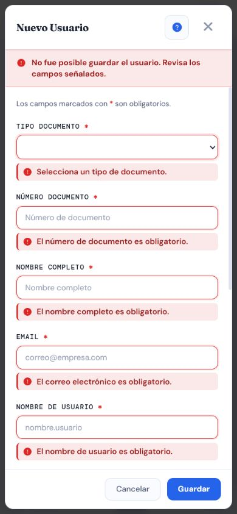{ loading=lazy width="420" }

---

### 7.4 Flujo: Registrar una compra

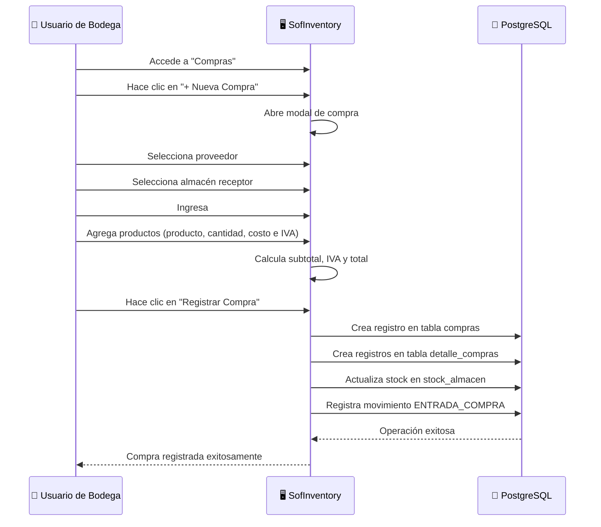
```mermaid
sequenceDiagram
    participant B as 👤 Usuario de Bodega
    participant S as 🖥️ SofInventory
    participant DB as 🐘 PostgreSQL

    B->>S: Accede a "Compras"
    B->>S: Hace clic en "+ Nueva Compra"
    S->>S: Abre modal de compra
    B->>S: Selecciona proveedor
    B->>S: Selecciona almacén receptor
    B->>S: Ingresa # factura, fecha y tipo de compra
    B->>S: Agrega productos (producto, cantidad, costo e IVA)
    S->>S: Calcula subtotal, IVA y total
    B->>S: Hace clic en "Registrar Compra"
    S->>DB: Crea registro en tabla compras
    S->>DB: Crea registros en tabla detalle_compras
    S->>DB: Actualiza stock en stock_almacen
    S->>DB: Registra movimiento ENTRADA_COMPRA
    DB-->>S: Operación exitosa
    S-->>B: Compra registrada exitosamente
```

**Pasos detallados:**

1. Acceda al módulo **"Compras"** desde el menú lateral.
2. Haga clic en **"+ Nueva Compra"**.
3. Seleccione el **Proveedor**.
4. Seleccione el **Almacén receptor**.
5. Ingrese el **Número de Factura** del proveedor.
6. Ingrese la **Fecha de Compra**.
7. Seleccione el **Tipo de Compra** (Contado o Crédito).
8. Haga clic en **"+ Agregar"** para agregar productos.
9. Para cada producto: seleccione el producto, ingrese la cantidad, el costo unitario y el IVA.
10. Revise los **totales** (Subtotal, IVA, Total).
11. Haga clic en **"Registrar Compra"**.
12. El sistema aumentará automáticamente el stock del almacén seleccionado y registrará el movimiento `ENTRADA_COMPRA`.

La evidencia vigente del formulario y de su ayuda se encuentra en la sección 6.4.2.

---

### 7.5 Flujo: Gestionar alertas de stock

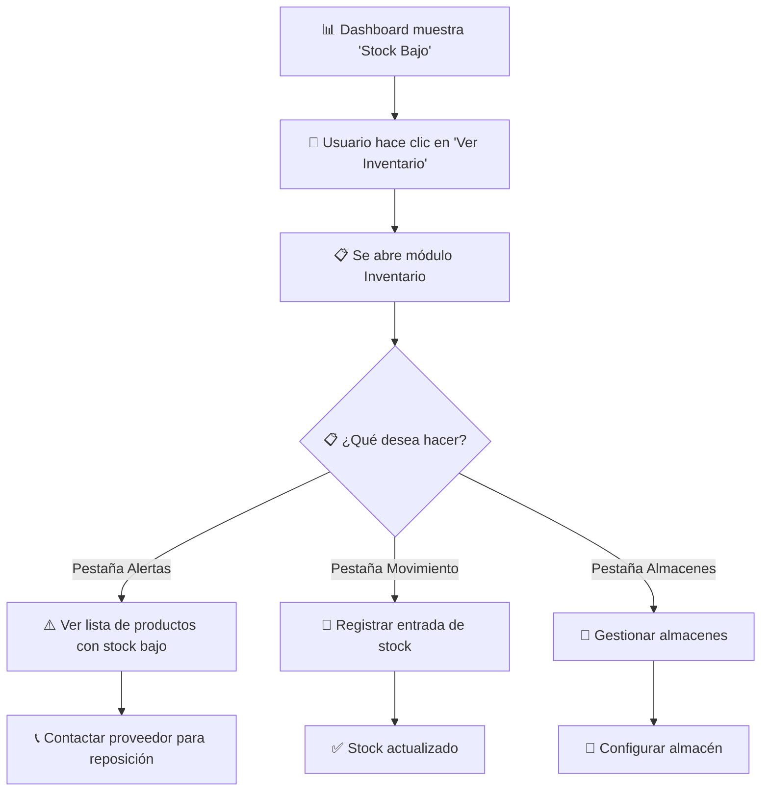
```mermaid
graph TD
    A["📊 Dashboard muestra 'Stock Bajo'"] --> B["👤 Usuario hace clic en 'Ver Inventario'"]
    B --> C["📋 Se abre módulo Inventario"]
    C --> D{"📋 ¿Qué desea hacer?"}
    D -->|"Pestaña Alertas"| E["⚠️ Ver lista de productos con stock bajo"]
    D -->|"Pestaña Movimiento"| F["🔄 Registrar entrada de stock"]
    D -->|"Pestaña Almacenes"| G["🏢 Gestionar almacenes"]
    E --> H["📞 Contactar proveedor para reposición"]
    F --> I["✅ Stock actualizado"]
    G --> J["📝 Configurar almacén"]
```
**Pasos detallados para consultar y gestionar alertas:**

1. Observe en el Dashboard o menú principal el contador/notificación de "Stock Bajo" o "Alertas".
2. Diríjase al módulo "Inventario" desde el menú lateral.
3. Haga clic en la pestaña "Alertas" (o filtro de productos con stock mínimo).
4. Revise el listado de productos cuyo stock actual es menor o igual al límite mínimo configurado.
5. Identifique el producto a reponer y proceda a contactar al proveedor o generar una Nueva Compra para abastecer la bodega.

La pestaña **Alertas** usa el mismo criterio de stock bajo descrito en la sección 6.4.5. Consulte allí la evidencia vigente de Inventario.
---

## 8. Glosario de términos

| Término | Definición |
|---|---|
| **SKU** | Código único asignado a un producto para su seguimiento y control en inventario. |
| **Stock Mínimo** | Cantidad mínima permisible de un producto antes de requerir reabastecimiento. |
| **Rol de Usuario** | Nivel de acceso y permisos asignados a un perfil (Administrador, Supervisor, Vendedor, Bodega). |
| **Modal** | Ventana emergente en la interfaz que permite capturar datos sin salir de la vista actual. |
| **Dashboard** | Panel de control principal que resume los indicadores más importantes del negocio. |
| **KPI** | Indicador clave de desempeño (Key Performance Indicator); métrica numérica que resume el estado de un proceso del negocio. |
| **IVA** | Impuesto al Valor Agregado; se calcula automáticamente sobre el valor de productos en ventas y compras. |
| **Movimiento de Inventario** | Registro de una entrada, salida o transferencia de stock, con su cantidad, motivo y fecha. |
| **Transferencia** | Operación que descuenta existencias de un almacén y las incorpora en otro sin cambiar el total general del producto. |
| **ENTRADA_COMPRA** | Tipo de movimiento que registra el aumento de stock generado por una compra a proveedor. |
| **SALIDA_VENTA** | Tipo de movimiento que registra la disminución de stock generada por una venta. |
| **DEVOLUCION_VENTA** | Tipo de movimiento que restaura el stock cuando una venta es anulada. |
| **Almacén** | Ubicación física donde se almacena el inventario de productos. |
| **Cliente General** | Cliente genérico utilizado en una venta cuando no se identifica a un cliente específico. |
| **Persona Natural / Jurídica** | Clasificación del cliente o proveedor según sea un individuo (natural) o una empresa (jurídica). |
| **Ayuda contextual** | Panel de orientación general asociado a un formulario, que puede abrirse sin borrar ni guardar la información diligenciada. |
| **Tema visual** | Presentación Claro, Azul u Oscuro que modifica la apariencia sin alterar los datos. |
| **Configuración de Empresa** | Identidad, contacto, ubicación, logo y textos utilizados por SofInventory en la interfaz y los comprobantes. |
| **Resumen criptográfico de contraseña** | Representación irreversible almacenada de forma segura; ni siquiera el administrador puede leer la contraseña en texto plano. |
| **Cuenta Bloqueada** | Estado de un usuario que superó el número máximo de intentos fallidos de inicio de sesión (5) y requiere ser desbloqueado por un Administrador. |

---

## 9. Preguntas frecuentes (FAQ)

**1. ¿Qué debo hacer si no recuerdo mi contraseña de acceso?**
> Contacte al usuario con perfil **Administrador** para que restablezca sus credenciales desde el módulo de administración de usuarios.

**2. ¿Puedo registrar una venta si el stock está en cero?**
> No. El sistema valida automáticamente las existencias disponibles para evitar descuadres en el inventario físico.

**3. ¿Qué pasa si anulo una venta por error?**
> El sistema restaura automáticamente el stock descontado mediante un movimiento `DEVOLUCION_VENTA`. Sin embargo, la anulación en sí misma es irreversible, por lo que deberá registrar una nueva venta si el cliente aún desea completar la compra.

**4. ¿Por qué no veo Empresa o Usuarios en el menú?**
> Estos módulos pertenecen al bloque **Administración** y solo se muestran al rol Administrador. Los módulos principales pueden aparecer en la navegación general, pero las operaciones siguen sujetas a los permisos de la sección 3.3.

**5. ¿Qué significa que mi cuenta esté "Bloqueada"?**
> Significa que se superaron los 5 intentos fallidos de inicio de sesión permitidos. Un Administrador debe desbloquear la cuenta desde el módulo de Usuarios.

**6. ¿Puedo editar una compra o venta ya registrada?**
> No se pueden editar directamente. Si el registro es incorrecto, debe anularse (si el estado lo permite) y registrarse nuevamente con los datos correctos.

**7. ¿Qué diferencia hay entre "Inactivo" y "Bloqueado" en un cliente?**
> "Inactivo" es un estado administrativo reversible que puede activar cualquier usuario autorizado. "Bloqueado" indica una restricción adicional sobre ese cliente y sigue el ciclo: activo → inactivo → bloqueado → activo.

**8. ¿El sistema funciona sin conexión a internet?**
> SofInventory requiere conexión con el servidor donde está desplegado. En una instalación local, esto puede ser la red local o el mismo equipo; en un despliegue remoto, se necesita conectividad con la dirección institucional.

**9. ¿Puedo abrir la ayuda sin perder lo que ya escribí?**
> Sí. El panel de ayuda conserva los datos del formulario. Puede cerrarlo con **Cerrar ayuda**, con su botón **X** o con **Esc** y continuar exactamente en el mismo formulario.

**10. ¿Por qué la ciudad está deshabilitada al elegir Colombia?**
> Primero debe seleccionar el departamento. El sistema habilita después las ciudades o municipios que pertenecen a ese departamento.

**11. ¿Dónde se cambian el logo y el mensaje del comprobante?**
> Un Administrador debe ingresar a **Empresa**, editar la configuración y guardar los datos. Revise la vista previa del logo y el mensaje antes de confirmar.

**12. ¿Cambiar el tema afecta mi trabajo?**
> No. Solo cambia la apariencia. Los formularios, permisos, operaciones y datos permanecen iguales.

---

## 10. Solución de problemas comunes

| Problema | Posible causa | Solución |
|---|---|---|
| No puedo iniciar sesión aunque la contraseña es correcta | La cuenta está bloqueada por intentos fallidos previos | Solicite a un Administrador que desbloquee la cuenta desde el módulo de Usuarios |
| El botón "Registrar Venta" no responde | Falta seleccionar un campo obligatorio (almacén, método de pago o al menos un producto) | Revise que todos los campos obligatorios del modal estén completos |
| No aparece un producto al buscarlo en Ventas | El producto está en estado "Inactivo" o "Pendiente" | Verifique el estado del producto en el módulo Productos; solo los productos "Activos" están disponibles para la venta |
| La página no carga o se queda en blanco | Pérdida de conexión con el servidor o servicio no disponible | Verifique la red y la dirección de acceso; si persiste, contacte a soporte indicando fecha, hora y módulo |
| El modal no se cierra después de guardar | Existen errores de validación o la solicitud no pudo completarse | Revise el resumen y los mensajes junto a los campos; corrija sin volver a diligenciar la información válida |
| Los totales de una venta o compra no cuadran | Se modificó la cantidad o el precio después de calcular el subtotal | Vuelva a verificar cada línea de producto; los totales se recalculan automáticamente al cambiar cantidad o precio |
| Una operación muestra "sin permisos" | El rol autenticado no está autorizado para modificar ese módulo | Consulte la matriz de la sección 3.3 y solicite la operación a un rol autorizado; no comparta cuentas |
| La ciudad de Colombia no se habilita | No se ha seleccionado un departamento válido o no cargó el catálogo | Seleccione nuevamente el departamento; si el problema continúa, cierre el formulario sin guardar y reporte la incidencia |
| No puedo transferir inventario | Origen y destino son iguales, falta stock o faltan campos obligatorios | Seleccione dos almacenes diferentes, confirme el stock del origen, la cantidad y el motivo |
| El panel de ayuda cubre el formulario en móvil | En pantallas pequeñas la ayuda usa una vista adaptada de mayor tamaño | Desplácese dentro del panel y use **Cerrar ayuda** o **Esc** para regresar al formulario sin perder datos |

---

## 11. Mesa de ayuda y soporte técnico

Si presenta inconsistencias en el sistema, errores de ejecución o requiere asistencia técnica adicional, puede comunicarse con el equipo de soporte a través de los siguientes canales:

* **Canal de Soporte:** Mesa de Ayuda SofInventory
* **Correo Electrónico:** alejosepulveda981@gmail.com
* **Línea de Atención:** 3197751596
* **Horario de Atención:** Lunes a Viernes de 8:00 a.m. a 6:00 p.m.

> **Antes de contactar a soporte:** revise la sección 9 (Preguntas Frecuentes) y la sección 10 (Solución de Problemas Comunes) de este manual; la mayoría de los inconvenientes reportados tienen solución inmediata sin necesidad de escalar el caso.

Al reportar una incidencia, indique **módulo, acción, fecha y hora, rol, tema visual, dispositivo o tamaño de pantalla y mensaje visible**. Adjunte una captura solo si no contiene credenciales, tokens ni datos personales o comerciales sensibles.

---

## 12. Referencias y fuentes consultadas

### 12.1 Normas y guías oficiales de documentación

| Guía / Norma | Entidad / Fuente | Descripción |
|---|---|---|
| **Guía para la Elaboración de Manuales de Usuario de Sistemas de Información** | DNP (Departamento Nacional de Planeación) — [Ver Documento](https://bit.ly/31aMsek) | Lineamientos de estructura, claridad y presentación para la elaboración de documentos dirigidos a usuarios finales. |
| **Elaborar el Manual del Usuario** | SENA — Ecosistema de Recursos Educativos Digitales (2022) — [Ver Video](https://www.youtube.com/watch?v=L6KrmflE4jU) | Orientaciones y buenas prácticas metodológicas para la redacción y estructuración de manuales de usuario en proyectos de software. |
| **Guía de accesibilidad y diseño visual de SofInventory** | [Documento interno](accessibility-visual-guide.md) | Temas, contraste, teclado, formularios, modales, ayuda contextual y responsive. |
| **Casos de prueba de SofInventory** | [Matriz de cobertura](test-cases/MATRIZ_COBERTURA.md) | Cobertura funcional y evidencias vigentes de los módulos descritos en este manual. |

---

<h3>🛠️ SofInventory ERP</h3>

Sistema de Gestión de Inventarios, Compras y Ventas para Empresas Comerciales

<strong>© 2026 SofInventory.</strong> Todos los derechos reservados.  
Documento elaborado por el Equipo de Desarrollo de Software — SENA

