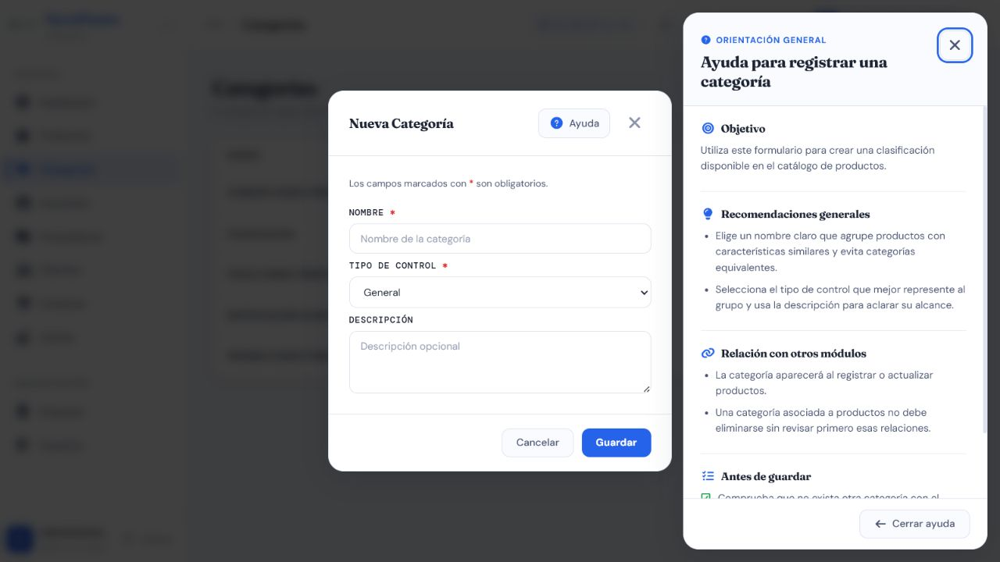

# Casos de prueba — Categorías

> **Prefijo:** TC-CAT · **Cobertura mínima:** 4 casos · **Ejecución final:** 4 aprobados · **Fecha:** 8 de agosto de 2026

## Alcance

Valida la creación, clasificación, listado y eliminación de categorías usadas por Productos. La autorización real permite crear, listar y eliminar a `Administrador` y `Supervisor`. No existe edición de categoría en las rutas actuales.

## Matriz de casos

| ID | Nombre | Tipo | Funcionalidad que verifica | Precondiciones y rol | Datos ficticios | Resultado esperado | Automatización existente | Falta automatización | Evidencia | Prioridad |
|---|---|---|---|---|---|---|---|---|---|---|
| TC-CAT-001 | Crear categoría válida | Positivo / integración | Alta con nombre, descripción y tipo de control; disponibilidad posterior en Productos | Sesión de Administrador o Supervisor | `Herramientas 2K`, descripción breve, `HERRAMIENTA` | HTTP 201; categoría normalizada y visible en el selector de Productos | `P` — serializer automatizado aprobado; endpoint y relación ejecutados en E2E | Automatizar el ciclo HTTP completo | AUTO + API + MAN; [formulario y ayuda](./evidencias/frontend/CAT-formulario-ayuda.png) | Alta |
| TC-CAT-002 | Rechazar categoría duplicada | Negativo | Unicidad ignorando mayúsculas y espacios | Categoría `Herramientas` existente; Administrador o Supervisor | `  herramientas  ` | HTTP 400 con mensaje por `nombre`; no se crea duplicado | `A` — pruebas de serializer aprobadas; endpoint E2E devolvió 400 | Agregar prueba automatizada directa del endpoint | AUTO + API + [captura](./evidencias/frontend/CAT-duplicado-e2e.png) | Alta |
| TC-CAT-003 | Rechazar nombre semánticamente inválido | Negativo | No acepta nombre solo numérico; acepta texto comercial alfanumérico | Administrador o Supervisor | Inválido `7777777`; válido `Químicos 2K` | Inválido: HTTP 400 por `nombre`; válido: creación permitida | `A` — prueba automatizada ejecutada y aprobada en SQLite/PostgreSQL | Falta prueba Angular del mensaje por campo | AUTO + API | Media |
| TC-CAT-004 | Eliminar, proteger dependencias y aplicar permisos | Permisos / integración | Eliminación de categoría libre, rechazo si está relacionada y restricción por rol | Categoría libre y categoría asociada a Producto; roles autorizados y Vendedor/Bodega | Dos categorías ficticias y un producto relacionado | Libre: eliminación según contrato; relacionada: respuesta controlada sin pérdida de producto; rol no autorizado: 403 | `M` — no se localizó prueba automatizada | Sí: eliminación libre/dependiente y matriz de roles | AUTO + API + DB-R | Alta |

## Evidencia visual mínima

La captura vigente muestra el formulario vacío de creación y su ayuda contextual. No se guardó ninguna categoría. Junto con la [captura equivalente de Producto](../04-modulo-productos/evidencias/frontend/PRD-formulario-ayuda.png), cubre presencia, tema y jerarquía visual. Duplicados, dependencias y permisos se prueban mejor con salida automatizada y respuesta API sanitizada.

## Riesgos pendientes

- La cobertura actual se concentra en el serializer y no demuestra el ciclo HTTP completo.
- Debe confirmarse en PostgreSQL que una eliminación no rompe relaciones con Productos.
- No se debe documentar edición de categoría mientras no exista una ruta real para esa operación.

## Resultado final de ejecución

**4/4 aprobados.** Se verificaron creación, duplicidad por mayúsculas/espacios, semántica, permisos y eliminación libre/protegida en API E2E y PostgreSQL. Ver [resultados trazables](../RESULTADOS_EJECUCION_2026-08-08.md#categorias).
