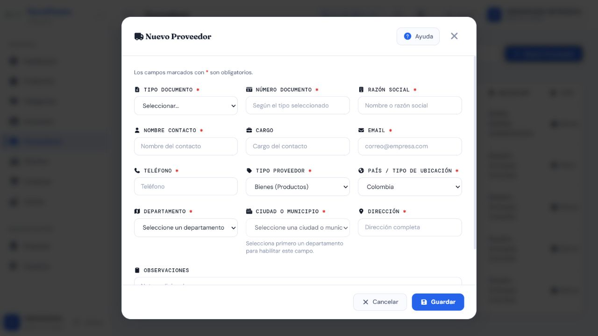
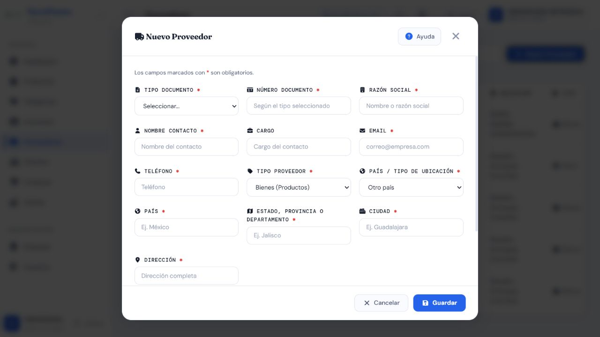

# Casos de prueba — Proveedores

> **Prefijo:** TC-PRV · **Cobertura mínima:** 5 casos · **Ejecución final:** 4 aprobados, 1 fallido · **Fecha:** 8 de agosto de 2026

## Alcance

Valida creación, edición, ubicación, estado y eliminación de Proveedores, que luego se seleccionan al registrar Compras. Las operaciones reales están restringidas a `Administrador` y `Supervisor`.

## Matriz de casos

| ID | Nombre | Tipo | Funcionalidad que verifica | Precondiciones y rol | Datos ficticios | Resultado esperado | Automatización existente | Falta automatización | Evidencia | Prioridad |
|---|---|---|---|---|---|---|---|---|---|---|
| TC-PRV-001 | Crear proveedor válido | Positivo | Alta con identidad comercial, documento, contacto y ubicación válidos | Administrador o Supervisor | `Suministros Demo S.A.S.`, NIT ficticio, teléfono y correo reservados para prueba | HTTP 201; normalización prevista y registro visible | `A` — pruebas automatizadas aprobadas y alta UI/API E2E ejecutada | Consolidar el flujo E2E en una prueba automatizada | AUTO + API | Alta |
| TC-PRV-002 | Rechazar duplicados y contacto inválido | Negativo | Unicidad comercial y mensajes naturales; teléfono y campos semánticos | Proveedor equivalente existente; Administrador o Supervisor | Razón social con distintas mayúsculas; teléfono con letras/especiales o demasiado largo | HTTP 400 por campo; no crea duplicado | `A` — métodos `test_no_permite_razon_social_duplicada_sin_importar_mayusculas`, `test_duplicados_exactos_devuelven_mensajes_naturales_en_espanol`, pruebas de teléfono y `test_campos_semanticos_invalidos_se_rechazan_por_campo` | No para validaciones cubiertas; falta confirmar interfaz | AUTO + API; captura compartida si se requiere error visual | Alta |
| TC-PRV-003 | Crear y editar ubicación Colombia/exterior | Positivo / integración | Catálogo departamento-municipio y cambio a campos manuales para otro país | Administrador o Supervisor | Colombia: Antioquia/Medellín; exterior: país/estado/ciudad ficticios válidos | Combinación colombiana canónica; exterior normalizado; edición conserva datos válidos | `A` — `test_crear_y_editar_proveedor_colombiano`, `test_rechaza_combinacion_colombiana_invalida`, `test_crear_y_editar_proveedor_extranjero`, `test_proveedor_extranjero_numerico_se_rechaza` y `test_edicion_parcial_conserva_ubicacion_legacy` | Parcial: falta automatización DOM del formulario; ambos modos se verificaron manualmente | AUTO + API + MAN; [Colombia](./evidencias/frontend/PRV-ubicacion-colombia.png) y [otro país](./evidencias/frontend/PRV-ubicacion-exterior.png) | Alta |
| TC-PRV-004 | Cambiar estado y excluir proveedor inactivo de Compras | Integración / permisos | Activación/inactivación y efecto en el selector de Compras | Proveedor existente; Administrador o Supervisor; compra nueva sin guardar | Proveedor ficticio activo que pasa a inactivo | Cambio exitoso; el inactivo no se usa en una compra nueva; datos históricos permanecen | `M` — no se localizó prueba automatizada | Sí: estado, selector y preservación histórica | AUTO + API + MAN | Alta |
| TC-PRV-005 | Eliminar proveedor libre y proteger el relacionado | Permisos / integración | Eliminación controlada y matriz de roles | Proveedor sin compras y proveedor con compra; rol autorizado y Vendedor/Bodega | Dos proveedores ficticios | Libre: resultado según contrato; relacionado: rechazo controlado sin perder compra; rol excluido: 403 | `M` — no se localizó prueba automatizada | Sí: dependencia y permisos | AUTO + API + DB-R | Alta |

## Evidencia visual mínima

Las dos capturas vigentes muestran el formulario vacío en modo Colombia y en modo Otro país. El cambio se realizó sin guardar el proveedor. Los duplicados, estados y dependencias deben respaldarse con `AUTO`/`API` y, si aplica, `DB-R`.

## Riesgos pendientes

- Existe buena cobertura de validación, pero falta el ciclo de estado y eliminación.
- Debe verificarse que Compras no permita seleccionar o enviar un proveedor inactivo.
- La cobertura de ubicación frontend actual es de funciones/código fuente, no de interacción DOM.

## Resultado final de ejecución

| Total | Aprobados | Fallidos |
|---:|---:|---:|
| 5 | 4 | 1 |

Alta, validaciones, ubicación y estado aprobaron. TC-PRV-005 falló solo para un Proveedor relacionado: el endpoint devolvió 500 en lugar de un rechazo controlado (`BUG-PRV-001`). Ver [resultados trazables](../RESULTADOS_EJECUCION_2026-08-08.md#proveedores).
