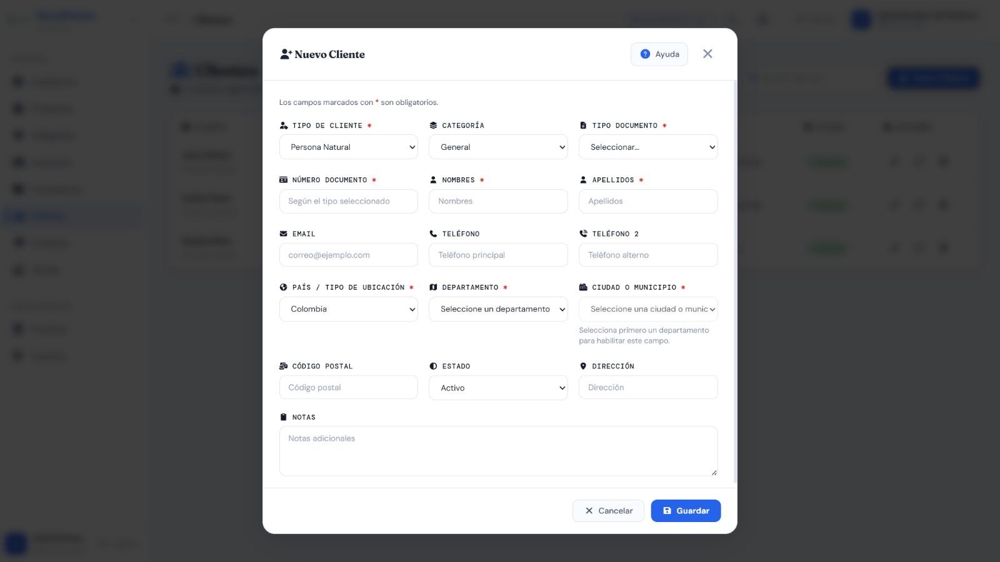
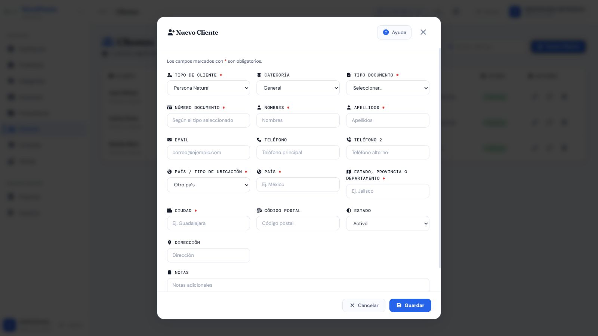

# Casos de prueba — Clientes

> **Prefijo:** TC-CLI · **Cobertura mínima:** 6 casos · **Ejecución final:** 5 aprobados, 1 fallido · **Fecha:** 8 de agosto de 2026

## Alcance

Cubre creación, edición, ubicación, listado, estado y eliminación de Clientes utilizados por Ventas. Crear y editar admite `Administrador`, `Supervisor` y `Vendedor`; cambiar estado y eliminar admite `Administrador` y `Supervisor`. El listado exige autenticación por la configuración general.

## Matriz de casos

| ID | Nombre | Tipo | Funcionalidad que verifica | Precondiciones y rol | Datos ficticios | Resultado esperado | Automatización existente | Falta automatización | Evidencia | Prioridad |
|---|---|---|---|---|---|---|---|---|---|---|
| TC-CLI-001 | Crear cliente válido | Positivo | Alta de persona o empresa con identidad, contacto y ubicación válidos | Administrador, Supervisor o Vendedor | Persona ficticia `Cliente Demostración`, documento reservado de prueba, correo `cliente@example.test` | HTTP 201; valores normalizados y autor registrado | `A` — pruebas automatizadas y alta UI/API E2E aprobadas | Falta E2E automatizado | AUTO + API | Alta |
| TC-CLI-002 | Validar documento según tipo | Negativo | Documento obligatorio; rangos numéricos; pasaporte alfanumérico | Rol autorizado | Vacío, corto, largo, con letras para tipo numérico y pasaporte ficticio alfanumérico | Se rechazan combinaciones inválidas por `numero_documento`; pasaporte válido se acepta | `A` — `test_numero_documento_obligatorio_muestra_error_espanol`, pruebas de longitud/letras y `test_pasaporte_alfanumerico_es_valido` | No para backend; falta interacción frontend | AUTO + API | Alta |
| TC-CLI-003 | Rechazar duplicados e identidad incoherente | Negativo | Unicidad de documento/correo/razón social/nombre comercial y diferencia entre nombres comerciales | Cliente equivalente existente; rol autorizado | Variantes de mayúsculas/espacios y campos repetidos | HTTP 400 por el campo correcto; no crea duplicado | `A` — pruebas `test_documento_repetido_rechazado`, `test_correo_repetido_rechazado`, duplicados de razón/nombre comercial y `test_nombre_comercial_no_debe_ser_igual_a_razon_social` | No para reglas cubiertas; falta UI | AUTO + API + DB-R opcional | Alta |
| TC-CLI-004 | Crear y editar ubicación Colombia/exterior | Positivo / integración | Canonización Colombia, pertenencia municipio-departamento, modo exterior y conservación legacy | Rol autorizado | Antioquia/Medellín; país/estado/ciudad ficticios; combinación colombiana inválida | Ubicaciones válidas se normalizan; combinación inválida y lugares numéricos se rechazan; edición conserva datos | `A` — backend y 8 pruebas Node aprobadas; ambos modos verificados en interfaz | Falta automatización Angular DOM | AUTO + API + MAN; [Colombia](./evidencias/frontend/CLI-ubicacion-colombia.png) y [otro país](./evidencias/frontend/CLI-ubicacion-exterior.png) | Alta |
| TC-CLI-005 | Cambiar estado y respetarlo en Ventas | Integración / permisos | Estados válido/inválido y disponibilidad para nuevas ventas | Cliente existente; Administrador/Supervisor para cambio; Vendedor para venta | Estados `activo`, `inactivo`, `bloqueado` y valor no admitido | Estado válido cambia; inválido da 400; cliente no apto no se usa en venta nueva; ventas históricas se conservan | `M` — no se localizó prueba automatizada del ciclo | Sí: estados, rol y consumo por Ventas | AUTO + API + MAN | Crítica |
| TC-CLI-006 | Eliminar cliente libre y proteger dependencias | Permisos / integración | Eliminación, dependencia con Ventas y roles | Cliente sin ventas y cliente relacionado; Administrador/Supervisor y Vendedor | Dos clientes ficticios | Rol autorizado elimina solo cuando el contrato lo permite; dependencia genera respuesta controlada; Vendedor recibe 403 | `M` — no se localizó prueba automatizada | Sí: dependencia, permisos y ausencia de error 500 | AUTO + API + DB-R | Alta |

## Evidencia visual mínima

Las capturas vigentes muestran el formulario vacío en modo Colombia y Otro país, sin guardar un cliente. Una captura del formulario no sustituye las pruebas de documento, duplicidad, estado ni dependencia.

## Riesgos pendientes

- El backend tiene cobertura amplia de validaciones, pero no del ciclo estado/eliminación.
- Debe verificarse la relación operativa con Ventas para clientes inactivos o bloqueados.
- Los tests Node de ubicación no demuestran accesibilidad ni comportamiento real del DOM Angular.

## Resultado final de ejecución

| Total | Aprobados | Fallidos |
|---:|---:|---:|
| 6 | 5 | 1 |

Alta, documento, duplicidad, ubicación y estado aprobaron. TC-CLI-006 falló solo para un Cliente relacionado: el endpoint devolvió 500 en lugar de un rechazo controlado (`BUG-CLI-001`). Ver [resultados trazables](../RESULTADOS_EJECUCION_2026-08-08.md#clientes).
