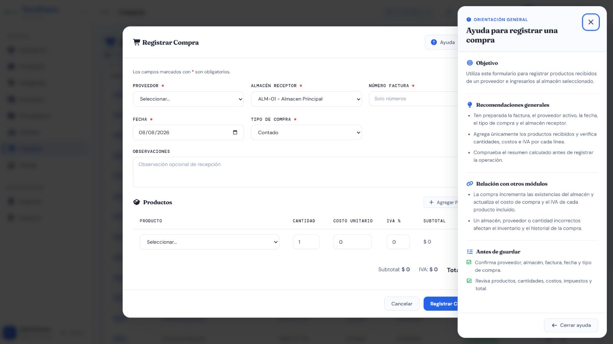

# Casos de prueba — Compras y anulaciones

> **Prefijo:** TC-COM · **Cobertura mínima:** 6 casos · **Ejecución final:** 5 aprobados, 1 fallido · **Fecha:** 8 de agosto de 2026

## Alcance

Cubre registro, cálculos, responsables, listado, detalle, stock y anulación de Compras. Registrar, listar y ver detalle admite `Administrador`, `Supervisor` y `Bodega`; anular corresponde a `Administrador` y `Supervisor`. Cada caso que modifique stock debe ejecutarse en una base aislada y verificarse también en PostgreSQL 15.18.

## Matriz de casos

| ID | Nombre | Tipo | Funcionalidad que verifica | Precondiciones y rol | Datos ficticios | Resultado esperado | Automatización existente | Falta automatización | Evidencia | Prioridad |
|---|---|---|---|---|---|---|---|---|---|---|
| TC-COM-001 | Registrar compra válida | Positivo / integración | Proveedor, almacén, factura, tipo Contado/Crédito, detalles, totales, responsable y entrada de stock | Proveedor, almacén y productos válidos; Administrador, Supervisor o Bodega | Factura numérica `900001`, dos líneas con cantidades/costos/IVA controlados | HTTP 201; compra y detalles persistidos; totales correctos; stock incrementado; usuario autenticado y snapshot guardados | `A` — pruebas aprobadas en SQLite/PostgreSQL y registro UI E2E ejecutado | Falta automatizar variante Crédito en DOM | AUTO + API + DB-R + MAN; [formulario y ayuda](./evidencias/frontend/COM-formulario-ayuda.png) | Crítica |
| TC-COM-002 | Rechazar factura duplicada y datos requeridos inválidos | Negativo | Unicidad de factura, proveedor/almacén existentes, al menos un detalle y tipos permitidos | Rol autorizado; factura existente | Factura repetida, payload vacío, proveedor/almacén inexistente, tipo no admitido | HTTP 400/404 según contrato; no crea cabecera, detalles ni movimientos | `M` — no se localizó suite directa de validaciones de entrada | Sí: tabla de variantes y ausencia de efectos | AUTO + API + DB-R | Crítica |
| TC-COM-003 | Rechazar cantidades, costos e IVA inválidos | Negativo | Límites de detalle y recálculo de totales en servidor | Rol autorizado; referencias válidas | Cantidad 0/negativa, costo negativo, IVA fuera de 0–100, totales manipulados | HTTP 400; el servidor no confía en totales enviados; stock sin cambios | `M` — no se localizó prueba automatizada directa | Sí: fronteras, manipulación y rollback | AUTO + API + DB-R | Crítica |
| TC-COM-004 | Hacer rollback ante referencia inactiva o error en una línea | Integración / seguridad | Atomicidad de compra completa y validación de entidades operativas | Producto/proveedor/almacén inactivo o segunda línea inválida; rol autorizado | Una línea válida y otra inválida | Falla toda la operación; no queda compra parcial, detalle ni entrada de stock | `M` — no se localizó prueba automatizada directa | Sí: rollback transaccional en PostgreSQL | AUTO + API + DB-R | Crítica |
| TC-COM-005 | Anular compra de forma auditable e idempotente | Integración / permisos | Motivo, usuario/fecha, reversión de stock, doble anulación y bloqueo si stock fue consumido | Compra completada; Administrador o Supervisor | Motivo ficticio; dos solicitudes de anulación; compra con unidades ya vendidas | Primera anulación válida revierte una vez; repetición no duplica; compra consumida se rechaza; Bodega recibe 403 | `A/P` — pruebas automatizadas y endpoints PostgreSQL ejecutados | Ampliar matriz automatizada de roles | AUTO + API + DB-R; [anulación](./evidencias/frontend/COM-anulada-e2e.png) | Crítica |
| TC-COM-006 | Listar y consultar detalle histórico | Positivo / interfaz | Búsqueda/filtros, detalle, responsable y snapshots aunque falte el usuario actual | Compras en varios estados y compra histórica sin responsable; sesión autorizada | Facturas/fechas/estados ficticios | Lista y detalle coherentes; una compra histórica muestra “No disponible” sin error; no pierde nombres históricos | `A` — backend, listado y detalle UI E2E ejecutados | Falta E2E automatizado de filtros | AUTO + API + MAN; [detalle](./evidencias/frontend/COM-detalle-e2e.png) | Alta |

## Evidencia visual mínima

- [COM-formulario-ayuda.png](./evidencias/frontend/COM-formulario-ayuda.png): compra nueva con proveedor, almacén, línea inicial, resumen y ayuda contextual.
- [Detalle E2E](./evidencias/frontend/COM-detalle-e2e.png) y [anulación E2E](./evidencias/frontend/COM-anulada-e2e.png), ambos con datos ficticios aislados.

Los cálculos y movimientos se sustentan con `AUTO` y `DB-R`; no se necesita una captura por cada validación.

## Riesgos pendientes

- Solo hay dos pruebas directas del módulo Compras; la mayor parte de la confianza proviene de pruebas integradas de Inventario.
- Faltan pruebas explícitas de entradas inválidas y rollback total.
- La anulación debe probarse con permisos y contra stock ya consumido en PostgreSQL.

## Resultado final de ejecución

| Total | Aprobados | Fallidos |
|---:|---:|---:|
| 6 | 5 | 1 |

Registro, validaciones, rollback, anulación auditable y detalle aprobaron. TC-COM-004 falló porque una Compra acepta un Producto inactivo (`BUG-COM-001`); la operación ficticia se anuló y el stock quedó restaurado. Ver [resultados trazables](../RESULTADOS_EJECUCION_2026-08-08.md#compras-y-anulaciones).
