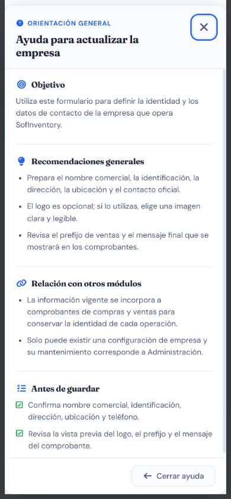

# Casos de prueba — Empresa

> **Prefijo:** TC-EMP · **Cobertura mínima:** 5 casos · **Ejecución final:** 4 aprobados, 1 fallido · **Fecha:** 8 de agosto de 2026

## Alcance

Cubre la configuración única de identidad empresarial, ubicación, contacto, logo y mensaje de comprobante. Todo usuario autenticado puede consultar la configuración; solo `Administrador` puede crearla o modificarla. La ruta no permite eliminarla.

## Matriz de casos

| ID | Nombre | Tipo | Funcionalidad que verifica | Precondiciones y rol | Datos ficticios | Resultado esperado | Automatización existente | Falta automatización | Evidencia | Prioridad |
|---|---|---|---|---|---|---|---|---|---|---|
| TC-EMP-001 | Crear configuración única y consultarla | Positivo / integración | Singleton, auditoría y lectura por otro rol | Sin Empresa previa; Administrador crea y Vendedor consulta | `Empresa Demostración S.A.S.`, NIT y contacto ficticios | Creación exitosa; solo existe una configuración; otro usuario autenticado puede leerla | `A` — prueba aprobada en SQLite/PostgreSQL y segundo POST E2E devolvió 409 | Falta prueba concurrente dedicada del singleton | AUTO + API + DB-R | Crítica |
| TC-EMP-002 | Aplicar permisos y prohibir eliminación | Permisos / seguridad | Modificación solo Administrador y método DELETE no permitido | Empresa existente; Administrador y Vendedor | Cambio ficticio de teléfono; solicitud DELETE | Administrador actualiza; Vendedor recibe 403; eliminación recibe método no permitido; configuración permanece | `A` — `test_usuario_no_admin_no_puede_modificar_y_empresa_no_se_elimina` | No para contrato actual; falta UI por rol | AUTO + API + DB-R | Crítica |
| TC-EMP-003 | Validar identidad, contacto y ubicación | Negativo / integración | Requeridos, NIT, teléfono, email/URL y ubicación Colombia/exterior | Empresa existente o alta inicial; Administrador | Campos vacíos/semánticamente inválidos; ubicaciones válidas e inválidas | HTTP 400 por campo; datos anteriores se conservan; ubicación válida se normaliza | `M/P` — no hay prueba específica en `backend/empresa/tests.py`; ubicación compartida está cubierta a nivel funcional en `frontend/tests/location-form.test.mjs` | Sí: serializer/API y automatización DOM; los modos visibles se evidencian en [Cliente Colombia](../06-modulo-clientes/evidencias/frontend/CLI-ubicacion-colombia.png) y [Cliente exterior](../06-modulo-clientes/evidencias/frontend/CLI-ubicacion-exterior.png) | AUTO + API + MAN | Alta |
| TC-EMP-004 | Gestionar logo de forma segura | Seguridad / integración | Formato real, máximo 2 MB, nombre seguro, reemplazo, eliminación y conservación ante error | Empresa existente; Administrador | PNG/JPEG/WebP válidos, archivo disfrazado y archivo sobredimensionado | Solo imágenes reales admitidas se guardan; nombre seguro; reemplazo/eliminación limpia el archivo anterior después de confirmar; un error ajeno conserva el logo | `A` — `test_rechaza_archivo_disfrazado_de_imagen`, `test_acepta_jpeg_y_webp_y_rechaza_archivo_demasiado_grande` y `test_cambia_elimina_y_conserva_logo_si_otra_validacion_falla` | Parcial: vista previa frontend y entorno de media aislado | AUTO + API + MAN; [ayuda responsive de configuración](./evidencias/frontend/EMP-ayuda-configuracion.png) | Alta |
| TC-EMP-005 | Reflejar datos en comprobantes sin alterar históricos | Integración / interfaz | Mensaje y snapshot de Empresa en Compras/Ventas; presentación responsive | Empresa configurada, operación creada y luego Empresa actualizada | Nombre/mensaje iniciales y posteriores ficticios | Operación nueva usa configuración vigente; comprobante histórico conserva snapshot; vista previa y tema son legibles | `P` — snapshots backend y comprobante UI E2E ejecutados | Automatizar DOM/impresión | AUTO + API + MAN; [comprobante](../10-modulo-ventas/evidencias/frontend/VTA-detalle-comprobante-e2e.png) | Alta |

## Evidencia visual mínima

La captura vigente muestra la ayuda de actualización en móvil sin publicar valores operativos. El [comprobante de Venta E2E](../10-modulo-ventas/evidencias/frontend/VTA-detalle-comprobante-e2e.png) muestra el snapshot de una Empresa ficticia. Los archivos rechazados y la limpieza de medios se evidencian con `AUTO`, sin exponer rutas sensibles.

## Riesgos pendientes

- Falta una prueba de concurrencia del singleton sobre PostgreSQL.
- Las validaciones de identidad/contacto/ubicación no tienen cobertura backend específica en este módulo.
- Los snapshots deben impedir que una actualización de Empresa cambie comprobantes históricos.

## Resultado final de ejecución

| Total | Aprobados | Fallidos |
|---:|---:|---:|
| 5 | 4 | 1 |

Singleton, permisos, ciclo de logo y snapshots aprobaron. TC-EMP-003 falló porque NIT y teléfono semánticamente inválidos fueron aceptados (`BUG-EMP-001`); los valores ficticios originales se restauraron. Ver [resultados trazables](../RESULTADOS_EJECUCION_2026-08-08.md#empresa).
